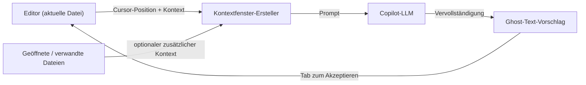

# GitHub Copilot

## Definition

GitHub Copilot ist ein KI-gesteuerter Coding-Assistent, der von GitHub und Microsoft entwickelt wurde und auf [großen Sprachmodellen](/docs/llms) basiert, die mit großen Mengen öffentlichen Codes trainiert wurden. Er integriert sich als leichte Erweiterung in bestehende Editoren und bietet KI-Unterstützung hauptsächlich durch **Inline-Vervollständigungen**: Während ein Entwickler tippt, schlägt Copilot die nächste Zeile oder den nächsten Block als Ghost-Text vor, der mit einem einzigen Tastendruck akzeptiert werden kann.

Über die Inline-Autovervollständigung hinaus fügt Copilot Chat eine Konversationsschnittstelle innerhalb der IDE hinzu, um Fragen zu stellen, Code aus natürlicher Sprache zu generieren, unbekannten Code zu erklären und Tests zu schreiben. Copilot Workspace (Vorschau) erweitert dies auf Issue-to-Code-Workflows, bei denen Copilot einen Plan und eine Implementierung für ein GitHub-Issue vorschlägt. Das Tool ist IDE-agnostisch, mit Erweiterungen für VS Code, JetBrains IDEs, Visual Studio, Neovim und den GitHub-Web-Editor.

Verglichen mit [Cursor](/docs/tools/cursor) ist Copilot eine leichtere Erweiterung, die innerhalb Ihrer bestehenden IDE funktioniert, anstatt sie zu ersetzen, und es konzentriert sich auf Datei- oder Auswahlebenen-Kontext statt auf vollständige Codebasis-Indizierung. Verglichen mit [Claude Code](/docs/tools/claude-code) fehlt Copilot ein terminal-first-Workflow und tiefe Multi-Datei-Agent-Bearbeitung. Die richtige Wahl hängt davon ab, ob Sie in Ihrem aktuellen Editor bleiben (Copilot), zu einem tief integrierten KI-Editor migrieren (Cursor) oder Terminal- und IDE-Arbeit kombinieren (Claude Code) möchten.

## Funktionsweise

### Inline-Vervollständigung



### Copilot Chat


### Hauptfunktionen

**Ghost-Text** — Inline-Vervollständigungen durch Tippen ausgelöst. **Copilot Chat** — Konversationshilfe mit Code-Erklärungen und Test-Generierung. **Copilot Edits** — Multi-Datei-Änderungen aus einer Chat-Anweisung anwenden. **Copilot Workspace** — aus einem GitHub-Issue planen und implementieren. **IDE-Unterstützung** — VS Code, JetBrains, Visual Studio, Neovim.

## Wann verwenden / Wann NICHT verwenden

| Szenario | GitHub Copilot verwenden | GitHub Copilot NICHT verwenden |
|----------|--------------------|--------------------------|
| Inline-Vervollständigung ohne Editor-Wechsel | Ja — leichte Erweiterung für jede unterstützte IDE | |
| Boilerplate und repetitiven Code generieren | Ja — hervorragend bei musterbasierter Vervollständigung | |
| JetBrains-, Neovim- oder Visual Studio-Umgebungen | Ja — breite IDE-Abdeckung | |
| Tiefer projektweit-Kontext und Refactoring | | [Cursor](/docs/tools/cursor) oder [Claude Code](/docs/tools/claude-code) handeln das besser |
| Terminal-first oder CLI-basierte Workflows | | [Claude Code](/docs/tools/claude-code) ist dafür entwickelt |
| LLM-Backend auswählen (z.B. Claude-Modelle) | | [Cursor](/docs/tools/cursor) ermöglicht Multi-Modell-Backend-Auswahl |

## Vergleiche

| Funktion | GitHub Copilot | Cursor | Claude Code |
|---------|---------------|--------|-------------|
| Basisoberfläche | IDE-Erweiterung | VS Code-Fork | Terminal + IDE-Erweiterung |
| IDE-Unterstützung | VS Code, JetBrains, Neovim usw. | Nur VS Code | VS Code, JetBrains, Terminal |
| Projektweiter Kontext | Geöffnete Dateien (begrenzt) | Codebasis-Index | Vollständiges Repo über CLI |
| Multi-Datei-Bearbeitungen | Copilot Edits (begrenzt) | Composer | Ja |
| Modell | OpenAI / GitHub | Mehrere (Claude, GPT-4o) | Claude (Anthropic) |
| GitHub-Integration | Tief (Issues, PRs) | Minimal | Über CLI-Git-Befehle |
| Preisgestaltung | Abonnement (kostenlos für Studenten) | Abonnement (Hobby-Gratis) | Abonnement (Pro+) |

## Vor- und Nachteile

| Vorteile | Nachteile |
|------|------|
| Funktioniert in bestehenden Editoren ohne Wechsel | Begrenzter projektweiter Kontext vs. Cursor |
| Breite Sprach- und Framework-Abdeckung | Keine benutzerdefinierten Projektregeln oder Steuerungsdateien |
| Tiefe GitHub-Integration (Issues, PRs) | Weniger Kontrolle über Modellauswahl |
| Geringer Aufwand — Ghost-Text vervollständigt beim Tippen | Vervollständigungsqualität variiert nach Sprache und Aufgabe |

## Codebeispiele

```python
# Copilot lernt aus dem Kontext — einen Docstring schreiben und Copilot die Funktion vervollständigen lassen

def calculate_compound_interest(principal: float, rate: float, periods: int) -> float:
    """
    Zinseszins berechnen.

    Args:
        principal: Anfangsbetrag
        rate: Jährlicher Zinssatz als Dezimalzahl (z.B. 0,05 für 5%)
        periods: Anzahl der Zinsperioden

    Returns:
        Endbetrag nach Zinseszins
    """
    # Copilot wird vorschlagen: return principal * (1 + rate) ** periods
    return principal * (1 + rate) ** periods
```

## Tipps für effektive Nutzung

- Beschreibende Kommentare und Docstrings vor dem Funktionskörper schreiben — Copilot verwendet sie als Absichtssignale.
- Teilweise Vervollständigungen mit `Ctrl+Right` (Wort für Wort) akzeptieren, anstatt einen gesamten mehrzeiligen Vorschlag blind zu akzeptieren.
- Den `/explain`-Befehl von Copilot Chat bei unbekanntem Code verwenden, bevor er geändert wird.
- Copilot in `.github/copilot-instructions.md` (Vorschau) aktivieren, um leichten Projektkontext hinzuzufügen.
- Generierte Tests sorgfältig überprüfen — Copilot kann syntaktisch valide, aber semantisch fehlerhafte Tests produzieren.

## Praktische Ressourcen

- [GitHub Copilot-Dokumentation](https://docs.github.com/en/copilot) — Setup, Verwendung und IDE-spezifische Anleitungen
- [GitHub Copilot — Erste Schritte](https://docs.github.com/en/copilot/getting-started-with-github-copilot) — Installation und erste Schritte
- [GitHub Copilot Chat](https://docs.github.com/en/copilot/github-copilot-chat) — Verwendung der Chat-Oberfläche
- [GitHub Copilot Workspace](https://githubnext.com/projects/copilot-workspace) — Issue-to-Code-Agent (Vorschau)

## Siehe auch

- [Cursor](/docs/tools/cursor)
- [Claude Code](/docs/tools/claude-code)
- [Agents](/docs/agents)
- [LLMs](/docs/llms)
