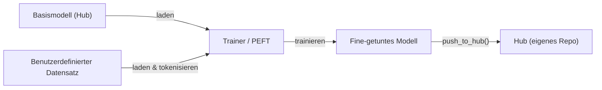

# Hugging Face

## Definition

Hugging Face ist die zentrale Open-Source-Plattform für maschinelles Lernen: Sie hostet den **Hub** (über 500.000 öffentliche Modelle und 50.000 Datensätze), stellt die `transformers`-Bibliothek zum Laden und Ausführen vortrainierter Modelle bereit und bietet Werkzeuge für [Fine-Tuning](/docs/llms/fine-tuning), Evaluation und Deployment. Es deckt [NLP](/docs/nlp), Computer Vision, Sprache und [multimodale](/docs/multimodal-ai) Modelle über eine einheitliche API ab, was es praktisch macht, zwischen Aufgaben und Architekturen zu wechseln, ohne neue Schnittstellen erlernen zu müssen.

Die `transformers`-Bibliothek läuft auf [PyTorch](/docs/frameworks/pytorch), TensorFlow und JAX. Ein `from_pretrained("modellname")`-Aufruf lädt Modellgewichte, Tokenizer und Konfiguration automatisch vom Hub herunter. Die gleiche Abstraktion funktioniert für [BERT](/docs/transformers/bert), [GPT-ähnliche](/docs/transformers/gpt) Decoder, Diffusionsmodelle, Vision-Transformer und Whisper-Klassen-Sprachmodelle. `datasets` ermöglicht effizientes Streaming und Vorverarbeitung großer Datensätze, und `accelerate` fügt verteiltes Training und gemischte Präzision mit minimalen Codeänderungen hinzu.

Hugging Face integriert sich auch in das breitere KI-Ökosystem: Modelle auf dem Hub können direkt in [LangChain](/docs/tools/langchain) und [LlamaIndex](/docs/tools/llamaindex) als Inferenz-Backends verwendet werden, und die `peft`-Bibliothek ermöglicht parametereffizientes [Fine-Tuning](/docs/llms/fine-tuning) (LoRA, QLoRA), sodass [LLMs](/docs/llms) mit Consumer-Hardware angepasst werden können. Spaces bietet Zero-Configuration-Demo-Hosting mit Gradio oder Streamlit und verbindet Forschung mit öffentlichem Zugang.

## Funktionsweise

### Laden und Inferenz


### Fine-Tuning-Workflow



### Wichtige Bibliotheken

**`transformers`** — Modell laden, Inferenz, Tokenisierung. **`datasets`** — effizientes Laden und Vorverarbeiten von Daten. **`accelerate`** — verteiltes Training und gemischte Präzision. **`peft`** — LoRA und QLoRA parametereffizientes Fine-Tuning. **`evaluate`** — Metriken (BLEU, ROUGE, Genauigkeit). **`diffusers`** — Diffusionsmodell-Pipelines.

## Wann verwenden / Wann NICHT verwenden

| Szenario | Hugging Face verwenden | Hugging Face NICHT verwenden |
|----------|-----------------|------------------------|
| Vortrainiertes NLP- oder Vision-Modell laden und ausführen | Ja — `from_pretrained` bietet eine einheitliche API | |
| Ein LLM auf einem benutzerdefinierten Datensatz fine-tunen | Ja — Trainer + PEFT (LoRA/QLoRA) | |
| Modelle und Datensätze mit der Community teilen | Ja — Hub mit Modellkarten und Versionierung | |
| Produktions-Serving mit hohem Durchsatz | | vLLM, TGI oder TorchServe für optimierte Inferenz verwenden |
| Echtzeit-Edge-Deployment | | TFLite oder ONNX Runtime sind besser geeignet |
| Training von Grund auf eines großen proprietären Modells | | Cloud-Provider-Tools (TPU-Pods, SLURM) können bevorzugt werden |

## Vor- und Nachteile

| Vorteile | Nachteile |
|------|------|
| Einheitliche API über hunderte von Architekturen | Großer Dependency-Footprint für einfache Anwendungsfälle |
| Hub bietet Modellkarten, Versionierung und Auffindbarkeit | Einige Modelle haben Forschungsqualität mit begrenztem Support |
| PEFT ermöglicht Fine-Tuning mit eingeschränkter Hardware | Inferenz-Durchsatz nicht optimiert gegenüber spezialisierten Servern |
| Aktive Community und häufige Updates | Häufige API-Änderungen können bestehenden Code brechen |

## Codebeispiele

```python
# Vortrainiertes Textklassifikationsmodell laden und Inferenz ausführen
from transformers import pipeline

classifier = pipeline("sentiment-analysis", model="distilbert-base-uncased-finetuned-sst-2-english")
result = classifier("Hugging Face makes NLP accessible to everyone.")
print(result)  # [{'label': 'POSITIVE', 'score': 0.9998}]

# Fine-Tuning mit PEFT (LoRA) auf einem benutzerdefinierten Datensatz
from transformers import AutoModelForCausalLM, AutoTokenizer, TrainingArguments, Trainer
from peft import get_peft_model, LoraConfig, TaskType
import datasets

model_name = "meta-llama/Llama-3.2-1B"
tokenizer = AutoTokenizer.from_pretrained(model_name)
base_model = AutoModelForCausalLM.from_pretrained(model_name)

lora_config = LoraConfig(task_type=TaskType.CAUSAL_LM, r=8, lora_alpha=32)
model = get_peft_model(base_model, lora_config)
model.print_trainable_parameters()  # zeigt nur ~0,1% der Parameter als trainierbar
```

## Vergleiche

| Funktion | Hugging Face Transformers | Direkte API (OpenAI, Anthropic) |
|---------|--------------------------|-------------------------------|
| Modellzugang | Open-Source-Modelle vom Hub | Proprietäre Frontier-Modelle |
| Kosten | Kostenlos auszuführen (eigene Hardware bezahlen) | Kosten pro Token API |
| Kontrolle | Vollzugriff auf Gewichte und Interna | Blackbox, begrenzte Kontrolle |
| Fine-Tuning | Erstklassig (Trainer, PEFT) | Begrenzt (OpenAI Fine-tune API) |
| Deployment | Selbst verwaltet (vLLM, TGI, TFLite) | Vom Anbieter verwaltet |
| Am besten für | Forschung, benutzerdefiniertes Fine-Tuning, Datenschutz | Schnelle Produktionsintegration |

## Praktische Ressourcen

- [Hugging Face-Dokumentation](https://huggingface.co/docs) — Vollständige Plattformdokumentation einschließlich Hub, Transformers und Spaces
- [Transformers-Bibliothek](https://huggingface.co/docs/transformers) — API-Referenz, Pipelines und Modellkarten
- [Hugging Face NLP-Kurs](https://huggingface.co/learn/nlp-course/) — Kostenloser End-to-End-Kurs über Transformers und Fine-Tuning
- [PEFT-Dokumentation](https://huggingface.co/docs/peft) — LoRA, QLoRA und andere parametereffiziente Methoden
- [Hugging Face Hub](https://huggingface.co/models) — 500k+ Modelle nach Aufgabe, Sprache und Lizenz durchsuchen und filtern

## Siehe auch

- [Transformers](/docs/transformers)
- [LLMs](/docs/llms)
- [Fine-Tuning](/docs/llms/fine-tuning)
- [RAG](/docs/rag)
- [Frameworks](/docs/frameworks/pytorch)
