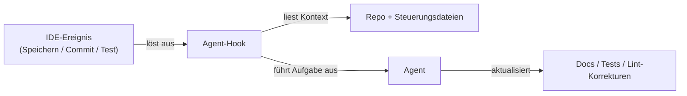

# Kiro

## Definition

Kiro ist eine **KI-gesteuerte IDE** von Amazon Web Services, die [spec-driven development](/docs/spec-driven-development) als erstklassigen Workflow operationalisiert. Anstatt freie KI-Vervollständigung bereitzustellen, strukturiert Kiro die KI-Unterstützung um eine bewusste Progression: Der Prompt eines Entwicklers wird in strukturierte **Anforderungen**, **Systemdesigns** und eine Aufschlüsselung von **Implementierungsaufgaben** erweitert. Dieser Prozess hält die Absicht explizit und auditierbar, wodurch die Mehrdeutigkeit reduziert wird, die bei Vibe-Coding-Ansätzen entsteht, bei denen ein einzelner Prompt unkontrollierte Generierung antreibt.

Die unterscheidende Fähigkeit sind **Agent-Hooks**: autonome [Agents](/docs/agents), die durch Ereignisse im Entwicklungs-Workflow ausgelöst werden (Dateispeicherungen, Git-Commits, Test-Durchläufe), die Wartungsaufgaben ausführen, wie das Aktualisieren von Dokumentationen, das Neugenerieren von Tests oder das Überprüfen von Code auf Stilregeln. Dieses ereignisgesteuerte Modell bedeutet, dass Qualitätsgates automatisiert statt manuell aufgerufen werden. **Autopilot** erweitert Hooks auf längere mehrstufige Aufgaben, die mit Entwickler-Checkpoints ausgeführt werden, geeignet für größere Features oder Refactors.

Kiro basiert auf einer VS Code-kompatiblen Grundlage (Open VSX-Erweiterungsregistrierung, vertraute Themen und Tastenbindungen) und integriert das **Model Context Protocol (MCP)** für die Verbindung von Agents mit externen Datenquellen — Datenbanken, Dokumentations-APIs und interne Tools. Eine **Kiro CLI** stellt die gleichen spec-gesteuerten und Agent-Workflows im Terminal bereit. Die Kombination macht Kiro zu einer natürlichen Wahl für Teams, die Struktur und Rückverfolgbarkeit beim Wechsel vom Prototyp zur Produktion wünschen.

## Funktionsweise

### Spec-gesteuerte Workflow


### Agent-Hooks (ereignisgesteuert)



### Hauptfunktionen

**Spec-Pipeline** — Prompt → Anforderungen → Design → Aufgaben. **Agent-Hooks** — ereignisgesteuerte Agents für Docs, Tests und Optimierung. **Autopilot** — mehrstufige Agent-Durchläufe mit Checkpoints. **Steuerungsdateien** — projektweite Konfiguration für Agent-Verhalten. **MCP-Integration** — Verbindung zu externen APIs, Datenbanken und Docs. **Kiro CLI** — Terminalzugang zu spec-gesteuerten und Agent-Workflows. **VS Code-kompatibel** — Open VSX-Erweiterungen, vertraute Einstellungen.

## Wann verwenden / Wann NICHT verwenden

| Szenario | Kiro verwenden | Kiro NICHT verwenden |
|----------|---------|-----------------|
| Spec-driven development mit strukturierten Anforderungen | Ja — Kern-Workflow | |
| Docs, Tests und Lint bei Dateispeicherung automatisieren | Ja — Agent-Hooks sind dafür entwickelt | |
| Prototyp-zur-Produktion mit Rückverfolgbarkeit | Ja — expliziter Spec-Trail vom Prompt zu Aufgaben | |
| Schnelle Inline-Vervollständigungen und Ghost-Text | | [GitHub Copilot](/docs/tools/github-copilot) oder [Cursor](/docs/tools/cursor) sind leichter |
| Nicht-VS Code-Umgebungen (JetBrains, Neovim) | | Kiro basiert auf VS Code; Copilot für breitere IDE-Abdeckung verwenden |
| Terminal-first Claude-gesteuerte Workflows | | [Claude Code](/docs/tools/claude-code) passt besser |

## Vor- und Nachteile

| Vorteile | Nachteile |
|------|------|
| Wandelt Prompts in strukturierte Specs um, reduziert Mehrdeutigkeit | Strukturierterer Workflow kann sich für kleine Aufgaben schwerfällig anfühlen |
| Agent-Hooks automatisieren repetitive Qualitätsprüfungen | Neuere Plattform; Ökosystem kleiner als VS Code-Erweiterungen |
| MCP-Integration verbindet Agents mit echten Datenquellen | AWS-gestützt, was Fragen zur Datenresidenz aufwerfen kann |
| VS Code-kompatibel, reduziert Migrationshürden | Autopilots Checkpointing erfordert Verfügbarkeit des Entwicklers |

## Codebeispiele

```yaml
# .kiro/steering.yaml — Agent-Verhalten und Projektstandards konfigurieren
project:
  name: my-api-service
  stack: [Python, FastAPI, PostgreSQL, pytest]

hooks:
  on_save:
    - task: update_docstrings
      scope: changed_files
    - task: lint_and_format
      tools: [ruff, black]

  on_commit:
    - task: generate_missing_tests
      coverage_threshold: 80

  on_test_fail:
    - task: analyze_failure
      suggest_fix: true

autopilot:
  require_approval_on:
    - database_migrations
    - new_dependencies
    - public_api_changes

mcp:
  connections:
    - name: internal_docs
      url: https://docs.internal.example.com/mcp
    - name: postgres_dev
      url: postgresql://localhost:5432/dev
```

## Tipps für effektive Nutzung

- Die generierten Anforderungen und das Systemdesign überprüfen, bevor Aufgaben ausgeführt werden — Korrekturen in der Spec-Phase sind günstiger als im Code.
- Agent-Hooks konservativ konfigurieren (eine oder zwei Aufgaben) und erweitern, wenn das Vertrauen in die Agent-Ausgabequalität wächst.
- Steuerungsdateien verwenden, um Team-Konventionen zu kodieren, damit alle Agents und Autopilot-Durchläufe konsistente Standards einhalten.
- Interne Dokumentation über MCP verbinden, damit Kiros Agents Zugang zu proprietärem Kontext haben.
- Steuerungsdateien und Spec-Artefakte in die Versionskontrolle übertragen, um zu verfolgen, wie sich Anforderungen im Laufe der Zeit entwickeln.

## Praktische Ressourcen

- [Kiro — KI-IDE](https://kiro.dev/) — Produktübersicht, Funktionen und Preise
- [Kiro — Dokumentation](https://kiro.dev/docs/chat) — Anleitungen für Chat, Hooks und Steuerungsdateien
- [Kiro — Agent-Hooks](https://kiro.dev/docs/hooks) — Ereignisgesteuerte Agent-Konfiguration
- [Model Context Protocol](https://modelcontextprotocol.io/) — MCP-Spezifikation für die Verbindung von Agents mit externen Tools

## Siehe auch

- [Spec-driven development](/docs/spec-driven-development)
- [Agents](/docs/agents)
- [Cursor](/docs/tools/cursor)
- [LLMs](/docs/llms)
