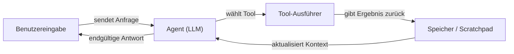

# LangChain

## Definition

LangChain ist ein Open-Source-Framework zum Erstellen von Anwendungen, die auf [großen Sprachmodellen](/docs/llms) basieren. Es bietet zusammensetzbare Abstraktionen für Prompts, Chains, Agents und Retrieval, sodass Entwickler Modellanbieter, Speichersysteme, Tools und Dokumenten-Loader mit minimalem Boilerplate verbinden können. Das Framework enthält vorgefertigte Integrationen für Dutzende von LLM-Anbietern (OpenAI, Anthropic, Mistral, lokal über Ollama) und Vektorspeicher (Pinecone, Chroma, FAISS).

Im Kern dreht sich LangChain um das Konzept der **Chains**: Schrittfolgen, bei denen die Ausgabe eines Schritts in den nächsten einfließt. **Agents** erweitern Chains, indem sie dem LLM eine Reasoning-Schleife geben: Es entscheidet, welches Tool aufgerufen werden soll, empfängt das Ergebnis und fährt fort, bis es eine endgültige Antwort liefert. LangSmith, die begleitende Observability-Plattform, bietet Tracing, Evaluation und Dataset-Management für LangChain-Anwendungen in der Produktion.

Es ergänzt [LlamaIndex](/docs/tools/llamaindex) (das den Schwerpunkt auf Datenindizierung und Retrieval-Qualität legt), indem es sich auf zusammensetzbare Orchestrierung und Agent-Schleifen konzentriert. Verwenden Sie LangChain, wenn Sie flexible Verkettung, mehrstufige [Prompt-Engineering](/docs/prompt-engineering)-Workflows oder [Agents mit Tools](/docs/agents) benötigen und ein großes Ökosystem an fertigen Integrationen wünschen.

## Funktionsweise

### Komponenten

LangChain zerlegt eine LLM-Anwendung in modulare Komponenten: **LLMs / Chat-Modelle** (das Inferenz-Backend), **Prompt-Templates** (strukturierte Eingabekonstruktion), **Output-Parser** (strukturierte Extraktion), **Retriever** (relevante Dokumente aus einer [Vektordatenbank](/docs/rag/vector-databases) abrufen) und **Tools** (externe APIs, Suche, Code-Ausführung).

### Chains und LCEL

Die **LangChain Expression Language (LCEL)** verbindet Komponenten mit einer Pipe-Syntax (`prompt | llm | parser`). Die resultierende Chain ist lazy, streambar und batchfähig. Eine einfache RAG-Chain: Dokumente abrufen → in einen Prompt formatieren → das LLM aufrufen → die Antwort parsen.

### Agents



### Observability mit LangSmith

LangSmith umhüllt Chains und Agents mit Trace-Logging und ermöglicht Latenzanalyse, Prompt-Tests und datensatzgesteuertes Evaluation, ohne den Anwendungscode zu ändern.

## Wann verwenden / Wann NICHT verwenden

| Szenario | LangChain verwenden | LangChain NICHT verwenden |
|----------|--------------|----------------------|
| Agents erstellen, die mehrere APIs und Tools aufrufen | Ja — Agent-Abstraktionen und Tool-Integrationen sind erstklassig | |
| RAG über eigene Dokumente mit schneller Einrichtung | Ja — viele Loader und Retriever-Integrationen | |
| Produktions-RAG mit tiefem Chunking und Retrieval-Tuning | | [LlamaIndex](/docs/tools/llamaindex) bevorzugen für feingranulare Kontrolle |
| Einzelne Vervollständigungen ohne Retrieval oder Tools | | Overhead ist unnötig; die API direkt aufrufen |
| Tracing und Evaluierung von LLM-Aufrufen in der Produktion | Ja — LangSmith-Integration | |
| Enges Latenzbudget und minimale Abhängigkeiten | | Framework-Overhead kann Latenz hinzufügen; schlanken Client in Betracht ziehen |

## Vergleiche

| Funktion | LangChain | LlamaIndex |
|---------|-----------|------------|
| Hauptfokus | Orchestrierung, Chains, Agents | Datenindizierung und Retrieval |
| Agent-Unterstützung | Erstklassig (Tool-Aufruf, LCEL) | Über Query-Engines als Tools |
| RAG-Kontrolle | Hochwertig, viele Integrationen | Feingranulares Chunking, Node-Parser |
| Observability | LangSmith (Tracing, Evals) | Über Integrationen |
| Lernkurve | Moderat | Moderat |
| Am besten für | Mehrstufige Workflows, Agents | Tiefes RAG über große Dokumentenkorpora |

## Vor- und Nachteile

| Vorteile | Nachteile |
|------|------|
| Großes Ökosystem an Integrationen (100+ LLMs, Stores, Tools) | Abstraktionen können Fehler verschleiern und das Debugging erschweren |
| LCEL macht Chains zusammensetzbar und streambar | API-Oberfläche ändert sich häufig zwischen Versionen |
| LangSmith bietet produktionsreifes Tracing und Evaluierungen | Kann Latenz und Abhängigkeitsoverhead für einfache Anwendungsfälle hinzufügen |
| Starke Community und Dokumentation | Mehrere Wege zum selben Ziel können verwirrend sein |

## Codebeispiele

```python
# Minimale RAG-Chain mit LangChain Expression Language (LCEL)
from langchain_openai import ChatOpenAI, OpenAIEmbeddings
from langchain_community.vectorstores import FAISS
from langchain_core.prompts import ChatPromptTemplate
from langchain_core.output_parsers import StrOutputParser
from langchain_core.runnables import RunnablePassthrough

# 1. Vektorspeicher aus Dokumenten erstellen
texts = ["LangChain composes LLM pipelines.", "LCEL uses pipe syntax."]
vectorstore = FAISS.from_texts(texts, embedding=OpenAIEmbeddings())
retriever = vectorstore.as_retriever()

# 2. Prompt definieren
prompt = ChatPromptTemplate.from_template(
    "Answer based on context:\n{context}\n\nQuestion: {question}"
)

# 3. Chain mit LCEL zusammenstellen
chain = (
    {"context": retriever, "question": RunnablePassthrough()}
    | prompt
    | ChatOpenAI(model="gpt-4o-mini")
    | StrOutputParser()
)

print(chain.invoke("What does LCEL use?"))
# -> "LCEL uses pipe syntax."
```

## Tipps für effektive Nutzung

- LCEL (Pipe-Syntax) statt dem alten `LLMChain` für allen neuen Code verwenden — es ist streambar, batchfähig und einfacher zu debuggen.
- Jede Chain und jeden Agent von Anfang an mit LangSmith-Tracing instrumentieren; nachträgliches Hinzufügen von Tracing ist schwieriger.
- Tool-Beschreibungen kurz und präzise halten — die Fähigkeit des Agents, das richtige Tool auszuwählen, hängt von der Beschreibungsqualität ab.
- `RunnablePassthrough` und `RunnableParallel` verwenden, um Daten durch die Chain zu leiten, ohne sie zu transformieren.
- Für Produktions-RAG Reranking (z.B. Cohere rerank) zwischen dem Retriever und dem LLM hinzufügen, um die Antwortqualität zu verbessern.

## Praktische Ressourcen

- [LangChain-Dokumentation](https://python.langchain.com/docs/) — Vollständige API-Referenz, Anleitungen und Tutorials
- [LangChain — Agents](https://python.langchain.com/docs/concepts/agents/) — Agent-Konzepte und Erstellung von Tool-aufrufenden Agents
- [LangChain — RAG](https://python.langchain.com/docs/use_cases/question_answering/) — Frage-Antwort und Retrieval-Anwendungsfälle
- [LangSmith](https://smith.langchain.com/) — Tracing, Evaluation und Dataset-Management
- [LCEL-Übersicht](https://python.langchain.com/docs/expression_language/) — Chains mit Pipe-Syntax zusammenstellen

## Siehe auch

- [RAG](/docs/rag)
- [Agents](/docs/agents)
- [LlamaIndex](/docs/tools/llamaindex)
