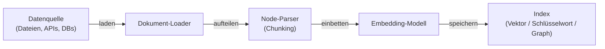
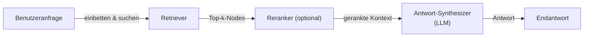

# LlamaIndex

## Definition

LlamaIndex (früher GPT Index) ist ein Daten-Framework, das [große Sprachmodelle](/docs/llms) mit eigenen Datenquellen verbindet. Sein Hauptzweck ist das Einlesen, Indizieren und Abfragen von Dokumenten, Datenbanken und APIs, damit LLMs Fragen beantworten können, die auf privaten oder domänenspezifischen Informationen beruhen. Es bietet ein hohes Maß an Kontrolle über jede Phase der [retrieval-augmented generation](/docs/rag): Datenladen, Node-Parsing (Chunking), Embedding-Auswahl, Indexkonstruktion, Retrieval-Strategie, Reranking und Antwortsynthese.

Während [LangChain](/docs/tools/langchain) zusammensetzbare Orchestrierung und Agent-Schleifen betont, ist LlamaIndex für die **Datenschicht** optimiert: Sie können Chunking-Strategien, Retrieval-Algorithmen und Syntheseansätze austauschen, ohne die Pipeline neu aufzubauen. Es liefert Query-Engines, Chat-Engines und Sub-Question-Decomposition direkt mit. Mehrere Indextypen (Vektor, Zusammenfassung, Wissensgraph, Schlüsselwort) können in einer einzigen Abfrage für hybrides Retrieval kombiniert werden.

LlamaIndex unterstützt auch [Agents](/docs/agents): Query-Engines können als Tools registriert werden, und Agent-Reasoning-Schleifen (ReAct, OpenAI Function Calling) können auswählen, welche Engine abgefragt werden soll. Eine Evaluierungssuite (Faithfulness, Relevance, Context Precision) hilft, die RAG-Qualität zu diagnostizieren und leitet das Chunking- oder Retrieval-Tuning für die Produktion.

## Funktionsweise

### Ingestion-Pipeline



### Query-Pipeline



### Wichtige Abstraktionen

**Nodes** sind die Einheit des Retrievals — Chunks eines Dokuments mit Metadaten. **Index** speichert Nodes und unterstützt Vektor-, Schlüsselwort- oder graphbasierte Suche. **Query-Engine** umhüllt Index + Retriever + Synthesizer in einem einzigen Callable. **Chat-Engine** pflegt den Gesprächsverlauf. **Sub-Question-Engine** zerlegt komplexe Anfragen in einfachere, die über mehrere Indizes verteilt werden.

## Wann verwenden / Wann NICHT verwenden

| Szenario | LlamaIndex verwenden | LlamaIndex NICHT verwenden |
|----------|---------------|----------------------|
| RAG über große Dokumentenkorpora mit Chunking-Kontrolle | Ja — feingranulare Node-Parser und mehrere Indextypen | |
| LLMs mit internen Datenbanken und APIs verbinden | Ja — Datenconnectors für SQL, Notion, Slack, S3 usw. | |
| Retrieval-Faithfulness und -Relevanz evaluieren | Ja — eingebaute Evaluierungsmodule | |
| Mehrstufige Agent-Workflows mit vielen externen APIs | | [LangChain](/docs/tools/langchain) für reichhaltigere Agent-Tooling bevorzugen |
| Einfache Einzel-Turn-Vervollständigungen ohne Retrieval | | Overhead ist unnötig; das LLM-API direkt aufrufen |
| Produktions-Pipeline mit LangSmith-Tracing | | Mit LangChain integrieren oder ein dediziertes Tracing-Tool verwenden |

## Vergleiche

| Funktion | LlamaIndex | LangChain |
|---------|------------|-----------|
| Hauptfokus | Datenindizierung und Retrieval (RAG) | Orchestrierung, Chains, Agents |
| Chunking-Kontrolle | Feingranulare Node-Parser | Hochwertige Text-Splitter |
| Indextypen | Vektor, Schlüsselwort, Graph, Zusammenfassung, Hybrid | Hauptsächlich Vektor über Retriever |
| Evaluation | Eingebaut (Faithfulness, Relevance) | Über LangSmith |
| Agent-Unterstützung | Query-Engines als Tools, ReAct | Erstklassiger LCEL-Agent |
| Am besten für | Tiefes RAG über große Korpora | Mehrstufige Agent-Orchestrierung |

## Vor- und Nachteile

| Vorteile | Nachteile |
|------|------|
| Feingranulare Kontrolle über jede RAG-Stufe | Steilere Lernkurve als einfache LLM-Wrapper |
| Mehrere Indextypen einschließlich Wissensgraphen | Weniger Nicht-RAG-Integrationen verglichen mit LangChain |
| Eingebaute Evaluierungssuite für Produktions-RAG | Einige Abstraktionen fügen Ausführlichkeit hinzu |
| Zusammensetzbare Pipelines, die Komponenten einfach austauschen | Dokumentation kann hinter schnellen Releases zurückbleiben |

## Codebeispiele

```python
# Einfache RAG-Pipeline mit LlamaIndex
from llama_index.core import VectorStoreIndex, SimpleDirectoryReader
from llama_index.llms.openai import OpenAI
from llama_index.core import Settings

# LLM und Embedding-Modell konfigurieren
Settings.llm = OpenAI(model="gpt-4o-mini")

# 1. Dokumente aus einem Verzeichnis laden
documents = SimpleDirectoryReader("./data").load_data()

# 2. Vektor-Index erstellen (bettet Nodes automatisch ein und speichert sie)
index = VectorStoreIndex.from_documents(documents)

# 3. Query-Engine mit Top-k-Retrieval erstellen
query_engine = index.as_query_engine(similarity_top_k=3)

# 4. Abfragen
response = query_engine.query("What are the main topics covered?")
print(response)
```

## Tipps für effektive Nutzung

- Chunk-Größe basierend auf den Dokumenten wählen: 256–512 Tokens funktioniert gut für faktisches Q&A; 1024+ für Zusammenfassungsaufgaben.
- Einen Reranker (z.B. `SentenceTransformerRerank`) verwenden, um die Retrieval-Präzision zu verbessern, ohne den Index zu ändern.
- Einen Vektor-Index für semantische Suche mit einem Schlüsselwort-Index für Exact-Match-Retrieval mit einem `QueryFusionRetriever` kombinieren.
- Die eingebaute Evaluierungssuite regelmäßig während der Entwicklung ausführen, um Regressionen in der Retrieval-Qualität zu erkennen.
- `IngestionPipeline` mit einem `RedisDocumentStore` für inkrementelle Ingestion verwenden, damit Dokumente bei erneuten Durchläufen nicht neu eingebettet werden.

## Praktische Ressourcen

- [LlamaIndex-Dokumentation](https://docs.llamaindex.ai/) — Vollständige Anleitungen, API-Referenz und Tutorials
- [LlamaIndex — RAG-Leitfaden](https://docs.llamaindex.ai/en/stable/module_guides/deploying/rag/) — Ingestion-, Indizierungs- und Query-Pipelines
- [LlamaIndex — Agents](https://docs.llamaindex.ai/en/stable/module_guides/deploying/agents/) — Agents mit Query-Engines als Tools erstellen
- [LlamaIndex — Evaluation](https://docs.llamaindex.ai/en/stable/module_guides/evaluating/) — Faithfulness-, Relevance- und Context-Precision-Metriken
- [LlamaHub](https://llamahub.ai/) — Community-Datenconnectors, Tools und Integrationen

## Siehe auch

- [RAG](/docs/rag)
- [LangChain](/docs/tools/langchain)
- [Vektordatenbanken](/docs/rag/vector-databases)
