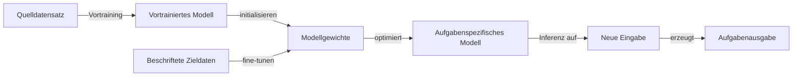

# Transfer Learning

## Definition

Transfer Learning ist eine Machine-Learning-Technik, die auf einer Quellaufgabe oder -domäne erworbenes Wissen nutzt, um die Leistung bei einer anderen, aber verwandten Zielaufgabe zu verbessern. Anstatt ein Modell von Grund auf neu zu trainieren, dient ein **vortrainiertes Modell** — bereits auf großen Daten trainiert (z. B. ImageNet, web-skaliger Text) — als Ausgangspunkt. Die erlernten Repräsentationen des Modells kodieren allgemeine Features (Kanten, Texturen, Sprachsyntax, Semantik), die gut auf verwandte Domänen übertragen.

Die Kernmotivation ist Dateneffizienz: Beschriftete Daten für die Zielaufgabe sind oft knapp oder teuer zu sammeln, aber das Vortraining auf reichlich unbeschrifteten oder beschrifteten Daten anderswo schafft eine starke Initialisierung. **Fine-Tuning** passt dann die vortrainierten Gewichte an die Besonderheiten der Zielaufgabe an und benötigt deutlich weniger Gradientenschritte und beschriftete Beispiele als das Trainieren von Grund auf. Dieses Paradigma ist jetzt Standard in [NLP](/docs/nlp) — BERT, GPT und ihre Nachkommen werden auf Milliarden von Token vortrainiert und auf Downstream-Aufgaben fine-getuned — und in [Computer Vision](/docs/cv), wo ImageNet-vortrainierte Backbones an medizinische Bildgebung, Satellitenbilder und mehr angepasst werden.

Die Effektivität von Transfer Learning hängt von der **Domänenähnlichkeit** ab: Das Übertragen zwischen eng verwandten Aufgaben (z. B. Englisch-zu-Französisch NLP, natur-zu-medizinische Bilder) funktioniert gut, während das Übertragen über sehr unterschiedliche Domänen (z. B. Textmodelle auf tabellarische Daten) möglicherweise mehr aufgabenspezifische Anpassung erfordert. Moderne parameter-effiziente Techniken — **LoRA**, **Adapter** und **Prompt-Tuning** — ermöglichen das Fine-Tuning großer Modelle mit einem Bruchteil des ursprünglichen Rechenaufwands, indem nur eine kleine Teilmenge der Parameter aktualisiert wird. Siehe [Few-Shot Learning](/docs/few-shot-learning) und [Zero-Shot Learning](/docs/zero-shot-learning) für die Extremfälle, bei denen Zielbeispiele minimal oder nicht vorhanden sind.

## Funktionsweise

### Vortraining

Ein großes Modell wird auf einem **Quelldatensatz** mit einem allgemeinen Ziel trainiert (z. B. Nächste-Token-Vorhersage für LLMs, ImageNet-Klassifizierung für Vision-Encoder). Dieser Schritt ist rechenintensiv und wird einmal durchgeführt; der vortrainierte Checkpoint wird dann zur Wiederverwendung verteilt.

### Fine-Tuning-Strategien



Drei gängige Strategien unterscheiden sich darin, wie viele Parameter aktualisiert werden:

### Vollständiges Fine-Tuning

Alle Modellparameter werden auf der Zielaufgabe aktualisiert. Am ausdrucksstärksten, erfordert aber erheblichen Rechenaufwand und riskiert **katastrophales Vergessen** (Überschreiben des Quellwissens).

### Head-Only / Feature-Extraktion

Das vortrainierte Backbone einfrieren und nur einen neuen aufgabenspezifischen Head trainieren (z. B. ein linearer Klassifikator auf eingefrorenen BERT-Embeddings). Recheneffizient, aber weniger ausdrucksstark.

### Parameter-effizientes Fine-Tuning (PEFT)

Methoden wie **LoRA** injizieren kleine trainierbare Rang-Zerlegungs-Matrizen in Transformer-Schichten. Nur diese Matrizen werden aktualisiert (~0,1–1% der Gesamtparameter), was Quellwissen bewahrt und das Modell effizient anpasst. **Adapter** fügen kleine Flaschenhals-Module zwischen Transformer-Schichten ein. **Prompt-Tuning** setzt lernbare Soft-Token als Eingabe vor, während das Modell eingefroren bleibt.

## Wann verwenden / Wann NICHT verwenden

| Szenario | Transfer Learning verwenden | Transfer Learning vermeiden |
|---|---|---|
| Begrenzte beschriftete Daten für Zielaufgabe | Ja — Kernanwendungsfall; vortrainierte Features kompensieren | Nein — von Grund auf trainieren nur wenn Daten reichlich sind |
| Verwandte Quell- und Zieldomänen | Ja — Repräsentationen übertragen effektiv | Nein — unähnliche Domänen erfordern möglicherweise domänenspezifisches Vortraining |
| Großes vortrainiertes Modell verfügbar | Ja — vom besten verfügbaren Checkpoint starten | Nein — wenn kein geeignetes vortrainiertes Modell für die Modalität vorhanden |
| Echtzeit-Inferenz mit strikter Latenz | Teilweise — PEFT oder kleinere Modelle für minimalen Overhead verwenden | — |
| Tabellarische oder strukturierte Daten (kein vortrainiertes Modell) | Nein — Gradient Boosting oder zweckgebaute Netze funktionieren möglicherweise besser | — |

## Vergleiche

| Strategie | Aktualisierte Parameter | Benötigte Daten | Rechenkosten | Vergessensrisiko |
|---|---|---|---|---|
| Von Grund auf trainieren | Alle | Groß | Hoch | Keine |
| Vollständiges Fine-Tuning | Alle | Mittel | Mittel | Hoch |
| Head-Only / Linear Probe | Nur Head | Niedrig | Niedrig | Keine |
| LoRA / Adapter (PEFT) | ~0,1–1% | Niedrig | Niedrig | Niedrig |
| Zero-Shot (kein Fine-Tuning) | Keine | Keine | Minimal | Keine |

## Vor- und Nachteile

| Vorteile | Nachteile |
|---|---|
| Reduziert Daten- und Rechenanforderungen drastisch | Katastrophales Vergessen kann Quellwissen degradieren |
| Schnellere Konvergenz — startet von einer starken Initialisierung | Negativer Transfer wenn Quell- und Zieldomänen zu unähnlich sind |
| Bewährt in NLP, Vision, Audio und multimodalen Aufgaben | Große vortrainierte Modelle benötigen erheblichen Speicher |
| PEFT-Techniken ermöglichen Fine-Tuning auf Consumer-Hardware | Fine-Tuning passt sich möglicherweise nicht vollständig an hochspezialisierte Domänen an |

## Code-Beispiele

Fine-Tuning eines vortrainierten BERT-Modells für Textklassifizierung mit Hugging Face Transformers:

```python
from transformers import AutoTokenizer, AutoModelForSequenceClassification, Trainer, TrainingArguments
from datasets import load_dataset
import numpy as np
from sklearn.metrics import accuracy_score

# Load a small sentiment dataset
dataset = load_dataset("imdb")
tokenizer = AutoTokenizer.from_pretrained("bert-base-uncased")

def tokenize(batch):
    return tokenizer(batch["text"], truncation=True, padding="max_length", max_length=128)

dataset = dataset.map(tokenize, batched=True)
dataset.set_format("torch", columns=["input_ids", "attention_mask", "label"])

# Load pretrained BERT with a classification head (2 classes)
model = AutoModelForSequenceClassification.from_pretrained(
    "bert-base-uncased", num_labels=2
)

def compute_metrics(pred):
    labels = pred.label_ids
    preds = np.argmax(pred.predictions, axis=1)
    return {"accuracy": accuracy_score(labels, preds)}

training_args = TrainingArguments(
    output_dir="./bert-imdb",
    num_train_epochs=3,
    per_device_train_batch_size=16,
    per_device_eval_batch_size=32,
    evaluation_strategy="epoch",
    save_strategy="epoch",
    load_best_model_at_end=True,
    logging_steps=100,
)

trainer = Trainer(
    model=model,
    args=training_args,
    train_dataset=dataset["train"].select(range(2000)),  # Subset for demo
    eval_dataset=dataset["test"].select(range(500)),
    compute_metrics=compute_metrics,
)

trainer.train()
```

## Praktische Ressourcen

- [Hugging Face – Transfer Learning Kurs](https://huggingface.co/course/chapter1/4?fw=pt) — Praxisorientierte Einführung in das Fine-Tuning von Transformern für NLP-Aufgaben
- [TensorFlow – Transfer Learning Tutorial](https://www.tensorflow.org/tutorials/images/transfer_learning) — Schritt-für-Schritt-Anleitung mit MobileNetV2 für Bildklassifizierung
- [LoRA: Low-Rank Adaptation of Large Language Models (Hu et al., 2022)](https://arxiv.org/abs/2106.09685) — Grundlegendes PEFT-Paper für effizientes Fine-Tuning großer Modelle
- [PEFT Bibliothek (Hugging Face)](https://huggingface.co/docs/peft/) — Einheitliche API für LoRA, Adapter, Prompt-Tuning und andere PEFT-Methoden

## Siehe auch

- [Fine-Tuning](/docs/llms/fine-tuning)
- [Few-Shot Learning](/docs/few-shot-learning)
