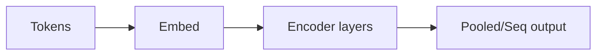

# BERT

## Definition

BERT ist ein Transformer-**Encoder**-Modell, das mit Masked Language Modeling (MLM) und Next-Sentence-Prediction vortrainiert wurde. Es erzeugt kontextuelle Einbettungen, die für nachgelagerte NLP-Aufgaben feinabgestimmt werden.

Im Gegensatz zu [GPT](/docs/transformers/gpt)-Stil-Decodern verwendet BERT **bidirektionalen** Kontext (links und rechts jedes Tokens), was bei Verständnisaufgaben (z. B. [NLP](/docs/nlp)-Klassifikation, NER, QA) hilft, anstatt bei offener Generierung. Es wird häufig als eingefrorener oder feinabgestimmter Encoder in [RAG](/docs/rag)- und Such-Pipelines verwendet.

## Funktionsweise

**Tokens** werden tokenisiert und eingebettet (Token- + Positionseinbettungen). Die **Encoder-Schichten** wenden bidirektionale Self-Attention und FFNs an; die Repräsentation jedes Tokens wird von allen anderen Tokens beeinflusst. Die Ausgabe kann **gepoolt** (z. B. [CLS] für Satzaufgaben) oder **sequenziell** (ein Vektor pro Token für NER, QA) sein. Vortraining: zufällig Token maskieren und vorhersagen (MLM), und vorhersagen, ob zwei Sätze aufeinanderfolgend sind (NSP). **Feinabstimmung** fügt einen Aufgabenkopf (z. B. linearen Klassifikator) hinzu und aktualisiert das Modell (oder nur den Kopf) auf gelabelten Daten.

## Anwendungsfälle

BERT-Stil-Modelle glänzen, wenn Sie reichhaltige kontextuelle Repräsentationen für Verständnis (Klassifikation, NER, QA) benötigen, anstatt für Generierung.

- Eigennamenerkennung und Relationsextraktion
- Suche und Retrieval (semantisches Matching, Relevanzranking)
- Fragebeantwortung und Natural Language Inference

## Externe Dokumentation

- [BERT: Pre-training of Deep Bidirectional Transformers (Devlin et al.)](https://arxiv.org/abs/1810.04805)
- [Hugging Face – BERT](https://huggingface.co/docs/transformers/model_doc/bert)

## Siehe auch

- [Transformers](/docs/transformers)
- [GPT](/docs/transformers/gpt)
- [NLP](/docs/nlp)
