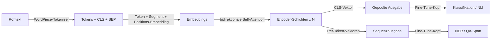

# BERT

## Definition

BERT ist ein Transformer-**Encoder**-Modell, das mit Masked Language Modeling (MLM) und Next-Sentence-Prediction vortrainiert wurde. Es produziert kontextuelle Embeddings, die für nachgelagerte NLP-Aufgaben fine-getuned werden.

Anders als [GPT](/docs/transformers/gpt)-Decoder verwendet BERT **bidirektionalen** Kontext (links und rechts von jedem Token), was bei Verstehensaufgaben hilft (z.B. [NLP](/docs/nlp)-Klassifikation, NER, QA) statt bei offener Generierung. Es wird häufig als eingefrorener oder fine-getunter Encoder in [RAG](/docs/rag) und Such-Pipelines verwendet.

BERTs Vortrainings-Ziel ist elegant einfach: 15% der Tokens in einer Eingabe zufällig maskieren und das Modell trainieren, sie anhand des vollständigen umgebenden Kontexts vorherzusagen. Dies zwingt den Encoder, reichhaltige, kontextabhängige Repräsentationen für jedes Token zu entwickeln, anstatt Oberflächenstatistiken zu memorieren. Beim Fine-Tuning wird ein kleiner Aufgaben-Kopf (eine oder zwei lineare Schichten) auf dem vortrainierten Encoder hinzugefügt und auf beschrifteten Daten trainiert — oft mit starker Leistung mit nur wenigen tausend Beispielen. Varianten wie RoBERTa (verbesserte Trainingsrezept), DistilBERT (destilliert für Geschwindigkeit) und DeBERTa (entkoppelte Attention) haben das Original verbessert, während das Encoder-only-Paradigma beibehalten wurde.

## Funktionsweise



### Tokenisierung und Embedding

**Tokens** werden vom WordPiece-Tokenizer produziert, der am Anfang ein spezielles [CLS]-Token anhängt und [SEP] zwischen/nach Segmenten einfügt. Das Embedding jedes Tokens ist die Summe aus Token-Embedding, Segment-Embedding und positionellem Embedding.

### Bidirektionaler Encoder

Die **Encoder-Schichten** wenden bidirektionale Self-Attention an: Anders als kausale Modelle kann jedes Token alle anderen Tokens in beide Richtungen beachten. Dies produziert Repräsentationen, die tief kontextbewusst sind. Das Stapeln von 12 oder 24 solchen Schichten (BERT-Base / BERT-Large) ergibt leistungsstarke universelle Repräsentationen.

### Ausgabe und Fine-Tuning

Die Ausgabe kann **gepoolte** (der [CLS]-Vektor für satzebene Aufgaben) oder die vollständige **Sequenz** (ein Vektor pro Token für NER, QA) sein. **Fine-Tuning** fügt einen Aufgaben-Kopf (z.B. linearen Klassifikator) hinzu und aktualisiert das gesamte Modell oder nur den Kopf auf beschrifteten Daten.

## Wann verwenden / Wann NICHT verwenden

| Szenario | BERT verwenden? | Hinweise |
|---|---|---|
| Textklassifikation (Sentiment, Intent) | Ja | [CLS]-Token + linearer Kopf ist sehr effektiv |
| Named Entity Recognition (NER) | Ja | Per-Token-Ausgaben eignen sich für Span-Labeling |
| Semantische Suche / Retrieval | Ja | Fine-getunete oder Bi-Encoder-Varianten (z.B. Sentence-BERT) |
| Offene Textgenerierung | Nein | Stattdessen GPT-Decoder verwenden |
| Sehr lange Dokumente (\>512 Tokens) | Mit Vorsicht | Longformer oder Chunking-Strategien verwenden |
| Zero-Shot-Generierungsaufgaben | Nein | BERT erfordert Fine-Tuning für Generierung |

## Vergleiche

| Aspekt | BERT (Encoder-only) | GPT (Decoder-only) |
|---|---|---|
| Kontextrichtung | Bidirektional | Unidirektional (kausal) |
| Hauptstärke | Verstehen / Klassifikation | Generierung |
| Vortrainings-Ziel | Masked LM + NSP | Next-Token-Vorhersage |
| Fine-Tuning-Stil | Kleinen Aufgaben-Kopf hinzufügen | Prompting oder supervised Fine-Tune |
| Generierungsfähigkeit | Schlecht (nicht dafür ausgelegt) | Ausgezeichnet |
| Embedding-Qualität (Retrieval) | Ausgezeichnet (mit Bi-Encoder) | Moderat ohne Fine-Tuning |

## Vor- und Nachteile

| Vorteile | Nachteile |
|---|---|
| Starke kontextuelle Repräsentationen | Kann keinen Text autoregressiv generieren |
| Effizientes Fine-Tuning auf kleinen Datensätzen | Max. 512 Tokens (Basisarchitektur) |
| Weit verfügbare vortrainierte Varianten | Benötigt beschriftete Daten für die meisten Aufgaben |
| Interpretierbare Attention-Muster | Schwächer als GPT-4-Klasse-Modelle bei komplexem Reasoning |

## Codebeispiele

```python
# BERT für Textklassifikation mit Hugging Face Transformers fine-tunen
from transformers import AutoTokenizer, AutoModelForSequenceClassification, Trainer, TrainingArguments
from datasets import Dataset
import torch

# Minimaler synthetischer Datensatz zur Demonstration
texts  = ["I love this product!", "Terrible experience.", "It was okay I guess.", "Absolutely fantastic!"]
labels = [1, 0, 0, 1]  # 1 = positiv, 0 = negativ

tokenizer = AutoTokenizer.from_pretrained("bert-base-uncased")

def tokenize(batch):
    return tokenizer(batch["text"], truncation=True, padding="max_length", max_length=64)

dataset = Dataset.from_dict({"text": texts, "label": labels})
dataset = dataset.map(tokenize, batched=True)
dataset.set_format("torch", columns=["input_ids", "attention_mask", "label"])

model = AutoModelForSequenceClassification.from_pretrained("bert-base-uncased", num_labels=2)

training_args = TrainingArguments(
    output_dir="./bert-sentiment",
    num_train_epochs=3,
    per_device_train_batch_size=2,
    logging_steps=5,
    save_strategy="no",
)

trainer = Trainer(model=model, args=training_args, train_dataset=dataset)
trainer.train()
print("Fine-Tuning abgeschlossen.")
```

## Praktische Ressourcen

- [BERT: Pre-training of Deep Bidirectional Transformers (Devlin et al.)](https://arxiv.org/abs/1810.04805) — Originalpaper
- [Hugging Face – BERT](https://huggingface.co/docs/transformers/model_doc/bert) — API-Referenz und Modellkarten
- [Sentence-BERT](https://www.sbert.net/) — BERT-Variante, optimiert für semantische Ähnlichkeit und Dense Retrieval

## Siehe auch

- [Transformers](/docs/transformers)
- [GPT](/docs/transformers/gpt)
- [NLP](/docs/nlp)
