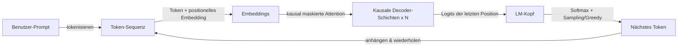

# GPT

## Definition

GPT bezeichnet Decoder-only-Transformer-Modelle, die trainiert werden, das nächste Token vorherzusagen (autoregressiv). Die Skalierung dieser Modelle hat zu den heutigen großen Sprachmodellen (LLMs) geführt, die zu Few-Shot- und Zero-Shot-Aufgaben fähig sind.

Das Decoder-only-Design eignet sich gut für die **Generierung**: Bei jedem Schritt konditioniert das Modell auf vorherige Tokens und sagt das nächste voraus. [LLMs](/docs/llms), die auf dieser Idee aufgebaut sind, werden dann mit Instruction-Tuning und Alignment (z.B. RLHF) für Chat und Tool-Nutzung angepasst. Für Aufgaben nur zum Verstehen können [BERT](/docs/transformers/bert)-Encoder parametereffizienter sein.

Die GPT-Modelllinie (GPT-1, GPT-2, GPT-3, GPT-4) demonstrierte, dass das Skalieren eines einfachen Next-Token-Prediction-Ziels auf immer größeren Korpora Modelle mit emergenten Fähigkeiten produziert: Reasoning, Code-Generierung, mehrstufige Arithmetik und Few-Shot-Aufgabenlösung ohne aufgabenspezifisches Training. Die Instruction-Tuning- und RLHF-Phasen, die dem Basis-Vortraining folgen, verwandeln einen rohen Next-Token-Predictor in einen Assistenten, der zuverlässig natürlichsprachlichen Anweisungen folgt, Gesprächskontext pflegt und schädliche Anfragen ablehnt. Moderne GPT-Familien-Deployments werden über APIs zugegriffen und unterstützen Funktionen wie Function Calling, Vision-Eingaben und Streaming.

## Funktionsweise



### Kausale Maskierung

**Tokens** werden eingebettet und in **kausale Decoder-Schichten** gespeist: Jede Position kann nur auf sich selbst und vorherige Positionen achten (maskierte Self-Attention über eine obere Dreiecksmaske). Dies verhindert, dass das Modell während Training und Inferenz die Zukunft "sieht".

### Language-Modeling-Kopf

Das **nächste Token** wird aus der Repräsentation der letzten Position über eine lineare Schicht über das Vokabular, gefolgt von Softmax, vorhergesagt. **Training** maximiert die Log-Likelihood des nächsten Tokens bei allen vorangehenden Tokens (Teacher-Forcing). Der Verlust wird über alle Positionen gemittelt, sodass jedes Token in der Sequenz ein Gradienten-Signal beiträgt.

### Inferenz und Sampling

**Inferenz** generiert autoregressiv: das nächste Token samplen oder greedy auswählen, anhängen und wiederholen, bis eine Stoppbedingung (EOS-Token oder maximale Länge) erreicht ist. Sampling-Parameter (Temperatur, Top-k, Top-p) steuern Diversität vs. Determinismus. [Prompt-Engineering](/docs/prompt-engineering) und [Fine-Tuning](/docs/llms/fine-tuning) formen das Aufgabenverhalten auf Basis dieses Mechanismus.

## Wann verwenden / Wann NICHT verwenden

| Szenario | GPT-Stil verwenden? | Hinweise |
|---|---|---|
| Textgenerierung, Zusammenfassung, Dialog | Ja | Die natürliche Wahl für autoregressive Generierung |
| Few-Shot-Klassifikation über Prompting | Ja | GPT handelt das gut mit wenigen Beispielen |
| Semantische Suche / Dense Retrieval | Mit Vorsicht | Bi-Encoder (BERT-Stil) sind effizienter |
| NER oder Token-Ebene-Klassifikation | Mit Vorsicht | Encoder-Modelle sind parametereffizienter |
| Weitreichendes Reasoning (\>8K Tokens) | Ja | Moderne GPT-Modelle unterstützen sehr lange Kontexte |
| Striktes Budget / Edge-Deployment | Nein | GPT-Modelle sind groß; destillierte Alternativen verwenden |

## Vergleiche

| Aspekt | GPT (Decoder-only) | BERT (Encoder-only) |
|---|---|---|
| Kontextrichtung | Unidirektional (kausal) | Bidirektional |
| Hauptstärke | Generierung | Verstehen / Klassifikation |
| Vortrainings-Ziel | Next-Token-Vorhersage | Masked LM + NSP |
| Zero-Shot-Fähigkeit | Hoch | Niedrig |
| Embedding-Qualität (Retrieval) | Moderat ohne Fine-Tuning | Ausgezeichnet (Bi-Encoder) |
| API-Zugang | OpenAI, Anthropic, Mistral usw. | HuggingFace Hub |

## Vor- und Nachteile

| Vorteile | Nachteile |
|---|---|
| Starke Zero-Shot- und Few-Shot-Generierung | Teuer zu betreiben (große Parameteranzahl) |
| Einheitliches Modell für verschiedene Aufgaben | Anfällig für Halluzinationen |
| Instruction-Following über Prompts | Kein expliziter bidirektionaler Kontext |
| Leicht mit Tools und RAG erweiterbar | Ausgabe muss validiert / geerdet werden |

## Codebeispiele

```python
# Chat-Vervollständigung mit OpenAI API + Streaming
from openai import OpenAI

client = OpenAI()  # liest OPENAI_API_KEY aus der Umgebung

response = client.chat.completions.create(
    model="gpt-4o-mini",
    messages=[
        {"role": "system", "content": "You are a concise technical assistant."},
        {"role": "user",   "content": "Explain the difference between GPT and BERT in two sentences."},
    ],
    temperature=0.3,
    max_tokens=200,
    stream=True,
)

print("Antwort: ", end="", flush=True)
for chunk in response:
    delta = chunk.choices[0].delta
    if delta.content:
        print(delta.content, end="", flush=True)
print()  # Zeilenumbruch am Ende
```

## Praktische Ressourcen

- [Improving Language Understanding by Generative Pre-Training (OpenAI)](https://cdn.openai.com/research-covers/language-unsupervised/language_understanding_paper.pdf) — Originales GPT-1-Paper
- [Hugging Face – GPT-2](https://huggingface.co/docs/transformers/model_doc/gpt2) — Modelldokumentation und gehostete Gewichte
- [OpenAI API-Referenz](https://platform.openai.com/docs/api-reference/chat) — Vollständige Referenz für den Chat-Completions-Endpunkt

## Siehe auch

- [Transformers](/docs/transformers)
- [LLMs](/docs/llms)
- [Prompt-Engineering](/docs/prompt-engineering)
