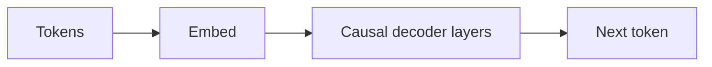

# GPT

## Definition

GPT bezeichnet Nur-Decoder-Transformer-Modelle, die trainiert werden, das nächste Token vorherzusagen (autoregressiv). Die Skalierung dieser Modelle hat zu den heutigen großen Sprachmodellen (LLMs) geführt, die Few-Shot- und Zero-Shot-Aufgaben beherrschen.

Das Nur-Decoder-Design eignet sich gut für **Generierung**: Bei jedem Schritt konditioniert das Modell auf vorherige Token und sagt das nächste vorher. [LLMs](/docs/llms), die auf dieser Idee basieren, werden dann instruktionsabgestimmt und aligniert (z. B. RLHF) für Chat und Werkzeugnutzung. Für reine Verständnisaufgaben können [BERT](/docs/transformers/bert)-Stil-Encoder parametereffizienter sein.

## Funktionsweise

**Tokens** werden eingebettet und in **kausale Decoder-Schichten** eingespeist: jede Position kann nur sich selbst und vorherige Positionen beachten (maskierte Self-Attention), sodass das Modell die Zukunft nicht „sehen" kann. Das **nächste Token** wird aus der Repräsentation der letzten Position vorhergesagt (oft mit einer linearen Schicht und Softmax über das Vokabular). **Training** maximiert die Wahrscheinlichkeit des nächsten Tokens bei gegebenem vorherigem Kontext (Teacher Forcing). **Inferenz** generiert autoregressiv: das nächste Token wird gesampelt oder gierig gewählt, angehängt und wiederholt bis zu einer Stoppbedingung. [Prompt Engineering](/docs/llms/prompt-engineering) und [Feinabstimmung](/docs/llms/fine-tuning) formen, wie das Modell diesen Mechanismus für Aufgaben nutzt.

## Anwendungsfälle

Nur-Decoder-Modelle sind das Rückgrat von Chat, Code und jeder Aufgabe, die von autoregressiver Generierung oder Few-Shot-Prompting profitiert.

- Text- und Code-Generierung (Vervollständigung, Zusammenfassung, Dialog)
- Few-Shot- und Zero-Shot-Klassifikation über Prompts
- Assistenten und Chatbots basierend auf instruktionsabgestimmten Modellen

## Externe Dokumentation

- [Improving Language Understanding by Generative Pre-Training (OpenAI)](https://cdn.openai.com/research-covers/language-unsupervised/language_understanding_paper.pdf)
- [Hugging Face – GPT-2](https://huggingface.co/docs/transformers/model_doc/gpt2)

## Siehe auch

- [Transformer](/docs/transformers)
- [LLMs](/docs/llms)
- [Prompt Engineering](/docs/llms/prompt-engineering)
