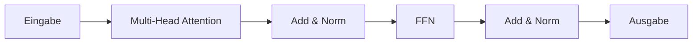

# Transformer

## Definition

Transformer sind neuronale Architekturen basierend auf **Self-Attention**: jedes Token beachtet alle anderen, um kontextuelle Repräsentationen zu berechnen. Sie vermeiden Rekurrenz und ermöglichen Parallelisierung, skalierbar auf sehr lange Sequenzen und große Modelle (BERT, GPT usw.).

Sie bilden die Grundlage moderner [LLMs](/docs/llms) und wurden auf [multimodale](/docs/multimodal-ai) und [Vision](/docs/cv)-Modelle erweitert. Nur-Encoder ([BERT](/docs/transformers/bert)) und Nur-Decoder ([GPT](/docs/transformers/gpt)) Varianten sind heute am häufigsten; das Encoder-Decoder-Layout wird weiterhin für Sequenz-zu-Sequenz-Aufgaben verwendet.

## Funktionsweise

- **Attention:** Query, Key, Value werden aus Eingaben berechnet; Attention-Gewichte kombinieren Werte.
- **Multi-Head Attention:** Mehrere Attention-Köpfe erfassen verschiedene Beziehungen.
- **Encoder-Decoder oder Nur-Decoder:** Der Encoder (z. B. BERT) sieht die gesamte Sequenz; der Decoder (z. B. GPT) verwendet kausale Maskierung für autoregressive Generierung.

Das folgende Diagramm zeigt einen Block: Eingabe durchläuft Multi-Head Attention (mit Add und Norm), dann ein Feed-Forward-Netzwerk (FFN), dann erneut Add und Norm. Encoder-Stapel verwenden bidirektionale Attention; Decoder-Stapel verwenden kausale (maskierte) Attention, sodass jede Position nur vergangene Token sieht. Residualverbindungen und Layer Norm stabilisieren das Training. Das Stapeln vieler solcher Blöcke und die Skalierung von Breite und Tiefe ergibt die großen Modelle für [NLP](/docs/nlp) und darüber hinaus.

## Anwendungsfälle

Transformer bilden die Grundlage der meisten modernen NLP- und multimodalen Systeme; Nur-Encoder, Nur-Decoder und Encoder-Decoder-Varianten eignen sich für unterschiedliche Aufgaben.

- BERT-Stil: Eigennamenerkennung, Suchrelevanz, Fragebeantwortung
- GPT-Stil: Textgenerierung, Code-Vervollständigung, Chat und Dialog
- Multimodale Transformer für Vision-Sprache-Aufgaben

## Vor- und Nachteile

| Vorteile | Nachteile |
|----------|-----------|
| Parallelisierbar, skalierbar | Hoher Rechen- und Speicherbedarf |
| Stark bei langreichweitigen Abhängigkeiten | Erfordert große Datenmengen |
| Einheitliche Architektur für viele Aufgaben | Herausforderungen bei der Interpretierbarkeit |

## Externe Dokumentation

- [Attention Is All You Need (Vaswani et al.)](https://arxiv.org/abs/1706.03762) — Originales Transformer-Paper
- [Hugging Face – Zusammenfassung der Modelle](https://huggingface.co/docs/transformers/model_summary) — Transformer-Modellfamilien
- [The Illustrated Transformer](https://jalammar.github.io/illustrated-transformer/) — Visuelle Erklärung der Architektur

## Siehe auch

- [BERT](/docs/transformers/bert)
- [GPT](/docs/transformers/gpt)
- [LLMs](/docs/llms)
