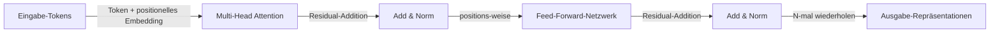

# Transformers

## Definition

Transformers sind neuronale Architekturen, die auf **Self-Attention** basieren: Jedes Token beachtet alle anderen, um kontextuelle Repräsentationen zu berechnen. Sie vermeiden Rekurrenz und ermöglichen Parallelisierung, skalierbar zu sehr langen Sequenzen und großen Modellen (BERT, GPT usw.).

Sie bilden die Grundlage moderner [LLMs](/docs/llms) und wurden auf [multimodale](/docs/multimodal-ai) und [Vision](/docs/cv)-Modelle ausgeweitet. Encoder-only ([BERT](/docs/transformers/bert)) und Decoder-only ([GPT](/docs/transformers/gpt)) Varianten sind heute am häufigsten; das Encoder-Decoder-Layout wird weiterhin für Sequence-to-Sequence-Aufgaben verwendet.

Das Paper "Attention Is All You Need" (2017) stellte den Transformer vor, indem die rekurrente Schleife vollständig entfernt und durch skaliertes Skalarprodukt-Attention ersetzt wurde. Dies machte das Training vollständig parallelisierbar, wodurch Modelle auf weit größeren Datensätzen als RNN-basierte Vorgänger trainiert werden konnten. Positionale Encodings ersetzen die implizite Ordnung der Rekurrenz; Residualverbindungen und Layer-Normalisierung stabilisieren den Gradientenfluss durch viele Schichten. Diese Designentscheidungen, kombiniert mit der Feed-Forward-Unterschicht für positions-weise Berechnung, bilden den grundlegenden Baustein, der auf hunderte Milliarden Parameter skaliert wurde.

## Funktionsweise



### Self-Attention-Mechanismus

**Attention:** Die Eingabe wird in Query (Q)-, Key (K)- und Value (V)-Matrizen projiziert. Attention-Gewichte werden als softmax(QK^T / sqrt(d_k)) berechnet und dann auf V angewendet. Die Ausgabe jedes Tokens ist eine gewichtete Kombination aller Token-Werte — globalen Kontext in einem Schritt erfassend.

### Multi-Head Attention

**Multi-Head Attention:** Mehrere Attention-Köpfe laufen parallel, jeder lernt unterschiedliche relationale Muster (Syntax, Koreferenz, Semantik). Ihre Ausgaben werden konkateniert und projiziert, was dem Modell reichhaltigere Repräsentationskapazität als ein einzelner Attention-Kopf gibt.

### Encoder vs. Decoder

**Encoder-only (z.B. BERT):** Alle Tokens beachten alle anderen (bidirektional). Am besten für Verstehensaufgaben. **Decoder-only (z.B. GPT):** Kausale Maskierung stellt sicher, dass jede Position nur auf vergangene Tokens achtet, was autoregressive Generierung ermöglicht. **Encoder-Decoder:** Wird für Aufgaben wie Übersetzung verwendet, bei denen die Eingabesequenz vollständig encodiert wird, bevor die Ausgabe decodiert wird.

## Wann verwenden / Wann NICHT verwenden

| Szenario | Transformers verwenden? | Hinweise |
|---|---|---|
| NLP-Klassifikation, NER, QA | Ja | Encoder-only (BERT-Stil) ist der Standard |
| Textgenerierung, Chat, Code | Ja | Decoder-only (GPT-Stil) ist der Standard |
| Low-Resource-Edge-Inferenz | Mit Vorsicht | Destillierte oder quantisierte Varianten empfohlen |
| Kurze Sequenzen mit klarer Lokalität | Mit Vorsicht | CNNs oder RNNs können effizienter sein |
| Sequence-to-Sequence (Übersetzung) | Ja | Encoder-Decoder-Transformers glänzen hier |
| Vision-Aufgaben | Ja | Vision Transformer (ViT) Patches funktionieren gut |

## Vergleiche

| Aspekt | RNN / LSTM | CNN | Transformer |
|---|---|---|---|
| Weitreichende Abhängigkeiten | Moderat | Schlecht | Ausgezeichnet |
| Parallelisierbares Training | Nein | Ja | Ja |
| Kontextfenster | Begrenzt durch Entfaltung | Fixes Rezeptivfeld | Konfigurierbar (bis zu 1M+ Tokens) |
| Speicherkosten bei Inferenz | Niedrig (fixer Zustand) | Niedrig | Hoch (KV-Cache wächst mit Kontext) |
| State-of-the-Art NLP | Nein | Nein | Ja |

## Vor- und Nachteile

| Vorteile | Nachteile |
|---|---|
| Parallelisierbar, skalierbar | Hohe Rechen- und Speicheranforderungen |
| Stark bei weitreichenden Abhängigkeiten | Benötigt große Datenmengen |
| Einheitliche Architektur für viele Aufgaben | Herausforderungen bei der Interpretierbarkeit |
| Vortrainierte Modelle weit verfügbar | Quadratische Attention-Kosten mit Sequenzlänge |

## Codebeispiele

```python
# Self-Attention von Grund auf mit PyTorch
import torch
import torch.nn as nn
import torch.nn.functional as F
import math

class MultiHeadSelfAttention(nn.Module):
    def __init__(self, d_model: int, num_heads: int):
        super().__init__()
        assert d_model % num_heads == 0
        self.d_k = d_model // num_heads
        self.num_heads = num_heads
        self.W_qkv = nn.Linear(d_model, 3 * d_model, bias=False)
        self.W_o   = nn.Linear(d_model, d_model, bias=False)

    def forward(self, x: torch.Tensor, causal: bool = False) -> torch.Tensor:
        B, T, C = x.shape
        qkv = self.W_qkv(x).split(C, dim=2)
        q, k, v = [t.view(B, T, self.num_heads, self.d_k).transpose(1, 2) for t in qkv]
        scale  = math.sqrt(self.d_k)
        scores = (q @ k.transpose(-2, -1)) / scale         # (B, heads, T, T)
        if causal:
            mask = torch.tril(torch.ones(T, T, device=x.device)).bool()
            scores = scores.masked_fill(~mask, float('-inf'))
        weights = F.softmax(scores, dim=-1)
        out = (weights @ v).transpose(1, 2).contiguous().view(B, T, C)
        return self.W_o(out)

# Test mit einem Dummy-Batch
attn  = MultiHeadSelfAttention(d_model=64, num_heads=4)
x     = torch.randn(2, 10, 64)   # batch=2, seq_len=10, d_model=64
print(attn(x).shape)             # (2, 10, 64)
```

## Praktische Ressourcen

- [Attention Is All You Need (Vaswani et al.)](https://arxiv.org/abs/1706.03762) — Originales Transformer-Paper
- [Hugging Face – Zusammenfassung der Modelle](https://huggingface.co/docs/transformers/model_summary) — Übersicht der Transformer-Modellfamilien
- [The Illustrated Transformer](https://jalammar.github.io/illustrated-transformer/) — Beste visuelle Erklärung der Architektur

## Siehe auch

- [BERT](/docs/transformers/bert)
- [GPT](/docs/transformers/gpt)
- [LLMs](/docs/llms)
