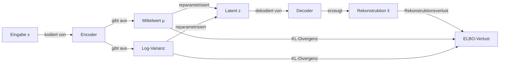

# Variational Autoencoders (VAEs)

## Definition

Variational Autoencoders (VAEs), eingeführt von Kingma & Welling im Jahr 2013, sind eine Klasse generativer Modelle, die einen strukturierten **Latenzraum** lernen, indem eine Autoencoder-Architektur mit variationaler Bayes-Inferenz kombiniert wird. Der Encoder bildet Eingabedaten auf eine Wahrscheinlichkeitsverteilung über latente Codes ab (statt eines einzelnen Punktes), und der Decoder bildet gesampelte latente Codes zurück auf rekonstruierte Ausgaben ab. Diese probabilistische Formulierung zwingt den Latenzraum, glatt und kontinuierlich zu sein, was bedeutungsvolle Interpolation und unbedingte Generierung ermöglicht.

Das Trainingsziel ist die **Evidence Lower Bound (ELBO)**: ein Rekonstruktionsterm, der dekodierte Ausgaben dazu drängt, Eingaben zu entsprechen, plus ein KL-Divergenz-Term, der die latente Verteilung zur Prior-Verteilung (typischerweise eine Standard-Normalverteilung) regularisiert. Der **Reparametrisierungs-Trick** — Sampling z = μ + σ·ε wobei ε ~ N(0, I) — ermöglicht es, Gradienten durch die Sampling-Operation fließen zu lassen, was End-to-End-Training mit Backpropagation möglich macht.

Im Vergleich zu [GANs](/docs/gans) sind VAEs einfacher zu trainieren (keine adversarische Dynamik), bieten eine explizite (wenn auch approximierte) Likelihood und einen gut strukturierten Latenzraum, der für Interpolation und Repräsentationslernen geeignet ist. Allerdings neigen die KL-Regularisierung und der Rekonstruktionsverlust (typischerweise MSE oder BCE) dazu, unschärfere Proben als GANs oder [Diffusionsmodelle](/docs/diffusion-models) zu erzeugen. VAEs bleiben das Arbeitspferd für Anomalieerkennung, kontrollierbare Generierung und als Komprimierungs-Backbone in **latenter Diffusion** (Stable Diffusion verwendet einen VAE-Encoder/Decoder um seinen Diffusionsprozess).

## Funktionsweise

### Encoder

Der **Encoder** q(z|x) bildet Eingabe **x** auf die Parameter einer Gaußschen Verteilung über die latente Variable z ab: einen Mittelwert-Vektor **μ** und einen Log-Varianz-Vektor **log σ²**. Dies ist als neuronales Netzwerk mit zwei Ausgabe-Heads implementiert.

### Reparametrisierung und Sampling

Ein latenter Vektor **z** wird als z = μ + σ · ε gesampelt, wobei ε ~ N(0, I). Dies hält das Sampling differenzierbar, sodass Gradienten durch μ und σ zurück zu den Encoder-Gewichten fließen können.

### Decoder

Der **Decoder** p(x|z) bildet **z** zurück auf den Datenraum ab und erzeugt die **rekonstruierte Ausgabe** x̂. Die Rekonstruktionsqualität wird durch einen Rekonstruktionsverlust gemessen (MSE für kontinuierliche Daten, BCE für binäre).

### Trainingsziel (ELBO)

```
Loss = Rekonstruktionsverlust + β · KL(q(z|x) || p(z))
```

Der KL-Term bestraft den Encoder dafür, vom Prior N(0, I) abzuweichen, und stellt sicher, dass der Latenzraum kompakt und glatt ist. β-VAE verwendet β > 1, um die Entkopplung zu erhöhen.



### Generierung bei Inferenz

Um neue Proben zu generieren, wird **z aus dem Prior** N(0, I) gezogen — unter Umgehung des Encoders vollständig — und durch den Decoder geleitet. Da der KL-Term sicherstellt, dass der Latenzraum dicht und glatt ist, erzeugen die meisten zufälligen z-Vektoren kohärente Ausgaben.

## Wann verwenden / Wann NICHT verwenden

| Szenario | VAE verwenden | VAE vermeiden |
|---|---|---|
| Glatte latente Interpolation benötigt | Ja — kontinuierlicher, strukturierter Latenzraum | Nein — GANs garantieren keine glatte Interpolation |
| Anomalieerkennung über Rekonstruktionsfehler | Ja — hoher Rekonstruktionsfehler signalisiert Anomalien | Nein — wenn ein diskriminativer Schwellenwert einfacher ist |
| Repräsentationslernen mit Unsicherheit | Ja — probabilistischer Encoder erfasst Eingabe-Unsicherheit | Nein — wenn ein deterministischer Encoder (z. B. SimCLR) ausreicht |
| Fotorealistische Bilderzeugung | Nein — Ausgaben neigen dazu, unschärfer als GANs/Diffusion zu sein | — |
| Anwendungen, die exakte Likelihood benötigen | Teilweise — ELBO ist eine untere Schranke, nicht exakt | — |

## Vergleiche

| Modell | Latenzstruktur | Proben-Schärfe | Training | Likelihood |
|---|---|---|---|---|
| VAE | Glatt, regularisiert | Unscharf | Stabil | Approximiert (ELBO) |
| GAN | Kein explizites Latent | Scharf | Instabil | Keine |
| Diffusion | Implizit (Rauschplan) | Sehr scharf | Stabil | Approximiert |
| AE (einfach) | Unregularisiert | Scharf | Stabil | Keine |

## Vor- und Nachteile

| Vorteile | Nachteile |
|---|---|
| Stabiles, prinzipielles Training über ELBO | Proben sind oft unschärfer als GANs oder Diffusion |
| Explizite (untere Schranke) Likelihood für Evaluierung | KL-Term kann über-regularisieren und die Ausdrucksstärke reduzieren |
| Glatter Latenzraum unterstützt Interpolation | Posterior Collapse — Encoder ignoriert z wenn der Decoder zu mächtig ist |
| Nützlich für Anomalieerkennung und Repräsentationslernen | Rekonstruktionsverlust ist ein Proxy; stimmt möglicherweise nicht mit wahrgenommener Qualität überein |

## Code-Beispiele

Minimaler VAE auf MNIST mit PyTorch:

```python
import torch
import torch.nn as nn
import torch.nn.functional as F
from torchvision import datasets, transforms
from torch.utils.data import DataLoader

class VAE(nn.Module):
    def __init__(self, latent_dim=20):
        super().__init__()
        # Encoder
        self.fc1 = nn.Linear(784, 400)
        self.fc_mu = nn.Linear(400, latent_dim)
        self.fc_logvar = nn.Linear(400, latent_dim)
        # Decoder
        self.fc3 = nn.Linear(latent_dim, 400)
        self.fc4 = nn.Linear(400, 784)

    def encode(self, x):
        h = F.relu(self.fc1(x))
        return self.fc_mu(h), self.fc_logvar(h)

    def reparameterize(self, mu, logvar):
        std = torch.exp(0.5 * logvar)
        eps = torch.randn_like(std)
        return mu + eps * std

    def decode(self, z):
        h = F.relu(self.fc3(z))
        return torch.sigmoid(self.fc4(h))

    def forward(self, x):
        mu, logvar = self.encode(x.view(-1, 784))
        z = self.reparameterize(mu, logvar)
        return self.decode(z), mu, logvar

def elbo_loss(recon_x, x, mu, logvar):
    bce = F.binary_cross_entropy(recon_x, x.view(-1, 784), reduction="sum")
    kl = -0.5 * torch.sum(1 + logvar - mu.pow(2) - logvar.exp())
    return bce + kl

model = VAE()
optimizer = torch.optim.Adam(model.parameters(), lr=1e-3)
loader = DataLoader(
    datasets.MNIST(".", download=True, transform=transforms.ToTensor()),
    batch_size=128, shuffle=True
)

for epoch in range(5):
    total_loss = 0
    for x, _ in loader:
        recon, mu, logvar = model(x)
        loss = elbo_loss(recon, x, mu, logvar)
        optimizer.zero_grad(); loss.backward(); optimizer.step()
        total_loss += loss.item()
    print(f"Epoch {epoch+1} | Loss: {total_loss / len(loader.dataset):.2f}")

# Generate new samples
with torch.no_grad():
    z = torch.randn(16, 20)
    samples = model.decode(z).view(16, 1, 28, 28)
```

## Praktische Ressourcen

- [Auto-Encoding Variational Bayes (Kingma & Welling, 2013)](https://arxiv.org/abs/1312.6114) — Originales VAE-Paper, das ELBO und den Reparametrisierungs-Trick einführt
- [PyTorch – VAE Beispiel](https://github.com/pytorch/examples/tree/main/vae) — Offizielle minimale Implementierung
- [β-VAE (Higgins et al., 2017)](https://openreview.net/forum?id=Sy2fchgYl) — Erweiterung für entkoppelte latente Repräsentationen
- [Latent Diffusion Models (Rombach et al.)](https://arxiv.org/abs/2112.10752) — Wie VAE-Komprimierung Stable Diffusion unterstützt

## Siehe auch

- [GANs](/docs/gans)
- [Diffusionsmodelle](/docs/diffusion-models)
