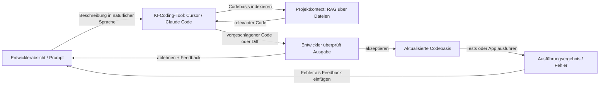

# Vibe Coding

## Definition

Vibe Coding ist ein Stil der Softwareentwicklung, bei dem Sie **iterativ mit KI-Unterstützung** arbeiten: Sie beschreiben Ihre Absicht in natürlicher Sprache, erhalten Code oder Bearbeitungen von einem [LLM](/docs/llms) oder Coding-Tool und verfeinern dann durch Feedback und Kontext, anstatt jede Zeile von Grund auf zu schreiben. Der „Vibe" ist der lockere, explorative Fluss — Sie steuern nach Absicht und Gefühl, und das Modell füllt die Implementierungsdetails aus. Der Fokus liegt auf der Reduzierung von Reibung: Ideen werden in Minuten statt Stunden in funktionierenden Code umgesetzt, wobei der Entwickler als Regisseur und Bewerter statt als Tipperin agiert.

Vibe Coding steht im Gegensatz zu vollständig spezifikationsfirst oder plan-then-code Ansätzen (z. B. [spezifikationsgetriebene Entwicklung](/docs/spec-driven-development)): Sie beginnen oft mit einer groben Idee und lassen [Prompt Engineering](/docs/prompt-engineering), [Agenten](/docs/agents) und Tools (z. B. [Cursor](/docs/tools/cursor), [Claude Code](/docs/tools/claude-code)) Code vorschlagen und bearbeiten. Die Rolle des Entwicklers verändert sich vom Schreiben von Syntax zum Beschreiben von Zielen, Bewerten von Ausgaben und Steuern in Richtung Korrektheit. Am produktivsten ist es, wenn der Entwickler das Codebase ausreichend versteht, um Fehler zu erkennen — Vibe Coding eliminiert nicht die Notwendigkeit für technisches Urteilsvermögen, es verändert, wo dieses Urteilsvermögen angewendet wird.

Die Praxis wird durch eine neue Generation von KI-Coding-Tools ermöglicht, die Kontext auf Projektebene bieten: indizierte Codebasen, mehrdateiige Bearbeitungen, Terminal-Zugang und agentische Schleifen, die autonom Code schreiben, ausführen und reparieren können. Tools wie Cursor, Windsurf und Claude Code gehen über Autovervollständigung hinaus, um als kollaborative Agenten zu agieren, die das gesamte Projekt verstehen. [RAG](/docs/rag)-artige Retrieval hält Vorschläge in Ihrer tatsächlichen Codebasis geerdet, anstatt generische Beispiele. Das Ergebnis ist besonders nützlich für Prototypen, Skripte, Boilerplate, Tests und Refactoring — Aufgaben, bei denen die Absicht leicht zu formulieren ist, aber die Implementierung mühsam zu schreiben ist.

## Funktionsweise

### Die Absicht-Feedback-Schleife

Der Kern von Vibe Coding ist eine schnelle Schleife: Absicht formulieren, Ausgabe überprüfen, Feedback geben, wiederholen. Im Gegensatz zur Wasserfall-Entwicklung gibt es keine Anforderung, Anforderungen vollständig zu spezifizieren, bevor man beginnt. Sie können erkunden, indem Sie das Modell bitten, „einige Ansätze auszuprobieren", und denjenigen wählen, der sich richtig anfühlt. Die Vorschläge des Modells werden zu Gerüsten, die Sie verfeinern, anstatt zu einem abgeschlossenen Artefakt, das Sie vollständig akzeptieren.

### Kontext und Werkzeuge



### Agentische und autonome Modi

Moderne Tools unterstützen agentisches Vibe Coding: Die KI kann Terminal-Befehle ausführen, Fehlerausgaben lesen und über mehrere Iterationen ohne Entwicklereingriff selbst korrigieren. Dies ist nützlich für repetitive Aufgaben (Test-Suiten generieren, APIs migrieren), erfordert aber, dass der Entwickler klare Grenzen setzt und den finalen Diff überprüft — agentische Schleifen können kaskadierende Änderungen vornehmen, die schwer zu entwirren sind.

## Wann verwenden / Wann NICHT verwenden

| Verwenden wenn | Vermeiden wenn |
|----------------|----------------|
| Prototyping oder Scripting, wo Geschwindigkeit mehr zählt als Architektur | Sicherheitskritische oder stark regulierte Systeme, wo nicht überprüfter Code inakzeptabel ist |
| Boilerplate, Tests oder Migrationen generieren, wo die Absicht leicht zu formulieren ist | Die Codebasis so komplex ist, dass dem Modell ausreichender Kontext fehlt, um subtile Fehler zu vermeiden |
| Lernen oder Erkunden einer unbekannten Codebasis oder Bibliothek | Jede Codezeile vollständig verstanden werden muss (z. B. für Sicherheitsüberprüfungen) |
| Schnell auf UI- oder API-Design iterieren, um Ideen zu validieren | Langfristige Wartbarkeit konsistente Muster und bewusste Architekturentscheidungen erfordert |

## Vergleiche

| Ansatz | Ausgangspunkt | Spezifikation erforderlich | Am besten für |
|--------|--------------|--------------------------|--------------|
| Vibe Coding | Grobe Absicht | Nein | Prototypen, Skripte, Exploration |
| Spezifikationsgetriebene Entwicklung | Explizite Spezifikation | Ja | Regulierte Systeme, Agenten, Compliance |
| TDD (Test-First) | Testfälle | Teilweise | Produktionsfunktionen mit klaren Akzeptanzkriterien |
| Pair Programming (Mensch + Mensch) | Geteilter Kontext | Variiert | Komplexe Probleme, die tiefes Denken erfordern |

## Vor- und Nachteile

| Vorteile | Nachteile |
|----------|-----------|
| Schnelle Iteration und weniger Tippen | Kann das Verständnis verdecken, wenn Sie den Code nie lesen |
| Gut für Exploration und Lernen | Kann brüchigen oder überfitteten Code ohne Überprüfung produzieren |
| Geringer Widerstand für kleine Aufgaben und Prototypen | Schwer auf große, konsistente Systeme ohne Spezifikationen zu skalieren |
| Funktioniert gut mit [Agenten](/docs/agents) und IDE-Integrationen | Stark abhängig von Modellqualität, Kontextfenster und Tool-Integration |
| Reduziert die Aktivierungsenergie, um eine neue Aufgabe zu beginnen | Agentische Schleifen können unerwünschte kaskadierende Änderungen vornehmen |

## Codebeispiele

### Beispiel-Vibe-Coding-Session mit Claude Code (Shell)

```bash
# Claude Code in Ihrem Projektverzeichnis starten
claude

# Beschreiben Sie, was Sie wollen — keine genaue Implementierung erforderlich
> Fügen Sie ein Rate-Limiting-Middleware zur Express-App hinzu.
>  Verwenden Sie ein gleitendes Fenster von 100 Anfragen pro Minute pro IP.
>  Geben Sie 429 mit einem Retry-After-Header zurück, wenn das Limit überschritten wird.

# Claude Code wird:
# 1. Das bestehende Express-Setup lesen
# 2. Die geeignete Bibliothek installieren (z. B. express-rate-limit)
# 3. Die Middleware schreiben und einfügen
# 4. Imports aktualisieren

# Den Diff überprüfen und dann iterieren
> Verwenden Sie tatsächlich Redis für den Rate-Limit-Store, damit es über mehrere Instanzen hinweg funktioniert.

# Den finalen Diff akzeptieren und Tests ausführen
> Führen Sie die bestehende Test-Suite aus und beheben Sie alle Fehler.
```

## Praktische Ressourcen

- [Claude Code Dokumentation](https://docs.anthropic.com/en/docs/claude-code/overview) — Anthropics terminalbasierter KI-Coding-Agent
- [Cursor Dokumentation](https://docs.cursor.com/) — KI-first IDE mit codebasis-bewussten Vorschlägen und agentischer Bearbeitung
- [Kiro – Spec-driven und Autopilot](https://kiro.dev/) — Tool, das strukturierte Spezifikationen mit KI-getriebenem Entwicklungsfluss ausbalanciert
- [Andrej Karpathy – Vibe Coding (Twitter/X)](https://x.com/karpathy/status/1886192184808149165) — Prägung und Beschreibung des Begriffs durch seinen Erfinder
- [Windsurf (Codeium)](https://codeium.com/windsurf) — Agentische IDE mit Cascade, einem mehrdateiigen agentischen Coding-Flow

## Siehe auch

- [Spezifikationsgetriebene Entwicklung](/docs/spec-driven-development) — Strukturierterer, spezifikationsfirst Ansatz
- [Agenten](/docs/agents) — KI, die Code schreiben und bearbeiten kann
- [Cursor](/docs/tools/cursor) — IDE für KI-unterstütztes Coding
- [Prompt Engineering](/docs/prompt-engineering)
