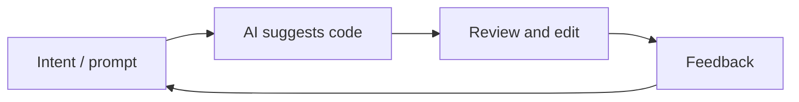

# Vibe Coding

## Definition

Vibe Coding ist ein Stil der Softwareentwicklung, bei dem Sie **iterativ mit KI-Unterstützung** arbeiten: man seine Absicht in natürlicher Sprache beschreibt, get code or edits from an [LLM](/docs/llms) or Programmierung tool, then refine by feedback and context anstatt writing every line von Grund auf. The “vibe” is the loose, exploratory flow—you steer by intent and feel, and the model fills in implementation details.

It contrasts with fully spec-first or plan-then-code approaches (z. B. [spec-driven development](/docs/spec-driven-development)): you often start with a rough idea and let [prompt engineering](/docs/prompt-engineering), [agents](/docs/agents), and tools (z. B. [Cursor](/docs/tools/cursor), [Claude Code](/docs/tools/claude-code)) suggest and edit code. Useful for prototypes, scripting, and tasks where speed and iteration matter more than upfront Entwurf.

## Funktionsweise

You give the **model** (or IDE tool) **context**: offene Dateien, Cursorposition, oder einem kurzen Prompt (“add a test for this”, “refactor to use async”). The **model** returns suggested code or diffs; you **accept, edit, or reject** und optional add **feedback** (“use a different library”, “make it shorter”). The loop repeats until the result nachzuahmenes what you want. Tools often provide project-aware context (indexed codebase, [RAG](/docs/rag)-style Abruf) so suggestions stay relevant. Success depends on clear intent, good tooling, and knowing when to take over or refine the output.

## Anwendungsfälle

Vibe Programmierung passt, wenn you want to move fast with AI assistance and are okay iterating in the loop anstatt nailing the spec first.

- Prototyping and scripting (z. B. one-off scripts, small tools)
- Boilerplate, tests, and refactors wo die intent is easy to state
- Learning or exploring a codebase by asking the AI to implement or explain
- Kombination mit [Agenten](/docs/agents) oder [autonomen Agenten](/docs/autonomous-agents), die Code aus Beschreibriptions

## Vor- und Nachteile

| Pros | Cons |
|------|------|
| Fast iteration and less typing | Can obscure understanding if you never read the code |
| Good for exploration and learning | May produce brittle or overfitted code without review |
| Low friction for small tasks | Hard to scale to large, consistent systems without specs |
| Works well with [agents](/docs/agents) and IDEs | Depends on model quality and context |

## Externe Dokumentation

- [Antigravity – Vibe Programmierung](https://www.antigravityai.io/) — Agent-first IDE that emphasizes vibe Programmierung
- [Kiro – Spec-driven and Autopilot](https://kiro.dev/) — Balancing structure with AI-driven flow

## Siehe auch

- [Spec-driven development](/docs/spec-driven-development) — More structured, spec-first approach
- [Agents](/docs/agents) — AI that can write and edit code
- [Cursor](/docs/tools/cursor) — IDE built for AI-assisted Programmierung
- [Prompt engineering](/docs/prompt-engineering)
