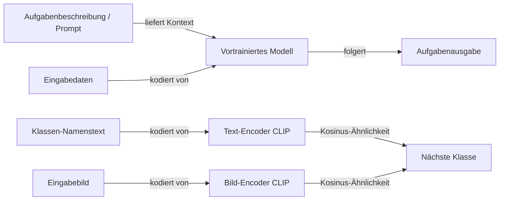

# Zero-Shot Learning

## Definition

Zero-Shot Learning (ZSL) ist die Fähigkeit eines Modells, eine Aufgabe durchzuführen, für die es zur Inferenzzeit **keine beschrifteten Trainingsbeispiele** erhalten hat. Das Modell generalisiert rein aus Wissen, das beim Vortraining erworben wurde, geleitet nur durch eine Aufgabenbeschreibung — einen natürlichen Sprach-Prompt, einen Satz von Klassenattribut-Vektoren oder einen gemeinsamen Einbettungsraum zwischen Modalitäten. Es finden keine Gradient-Updates auf der Zielaufgabe statt; das Modell muss die Lücke zwischen dem, was es beim Vortraining gelernt hat, und der neuen Aufgabenspezifikation überbrücken.

Zwei wichtige Paradigmen existieren. Im **attributbasierten** Ansatz — die ursprüngliche Formulierung aus Computer Vision (Lampert et al., 2009) — werden unbekannte Klassen durch semantische Attribute beschrieben (z. B. „hat Streifen", „lebt im Wasser"), und das Modell klassifiziert Eingaben, indem vorhergesagte Attribute mit Klassenbeschreibungen abgeglichen werden. Im **großen Modell**-Ansatz — jetzt dominant — generalisieren vortrainierte LLMs oder Vision-Language-Modelle über **Prompting**. Für Textaufgaben erhält das Modell eine Anweisung, die die Aufgabe und das Format beschreibt; für Bildaufgaben bettet CLIP sowohl Bilder als auch Klassen-Namenstexte in einem gemeinsamen Raum ein und klassifiziert nach Kosinus-Ähnlichkeit.

Die Qualität von Zero-Shot-Vorhersagen hängt vollständig davon ab, wie gut das Vortraining die Zielaufgabe oder semantisch ähnliche abgedeckt hat. LLMs exzellieren bei Zero-Shot für NLP-Aufgaben (Klassifizierung, Zusammenfassung, Übersetzung, Frage-Antwort), weil web-skaliertes Vortraining implizit die meisten Textaufgaben abdeckt. CLIP-artige Vision-Language-Modelle generalisieren Zero-Shot auf Objekterkennung über Hunderte von ImageNet-Klassen. Wenn die Zero-Shot-Qualität unzureichend ist, sind [Few-Shot Learning](/docs/few-shot-learning) (Beispiele zum Prompt hinzufügen) oder [Fine-Tuning](/docs/llms/fine-tuning) natürliche nächste Schritte.

## Funktionsweise

### Prompt-basiertes Zero-Shot (LLMs)

Die Aufgabe ist vollständig im Prompt spezifiziert: keine Beispiele, nur Anweisungen und Format. Das LLM konditioniert auf den Prompt und generiert oder vervollständigt die Antwort. Instruktions-fine-getunte Modelle (z. B. GPT-4, Claude, Llama-3-Instruct) sind speziell darauf trainiert, Zero-Shot-Anweisungen zuverlässig zu befolgen.

### Vision-Language Zero-Shot (CLIP)

CLIP trainiert einen Bild-Encoder und einen Text-Encoder gemeinsam, sodass übereinstimmende Bild-Text-Paare hohe Kosinus-Ähnlichkeit in einem gemeinsamen Einbettungsraum haben. Bei Inferenz werden Klassennamen (z. B. „a photo of a cat") als Text eingebettet; ein Eingabebild wird eingebettet und nach Nächste-Nachbar-Suche zu Klassen-Text-Einbettungen klassifiziert — keine beschrifteten Bilder erforderlich.



### Zero-Shot Chain-of-Thought (CoT)

Das Hinzufügen von „Lass uns Schritt für Schritt denken" zu einem Zero-Shot-Prompt ruft mehrstufiges Reasoning von LLMs hervor und verbessert die Genauigkeit bei Arithmetik-, Logik- und Alltagsaufgaben erheblich, ohne gelernte Beispiele bereitzustellen.

### Generalized Zero-Shot Learning (GZSL)

Bei GZSL muss das Modell Eingaben sowohl von **gesehenen** (Trainings-) als auch von **ungesehenen** (Zero-Shot-) Klassen gleichzeitig klassifizieren. Dies ist schwieriger als Standard-ZSL, weil das Modell tendenziell zu gesehenen Klassen biased ist. Kalibrierungstechniken und generative Modelle (Features für ungesehene Klassen synthetisieren) helfen.

## Wann verwenden / Wann NICHT verwenden

| Szenario | Zero-Shot verwenden | Zero-Shot vermeiden |
|---|---|---|
| Aufgabe in natürlicher Sprache gut beschreibbar ist | Ja — instruktions-fine-getunte LLMs handhaben das zuverlässig | Nein — wenn die Aufgabe spezialisiertes Domänenwissen erfordert, das nicht im Vortraining enthalten ist |
| Keine beschrifteten Daten verfügbar | Ja — Zero-Shot ist die einzige Option | Nein — auch nur wenige Beispiele sammeln und Few-Shot verwenden |
| Schnelles Prototyping über viele Aufgaben | Ja — kein Trainingsaufwand | Nein — Produktionssysteme mit Qualitätsanforderungen |
| Neue Bildklassen durch Text beschrieben | Ja — CLIP-artige Modelle generalisieren aus Klassennamen | Nein — wenn visuelle Ähnlichkeit mit Trainingsklassen gering ist |
| Arithmetik- oder Reasoning-Aufgaben mit hoher Genauigkeit | Teilweise — mit Chain-of-Thought-Prompting verwenden | Few-Shot oder fine-getunede Modelle für kritische Anwendungen bevorzugen |

## Vergleiche

| Ansatz | Benötigte Beispiele | Anpassung | Genauigkeitspotenzial | Bereitstellungsgeschwindigkeit |
|---|---|---|---|---|
| Zero-Shot | 0 | Nur Prompt | Moderat | Sofort |
| Few-Shot (In-Context) | 1–10 | In-Context-Beispiele | Höher | Sehr schnell |
| Fine-Tuning | 100–10K+ | Gradient-Updates | Höchste | Langsamer |
| Zero-Shot + CoT | 0 | Prompt mit Reasoning | Höher als Zero-Shot | Sofort |

## Vor- und Nachteile

| Vorteile | Nachteile |
|---|---|
| Keine beschrifteten Daten oder Training erforderlich | Qualität hängt stark von der Vortrainings-Abdeckung ab |
| Sofortige Bereitstellung — einfach einen Prompt schreiben | Inkonsistent für Nischen- oder hochspezialisierte Aufgaben |
| Flexibel — ein Modell bewältigt viele Aufgaben | Keine Garantie für strukturiertes Ausgabeformat |
| CLIP erweitert Zero-Shot auf Vision ohne Bildlabels | Generalized ZSL ist zu gesehenen Klassen biased |

## Code-Beispiele

Zero-Shot-Textklassifizierung mit Hugging Faces NLI-basierter Pipeline:

```python
from transformers import pipeline

# Zero-shot classifier using NLI (no fine-tuning needed)
classifier = pipeline("zero-shot-classification", model="facebook/bart-large-mnli")

text = "The central bank raised interest rates by 50 basis points to combat inflation."
candidate_labels = ["finance", "sports", "technology", "politics", "science"]

result = classifier(text, candidate_labels=candidate_labels)
print("Top label:", result["labels"][0])      # finance
print("Confidence:", f"{result['scores'][0]:.2%}")
```

Zero-Shot-Bildklassifizierung mit CLIP:

```python
import torch
from PIL import Image
from transformers import CLIPProcessor, CLIPModel

model = CLIPModel.from_pretrained("openai/clip-vit-base-patch32")
processor = CLIPProcessor.from_pretrained("openai/clip-vit-base-patch32")

# Class descriptions as text (no labeled images needed)
class_texts = [
    "a photo of a cat",
    "a photo of a dog",
    "a photo of a bird",
    "a photo of a car",
]

image = Image.open("test_image.jpg")  # Any image

inputs = processor(
    text=class_texts,
    images=image,
    return_tensors="pt",
    padding=True,
)

with torch.no_grad():
    outputs = model(**inputs)
    probs = outputs.logits_per_image.softmax(dim=1)

predicted_class = class_texts[probs.argmax().item()]
print(f"Predicted: {predicted_class} ({probs.max().item():.2%})")
```

## Praktische Ressourcen

- [Learning Transferable Visual Models from Natural Language (CLIP, Radford et al., 2021)](https://arxiv.org/abs/2103.00020) — CLIP-Paper, das Zero-Shot-Bildklassifizierung aus Textbeschreibungen ermöglicht
- [Language Models are Few-Shot Learners (GPT-3, Brown et al., 2020)](https://arxiv.org/abs/2005.14165) — GPT-3-Paper, das Zero-Shot- und Few-Shot-Prompting im großen Maßstab demonstriert
- [Large Language Models are Zero-Shot Reasoners (Kojima et al., 2022)](https://arxiv.org/abs/2205.11916) — Chain-of-Thought Zero-Shot Prompting
- [Hugging Face – Zero-Shot Classification Pipeline](https://huggingface.co/docs/transformers/tasks/zero_shot_classification) — Einsatzbereite NLI-basierte Zero-Shot-Textklassifizierung

## Siehe auch

- [Few-Shot Learning](/docs/few-shot-learning)
- [Prompt Engineering](/docs/prompt-engineering)
- [LLMs](/docs/llms)
