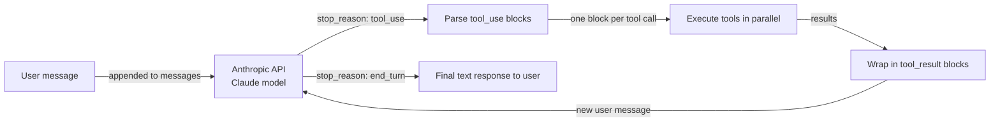

# Anthropic Tool Use

## Definición

**Anthropic Tool Use** (a veces llamado "function calling") es el mecanismo nativo de Claude para interactuar con sistemas externos de forma estructurada y confiable. En lugar de pedirle a Claude que produzca texto que luego se analiza para encontrar un nombre de función y sus argumentos, se describen las herramientas como esquemas JSON en la solicitud a la API y Claude devuelve un bloque `tool_use` estructurado con el nombre exacto de la herramienta y un objeto JSON de argumentos validados. El código ejecuta la herramienta, envuelve el resultado en un bloque `tool_result` y lo devuelve a Claude como el siguiente turno de la conversación — un ciclo que continúa hasta que Claude produce una respuesta de texto final.

La filosofía de diseño es un minimalismo intencional: Anthropic Tool Use es una capacidad de la API del modelo, no un framework. No hay capa de orquestación, ni memoria incorporada, ni bucle de agente — tú los escribes. Esto da el máximo control y la mínima sobrecarga de abstracción. Para casos de uso de herramientas de simple a mediano, el resultado es limpio, legible y fácil de depurar. Para sistemas multi-agente complejos, típicamente se combina Anthropic Tool Use con un framework como LangGraph o un orquestador personalizado.

Los modelos de Claude han sido entrenados específicamente en el uso de herramientas, lo que significa que muestran un rendimiento sólido al decidir *cuándo* llamar a una herramienta (sin llamar innecesariamente), *cómo* poblar los argumentos correctamente desde el lenguaje natural, y *cómo* manejar solicitudes ambiguas o poco especificadas de forma elegante pidiendo aclaraciones en lugar de alucinar argumentos. Las llamadas paralelas a herramientas (múltiples bloques `tool_use` en una sola respuesta) y el uso de herramientas en múltiples turnos (varias rondas de llamadas a herramientas antes de una respuesta final) son compatibles de forma nativa.

## Cómo funciona

### Definiciones de herramientas: esquema JSON

Cada herramienta se describe como un objeto JSON con tres campos obligatorios: `name` (un identificador de cadena), `description` (una explicación en lenguaje natural de lo que hace la herramienta y cuándo usarla — este es el campo más importante para orientar la decisión de Claude), e `input_schema` (un objeto JSON Schema que define los argumentos esperados). El `input_schema` sigue el estándar JSON Schema draft, admitiendo tipos string, number, boolean, array, object, campos requeridos, valores enum y esquemas anidados. Claude lee las descripciones de las herramientas para decidir cuál llamar; descripciones más precisas llevan a una selección de herramientas más exacta.

### Tipos de mensajes tool_use y tool_result

Cuando Claude decide usar una herramienta, devuelve una respuesta con `stop_reason: "tool_use"` y un array `content` que contiene uno o más bloques `tool_use`. Cada bloque tiene un `id` (una cadena única como `"toulu_01abc..."`), un `name` (que coincide con una de las definiciones de tus herramientas) y un `input` (un objeto JSON con los argumentos validados). Tu aplicación extrae estos bloques, ejecuta cada llamada a la herramienta y construye un nuevo mensaje con `role: "user"` cuyo contenido es una lista de bloques `tool_result` — uno por cada llamada a herramienta, vinculado por `tool_use_id`. El bloque `tool_result` lleva la salida como una cadena o un array de contenido estructurado. Este intercambio continúa hasta que Claude devuelve `stop_reason: "end_turn"` con una respuesta de texto simple.

### Llamadas paralelas a herramientas

Claude puede emitir múltiples bloques `tool_use` en una sola respuesta cuando determina que varias herramientas pueden llamarse simultáneamente — por ejemplo, buscar en dos bases de datos diferentes o obtener el clima para tres ciudades a la vez. Tu aplicación debe detectar múltiples bloques `tool_use` y ejecutarlos en paralelo (por ejemplo, con `asyncio.gather` o un pool de hilos) antes de construir la respuesta `tool_result`. Las llamadas paralelas reducen significativamente la latencia total en comparación con rondas secuenciales de una sola llamada, y Claude ha sido entrenado para usar esta capacidad cuando tiene sentido.

### Uso de herramientas en múltiples turnos

Las tareas complejas a menudo requieren varias rondas de llamadas a herramientas antes de que Claude pueda producir una respuesta final: buscar una entidad, luego obtener detalles sobre ella, luego calcular algo a partir de esos detalles. Cada ronda agrega un mensaje del asistente (con bloques `tool_use`) y un mensaje del usuario (con bloques `tool_result`) al historial de conversación. El historial de conversación siempre se envía completo en cada llamada a la API, dando a Claude contexto completo sobre lo que se intentó y cuáles fueron los resultados. Este diseño sin estado significa que eres responsable de mantener y recortar la lista de mensajes — no hay gestión de memoria o estado incorporada.



## Cuándo usar / Cuándo NO usar

| Usar cuando | Evitar cuando |
|---|---|
| Quieres control directo sobre el bucle de llamada a herramientas sin sobrecarga de framework | Necesitas una capa de coordinación multi-agente — Anthropic Tool Use es de un solo agente |
| Necesitas la integración más ajustada con características específicas de Claude (streaming, extended thinking) | Necesitas comodidades del framework como memoria automática, bibliotecas de herramientas integradas o gestión de roles |
| Tu caso de uso tiene 1-10 herramientas y un flujo de conversación bien definido | Tu conjunto de herramientas es muy grande y necesitas selección semántica de herramientas a escala |
| Estás construyendo un sistema de producción y quieres dependencias mínimas | Quieres prototipado rápido con integraciones preconstruidas (usa LangChain o CrewAI en su lugar) |
| Necesitas máxima portabilidad — solo el SDK de Anthropic y tu propio código | Tu equipo prefiere configuración declarativa de agentes sobre escribir código de orquestación |

## Comparaciones

| Criterio | Anthropic Tool Use | OpenAI Function Calling |
|---|---|---|
| **Formato de esquema** | JSON Schema con campos `name`, `description`, `input_schema` | JSON Schema con campos `name`, `description`, `parameters` — estructura casi idéntica |
| **Streaming de llamadas a herramientas** | Compatible: eventos `input_json_delta` transmiten tokens de argumentos en tiempo real | Compatible: streaming de argumentos `function_call` mediante eventos delta |
| **Llamadas paralelas a herramientas** | Compatible: múltiples bloques `tool_use` en una sola respuesta | Compatible: múltiples entradas `tool_calls` en una sola respuesta |
| **Confiabilidad / precisión de argumentos** | Sólida: los modelos Claude están entrenados específicamente para un uso preciso de herramientas | Sólida: los modelos de clase GPT-4 tienen llamadas a funciones robustas |
| **Soporte de modelos** | Familia Claude 3 y superior (Haiku, Sonnet, Opus) | GPT-3.5-turbo, GPT-4, GPT-4o y superior |
| **Formato de resultado de herramienta** | Bloque de contenido `tool_result` con referencia `tool_use_id` | Mensaje de rol `tool` con referencia `tool_call_id` |
| **Características extendidas** | Herramientas de uso del computador (beta), herramientas de documentos | Intérprete de código, búsqueda de archivos (API de Asistentes) |

## Ejemplos de código

```python
import anthropic
import json
from typing import Any

# Initialize the Anthropic client
client = anthropic.Anthropic()  # reads ANTHROPIC_API_KEY from environment

# --- Tool definitions using JSON Schema ---
# The 'description' field is critical: Claude uses it to decide when to call each tool.
# The 'input_schema' defines the expected arguments with types and required fields.

tools = [
    {
        "name": "get_weather",
        "description": (
            "Get current weather information for a specific city. "
            "Use this when the user asks about weather conditions, temperature, or forecasts."
        ),
        "input_schema": {
            "type": "object",
            "properties": {
                "city": {
                    "type": "string",
                    "description": "The city name, e.g. 'London' or 'New York'",
                },
                "units": {
                    "type": "string",
                    "enum": ["celsius", "fahrenheit"],
                    "description": "Temperature unit. Defaults to celsius.",
                },
            },
            "required": ["city"],
        },
    },
    {
        "name": "search_knowledge_base",
        "description": (
            "Search an internal knowledge base for information on AI topics. "
            "Use this when the user asks a factual question about AI frameworks, models, or concepts."
        ),
        "input_schema": {
            "type": "object",
            "properties": {
                "query": {
                    "type": "string",
                    "description": "The search query string",
                },
                "max_results": {
                    "type": "integer",
                    "description": "Maximum number of results to return. Default: 3.",
                    "minimum": 1,
                    "maximum": 10,
                },
            },
            "required": ["query"],
        },
    },
    {
        "name": "create_summary",
        "description": (
            "Create a structured summary of provided content. "
            "Use this to format research findings or information into a clean summary."
        ),
        "input_schema": {
            "type": "object",
            "properties": {
                "content": {
                    "type": "string",
                    "description": "The content to summarize",
                },
                "format": {
                    "type": "string",
                    "enum": ["bullet_points", "paragraph", "table"],
                    "description": "Output format for the summary",
                },
            },
            "required": ["content", "format"],
        },
    },
]

# --- Tool execution functions ---
# In production, these would call real APIs. Here they return simulated results.

def get_weather(city: str, units: str = "celsius") -> dict:
    """Simulated weather API call."""
    return {
        "city": city,
        "temperature": 22 if units == "celsius" else 72,
        "units": units,
        "condition": "partly cloudy",
        "humidity": "65%",
    }

def search_knowledge_base(query: str, max_results: int = 3) -> list[dict]:
    """Simulated knowledge base search."""
    return [
        {"title": f"Result {i+1} for '{query}'", "snippet": f"Relevant information about {query}..."}
        for i in range(min(max_results, 3))
    ]

def create_summary(content: str, format: str) -> str:
    """Simulated summary creation."""
    if format == "bullet_points":
        return f"• Key point from: {content[:50]}...\n• Additional insight\n• Conclusion"
    return f"Summary: {content[:100]}..."

def execute_tool(tool_name: str, tool_input: dict) -> Any:
    """Dispatch tool calls to the appropriate function."""
    if tool_name == "get_weather":
        return get_weather(**tool_input)
    elif tool_name == "search_knowledge_base":
        return search_knowledge_base(**tool_input)
    elif tool_name == "create_summary":
        return create_summary(**tool_input)
    else:
        return {"error": f"Unknown tool: {tool_name}"}

# --- Multi-turn tool use loop ---

def run_agent(user_message: str) -> str:
    """
    Run a multi-turn tool use loop until Claude produces a final answer.
    Returns the final text response.
    """
    messages = [{"role": "user", "content": user_message}]

    while True:
        response = client.messages.create(
            model="claude-opus-4-5",
            max_tokens=4096,
            tools=tools,
            messages=messages,
            system=(
                "You are a helpful AI assistant with access to weather data, "
                "a knowledge base, and a summary tool. "
                "Use tools when needed to answer questions accurately."
            ),
        )

        # Append the assistant's response to the conversation history
        messages.append({"role": "assistant", "content": response.content})

        # Check if we're done
        if response.stop_reason == "end_turn":
            # Extract the final text from the response content
            for block in response.content:
                if hasattr(block, "text"):
                    return block.text
            return "No text response found."

        # Handle tool use: execute all tool_use blocks
        if response.stop_reason == "tool_use":
            tool_results = []

            for block in response.content:
                if block.type == "tool_use":
                    print(f"  Calling tool: {block.name}({json.dumps(block.input)})")

                    # Execute the tool and get the result
                    result = execute_tool(block.name, block.input)

                    # Wrap result in a tool_result block
                    # The tool_use_id links this result to the specific tool call
                    tool_results.append({
                        "type": "tool_result",
                        "tool_use_id": block.id,
                        "content": json.dumps(result),  # serialize to string
                    })

            # Add tool results as a user message to continue the conversation
            messages.append({"role": "user", "content": tool_results})

        else:
            # Unexpected stop reason — return what we have
            break

    return "Agent loop ended unexpectedly."

# --- Run examples ---

print("Example 1: Weather + Knowledge base (potential parallel calls)")
answer = run_agent(
    "What is the weather in Paris right now, and also search for information about LangGraph?"
)
print("Answer:", answer)

print("\nExample 2: Multi-turn tool use")
answer = run_agent(
    "Search for information about CrewAI and then create a bullet-point summary of the results."
)
print("Answer:", answer)
```

## Recursos prácticos

- [Documentación de Anthropic Tool Use](https://docs.anthropic.com/en/docs/build-with-claude/tool-use) — Guía oficial que cubre definiciones de herramientas, flujo de mensajes, llamadas paralelas y mejores prácticas para descripciones de herramientas.
- [Referencia del SDK Python de Anthropic](https://github.com/anthropics/anthropic-sdk-python) — SDK completo con objetos de respuesta tipados, soporte asíncrono y streaming para el uso de herramientas.
- [Cookbook de Anthropic: ejemplos de uso de herramientas](https://github.com/anthropics/anthropic-cookbook/tree/main/tool_use) — Notebooks prácticos que demuestran patrones de herramienta única y múltiples herramientas, llamadas paralelas y uso del computador.
- [Documentación de OpenAI Function Calling](https://platform.openai.com/docs/guides/function-calling) — Referencia útil para comparar los dos enfoques; los conceptos se corresponden estrechamente a pesar de las diferencias de nomenclatura.

## Ver también

- [Resumen de frameworks de agentes](/docs/agents/frameworks-overview)
- [Agentes de IA](/docs/agents)
- [Sistemas multi-agente](/docs/agents/multi-agent-systems)
- [ReAct](/docs/reasoning-patterns/react)
