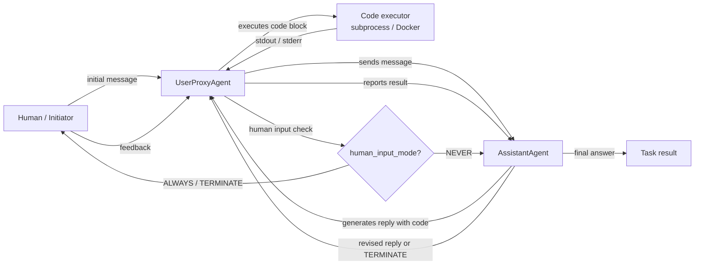

# AutoGen

## Definición

AutoGen es un framework de código abierto desarrollado por Microsoft Research para construir **sistemas de IA conversacional multi-agente**. Su idea central es simple: los agentes se comunican intercambiando mensajes en una conversación estructurada, y el framework maneja el enrutamiento, la gestión de turnos y la lógica de terminación. A diferencia de los frameworks basados en roles como CrewAI que definen a los agentes como personas con tareas, los agentes de AutoGen se definen principalmente por su **comportamiento en la conversación** — cómo responden a los mensajes, si pueden ejecutar código, y cuándo transfieren el control a otro agente o a un humano.

El primitivo más importante del framework es el `ConversableAgent` — una clase base que puede desempeñar cualquier rol dependiendo de su configuración. Dos especializaciones cubren los patrones más comunes: `AssistantAgent` (respaldado por un LLM, responde con planes y código) y `UserProxyAgent` (opcionalmente respaldado por un humano o ejecutor de código, ejecuta código localmente y alimenta los resultados de vuelta). Este patrón de dos agentes es poderoso de inmediato: obtienes un bucle de escritura de código donde el asistente propone soluciones y el proxy ejecuta e informa resultados, sin necesidad de scaffolding adicional.

AutoGen también admite **chats grupales**, donde tres o más agentes se turnan para contribuir a una conversación compartida gestionada por un `GroupChatManager`. Esto permite patrones como paneles de expertos, bucles de debate y canalizaciones modulares donde cada agente maneja un paso específico. El humano en el bucle es una característica de primera clase: el `UserProxyAgent` puede pausar y pedir información a un humano en cualquier momento, lo que lo hace muy adecuado para flujos de trabajo de investigación y experimentación donde se desea inspeccionar o redirigir al agente durante la ejecución.

## Cómo funciona

### ConversableAgent: el bloque de construcción universal

`ConversableAgent` es la clase base para todos los agentes de AutoGen. Mantiene un mensaje de sistema, una configuración opcional de LLM, una lista de funciones registradas (herramientas) y un conjunto de reglas sobre cuándo terminar una conversación (`is_termination_msg`). Cada agente tiene un método `generate_reply` que decide qué mensaje enviar a continuación dado el historial de conversación. Los agentes pueden ser agentes proxy humanos (pausan y piden entrada), agentes LLM (generan respuestas con un LLM) o agentes ejecutores (ejecutan código sin llamadas a LLM). Esta flexibilidad significa que una sola clase base cubre todo el espectro desde agentes completamente automatizados hasta completamente manuales.

### AssistantAgent y UserProxyAgent

`AssistantAgent` es un `ConversableAgent` preconfigurado como un asistente de IA útil: tiene un mensaje de sistema predeterminado que lo incentiva a proponer bloques de código Python para tareas que requieren cómputo. `UserProxyAgent` está preconfigurado para ejecutar bloques de código en un contenedor Docker local o subproceso, informar resultados y opcionalmente pedir entrada humana cuando no puede proceder automáticamente. Juntos forman el bucle canónico de dos agentes de AutoGen: el asistente sugiere código, el proxy lo ejecuta, la salida vuelve al asistente y el bucle continúa hasta que la tarea está completa o se activa una condición de terminación. Este patrón es particularmente poderoso para análisis de datos, scripting de automatización y experimentación en ML.

### Chats grupales y GroupChatManager

Para flujos de trabajo con tres o más agentes, AutoGen proporciona `GroupChat` y `GroupChatManager`. `GroupChat` mantiene la lista de agentes participantes y el historial de mensajes compartido. `GroupChatManager` es en sí mismo un `ConversableAgent` que actúa como moderador: después de cada mensaje, selecciona al siguiente orador (ya sea por una regla de turno rotativo, una función de selección personalizada, o una estrategia de selección basada en LLM). Los chats grupales permiten patrones de panel de expertos donde un investigador, un programador y un revisor se turnan, o canalizaciones de múltiples pasos donde cada agente maneja una fase. El administrador también puede terminar la conversación cuando se cumple una condición global.

### Ejecución de código y humano en el bucle

La capa de ejecución de código de AutoGen es configurable: los agentes pueden ejecutar código localmente (subproceso), en un contenedor Docker (aislado) o mediante un ejecutor personalizado. El `UserProxyAgent` detecta bloques de código en los mensajes del asistente y los ejecuta automáticamente cuando `human_input_mode="NEVER"`. Configurar `human_input_mode="ALWAYS"` o `"TERMINATE"` pone la ejecución detrás de la aprobación humana, lo que permite patrones seguros de humano en el bucle para flujos de trabajo de producción o sensibles. Esto hace que AutoGen sea particularmente adecuado para tareas de codificación agéntica, automatización de ciencia de datos y entornos de investigación donde se desea que un humano revise las salidas antes de que surtan efecto.



## Cuándo usar / Cuándo NO usar

| Usar cuando | Evitar cuando |
|---|---|
| Necesitas agentes que escriban y ejecuten código como parte del flujo de trabajo | La ejecución de código no es necesaria y la sobrecarga de conversación no es bienvenida |
| Quieres humano en el bucle en puntos de control configurables | Canalizaciones completamente automatizadas donde la intervención humana es indeseable |
| Tu flujo de trabajo involucra investigación, experimentación o refinamiento iterativo | Necesitas una API declarativa y con opinión — AutoGen requiere más configuración manual |
| Quieres un panel de expertos multi-agente o un patrón de debate (chat grupal) | Necesitas canalizaciones deterministas y testeables — las conversaciones no deterministas son más difíciles de probar unitariamente |
| Estás prototipando asistentes de codificación agéntica o automatización de ciencia de datos | La latencia de producción es crítica — los bucles de conversación de múltiples turnos añaden una sobrecarga significativa |

## Comparaciones

| Criterio | AutoGen | CrewAI | LangGraph |
|---|---|---|---|
| **Metáfora central** | Agentes como participantes conversacionales | Agentes como miembros de una tripulación con roles | Comportamiento del agente como un grafo con estado |
| **Gestión de estado** | Implícita: historial de mensajes compartido en GroupChat | Implícita: contexto de tarea y memoria de la tripulación | Explícita: estado TypedDict compartido entre nodos |
| **Ejecución de código** | Primera clase: UserProxyAgent ejecuta bloques de código automáticamente | Solo mediante herramientas externas | Mediante nodos de herramientas en el grafo |
| **Humano en el bucle** | Primera clase: `human_input_mode` en cada agente | Limitado: solo intervención manual | Primera clase: `interrupt_before` / `interrupt_after` en nodos del grafo |
| **Curva de aprendizaje** | Media: intuitivo para desarrolladores Python, pero el enrutamiento del chat grupal puede ser complejo | Baja: la API declarativa es fácil de aprender | Alta: requiere pensar en términos de grafos |

## Ejemplos de código

```python
import os
import autogen

# --- LLM configuration ---
# AutoGen uses a list of configs for load balancing / fallback.
# Set your OPENAI_API_KEY or use an Anthropic-compatible config.
llm_config = {
    "config_list": [
        {
            "model": "gpt-4o",
            "api_key": os.environ.get("OPENAI_API_KEY"),
        }
    ],
    "temperature": 0.1,
    "timeout": 120,
}

# --- Two-agent pattern: AssistantAgent + UserProxyAgent ---
# The assistant writes code; the proxy executes it and reports results.

assistant = autogen.AssistantAgent(
    name="data_analyst",
    system_message=(
        "You are a data analysis expert. When given a task, write Python code to solve it. "
        "Always verify your results by printing them. "
        "Reply TERMINATE when the task is fully complete."
    ),
    llm_config=llm_config,
)

user_proxy = autogen.UserProxyAgent(
    name="user_proxy",
    human_input_mode="NEVER",       # fully automated; change to "ALWAYS" for human review
    max_consecutive_auto_reply=10,  # safety limit on auto-replies
    is_termination_msg=lambda msg: "TERMINATE" in msg.get("content", ""),
    code_execution_config={
        "work_dir": "/tmp/autogen_workspace",
        "use_docker": False,         # set True to execute in an isolated Docker container
    },
)

# Kick off the two-agent conversation
user_proxy.initiate_chat(
    assistant,
    message=(
        "Analyze the following data and compute the mean, median, and standard deviation. "
        "Data: [12, 45, 23, 67, 34, 89, 11, 56, 78, 42]"
    ),
)


# --- Group chat pattern: researcher, coder, reviewer ---
# Three specialized agents collaborate on a more complex task.

researcher = autogen.AssistantAgent(
    name="researcher",
    system_message=(
        "You are a research specialist. Find information and summarize findings. "
        "Do not write code — delegate code tasks to the coder."
    ),
    llm_config=llm_config,
)

coder = autogen.AssistantAgent(
    name="coder",
    system_message=(
        "You are a Python expert. Write clean, well-commented code when asked. "
        "Always include error handling and print results clearly."
    ),
    llm_config=llm_config,
)

reviewer = autogen.AssistantAgent(
    name="reviewer",
    system_message=(
        "You are a critical reviewer. After the researcher and coder have finished, "
        "review the outputs for accuracy and completeness. "
        "Reply TERMINATE when you are satisfied with the result."
    ),
    llm_config=llm_config,
)

group_proxy = autogen.UserProxyAgent(
    name="group_proxy",
    human_input_mode="NEVER",
    max_consecutive_auto_reply=15,
    is_termination_msg=lambda msg: "TERMINATE" in msg.get("content", ""),
    code_execution_config={"work_dir": "/tmp/autogen_group", "use_docker": False},
)

# GroupChat manages turn order and shared message history
group_chat = autogen.GroupChat(
    agents=[group_proxy, researcher, coder, reviewer],
    messages=[],
    max_round=12,
    speaker_selection_method="auto",  # LLM-based speaker selection
)

manager = autogen.GroupChatManager(
    groupchat=group_chat,
    llm_config=llm_config,
)

group_proxy.initiate_chat(
    manager,
    message=(
        "Research the top 3 Python libraries for data visualization in 2025. "
        "Then write a code example using the most popular one to plot a bar chart."
    ),
)
```

## Recursos prácticos

- [Documentación oficial de AutoGen](https://microsoft.github.io/autogen/) — Referencia completa del framework que cubre agentes, chat grupal, ejecución de código y uso de herramientas.
- [Repositorio de AutoGen en GitHub](https://github.com/microsoft/autogen) — Código fuente, rastreador de problemas y un rico conjunto de notebooks de ejemplo.
- [Artículo de AutoGen: "AutoGen: Enabling Next-Gen LLM Applications via Multi-Agent Conversation" (Wu et al., 2023)](https://arxiv.org/abs/2308.08155) — Artículo de investigación original que motiva el diseño multi-agente basado en conversación.
- [AutoGen Studio](https://microsoft.github.io/autogen/docs/autogen-studio/getting-started) — Interfaz de usuario sin código para construir y probar flujos de trabajo de AutoGen, útil para prototipado.

## Ver también

- [Resumen de frameworks de agentes](/docs/agents/frameworks-overview)
- [CrewAI](/docs/agents/crewai)
- [LangGraph](/docs/agents/langgraph)
- [Sistemas multi-agente](/docs/agents/multi-agent-systems)
- [Agentes de IA](/docs/agents)
