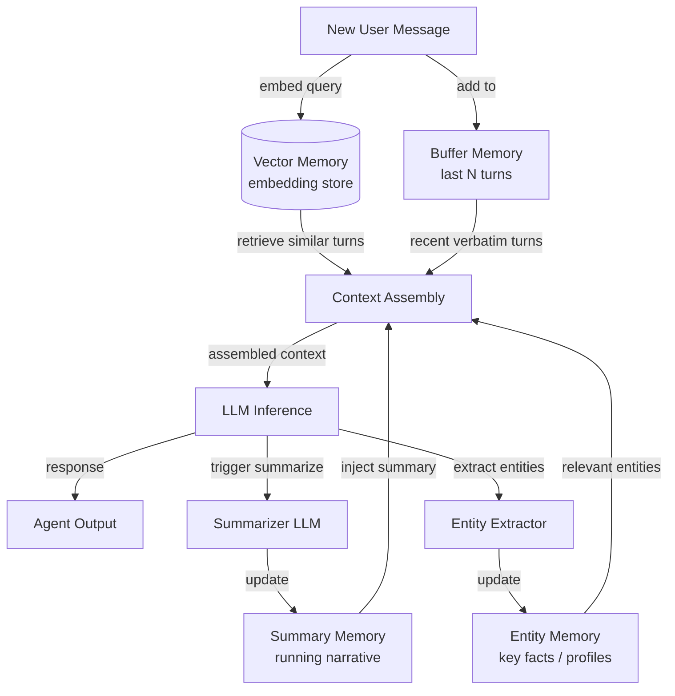

# Memoria conversacional

## Definición

La memoria conversacional se refiere al conjunto de técnicas que permiten a un agente de chat retener y utilizar información de turnos previos en un diálogo. A diferencia de la generación aumentada por recuperación, que trae documentos externos, la memoria conversacional se ocupa exclusivamente de lo que ya se ha dicho entre el usuario y el agente. Hacerlo correctamente es lo que separa a un chatbot frustrante que te pide que te repitas de un agente que se siente genuinamente atento.

Existen varias estrategias distintas para gestionar el historial de conversación, cada una con diferentes compensaciones entre costo, fidelidad y escalabilidad. El enfoque más simple — mantener cada mensaje textualmente — funciona bien para conversaciones cortas pero agota rápidamente la ventana de contexto del modelo. Los patrones más sofisticados utilizan resumen o indexación semántica para comprimir o recuperar selectivamente el historial más relevante para el turno actual.

Elegir el patrón de memoria correcto depende en gran medida de la duración esperada de la conversación, la importancia de la redacción exacta frente al significado semántico, y las restricciones de costo del despliegue. En la práctica, los agentes de chat de producción frecuentemente combinan dos o más patrones: un buffer textual a corto plazo para la coherencia inmediata y una capa de resumen o vector para el recuerdo a largo plazo.

## Cómo funciona

### Memoria buffer

La memoria buffer es el patrón más sencillo: el agente mantiene una lista ordenada de los últimos N pares de mensajes y los antepone a cada nueva ventana de contexto. Cuando el buffer alcanza su capacidad, se elimina el par más antiguo (FIFO). Esto garantiza que el agente siempre tenga acceso a los intercambios más recientes sin ninguna transformación o compresión con pérdida. La memoria buffer es ideal para conversaciones cortas a medianas y no incurre en llamadas LLM adicionales. Su principal debilidad es que el contexto más antiguo se pierde silenciosamente sin ningún resumen.

### Memoria de resumen

La memoria de resumen aborda el problema del olvido usando un LLM para generar periódicamente un resumen en ejecución de la conversación hasta el momento. Cuando el buffer crece demasiado, el agente lo condensa en una narrativa compacta — capturando hechos clave, decisiones y sentimiento — y luego descarta los mensajes en bruto. El resumen ocupa muchos menos tokens que los turnos originales. La compensación es una llamada LLM secundaria para cada paso de resumen, lo que añade latencia y costo.

### Memoria vectorial

La memoria vectorial embebe cada turno de conversación y lo almacena en una base de datos vectorial. En cada nuevo turno, los intercambios pasados más semánticamente relevantes se recuperan por búsqueda de similitud y se inyectan en la ventana de contexto. Este patrón sobresale cuando las conversaciones son muy largas o cuando la pregunta actual se relaciona con algo dicho muchos turnos atrás. La memoria vectorial requiere infraestructura de embeddings e introduce latencia de recuperación.

### Memoria de entidades

La memoria de entidades extrae entidades nombradas — personas, lugares, productos, preferencias — de la conversación y mantiene un registro estructurado de lo que el agente sabe sobre cada entidad. Cuando se menciona una entidad de nuevo, su perfil almacenado se inyecta en el contexto. La memoria de entidades es ideal para casos de uso de asistente personal donde recordar que "Alice prefiere reuniones matutinas" o "el plazo del proyecto es el 10 de junio" es más valioso que recordar la redacción exacta de mensajes pasados.



## Cuándo usar / Cuándo NO usar

| Usar cuando | Evitar cuando |
|---|---|
| Las conversaciones abarcan más de unos pocos turnos | La tarea es de un solo turno sin necesidad de historial |
| Los usuarios esperan que el agente recuerde lo que dijeron antes | Los datos de conversación no pueden almacenarse por razones de privacidad o cumplimiento |
| Los costos de la ventana de contexto son significativos y el historial es largo | La conversación siempre es lo suficientemente corta para caber completamente en la ventana de contexto |
| Los usuarios discuten múltiples entidades o temas a lo largo de la sesión | La latencia de resumen es inaceptable para el caso de uso |
| Se requiere recuerdo entre sesiones (patrones de vector/entidad) | La complejidad de infraestructura añadida supera el beneficio de fidelidad |

## Comparaciones

| Criterio | Memoria buffer | Memoria de resumen | Memoria vectorial |
|---|---|---|---|
| Costo por turno | Bajo (sin llamada LLM adicional) | Medio (llamada al resumidor ocasional) | Medio (llamada de embedding + consulta DB) |
| Fidelidad del recuerdo | Exacta pero limitada a los últimos N turnos | Compresión con pérdida de turnos más antiguos | Alta para contenido semánticamente relevante |
| Manejo de longitud de contexto | Deficiente — los turnos más antiguos se pierden silenciosamente | Bueno — el resumen comprime los turnos antiguos | Excelente — recupera solo fragmentos relevantes |
| Latencia | Mínima | Moderada (el resumen añade un paso) | Moderada (embedding + búsqueda de vecino más cercano) |
| Recuerdo entre sesiones | No (buffer en memoria) | Posible si se persiste el resumen | Sí (el almacén vectorial es persistente) |
| Complejidad de implementación | Muy baja | Baja–media | Media–alta |

## Ejemplos de código

```python
"""
Conversational memory patterns using LangChain.

Demonstrates:
1. ConversationBufferMemory  — keep verbatim last N messages
2. ConversationSummaryMemory — compress history into a running summary
3. ConversationBufferWindowMemory — sliding window variant
"""
# pip install langchain langchain-openai openai
from langchain.memory import (
    ConversationBufferMemory,
    ConversationSummaryMemory,
    ConversationBufferWindowMemory,
)
from langchain.chains import ConversationChain
from langchain_openai import ChatOpenAI


# ---------------------------------------------------------------------------
# 1. Buffer memory — keeps ALL messages (use for short conversations)
# ---------------------------------------------------------------------------
def demo_buffer_memory():
    llm = ChatOpenAI(model="gpt-4o-mini", temperature=0)
    memory = ConversationBufferMemory(return_messages=True)
    chain = ConversationChain(llm=llm, memory=memory, verbose=False)

    reply1 = chain.predict(input="My name is Alice. I enjoy hiking.")
    reply2 = chain.predict(input="What outdoor activities would you recommend for me?")

    # The second call has access to the first turn verbatim
    print("Buffer memory — reply 2:", reply2)
    print("History length:", len(memory.chat_memory.messages), "messages\n")


# ---------------------------------------------------------------------------
# 2. Summary memory — LLM compresses history on each turn
# ---------------------------------------------------------------------------
def demo_summary_memory():
    llm = ChatOpenAI(model="gpt-4o-mini", temperature=0)
    # The same LLM is used to generate summaries; you can use a cheaper model here
    memory = ConversationSummaryMemory(llm=llm, return_messages=True)
    chain = ConversationChain(llm=llm, memory=memory, verbose=False)

    chain.predict(input="I'm planning a trip to Japan next spring.")
    chain.predict(input="I'm most interested in traditional temples and local food.")
    reply3 = chain.predict(input="Can you suggest a one-week itinerary?")

    print("Summary memory — reply 3:", reply3)
    # The buffer contains only the latest summary, not all past raw messages
    print("Summary:", memory.moving_summary_buffer[:200], "...\n")


# ---------------------------------------------------------------------------
# 3. Window memory — keeps only the last k turns (sliding window)
# ---------------------------------------------------------------------------
def demo_window_memory(k: int = 3):
    llm = ChatOpenAI(model="gpt-4o-mini", temperature=0)
    # k=3 means only the last 3 HumanMessage+AIMessage pairs are retained
    memory = ConversationBufferWindowMemory(k=k, return_messages=True)
    chain = ConversationChain(llm=llm, memory=memory, verbose=False)

    for i in range(6):
        reply = chain.predict(input=f"This is message number {i + 1}.")
        print(f"Turn {i + 1}: {reply[:80]}")

    print(
        f"\nWindow memory keeps {len(memory.chat_memory.messages)} messages "
        f"(max {k * 2} for k={k} turn pairs)\n"
    )


# ---------------------------------------------------------------------------
# Manual entity-style memory (illustrative, no extra dependency)
# ---------------------------------------------------------------------------
def demo_entity_memory_manual():
    """
    Minimal entity memory: parse key facts from each turn and inject them.
    In production, use LangChain's ConversationEntityMemory or a dedicated NER model.
    """
    entity_store: dict[str, str] = {}

    def extract_entities_mock(text: str) -> dict[str, str]:
        """Mock extraction — real impl would call an LLM or NER model."""
        entities = {}
        if "my name is" in text.lower():
            name = text.lower().split("my name is")[-1].strip().split()[0].rstrip(".,")
            entities["user_name"] = name.capitalize()
        if "deadline" in text.lower():
            entities["deadline"] = "mentioned but not parsed in this mock"
        return entities

    turns = [
        ("user", "My name is Bob and my project deadline is end of July."),
        ("user", "Can you help me prioritize my tasks?"),
    ]
    for role, msg in turns:
        entity_store.update(extract_entities_mock(msg))
        entity_context = "; ".join(f"{k}={v}" for k, v in entity_store.items())
        print(f"[{role}] {msg}")
        print(f"  Entity context injected: {entity_context}\n")


if __name__ == "__main__":
    import os

    if os.getenv("OPENAI_API_KEY"):
        demo_buffer_memory()
        demo_summary_memory()
        demo_window_memory()
    else:
        print("Set OPENAI_API_KEY to run LangChain demos.")
    demo_entity_memory_manual()
```

## Recursos prácticos

- [Documentación de memoria de LangChain](https://python.langchain.com/docs/concepts/memory/) — Referencia completa para todas las clases de memoria de LangChain con ejemplos de uso.
- [Rethinking Memory in Conversational AI (Lilian Weng)](https://lilianweng.github.io/posts/2023-06-23-agent/#memory) — Publicación de blog detallada que cubre la taxonomía de memoria y las compensaciones de diseño en sistemas de agentes.
- [MemoryOS: Memory-based Operating System for LLM Agents](https://arxiv.org/abs/2506.06326) — Investigación sobre gestión jerárquica de memoria inspirada en el diseño de SO.
- [OpenAI Assistants Thread Management](https://platform.openai.com/docs/assistants/how-it-works/managing-threads) — Cómo la API gestionada de OpenAI maneja los hilos de conversación persistentes.

## Ver también

- [Memoria del agente](/docs/agents/memory)
- [Agentes de IA](/docs/agents)
- [Embeddings de RAG](/docs/rag/embeddings)
