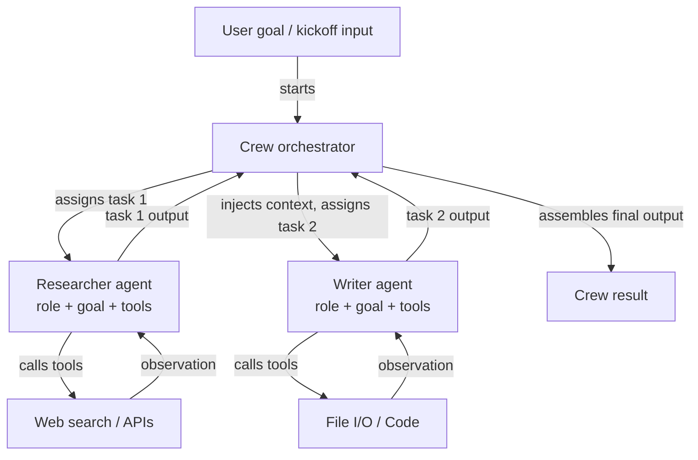

# CrewAI

## Definición

CrewAI es un framework Python de código abierto para orquestar **sistemas multi-agente basados en roles**. Cada agente en una tripulación se define por tres cosas: un **rol** (lo que hace el agente, por ejemplo "Investigador Senior"), un **objetivo** (lo que el agente intenta lograr, por ejemplo "Encontrar información precisa y actualizada") y un **trasfondo** (una descripción de persona que moldea el comportamiento y tono del agente). Esta estructura hace que el comportamiento del agente sea intuitivo de especificar y fácil de entender — refleja cómo incorporarías a un miembro humano del equipo.

Las tareas en CrewAI son unidades de trabajo discretas asignadas a los agentes. Una tarea tiene una descripción, una salida esperada y opcionalmente contexto de tareas anteriores. Las tareas se agrupan en una **Tripulación** (Crew), que define el proceso de ejecución: **secuencial** (las tareas se ejecutan una tras otra, con la salida de cada una alimentando a la siguiente) o **jerárquico** (un agente gestor delega y coordina tareas entre los trabajadores). Este modelo declarativo abstrae el bucle de paso de mensajes, permitiendo a los desarrolladores centrarse en *qué* debe hacerse en lugar de *cómo* los agentes se comunican entre sí.

CrewAI tiene integración de herramientas incorporada, compatible con herramientas de LangChain, funciones Python personalizadas decoradas con `@tool` y una biblioteca creciente de herramientas integradas (búsqueda web, E/S de archivos, ejecución de código). Los agentes también pueden recibir memoria (a corto plazo, a largo plazo, memoria de entidades) para mantener el contexto a través de ejecuciones de tareas y ejecuciones de la tripulación.

## Cómo funciona

### Agentes: roles, objetivos y trasfondos

Un agente es la unidad fundamental de trabajo en CrewAI. Se instancia un `Agent` con un rol, objetivo y trasfondo, más herramientas opcionales y un override de LLM. El trasfondo inicializa el prompt de sistema del agente, dándole una persona consistente en todas las interacciones de tareas. Los agentes pueden configurarse con `verbose=True` para exponer sus pasos de razonamiento internos. Cada agente opera de forma independiente dentro de la capa de orquestación de la tripulación, recibiendo tareas del gestor del proceso y devolviendo salidas estructuradas. La memoria del agente (cuando está habilitada) persiste las observaciones entre tareas, lo que es crítico para flujos de trabajo de investigación o análisis de larga duración.

### Tareas: descripciones, salidas esperadas y contexto

Un objeto `Task` describe lo que un agente debe hacer, cómo se ve una buena salida y qué agente debe ejecutarla. Las tareas pueden declarar dependencias de `context` en otras tareas, haciendo que sus salidas se inyecten automáticamente como contexto. Las descripciones de salidas esperadas guían al LLM para producir resultados estructurados y utilizables. Las tareas admiten formatos de salida: texto plano, JSON mediante modelos Pydantic o salidas de archivo. Al usar un proceso jerárquico, el agente gestor utiliza las descripciones de tareas para decidir la asignación y secuenciación de forma dinámica, sin requerir que el desarrollador codifique las dependencias.

### Procesos: secuencial y jerárquico

El objeto `Crew` une agentes y tareas y especifica un `Process`. En `Process.sequential`, las tareas se ejecutan en orden de lista, pasando la salida de cada tarea a la siguiente. En `Process.hierarchical`, un LLM gestor se instancia automáticamente para descomponer objetivos, asignar trabajo y revisar resultados — permitiendo una coordinación emergente sin cableado explícito. El modo secuencial es predecible y fácil de probar; el jerárquico es más flexible pero menos determinista. Elegir entre ellos depende de si tu flujo de trabajo tiene un DAG fijo (secuencial) o necesita asignación de tareas dinámica (jerárquico).

### Integración de herramientas incorporada

CrewAI incluye un decorador `@tool` compatible con las herramientas de LangChain, lo que facilita equipar a los agentes con búsqueda web (SerperDev, DuckDuckGo), ejecución de código, lectura/escritura de archivos y llamadas a APIs personalizadas. Las herramientas se registran por agente, por lo que el agente investigador puede tener herramientas de búsqueda mientras el agente escritor tiene herramientas de archivos. Las descripciones de herramientas se incluyen en el prompt del agente, y el framework maneja el bucle de llamada a herramientas de forma transparente. Para uso en producción, el paquete `CrewAI Tools` proporciona un conjunto curado de integraciones preconstruidas.



## Cuándo usar / Cuándo NO usar

| Usar cuando | Evitar cuando |
|---|---|
| Tu problema se mapea naturalmente a roles humanos distintos (investigador, escritor, revisor) | Necesitas un solo agente con herramientas — la sobrecarga de CrewAI es innecesaria |
| Quieres una API declarativa de alto nivel que oculte la complejidad del paso de mensajes | Necesitas control preciso sobre cada mensaje intercambiado entre agentes |
| Estás construyendo canalizaciones de contenido, flujos de trabajo de investigación o sistemas de análisis | Tu flujo de trabajo requiere ramificación condicional compleja o ciclos no admitidos por secuencial/jerárquico |
| Quieres memoria e integración de herramientas incorporadas con configuración mínima | La latencia en tiempo real es crítica — las ejecuciones secuenciales multi-agente añaden sobrecarga |
| Tu equipo no es experto en frameworks de agentes y necesita una API intuitiva | Necesitas observabilidad detallada de cada interacción de agente a nivel de grafo |

## Comparaciones

| Criterio | CrewAI | AutoGen | LangGraph |
|---|---|---|---|
| **Nivel de abstracción** | Alto: roles, objetivos, tareas declarativos | Medio: agentes conversacionales con API basada en mensajes | Bajo: nodos y aristas explícitos del grafo |
| **Modelo multi-agente** | Tripulación basada en roles con procesos secuenciales o jerárquicos | Pares de agentes conducidos por conversación o chats grupales | Subgrafos; grafo único con estado con múltiples nodos por agente |
| **Gestión de estado** | Implícita: pasada mediante contexto de tarea y memoria de la tripulación | Implícita: historial de mensajes | Explícita: estado TypedDict compartido entre todos los nodos |
| **Facilidad de configuración** | Muy fácil: 10-20 líneas para una tripulación multi-agente funcional | Moderada: requiere comprender tipos de agentes y patrones de iniciación | Más difícil: requiere un modelo mental de construcción de grafos |
| **Flujos condicionales/cíclicos** | Limitado: el secuencial es lineal, el jerárquico es opaco | Limitado: depende de las respuestas del agente | Primera clase: las aristas condicionales y los ciclos son la característica central |

## Ejemplos de código

```python
import os
from crewai import Agent, Task, Crew, Process
from crewai_tools import SerperDevTool

# --- Tool setup ---
# Requires SERPER_API_KEY environment variable for web search
search_tool = SerperDevTool()

# --- Agent definitions ---
# Each agent has a role, a goal that guides its behavior, and a backstory
# that sets its persona. Tools are assigned per-agent.

researcher = Agent(
    role="Senior AI Research Analyst",
    goal="Uncover the latest developments and practical applications of AI agent frameworks",
    backstory=(
        "You are an expert AI researcher with 10 years of experience evaluating "
        "LLM frameworks. You excel at finding accurate, up-to-date information "
        "and synthesizing it into clear technical summaries."
    ),
    tools=[search_tool],
    verbose=True,  # shows reasoning steps
    allow_delegation=False,
)

writer = Agent(
    role="Technical Content Writer",
    goal="Transform technical research into clear, engaging documentation",
    backstory=(
        "You are a seasoned technical writer who specializes in AI and machine learning. "
        "You turn dense research into accessible content without losing precision."
    ),
    tools=[],  # writer does not need search tools
    verbose=True,
)

reviewer = Agent(
    role="Editorial Reviewer",
    goal="Ensure accuracy, clarity, and completeness of technical content",
    backstory=(
        "You are a detail-oriented editor with a background in computer science. "
        "You catch technical inaccuracies, improve clarity, and verify all claims."
    ),
    verbose=True,
)

# --- Task definitions ---
# Tasks describe what to do, what output to expect, and which agent executes them.
# Context dependencies are declared explicitly.

research_task = Task(
    description=(
        "Research the current state of AI agent frameworks in 2024-2025. "
        "Focus on CrewAI, AutoGen, LangGraph, and Anthropic Tool Use. "
        "Cover: architecture, use cases, community size, and key differentiators."
    ),
    expected_output=(
        "A structured research report with sections for each framework, "
        "covering architecture, strengths, weaknesses, and best use cases. "
        "Include specific version numbers and recent updates where available."
    ),
    agent=researcher,
)

writing_task = Task(
    description=(
        "Using the research report, write a 500-word technical blog post comparing "
        "the four agent frameworks. Target audience: senior software engineers "
        "who are evaluating frameworks for production use."
    ),
    expected_output=(
        "A well-structured blog post with an introduction, per-framework sections, "
        "a comparison table, and a recommendation section. "
        "Use clear headings and avoid jargon where possible."
    ),
    agent=writer,
    context=[research_task],  # injects research_task output as context
)

review_task = Task(
    description=(
        "Review the blog post for technical accuracy, clarity, and completeness. "
        "Fix any errors and improve readability without changing the core content."
    ),
    expected_output=(
        "A polished, publication-ready blog post with all inaccuracies corrected "
        "and prose improved. Return the full revised text."
    ),
    agent=reviewer,
    context=[writing_task],
)

# --- Crew assembly ---
# Process.sequential runs tasks in order, passing outputs as context.
# Switch to Process.hierarchical for dynamic task allocation by a manager LLM.

crew = Crew(
    agents=[researcher, writer, reviewer],
    tasks=[research_task, writing_task, review_task],
    process=Process.sequential,
    verbose=True,
)

# --- Execution ---
result = crew.kickoff(inputs={"topic": "AI agent frameworks comparison 2025"})
print(result.raw)
```

## Recursos prácticos

- [Documentación oficial de CrewAI](https://docs.crewai.com/) — Referencia completa que cubre agentes, tareas, tripulaciones, procesos, herramientas y configuración de memoria.
- [Repositorio de CrewAI en GitHub](https://github.com/crewAIInc/crewAI) — Código fuente, ejemplos y rastreador de problemas del framework de código abierto.
- [Documentación de CrewAI Tools](https://docs.crewai.com/concepts/tools) — Integraciones de herramientas preconstruidas: búsqueda web, E/S de archivos, ejecución de código y creación de herramientas personalizadas.
- [Guía de integración CrewAI + LangChain](https://docs.crewai.com/how-to/llm-connections) — Cómo configurar diferentes proveedores de LLM incluyendo OpenAI, Anthropic y modelos locales.

## Ver también

- [Resumen de frameworks de agentes](/docs/agents/frameworks-overview)
- [AutoGen](/docs/agents/autogen)
- [LangGraph](/docs/agents/langgraph)
- [Sistemas multi-agente](/docs/agents/multi-agent-systems)
- [Agentes de IA](/docs/agents)
