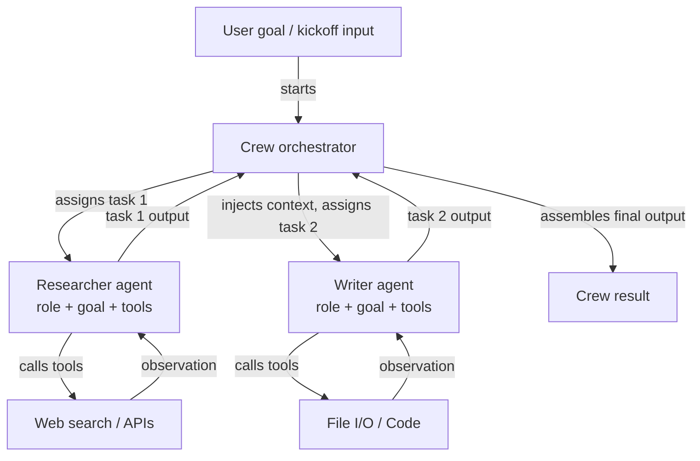

# CrewAI

## Definición

CrewAI es un framework Python de código abierto para orquestar **sistemas multi-agente basados en roles**. Cada agente en una crew se define por tres cosas: un **rol** (qué hace el agente, p.ej. "Senior Researcher"), un **objetivo** (qué intenta lograr el agente, p.ej. "Encontrar información precisa y actualizada") y una **historia de fondo** (una descripción de persona que da forma al comportamiento y tono del agente). Esta estructura hace que el comportamiento del agente sea intuitivo de especificar y fácil de entender — refleja cómo incorporarías a un miembro humano del equipo.

Las tareas en CrewAI son unidades discretas de trabajo asignadas a agentes. Una tarea tiene una descripción, una salida esperada y opcionalmente contexto de tareas anteriores. Las tareas se agrupan en una **Crew**, que define el proceso de ejecución: **secuencial** (las tareas se ejecutan una tras otra, con la salida de cada una fluyendo hacia la siguiente) o **jerárquico** (un agente administrador delega y coordina tareas entre trabajadores). Este modelo declarativo abstrae el bucle de paso de mensajes, permitiendo a los desarrolladores centrarse en *qué* debe hacerse en lugar de *cómo* los agentes hablan entre sí.

CrewAI tiene integración de herramientas incorporada, con soporte para herramientas de LangChain, funciones Python personalizadas decoradas con `@tool`, y una biblioteca creciente de herramientas incorporadas (búsqueda web, E/S de archivos, ejecución de código). Los agentes también pueden recibir memoria (corto plazo, largo plazo, memoria de entidades) para mantener contexto a través de las ejecuciones de tareas y las corridas de la crew.

## Cómo funciona

### Agentes: roles, objetivos e historias de fondo

Un agente es la unidad fundamental de trabajo en CrewAI. Instancias un `Agent` con un rol, objetivo e historia de fondo, más herramientas opcionales y una anulación de LLM. La historia de fondo prepara el prompt del sistema del agente, dándole una persona consistente a través de todas las interacciones de tareas. Los agentes pueden configurarse con `verbose=True` para exponer sus pasos de razonamiento interno. Cada agente opera independientemente dentro de la capa de orquestación de la crew.

### Tareas: descripciones, salidas esperadas y contexto

Un objeto `Task` describe qué debe hacer un agente, cómo luce una buena salida y qué agente debe ejecutarla. Las tareas pueden declarar dependencias de `context` en otras tareas, haciendo que sus salidas se inyecten automáticamente como contexto. Las descripciones de salida esperada guían al LLM para producir resultados estructurados y utilizables. Las tareas admiten formatos de salida: texto plano, JSON vía modelos Pydantic, o salidas de archivos.

### Procesos: secuencial y jerárquico

El objeto `Crew` une agentes y tareas y especifica un `Process`. En `Process.sequential`, las tareas se ejecutan en orden de lista, pasando cada salida de tarea como contexto. En `Process.hierarchical`, se instancia automáticamente un LLM administrador para descomponer objetivos, asignar trabajo y revisar resultados — permitiendo coordinación emergente sin cableado explícito. Secuencial es predecible y fácil de probar; jerárquico es más flexible pero menos determinista.

### Integración de herramientas incorporada

CrewAI incluye un decorador `@tool` compatible con herramientas de LangChain, facilitando equipar agentes con búsqueda web (SerperDev, DuckDuckGo), ejecución de código, lectura/escritura de archivos y llamadas de API personalizadas. Las herramientas se registran por agente, por lo que el agente investigador puede tener herramientas de búsqueda mientras el agente escritor tiene herramientas de archivos.



## Cuándo usar / Cuándo NO usar

| Usar cuando | Evitar cuando |
|---|---|
| Tu problema se mapea naturalmente a roles similares a los humanos (investigador, escritor, revisor) | Necesitas un solo agente con herramientas — el overhead de CrewAI es innecesario |
| Quieres una API declarativa de alto nivel que oculte la complejidad del paso de mensajes | Necesitas control preciso sobre cada mensaje intercambiado entre agentes |
| Estás construyendo pipelines de contenido, flujos de trabajo de investigación o sistemas de análisis | Tu flujo de trabajo requiere ramificación condicional compleja o ciclos no soportados por secuencial/jerárquico |
| Quieres memoria e integración de herramientas incorporadas con configuración mínima | La latencia en tiempo real es crítica — las corridas secuenciales multi-agente añaden overhead |
| Tu equipo no es experto en frameworks de agentes y necesita una API intuitiva | Necesitas observabilidad detallada de cada interacción de agente a nivel de grafo |

## Comparaciones

| Criterio | CrewAI | AutoGen | LangGraph |
|---|---|---|---|
| **Nivel de abstracción** | Alto: roles declarativos, objetivos, tareas | Medio: agentes conversacionales con API basada en mensajes | Bajo: nodos y aristas de grafo explícitos |
| **Modelo multi-agente** | Crew basada en roles con procesos secuenciales o jerárquicos | Pares de agentes impulsados por conversación o chats grupales | Subgrafos; grafo único con estado con múltiples nodos por agente |
| **Gestión de estado** | Implícita: pasada vía contexto de tarea y memoria de crew | Implícita: historial de mensajes | Explícita: estado TypedDict compartido entre todos los nodos |
| **Facilidad de configuración** | Muy fácil: 10–20 líneas para una crew multi-agente funcional | Moderado: requiere entender tipos de agentes y patrones de iniciación | Más difícil: requiere modelo mental de construcción de grafos |
| **Flujos condicionales/cíclicos** | Limitado: secuencial es lineal, jerárquico es opaco | Limitado: depende de las respuestas de los agentes | Primera clase: las aristas condicionales y los ciclos son la característica central |

## Ejemplos de código

```python
import os
from crewai import Agent, Task, Crew, Process
from crewai_tools import SerperDevTool

# --- Tool setup ---
# Requires SERPER_API_KEY environment variable for web search
search_tool = SerperDevTool()

# --- Agent definitions ---
# Each agent has a role, a goal that guides its behavior, and a backstory
# that sets its persona. Tools are assigned per-agent.

researcher = Agent(
    role="Senior AI Research Analyst",
    goal="Uncover the latest developments and practical applications of AI agent frameworks",
    backstory=(
        "You are an expert AI researcher with 10 years of experience evaluating "
        "LLM frameworks. You excel at finding accurate, up-to-date information "
        "and synthesizing it into clear technical summaries."
    ),
    tools=[search_tool],
    verbose=True,  # shows reasoning steps
    allow_delegation=False,
)

writer = Agent(
    role="Technical Content Writer",
    goal="Transform technical research into clear, engaging documentation",
    backstory=(
        "You are a seasoned technical writer who specializes in AI and machine learning. "
        "You turn dense research into accessible content without losing precision."
    ),
    tools=[],  # writer does not need search tools
    verbose=True,
)

reviewer = Agent(
    role="Editorial Reviewer",
    goal="Ensure accuracy, clarity, and completeness of technical content",
    backstory=(
        "You are a detail-oriented editor with a background in computer science. "
        "You catch technical inaccuracies, improve clarity, and verify all claims."
    ),
    verbose=True,
)

# --- Task definitions ---
# Tasks describe what to do, what output to expect, and which agent executes them.
# Context dependencies are declared explicitly.

research_task = Task(
    description=(
        "Research the current state of AI agent frameworks in 2024-2025. "
        "Focus on CrewAI, AutoGen, LangGraph, and Anthropic Tool Use. "
        "Cover: architecture, use cases, community size, and key differentiators."
    ),
    expected_output=(
        "A structured research report with sections for each framework, "
        "covering architecture, strengths, weaknesses, and best use cases. "
        "Include specific version numbers and recent updates where available."
    ),
    agent=researcher,
)

writing_task = Task(
    description=(
        "Using the research report, write a 500-word technical blog post comparing "
        "the four agent frameworks. Target audience: senior software engineers "
        "who are evaluating frameworks for production use."
    ),
    expected_output=(
        "A well-structured blog post with an introduction, per-framework sections, "
        "a comparison table, and a recommendation section. "
        "Use clear headings and avoid jargon where possible."
    ),
    agent=writer,
    context=[research_task],  # injects research_task output as context
)

review_task = Task(
    description=(
        "Review the blog post for technical accuracy, clarity, and completeness. "
        "Fix any errors and improve readability without changing the core content."
    ),
    expected_output=(
        "A polished, publication-ready blog post with all inaccuracies corrected "
        "and prose improved. Return the full revised text."
    ),
    agent=reviewer,
    context=[writing_task],
)

# --- Crew assembly ---
# Process.sequential runs tasks in order, passing outputs as context.
# Switch to Process.hierarchical for dynamic task allocation by a manager LLM.

crew = Crew(
    agents=[researcher, writer, reviewer],
    tasks=[research_task, writing_task, review_task],
    process=Process.sequential,
    verbose=True,
)

# --- Execution ---
result = crew.kickoff(inputs={"topic": "AI agent frameworks comparison 2025"})
print(result.raw)
```

## Recursos prácticos

- [Documentación oficial de CrewAI](https://docs.crewai.com/) — Referencia completa que cubre agentes, tareas, crews, procesos, herramientas y configuración de memoria.
- [Repositorio GitHub de CrewAI](https://github.com/crewAIInc/crewAI) — Código fuente, ejemplos y rastreador de problemas para el framework de código abierto.
- [Documentación de CrewAI Tools](https://docs.crewai.com/concepts/tools) — Integraciones de herramientas preconstruidas: búsqueda web, E/S de archivos, ejecución de código y creación de herramientas personalizadas.
- [Guía de integración CrewAI + LangChain](https://docs.crewai.com/how-to/llm-connections) — Cómo configurar diferentes proveedores de LLM incluyendo OpenAI, Anthropic y modelos locales.

## Ver también

- [Resumen de frameworks de agentes](/docs/agents/frameworks-overview)
- [AutoGen](/docs/agents/autogen)
- [LangGraph](/docs/agents/langgraph)
- [Sistemas multi-agente](/docs/agents/multi-agent-systems)
- [Agentes de IA](/docs/agents)
