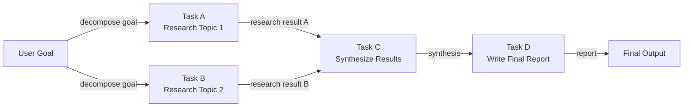

# Agentes basados en DAG

## Definición

Un agente basado en DAG organiza su trabajo como un **grafo acíclico dirigido (DAG)**: un conjunto de nodos (tareas o pasos del agente) conectados por aristas dirigidas que codifican dependencias entre ellos. «Acíclico» significa que no hay dependencias circulares; la ejecución fluye estrictamente hacia adelante de entradas a salidas. El beneficio clave frente a las pipelines secuenciales es que los **nodos independientes pueden ejecutarse en paralelo**, reduciendo drásticamente el tiempo de reloj para flujos de trabajo complejos de múltiples pasos.

En la práctica, cada nodo en el DAG puede ser una llamada a LLM, una invocación de herramienta, una transformación de datos o incluso un subagente. Un nodo se activa tan pronto como todos sus predecesores han completado con éxito, pasando sus salidas como entradas. Este modelo se adapta naturalmente a tareas como el análisis competitivo (investigar tres empresas en paralelo y luego sintetizar), revisión de código (verificar seguridad, estilo y pruebas de forma concurrente y luego informar) o pipelines de datos (obtener múltiples fuentes de datos en paralelo, unirlas y agregar).

La construcción dinámica de DAG va más allá: en lugar de un grafo fijo definido en tiempo de diseño, el agente construye o modifica el grafo en tiempo de ejecución basándose en resultados intermedios. Un agente de planificación podría producir una lista de tareas cuyas dependencias no se conocen hasta que ve los datos, y luego construir y ejecutar el DAG apropiado sobre la marcha. Esto combina el paralelismo estructurado de los DAGs con la adaptabilidad de los agentes de planificación, a costa de mayor complejidad de implementación.

## Cómo funciona

### Definición del grafo y tipos de nodos

Un DAG se define por un conjunto de nodos y un conjunto de aristas dirigidas. Cada nodo lleva una función (el trabajo a realizar), una especificación de entrada (qué salidas de nodos anteriores aceptar) y una especificación de salida (qué produce). Las aristas se definen como pares `(upstream_node, downstream_node)`. Los nodos sin aristas entrantes son puntos de entrada; los nodos sin aristas salientes son puntos de salida. Las funciones de nodo pueden ser síncronas o asíncronas; los nodos asíncronos son esenciales para lograr paralelismo real en flujos de trabajo de E/S.

### Ordenamiento topológico y planificación

Antes de la ejecución, el planificador calcula un **ordenamiento topológico** del grafo: una secuencia lineal de nodos tal que cada nodo aparece después de todos sus predecesores. Si múltiples nodos están en la misma profundidad (sin dependencia entre sí), pueden despacharse de forma concurrente. El algoritmo estándar es el algoritmo de Kahn, que procesa nodos capa por capa. En tiempo de ejecución, una cola mantiene nodos cuyas dependencias se han satisfecho; los workers toman de la cola y ejecutan nodos, luego encolan los nodos descendentes recién desbloqueados.

### Ejecución paralela

Los nodos independientes —aquellos sin dependencias compartidas— se ejecutan en paralelo usando hilos, corrutinas asíncronas o un pool de procesos. El grado de paralelismo está limitado por la estructura del DAG: una cadena completamente secuencial no ofrece paralelismo, mientras que un fan-out amplio seguido de una agregación fan-in puede ejecutar docenas de tareas de forma concurrente. En flujos de trabajo de agentes, esto es especialmente valioso para tareas como búsquedas web masivas, obtención de datos de múltiples fuentes o llamadas independientes a subagentes.

### Construcción dinámica de DAG

En modo dinámico, primero se ejecuta un paso de planificación y genera una especificación de grafo (por ejemplo, una lista JSON de nodos y aristas). El planificador instancia el DAG, lo valida para ciclos y comienza la ejecución. Los DAGs dinámicos deben incluir detección de ciclos —típicamente mediante DFS— antes de que comience la planificación. Este patrón es más frágil que los DAGs estáticos porque un plan mal formado puede producir un grafo inválido, pero permite una adaptabilidad mucho más rica.



## Cuándo usar / Cuándo NO usar

| Usar cuando | Evitar cuando |
|---|---|
| El flujo de trabajo tiene múltiples subtareas independientes que pueden ejecutarse en paralelo | Todas las tareas son estrictamente secuenciales sin oportunidad de paralelismo |
| El tiempo de ejecución es prioritario y las tareas están limitadas por E/S | El grafo de dependencias es lo suficientemente simple como para que baste una pipeline lineal |
| Las dependencias de tareas están bien definidas y pueden especificarse de antemano | La replanificación dinámica es más importante que la ejecución paralela |
| Se necesita observabilidad granular sobre qué tareas pasaron o fallaron | El equipo no tiene familiaridad con conceptos de planificación de grafos |
| El flujo de trabajo se asemeja a una pipeline de datos con etapas de fan-out y fan-in | Las tareas son tan rápidas que el overhead de planificación supera el beneficio del paralelismo |

## Comparaciones

| Criterio | Agentes basados en DAG | Pipeline secuencial | Planner-Executor |
|---|---|---|---|
| Paralelismo | Nativo — ramas independientes se ejecutan concurrentemente | Ninguno | Ninguno por defecto |
| Flexibilidad / adaptación dinámica | Baja-media (grafo fijo) | Baja | Alta (bucle de replanificación) |
| Complejidad de implementación | Alta (planificador, detección de ciclos, async) | Muy baja | Media |
| Auditabilidad | Alta — la estructura del grafo es explícita | Media | Alta — el artefacto del plan es explícito |
| Manejo de fallos | Reintentos por nodo, ejecuciones parciales posibles | Reiniciar desde el principio | Replanificación en caso de fallo |
| Mejor para | Flujos de trabajo amplios y paralelizables | Tareas secuenciales simples | Tareas adaptativas de múltiples pasos |

## Ejemplos de código

```python
"""
Simple DAG execution engine with topological sort.

Nodes are Python callables. Edges encode dependencies.
Independent nodes execute concurrently using asyncio.
"""
from __future__ import annotations

import asyncio
from collections import defaultdict, deque
from dataclasses import dataclass, field
from typing import Any, Callable, Coroutine


# ---------------------------------------------------------------------------
# DAG data structures
# ---------------------------------------------------------------------------

@dataclass
class Node:
    """A single unit of work in the DAG."""
    name: str
    # func receives a dict of {upstream_node_name: result} for all predecessors
    func: Callable[..., Coroutine[Any, Any, Any]]
    depends_on: list[str] = field(default_factory=list)


class DAGExecutionError(Exception):
    pass


# ---------------------------------------------------------------------------
# DAG engine
# ---------------------------------------------------------------------------

class DAGExecutor:
    """
    Executes a DAG of async nodes respecting dependencies.
    Independent nodes are dispatched concurrently.
    """

    def __init__(self):
        self._nodes: dict[str, Node] = {}

    def add_node(self, node: Node) -> "DAGExecutor":
        self._nodes[node.name] = node
        return self

    def _validate(self) -> list[str]:
        """
        Kahn's topological sort algorithm.
        Returns an ordered list of node names, or raises on cycle detection.
        """
        in_degree: dict[str, int] = {n: 0 for n in self._nodes}
        dependents: dict[str, list[str]] = defaultdict(list)

        for node in self._nodes.values():
            for dep in node.depends_on:
                if dep not in self._nodes:
                    raise DAGExecutionError(f"Dependency '{dep}' not found in DAG.")
                in_degree[node.name] += 1
                dependents[dep].append(node.name)

        queue = deque(n for n, deg in in_degree.items() if deg == 0)
        order: list[str] = []

        while queue:
            current = queue.popleft()
            order.append(current)
            for downstream in dependents[current]:
                in_degree[downstream] -= 1
                if in_degree[downstream] == 0:
                    queue.append(downstream)

        if len(order) != len(self._nodes):
            raise DAGExecutionError("Cycle detected in DAG — cannot execute.")

        return order

    async def run(self) -> dict[str, Any]:
        """Execute the DAG and return a mapping of node_name -> result."""
        self._validate()

        results: dict[str, Any] = {}
        completed: set[str] = set()
        pending: dict[str, asyncio.Task] = {}
        in_degree: dict[str, int] = {n: len(self._nodes[n].depends_on) for n in self._nodes}

        async def execute_node(node: Node) -> Any:
            upstream = {dep: results[dep] for dep in node.depends_on}
            return await node.func(upstream)

        # Start nodes with no dependencies immediately
        ready = [n for n, deg in in_degree.items() if deg == 0]
        for name in ready:
            pending[name] = asyncio.create_task(execute_node(self._nodes[name]))

        # Build reverse adjacency for unblocking
        dependents: dict[str, list[str]] = defaultdict(list)
        for node in self._nodes.values():
            for dep in node.depends_on:
                dependents[dep].append(node.name)

        while pending:
            done_tasks, _ = await asyncio.wait(
                pending.values(), return_when=asyncio.FIRST_COMPLETED
            )
            for task in done_tasks:
                finished_name = next(n for n, t in pending.items() if t is task)
                results[finished_name] = task.result()
                completed.add(finished_name)
                del pending[finished_name]

                for downstream in dependents[finished_name]:
                    in_degree[downstream] -= 1
                    if in_degree[downstream] == 0 and downstream not in completed:
                        pending[downstream] = asyncio.create_task(
                            execute_node(self._nodes[downstream])
                        )

        return results


async def research_topic_1(upstream: dict) -> str:
    await asyncio.sleep(0.1)
    return "Research result for Topic 1: renewable energy trends in Europe."

async def research_topic_2(upstream: dict) -> str:
    await asyncio.sleep(0.1)
    return "Research result for Topic 2: renewable energy adoption in Asia."

async def synthesize(upstream: dict) -> str:
    result_a = upstream["task_a"]
    result_b = upstream["task_b"]
    return f"Synthesis of:\n  A: {result_a}\n  B: {result_b}"

async def write_report(upstream: dict) -> str:
    synthesis = upstream["task_c"]
    return f"Final report based on synthesis:\n{synthesis}"


async def main():
    dag = DAGExecutor()
    dag.add_node(Node("task_a", research_topic_1, depends_on=[]))
    dag.add_node(Node("task_b", research_topic_2, depends_on=[]))
    dag.add_node(Node("task_c", synthesize, depends_on=["task_a", "task_b"]))
    dag.add_node(Node("task_d", write_report, depends_on=["task_c"]))

    import time
    start = time.perf_counter()
    results = await dag.run()
    elapsed = time.perf_counter() - start

    print(f"DAG completed in {elapsed:.3f}s (task_a and task_b ran in parallel)\n")
    for name, result in results.items():
        print(f"[{name}]\n{result}\n")


if __name__ == "__main__":
    asyncio.run(main())
```

## Recursos prácticos

- [LangGraph Documentation](https://langchain-ai.github.io/langgraph/) — Framework de ejecución de grafos de nivel productivo para agentes LLM, con soporte de primera clase para ramificación, ejecución paralela y ciclos.
- [LLM Compiler: Parallel Function Calling (Kim et al., 2023)](https://arxiv.org/abs/2312.04511) — Paper que introduce llamadas de herramientas paralelas basadas en DAG para agentes LLM, con mejoras significativas de latencia.
- [Apache Airflow DAG Concepts](https://airflow.apache.org/docs/apache-airflow/stable/core-concepts/dags.html) — Modelo de orquestación de DAG probado en batalla en el mundo de la ingeniería de datos; muchos motores de DAG de agentes toman prestados estos conceptos.
- [Prefect — Workflow Orchestration](https://docs.prefect.io/latest/concepts/flows/) — Orquestación de flujos de trabajo moderna con ejecución de tareas paralelas integrada, aplicable a flujos de trabajo de agentes.

## Ver también

- [Planner-Executor architecture](/docs/agents/planner-executor)
- [AI agents](/docs/agents)
- [Airflow](/docs/mlops/data-engineering/airflow)
