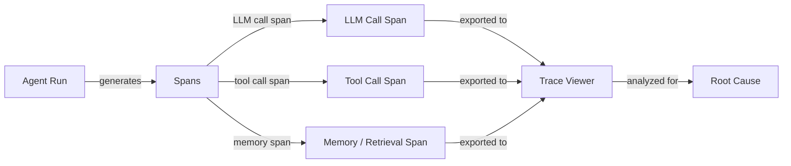

# Depuración y observabilidad de agentes

## Definición

La depuración y observabilidad de agentes es la disciplina de hacer que los sistemas de agentes de IA sean suficientemente transparentes para que los fallos, regresiones e ineficiencias puedan identificarse, diagnosticarse y corregirse. A diferencia de la depuración de software tradicional — donde un stack trace apunta a una línea exacta — los fallos de agentes a menudo son emergentes: una llamada correcta al LLM produce una salida plausible pero incorrecta que se propaga a través de llamadas a herramientas posteriores, corrompe el estado del agente y produce una respuesta final incorrecta sin que se lance ninguna excepción. La observabilidad te proporciona los datos necesarios para reconstruir lo que ocurrió.

Los tres pilares de la observabilidad — registros, métricas y trazas — se aplican a los agentes como lo hacen a los sistemas distribuidos, pero con adaptaciones importantes. Los registros deben capturar no solo los errores sino el contenido semántico de las entradas y salidas del LLM. Las métricas deben incluir recuentos de tokens, latencia por span y frecuencias de llamadas a herramientas junto a las métricas de sistema habituales. Las trazas deben modelar la estructura jerárquica de una ejecución de agente: un span raíz para la tarea general, spans hijo para cada llamada al LLM, spans nieto para cada invocación de herramienta, y así sucesivamente. Juntos, estos dan un registro completo y reproducible de cada ejecución del agente.

Sin una buena observabilidad, la depuración se convierte en conjeturas: vuelves a ejecutar el agente, quizás obtienes un resultado diferente debido al no determinismo, y no puedes estar seguro de si tu corrección abordó la causa raíz. Con ella, puedes identificar la llamada exacta al LLM donde el razonamiento falló, identificar qué herramienta devolvió datos inesperados, medir la contribución de latencia de cada paso y comparar dos ejecuciones lado a lado para entender qué cambió.

## Cómo funciona



### Registro estructurado

El registro estructurado significa emitir registros JSON legibles por máquina en lugar de cadenas de texto libre. Para los agentes, cada entrada de registro debe incluir: ID de ejecución, número de paso, tipo de span (llm/tool/memory), payload de entrada, payload de salida, timestamps, recuentos de tokens y cualquier error. Los registros estructurados hacen posible filtrar, agregar y correlacionar eventos a través de una ejecución distribuida sin análisis manual de cadenas. Bibliotecas como `structlog` o `loguru` de Python hacen esto sencillo.

### Rastreo distribuido y spans

Una traza es un grafo acíclico dirigido de spans que representa una única ejecución del agente. El span raíz cubre toda la ejecución; los spans hijo cubren llamadas al LLM, invocaciones de herramientas y búsquedas de memoria. Cada span lleva un ID de traza (compartido a través de la ejecución) y un ID de span (único por span), lo que permite una reconstrucción completa. OpenTelemetry (OTel) es el estándar abierto para emitir trazas; tiene exportadores para Jaeger, Zipkin, Phoenix y LangSmith. Instrumentar un agente con spans de OTel requiere envolver las llamadas al LLM y las llamadas a herramientas con gestores de contexto de span.

### Visualización de trazas

Los visores de trazas renderizan el árbol de spans visualmente, mostrando la línea de tiempo, duración, entradas, salidas y errores para cada span. LangSmith proporciona un visor de trazas diseñado específicamente para agentes LangChain con detalle a nivel de tokens. Phoenix (Arize) es una alternativa de código abierto que admite cualquier fuente compatible con OpenTelemetry. Weights & Biases Traces se integra con las ejecuciones de W&B para equipos que ya lo utilizan para seguimiento de experimentos. Los buenos visores de trazas permiten comparar dos ejecuciones lado a lado, filtrar spans por tipo y profundizar en la entrada/salida exacta a nivel de tokens que causó un fallo.

### Análisis de causa raíz

Con las trazas a mano, el análisis de causa raíz sigue un proceso sistemático: encontrar el primer span donde la salida se desvió de la expectativa, inspeccionar sus entradas (¿eran correctas?) y determinar si el fallo fue en el razonamiento del LLM, en una herramienta que devolvió datos incorrectos o en un problema de memoria/contexto. El no determinismo hace esto más difícil — ejecutar la misma entrada dos veces puede producir resultados diferentes — por lo que capturar trazas para cada ejecución (no solo los fallos) y comparar con una traza conocida como buena es esencial. Etiquetar las trazas con metadatos (ID de usuario, tipo de tarea, versión del prompt) permite el análisis de cohortes para detectar patrones en muchas ejecuciones.

### Desafíos comunes de depuración

El no determinismo significa que el mismo error puede no reproducirse en la siguiente ejecución, lo que requiere análisis estadístico a través de muchas trazas. Los fallos de múltiples pasos se acumulan: un error en el paso 2 puede no manifestarse hasta el paso 7, por lo que debes rastrear la propagación del error hacia atrás. Los errores de herramientas — tiempos de espera de red, respuestas de API malformadas, errores de permisos — a menudo son silenciosos (el agente recibe una cadena de error como resultado de la herramienta y continúa). La inyección de prompts y los límites de la ventana de contexto pueden causar cambios repentinos de comportamiento que parecen aleatorios sin el contexto de la traza.

## Cuándo usar / Cuándo NO usar

| Usar cuando | Evitar cuando |
|---|---|
| Diagnosticar un fallo específico del agente en producción | Tratar la observabilidad como algo secundario después del despliegue |
| Comparar dos versiones del prompt para entender diferencias de comportamiento | Registrar en exceso cada token en una canalización de baja latencia y alto volumen sin muestreo |
| Identificar qué llamada a herramienta es el cuello de botella de latencia | Confiar únicamente en la respuesta final para juzgar si una ejecución tuvo éxito |
| Construir un conjunto de regresión que requiera aserciones a nivel de traza | Registrar PII sin redacción en sistemas multi-inquilino |
| Auditar frecuencias de llamadas a herramientas y distribuciones de argumentos | Usar declaraciones print en lugar de trazas estructuradas y correlacionadas |

## Pros y contras

| Pros | Contras |
|---|---|
| Permite un análisis preciso de causa raíz para fallos de múltiples pasos | La instrumentación añade complejidad al código y una pequeña sobrecarga de latencia |
| Proporciona un registro de auditoría completo para cumplimiento y depuración | Almacenar trazas completas de E/S del LLM genera un volumen de datos significativo |
| Hace que el comportamiento no determinista sea manejable mediante la comparación de ejecuciones | Los visores de trazas tienen una curva de aprendizaje para nuevos miembros del equipo |
| Se integra con pilas de MLOps y monitoreo existentes | Las estrategias de muestreo deben ajustarse para equilibrar cobertura vs. costo |
| Los registros estructurados permiten la detección automática de anomalías | Los datos sensibles de usuarios en las trazas requieren control de acceso cuidadoso |

## Ejemplos de código

```python
# Agent observability with OpenTelemetry + Phoenix (Arize)
# pip install opentelemetry-api opentelemetry-sdk openinference-instrumentation-openai arize-phoenix

import os
import time
import json
import structlog
from opentelemetry import trace
from opentelemetry.sdk.trace import TracerProvider
from opentelemetry.sdk.trace.export import BatchSpanProcessor
from opentelemetry.exporter.otlp.proto.http.trace_exporter import OTLPSpanExporter
from opentelemetry.sdk.resources import Resource


# --- Configure structured logger ---
structlog.configure(
    processors=[
        structlog.processors.TimeStamper(fmt="iso"),
        structlog.stdlib.add_log_level,
        structlog.processors.JSONRenderer(),
    ]
)
log = structlog.get_logger()


# --- Set up OpenTelemetry tracer pointing at Phoenix (default port 6006) ---
resource = Resource.create({"service.name": "my-agent", "service.version": "0.1.0"})
provider = TracerProvider(resource=resource)
otlp_exporter = OTLPSpanExporter(
    endpoint="http://localhost:6006/v1/traces",  # Phoenix local endpoint
)
provider.add_span_processor(BatchSpanProcessor(otlp_exporter))
trace.set_tracer_provider(provider)
tracer = trace.get_tracer("agent.tracer")


# --- Simulated LLM call (replace with real client) ---
def call_llm(messages: list[dict], run_id: str) -> dict:
    """Wrap an LLM call in an OTel span."""
    with tracer.start_as_current_span("llm.call") as span:
        span.set_attribute("llm.model", "gpt-4o-mini")
        span.set_attribute("llm.prompt_tokens", sum(len(m["content"]) for m in messages))
        span.set_attribute("run.id", run_id)

        # Simulate LLM response with a tool call decision
        time.sleep(0.05)  # Simulate network latency
        response = {
            "content": None,
            "tool_call": {"name": "search_web", "args": {"query": messages[-1]["content"]}},
            "completion_tokens": 42,
        }
        span.set_attribute("llm.completion_tokens", response["completion_tokens"])
        log.info("llm_call_complete", run_id=run_id, tool_call=response.get("tool_call"))
        return response


# --- Simulated tool call ---
def call_tool(name: str, args: dict, run_id: str) -> str:
    """Wrap a tool call in an OTel span."""
    with tracer.start_as_current_span(f"tool.{name}") as span:
        span.set_attribute("tool.name", name)
        span.set_attribute("tool.input", json.dumps(args))
        span.set_attribute("run.id", run_id)

        start = time.time()
        # Simulate tool execution
        time.sleep(0.1)
        result = f"Search results for: {args.get('query', '')}"
        duration_ms = (time.time() - start) * 1000

        span.set_attribute("tool.output", result)
        span.set_attribute("tool.duration_ms", round(duration_ms, 1))
        log.info("tool_call_complete", run_id=run_id, tool=name, duration_ms=duration_ms)
        return result


# --- Agent run with full trace ---
def run_agent(task: str, run_id: str, max_steps: int = 5) -> str:
    """Run a simple ReAct-style agent with full OTel tracing."""
    with tracer.start_as_current_span("agent.run") as root_span:
        root_span.set_attribute("agent.task", task)
        root_span.set_attribute("run.id", run_id)
        log.info("agent_run_start", run_id=run_id, task=task)

        messages = [
            {"role": "system", "content": "You are a helpful assistant with tool access."},
            {"role": "user", "content": task},
        ]

        for step in range(max_steps):
            with tracer.start_as_current_span(f"agent.step.{step}") as step_span:
                step_span.set_attribute("agent.step", step)

                response = call_llm(messages, run_id)

                if response.get("tool_call"):
                    tool_call = response["tool_call"]
                    tool_result = call_tool(tool_call["name"], tool_call["args"], run_id)
                    # Append tool result to conversation
                    messages.append({"role": "assistant", "content": str(response["content"])})
                    messages.append({"role": "tool", "content": tool_result})
                else:
                    # No tool call: agent has a final answer
                    final_answer = response.get("content", "")
                    root_span.set_attribute("agent.final_answer", str(final_answer))
                    log.info("agent_run_complete", run_id=run_id, steps=step + 1)
                    return final_answer

        root_span.set_attribute("agent.stopped", "max_steps_reached")
        log.warning("agent_max_steps_reached", run_id=run_id, max_steps=max_steps)
        return "Agent stopped: max steps reached."


# --- Run the agent ---
if __name__ == "__main__":
    import uuid
    run_id = str(uuid.uuid4())
    answer = run_agent("What are the latest developments in AI agents?", run_id)
    print(f"Answer: {answer}")
    # Traces are now visible at http://localhost:6006 in Phoenix UI
```

## Recursos prácticos

- [Documentación de LangSmith](https://docs.smith.langchain.com/) — Plataforma completa de rastreo, gestión de conjuntos de datos y evaluación para agentes basados en LangChain, con un visor de trazas específico.
- [Documentación de Phoenix by Arize](https://docs.arize.com/phoenix) — Plataforma de observabilidad LLM de código abierto que admite trazas OpenTelemetry; funciona con cualquier framework de agentes.
- [Documentación de OpenTelemetry Python](https://opentelemetry-python.readthedocs.io/) — Documentación oficial para instrumentar aplicaciones Python con rastreo distribuido, métricas y registros.
- [Weights & Biases Weave](https://wandb.github.io/weave/) — Herramienta de rastreo y evaluación de W&B para aplicaciones LLM, integrada con el seguimiento de experimentos de W&B.
- [Instrumentación OpenInference](https://github.com/Arize-ai/openinference) — Bibliotecas de instrumentación basadas en OTel de código abierto para LLMs, agentes y almacenes vectoriales (usadas por Phoenix).

## Ver también

- [Evaluación y pruebas de agentes](/docs/agents/evaluation)
- [Agentes](/docs/agents)
- [Monitoreo de MLOps](/docs/mlops/monitoring)
