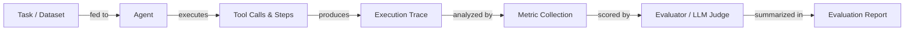

# Evaluación y pruebas de agentes

## Definición

La evaluación de agentes es la práctica de medir qué tan bien un agente de IA completa tareas, usa las herramientas correctamente, se mantiene dentro de los presupuestos de costo y latencia, y produce salidas precisas. A diferencia de la evaluación estática de modelos — donde se compara una salida fija con una referencia — la evaluación de agentes debe tener en cuenta trayectorias de múltiples pasos, rutas no deterministas, llamadas a herramientas intermedias y el efecto acumulativo de los errores a través de los pasos. Una sola tarea puede tener éxito a través de muchas rutas de ejecución diferentes, lo que hace que las puntuaciones de precisión tradicionales sean insuficientes por sí solas.

La evaluación rigurosa es lo que separa una demo de un sistema de producción. Sin ella, no puedes saber si un cambio de prompt mejoró o empeoró el comportamiento, si una nueva definición de herramienta se está usando correctamente, o si la latencia es aceptable bajo carga real. La evaluación debe ocurrir en múltiples niveles: pruebas unitarias de herramientas individuales, pruebas de integración de ejecuciones completas del agente y pruebas de regresión contra un conjunto de datos de referencia de tareas representativas.

Una estrategia de evaluación madura combina métricas automatizadas (tasa de completitud de tareas, precisión, latencia, costo, eficiencia del uso de herramientas) con revisión humana para casos extremos y calidad subjetiva. Los benchmarks como AgentBench y SWE-bench proporcionan conjuntos de tareas estandarizadas para comparar entre modelos y frameworks, mientras que frameworks como LangSmith, Ragas y DeepEval proporcionan infraestructura para ejecutar evaluaciones a escala y rastrear resultados a lo largo del tiempo.

## Cómo funciona



### Preparación de tareas y conjuntos de datos

Un buen conjunto de datos de evaluación contiene tareas representativas extraídas de solicitudes de usuarios reales o realistas, cada una con resultados esperados o respuestas de referencia. Las tareas deben cubrir caminos felices, casos extremos, entradas adversariales y flujos de trabajo de múltiples pasos. Para la evaluación de agentes específicamente, cada tarea debe especificar la respuesta final esperada y opcionalmente la secuencia esperada de llamadas a herramientas. La calidad del conjunto de datos es la palanca más importante en la calidad de la evaluación — basura entra, basura sale.

### Ejecución y recopilación de trazas

El agente ejecuta cada tarea del conjunto de datos, y cada paso — llamadas al LLM, invocaciones de herramientas, lecturas de memoria y salidas — se captura como una traza estructurada. Las trazas registran entradas, salidas, timestamps, recuentos de tokens y errores para cada span. Este es el material en bruto para todas las métricas posteriores y también es invaluable para depurar fallos. El determinismo puede mejorarse fijando semillas aleatorias y temperatura, pero debe esperarse cierta variabilidad y tenerse en cuenta ejecutando múltiples pruebas por tarea.

### Recopilación de métricas

Las métricas principales para la evaluación de agentes incluyen: **tasa de completitud de tareas** (¿el agente terminó la tarea con éxito?), **precisión** (¿es correcta la respuesta final?), **latencia** (tiempo total de extremo a extremo), **costo** (total de tokens × precio) y **eficiencia del uso de herramientas** (¿se llamaron las herramientas el número correcto de veces con argumentos correctos?). Las métricas secundarias incluyen recuento de pasos, tasa de reintentos, tasa de alucinaciones y fidelidad al contexto recuperado. Las métricas se calculan por tarea y se agregan en todo el conjunto de datos.

### Evaluación y puntuación

Muchas métricas — especialmente la corrección para salidas de formato libre — requieren un juez. Un juez LLM (por ejemplo, GPT-4 o Claude) recibe la tarea, la respuesta del agente y opcionalmente una respuesta de referencia, y puntúa la calidad en una rúbrica. Esto se llama a veces "LLM como juez" y es la columna vertebral de frameworks como Ragas y DeepEval. Para tareas deterministas (ejecución de código, consultas SQL, extracción estructurada), las verificaciones basadas en reglas son más confiables y económicas. La revisión humana debe usarse para calibrar los jueces LLM y detectar sesgos sistemáticos.

### Informes y seguimiento de regresiones

Los resultados de la evaluación se agregan en un informe y se almacenan junto con la versión del agente, la versión del prompt y la versión del modelo. Esto permite el seguimiento de regresiones: puedes comparar el agente actual con una línea de base y detectar regresiones antes de desplegarlo. Los paneles en herramientas como LangSmith muestran tendencias de métricas a lo largo del tiempo, ayudando a los equipos a detectar degradaciones sutiles que las ejecuciones de prueba individuales pasarían por alto.

## Cuándo usar / Cuándo NO usar

| Usar cuando | Evitar cuando |
|---|---|
| Comparar dos versiones de agente o prompts antes de desplegar | Omitir la evaluación porque la tarea "parece correcta" en una demo |
| Construir un conjunto de regresión para detectar cambios que rompen el prompt | Ejecutar la evaluación solo una vez al inicio del proyecto y nunca más |
| Medir costo y latencia para cumplir con los SLAs | Usar una sola métrica (por ejemplo, solo precisión) para juzgar la calidad general |
| Validar el comportamiento de llamadas a herramientas y la corrección de argumentos | Usar un conjunto de datos de solo tareas fáciles y limpias sin casos extremos |
| Incorporar un nuevo modelo para verificar la transferencia de capacidades | Tratar las puntuaciones del juez LLM como verdad absoluta sin calibración humana |

## Comparaciones

| Criterio | LangSmith | DeepEval | Ragas |
|---|---|---|---|
| **Facilidad de uso** | Integración estrecha con LangChain, configuración rápida para usuarios de LangChain; más difícil para otros | API Python limpia, sin boilerplate mínimo, fácil de agregar a cualquier canalización | Optimizado para canalizaciones RAG; sencillo para tareas de recuperación |
| **Cobertura de métricas** | Rastreo, evaluadores personalizados, gestión de conjuntos de datos; menos métricas LLM incorporadas | 20+ métricas incorporadas (alucinación, fidelidad, corrección de herramientas, toxicidad) | Métricas centradas en RAG (fidelidad, relevancia de respuestas, recuperación de contexto, precisión) |
| **Integración de rastreo** | Primera clase: captura completa de trazas, visualización de spans, comparación de ejecuciones | Captura de trazas mediante decoradores; menos visualización nativa | Sin rastreo incorporado; se integra a través de LangSmith o W&B |
| **Precio** | Nivel gratuito + planes de pago alojados; auto-hospedable | Código abierto; panel de control en la nube disponible | Código abierto; sin panel alojado |
| **Personalización** | Evaluadores personalizados mediante Python o plantillas de prompts | Extender mediante subclases de clases de métricas | Métricas personalizadas mediante Python; fuerte soporte de biblioteca de métricas NLP |

## Pros y contras

| Pros | Contras |
|---|---|
| Detecta regresiones antes de que lleguen a los usuarios | Construir un buen conjunto de datos es tedioso |
| Proporciona evidencia objetiva para decisiones de prompt/modelo | Los jueces LLM pueden ser sesgados o inconsistentes |
| Permite presupuestar costo y latencia | El no determinismo requiere múltiples pruebas, aumentando el costo |
| Escala a grandes conjuntos de datos con automatización | Las trazas del agente pueden ser grandes y costosas de almacenar |
| Se integra en CI/CD para puertas de calidad continuas | La elección de métricas es difícil y específica del dominio |

## Ejemplos de código

```python
# Agent evaluation with DeepEval
# pip install deepeval langchain-openai

from deepeval import evaluate
from deepeval.metrics import (
    TaskCompletionMetric,
    ToolCorrectnessMetric,
    HallucinationMetric,
)
from deepeval.test_case import LLMTestCase, ToolCall
from langchain_openai import ChatOpenAI
from langchain.agents import AgentExecutor, create_openai_tools_agent
from langchain_core.prompts import ChatPromptTemplate
from langchain_core.tools import tool


# --- Define a simple tool for the agent ---
@tool
def get_weather(city: str) -> str:
    """Return the current weather for a city."""
    # In production this would call a real API
    return f"The weather in {city} is sunny and 22°C."


# --- Build a minimal agent ---
llm = ChatOpenAI(model="gpt-4o-mini", temperature=0)
prompt = ChatPromptTemplate.from_messages([
    ("system", "You are a helpful assistant. Use tools when needed."),
    ("human", "{input}"),
    ("placeholder", "{agent_scratchpad}"),
])
agent = create_openai_tools_agent(llm, [get_weather], prompt)
agent_executor = AgentExecutor(agent=agent, tools=[get_weather], verbose=False)


def run_agent(user_input: str) -> tuple[str, list[ToolCall]]:
    """Run the agent and return (final_answer, tool_calls)."""
    result = agent_executor.invoke({"input": user_input})
    # In a real setup, parse the intermediate steps for tool call records
    actual_output = result["output"]
    tool_calls_used = [
        ToolCall(name="get_weather", input_parameters={"city": "Paris"})
    ]  # Extracted from result["intermediate_steps"] in production
    return actual_output, tool_calls_used


# --- Build DeepEval test cases from an evaluation dataset ---
dataset = [
    {
        "input": "What is the weather in Paris?",
        "expected_output": "The weather in Paris is sunny and 22°C.",
        "expected_tools": [
            ToolCall(name="get_weather", input_parameters={"city": "Paris"})
        ],
        "context": ["get_weather tool returns current conditions"],
    },
    {
        "input": "Tell me the weather in London.",
        "expected_output": "The weather in London is sunny and 22°C.",
        "expected_tools": [
            ToolCall(name="get_weather", input_parameters={"city": "London"})
        ],
        "context": ["get_weather tool returns current conditions"],
    },
]

test_cases = []
for item in dataset:
    actual_output, tool_calls_used = run_agent(item["input"])

    test_case = LLMTestCase(
        input=item["input"],
        actual_output=actual_output,
        expected_output=item["expected_output"],
        tools_called=tool_calls_used,
        expected_tools=item["expected_tools"],
        context=item["context"],
    )
    test_cases.append(test_case)

# --- Define metrics ---
task_completion = TaskCompletionMetric(
    threshold=0.7,
    model="gpt-4o-mini",
    include_reason=True,
)
tool_correctness = ToolCorrectnessMetric()  # Checks tool name + args match
hallucination = HallucinationMetric(
    threshold=0.3,
    model="gpt-4o-mini",
)

# --- Run evaluation ---
results = evaluate(
    test_cases=test_cases,
    metrics=[task_completion, tool_correctness, hallucination],
)

# --- Print summary ---
for tc, result in zip(test_cases, results.test_results):
    print(f"Input: {tc.input}")
    for metric_result in result.metrics_data:
        status = "PASS" if metric_result.success else "FAIL"
        print(f"  [{status}] {metric_result.name}: {metric_result.score:.2f}")
        if metric_result.reason:
            print(f"         Reason: {metric_result.reason}")
    print()
```

## Recursos prácticos

- [Documentación de DeepEval](https://docs.confident-ai.com/) — Guía completa de métricas de DeepEval, casos de prueba e integración CI/CD para evaluación de LLM y agentes.
- [Documentación de Ragas](https://docs.ragas.io/) — Framework Ragas para evaluar canalizaciones RAG y fidelidad de agentes, con métricas como relevancia de respuestas y recuperación de contexto.
- [Documentación de LangSmith](https://docs.smith.langchain.com/) — Características de evaluación, rastreo y gestión de conjuntos de datos de LangSmith para agentes basados en LangChain.
- [Artículo y tabla de clasificación de AgentBench](https://github.com/THUDM/AgentBench) — Benchmark para evaluar agentes LLM en diversas tareas del mundo real incluyendo entornos web, codificación y SO.
- [SWE-bench](https://www.swebench.com/) — Benchmark que mide la capacidad del agente para resolver problemas reales de GitHub en repositorios de ingeniería de software.

## Ver también

- [Agentes](/docs/agents)
- [Depuración y observabilidad de agentes](/docs/agents/debugging)
- [Métricas de evaluación](/docs/evaluation-metrics)
- [Benchmarks](/docs/benchmarks)
