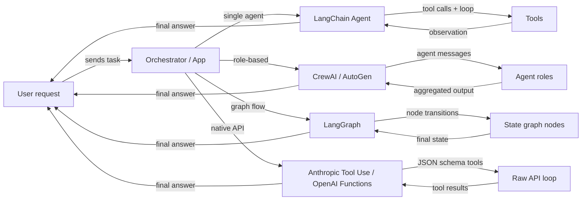

# Resumen de frameworks de agentes

## Definición

Un **framework de agentes** es una biblioteca o SDK que gestiona las preocupaciones de infraestructura para construir agentes de IA: registro de herramientas, paso de mensajes, gestión de estado, orquestación e integración con proveedores de LLM. Sin un framework, se escriben esas capas de plomería uno mismo; con un framework, se describe *qué* debe hacer el agente y este gestiona *cómo* se ejecuta el bucle.

El panorama de frameworks de agentes ha crecido rápidamente y ahora abarca varias categorías distintas. Algunos frameworks se centran en un único agente con herramientas (agentes LangChain), otros priorizan la colaboración basada en roles entre muchos agentes (CrewAI, AutoGen), otros modelan el comportamiento del agente como grafos de estado explícitos (LangGraph), y algunos omiten el framework por completo y se basan en las capacidades nativas del proveedor del modelo (Anthropic Tool Use, OpenAI Function Calling). Cada categoría refleja una filosofía diferente sobre dónde deben residir el control y la complejidad.

Elegir el framework correcto no es solo una decisión técnica — da forma a cómo se razona sobre el sistema, se depuran los fallos y se escala a producción. Un principiante que construye un asistente de investigación simple tiene necesidades muy diferentes a las de un equipo de plataforma que conecta una docena de agentes especializados en una pipeline de producción.

## Cómo funciona

### Frameworks de agente único (agentes LangChain)

Los frameworks de agente único dan a un LLM acceso a un conjunto de herramientas y ejecutan un bucle: el modelo decide qué herramienta llamar, el framework la ejecuta, la observación se añade a la conversación y el bucle continúa hasta que el modelo emite una respuesta final. LangChain es el ejemplo canónico, exponiendo `create_react_agent` y `AgentExecutor` para agentes de estilo ReAct sencillos. El desarrollador registra herramientas (funciones Python con docstrings o esquemas Pydantic) y el framework gestiona la construcción de prompts y el análisis de resultados. El agente único es el punto de partida correcto: menor latencia, más fácil de depurar y más sencillo de probar. La complejidad crece cuando se necesitan múltiples roles especializados trabajando en paralelo o cuando el estado es demasiado grande para una ventana de contexto.

### Frameworks multi-agente (CrewAI, AutoGen)

Los frameworks multi-agente coordinan varios agentes respaldados por LLM, cada uno con su propio rol, instrucciones y herramientas, hacia un objetivo compartido. CrewAI usa una metáfora de crew con roles, objetivos e historias de fondo; AutoGen usa una metáfora de conversación donde los agentes intercambian mensajes. Ambos admiten patrones de ejecución secuencial y paralela. El framework gestiona el enrutamiento de mensajes, el paso de salidas entre agentes y opcionalmente los puntos de control de human-in-the-loop. Los enfoques multi-agente brillan cuando el problema se descompone naturalmente en especializaciones distintas (investigador, escritor, crítico) o cuando se necesita redundancia y debate para mejorar la calidad de la salida.

### Frameworks basados en grafos (LangGraph)

Los frameworks basados en grafos representan el comportamiento del agente como un grafo dirigido explícito: los nodos son funciones Python (cada una puede llamar a un LLM o una herramienta), las aristas son transiciones entre nodos y el estado compartido es un diccionario tipado. LangGraph, construido sobre LangChain, popularizó este enfoque. Los ciclos en el grafo permiten que el agente haga bucles hasta que se cumpla una condición de terminación; las aristas condicionales permiten enrutamiento dinámico basado en resultados intermedios. La explicititud de un grafo hace que los flujos complejos sean más fáciles de razonar, probar en aislamiento y persistir a través de interrupciones. Este es el patrón preferido cuando se necesita control de grano fino sobre el flujo de ejecución, puntos de control o aprobaciones human-in-the-loop en pasos específicos.

### Uso nativo de herramientas (Anthropic Tool Use, OpenAI Function Calling)

El uso nativo de herramientas omite la capa del framework por completo y usa el mecanismo integrado del proveedor del modelo para la llamada de funciones estructuradas. La API de Anthropic acepta un parámetro `tools` con definiciones de esquema JSON; el modelo devuelve bloques `tool_use` que el código ejecuta, y luego se devuelven los bloques `tool_result`. El equivalente de OpenAI son `functions` / `tools` con respuestas `function_call`. Este enfoque tiene un overhead de abstracción mínimo, control total sobre el bucle y la integración más estrecha con características específicas del modelo como streaming y llamadas a herramientas paralelas. El tradeoff es que se escribe la lógica de orquestación uno mismo, lo cual está bien para casos de uso simples pero se vuelve complejo a escala.



## Cuándo usar / Cuándo NO usar

| Usar cuando | Evitar cuando |
|---|---|
| Se necesita comportamiento LLM aumentado con herramientas más allá de un único prompt | La tarea es un prompt de una sola vez sin necesidades de datos externos |
| El problema se descompone en múltiples roles especializados (multi-agente) | Se necesita latencia ultra-baja y no se pueden permitir bucles de múltiples pasos |
| Se quieren flujos de agentes reproducibles e inspeccionables (basados en grafos) | El equipo carece de la experiencia para depurar bucles de agentes no deterministas |
| Se quiere permanecer cerca de la API del proveedor con abstracción mínima (nativo) | Se necesita prototipado rápido y no se quiere escribir boilerplate de orquestación |
| Se está construyendo un sistema de producción que necesita puntos de control y persistencia | La tarea puede resolverse con una pipeline RAG simple o una única cadena de prompts |

## Comparaciones

| Criterio | CrewAI | AutoGen | LangGraph | Anthropic Tool Use |
|---|---|---|---|---|
| **Arquitectura** | Crew basada en roles con tareas y procesos | Pares de agentes y chats grupales impulsados por conversación | Grafo de estado explícito con nodos y aristas | API raw con definiciones de herramientas con esquema JSON |
| **Soporte multi-agente** | Primera clase: los agentes son miembros de crew con roles y objetivos | Primera clase: los agentes conversan a través de un bus de mensajes | Posible mediante subgrafos, pero principalmente grafos de agente único | Manual: se implementa la coordinación multi-agente uno mismo |
| **Gestión de estado** | Implícito: pasado entre tareas via contexto del crew | Implícito: historial de mensajes en la conversación | Explícito: estado TypedDict compartido en todos los nodos | Manual: se mantiene el propio diccionario de estado |
| **Curva de aprendizaje** | Baja: API declarativa estilo YAML | Media: requiere entender roles de agentes y chat grupal | Media-Alta: requiere intuición de teoría de grafos | Baja: solo Python + esquema JSON, pero más boilerplate |
| **Comunidad y ecosistema** | Creciendo rápidamente, fuertes tutoriales | Grande (respaldado por Microsoft), fuerte comunidad de investigación | Creciendo rápidamente, estrecha integración con LangChain | SDK oficial de Anthropic, bien documentado |
| **Mejor para** | Pipelines estructuradas basadas en roles, flujos de trabajo de contenido | Investigación, generación de código, experimentación human-in-the-loop | Flujos de ramificación complejos, pipelines de producción | Herramientas simples a medias, integración estrecha con el modelo |
| **Soporte de streaming** | Limitado | Limitado | Soportado via streaming de LangChain | Streaming completo via SDK de Anthropic |

## Ejemplos de código

```python
# --- LangChain agent (single-agent, ReAct) ---
from langchain_anthropic import ChatAnthropic
from langchain.agents import create_react_agent, AgentExecutor
from langchain_core.tools import tool

@tool
def search(query: str) -> str:
    """Search the web for information."""
    return f"Results for: {query}"

llm = ChatAnthropic(model="claude-3-5-sonnet-20241022")
agent = create_react_agent(llm, tools=[search])
executor = AgentExecutor(agent=agent, tools=[search])
result = executor.invoke({"input": "What is LangGraph?"})


# --- CrewAI minimal setup ---
from crewai import Agent, Task, Crew

researcher = Agent(role="Researcher", goal="Find accurate information", backstory="Expert researcher")
task = Task(description="Research LangGraph", agent=researcher)
crew = Crew(agents=[researcher], tasks=[task])
result = crew.kickoff()


# --- AutoGen minimal setup ---
import autogen

assistant = autogen.AssistantAgent(name="assistant", llm_config={"model": "gpt-4o"})
user = autogen.UserProxyAgent(name="user", human_input_mode="NEVER")
user.initiate_chat(assistant, message="Explain LangGraph in one paragraph.")


# --- LangGraph minimal setup ---
from langgraph.graph import StateGraph, END
from typing import TypedDict

class State(TypedDict):
    message: str

def process(state: State) -> State:
    return {"message": f"Processed: {state['message']}"}

graph = StateGraph(State)
graph.add_node("process", process)
graph.set_entry_point("process")
graph.add_edge("process", END)
app = graph.compile()
result = app.invoke({"message": "hello"})


# --- Anthropic Tool Use minimal setup ---
import anthropic

client = anthropic.Anthropic()
tools = [{"name": "search", "description": "Search the web", "input_schema": {"type": "object", "properties": {"query": {"type": "string"}}, "required": ["query"]}}]
response = client.messages.create(
    model="claude-opus-4-5",
    max_tokens=1024,
    tools=tools,
    messages=[{"role": "user", "content": "Search for LangGraph documentation."}]
)
```

## Recursos prácticos

- [LangChain Agents documentation](https://python.langchain.com/docs/concepts/agents/) — Guía completa para construir agentes con LangChain, incluyendo ReAct, uso de herramientas y memoria.
- [CrewAI official documentation](https://docs.crewai.com/) — Referencia completa de roles, tareas, crews y procesos en CrewAI.
- [AutoGen documentation (Microsoft)](https://microsoft.github.io/autogen/) — Cubre ConversableAgent, chats grupales, ejecución de código y patrones human-in-the-loop.
- [LangGraph documentation](https://langchain-ai.github.io/langgraph/) — Máquinas de estado de agentes basadas en grafos, persistencia y puntos de control human-in-the-loop.
- [Anthropic Tool Use guide](https://docs.anthropic.com/en/docs/build-with-claude/tool-use) — Guía oficial para definir herramientas con esquema JSON y manejar tipos de mensajes tool_use / tool_result.
- [AgentsKit](https://emersonbraun.github.io/agentskit/) — Framework listo para producción para construir agentes de IA con memoria, herramientas y orquestación multi-agente

## Ver también

- [CrewAI](/docs/agents/crewai)
- [AutoGen](/docs/agents/autogen)
- [LangGraph](/docs/agents/langgraph)
- [Anthropic Tool Use](/docs/agents/anthropic-tool-use)
- [Multi-agent systems](/docs/agents/multi-agent-systems)
- [AI agents](/docs/agents)
