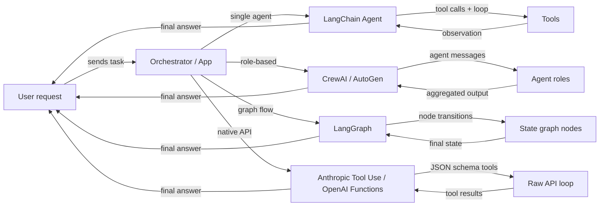

# Resumen de frameworks de agentes

## Definición

Un **framework de agentes** es una biblioteca o SDK que gestiona las preocupaciones de infraestructura de la construcción de agentes de IA: registro de herramientas, paso de mensajes, gestión de estado, orquestación e integración con proveedores de LLM. Sin un framework, escribes esas capas de plomería tú mismo; con un framework, describes *qué* debe hacer tu agente y él se encarga de *cómo* se ejecuta el bucle.

El panorama de frameworks de agentes ha crecido rápidamente y ahora abarca varias categorías distintas. Algunos frameworks se centran en un agente único con herramientas (agentes LangChain), otros priorizan la colaboración basada en roles entre muchos agentes (CrewAI, AutoGen), otros modelan el comportamiento del agente como grafos explícitos con estado (LangGraph), y algunos omiten completamente el framework y se basan en las capacidades nativas del proveedor del modelo (Anthropic Tool Use, OpenAI Function Calling). Cada categoría refleja una filosofía diferente sobre dónde deben residir el control y la complejidad.

Elegir el framework correcto no es solo una decisión técnica — moldea cómo razonas sobre tu sistema, depuras fallos y escala a producción. Un principiante que construye un asistente de investigación simple tiene necesidades muy diferentes a las de un equipo de plataforma que conecta una docena de agentes especializados en una canalización de producción.

## Cómo funciona

### Frameworks de agente único (agentes LangChain)

Los frameworks de agente único dan a un LLM acceso a un conjunto de herramientas y ejecutan un bucle: el modelo decide qué herramienta llamar, el framework la ejecuta, la observación se añade a la conversación y el bucle continúa hasta que el modelo emite una respuesta final. LangChain es el ejemplo canónico, exponiendo `create_react_agent` y `AgentExecutor` para agentes de estilo ReAct simples. El desarrollador registra herramientas (funciones Python con docstrings o esquemas Pydantic) y el framework maneja la construcción del prompt y el análisis del resultado. El agente único es el punto de partida correcto: menor latencia, más fácil de depurar y más simple de probar. La complejidad crece cuando necesitas múltiples roles especializados trabajando en paralelo o cuando el estado se vuelve demasiado grande para una ventana de contexto.

### Frameworks multi-agente (CrewAI, AutoGen)

Los frameworks multi-agente coordinan varios agentes respaldados por LLM, cada uno con su propio rol, instrucciones y herramientas, hacia un objetivo compartido. CrewAI utiliza una metáfora de tripulación con roles, objetivos y trasfondos; AutoGen utiliza una metáfora de conversación donde los agentes intercambian mensajes. Ambos admiten patrones de ejecución secuencial y en paralelo. El framework gestiona el enrutamiento de mensajes, el paso de salidas entre agentes y, opcionalmente, los puntos de control de humano en el bucle. Los enfoques multi-agente brillan cuando el problema se descompone naturalmente en especializaciones distintas (investigador, escritor, crítico) o cuando se necesita redundancia y debate para mejorar la calidad de la salida.

### Frameworks basados en grafos (LangGraph)

Los frameworks basados en grafos representan el comportamiento del agente como un grafo dirigido explícito: los nodos son funciones Python (cada una puede llamar a un LLM o una herramienta), las aristas son transiciones entre nodos y el estado compartido es un diccionario tipado. LangGraph, construido sobre LangChain, popularizó este enfoque. Los ciclos en el grafo permiten al agente hacer bucles hasta que se cumpla una condición de terminación; las aristas condicionales permiten el enrutamiento dinámico basado en resultados intermedios. La explicitud de un grafo hace que los flujos complejos sean más fáciles de razonar, probar de forma aislada y persistir a través de interrupciones. Este es el patrón preferido cuando se necesita control detallado sobre el flujo de ejecución, puntos de control o aprobaciones de humano en el bucle en pasos específicos.

### Uso nativo de herramientas (Anthropic Tool Use, OpenAI Function Calling)

El uso nativo de herramientas omite completamente la capa del framework y utiliza el mecanismo incorporado del proveedor del modelo para la llamada a funciones estructurada. La API de Anthropic acepta un parámetro `tools` con definiciones de esquema JSON; el modelo devuelve bloques `tool_use` que tu código ejecuta, luego alimentas de vuelta los bloques `tool_result`. El equivalente de OpenAI es `functions` / `tools` con respuestas `function_call`. Este enfoque tiene una sobrecarga de abstracción mínima, control total sobre el bucle y la integración más ajustada con características específicas del modelo como streaming y llamadas paralelas a herramientas. El compromiso es que escribes la lógica de orquestación tú mismo, lo que está bien para casos de uso simples pero se vuelve complejo a escala.



## Cuándo usar / Cuándo NO usar

| Usar cuando | Evitar cuando |
|---|---|
| Necesitas comportamiento LLM aumentado con herramientas más allá de un solo prompt | Tu tarea es un prompt único sin necesidad de datos externos |
| Tu problema se descompone en múltiples roles especializados (multi-agente) | Necesitas latencia ultra-baja y no puedes permitirte bucles de múltiples pasos |
| Quieres flujos de agente reproducibles e inspeccionables (basados en grafos) | Tu equipo carece de experiencia para depurar bucles de agentes no deterministas |
| Quieres mantenerte cerca de la API del proveedor con abstracción mínima (nativo) | Necesitas prototipado rápido y no quieres escribir código de orquestación |
| Estás construyendo un sistema de producción que necesita puntos de control y persistencia | La tarea puede resolverse con una canalización RAG simple o una única cadena de prompts |

## Comparaciones

| Criterio | CrewAI | AutoGen | LangGraph | Anthropic Tool Use |
|---|---|---|---|---|
| **Arquitectura** | Tripulación basada en roles con tareas y procesos | Pares de agentes conducidos por conversación y chats grupales | Grafo de estado explícito con nodos y aristas | API sin procesar con definiciones de herramientas de esquema JSON |
| **Soporte multi-agente** | Primera clase: los agentes son miembros de la tripulación con roles y objetivos | Primera clase: los agentes conversan mediante un bus de mensajes | Posible mediante subgrafos, pero principalmente grafos de agente único | Manual: implementas la coordinación multi-agente tú mismo |
| **Gestión de estado** | Implícita: pasada entre tareas mediante contexto de la tripulación | Implícita: historial de mensajes en la conversación | Explícita: estado TypedDict compartido entre todos los nodos | Manual: mantienes tu propio diccionario de estado |
| **Curva de aprendizaje** | Baja: API declarativa estilo YAML | Media: requiere comprender roles de agentes y chat grupal | Media-Alta: requiere intuición de teoría de grafos | Baja: solo Python + esquema JSON, pero más boilerplate |
| **Comunidad y ecosistema** | Creciendo rápidamente, tutoriales sólidos | Grande (respaldado por Microsoft), comunidad de investigación sólida | Creciendo rápidamente, integración estrecha con LangChain | SDK oficial de Anthropic, bien documentado |
| **Mejor para** | Canalizaciones basadas en roles estructurados, flujos de contenido | Investigación, generación de código, experimentación con humano en el bucle | Flujos de ramificación complejos, canalizaciones de producción | Herramientas simples a medias, integración ajustada con el modelo |
| **Soporte de streaming** | Limitado | Limitado | Compatible mediante streaming de LangChain | Streaming completo mediante SDK de Anthropic |

## Ejemplos de código

```python
# --- LangChain agent (single-agent, ReAct) ---
from langchain_anthropic import ChatAnthropic
from langchain.agents import create_react_agent, AgentExecutor
from langchain_core.tools import tool

@tool
def search(query: str) -> str:
    """Search the web for information."""
    return f"Results for: {query}"

llm = ChatAnthropic(model="claude-3-5-sonnet-20241022")
agent = create_react_agent(llm, tools=[search])
executor = AgentExecutor(agent=agent, tools=[search])
result = executor.invoke({"input": "What is LangGraph?"})


# --- CrewAI minimal setup ---
from crewai import Agent, Task, Crew

researcher = Agent(role="Researcher", goal="Find accurate information", backstory="Expert researcher")
task = Task(description="Research LangGraph", agent=researcher)
crew = Crew(agents=[researcher], tasks=[task])
result = crew.kickoff()


# --- AutoGen minimal setup ---
import autogen

assistant = autogen.AssistantAgent(name="assistant", llm_config={"model": "gpt-4o"})
user = autogen.UserProxyAgent(name="user", human_input_mode="NEVER")
user.initiate_chat(assistant, message="Explain LangGraph in one paragraph.")


# --- LangGraph minimal setup ---
from langgraph.graph import StateGraph, END
from typing import TypedDict

class State(TypedDict):
    message: str

def process(state: State) -> State:
    return {"message": f"Processed: {state['message']}"}

graph = StateGraph(State)
graph.add_node("process", process)
graph.set_entry_point("process")
graph.add_edge("process", END)
app = graph.compile()
result = app.invoke({"message": "hello"})


# --- Anthropic Tool Use minimal setup ---
import anthropic

client = anthropic.Anthropic()
tools = [{"name": "search", "description": "Search the web", "input_schema": {"type": "object", "properties": {"query": {"type": "string"}}, "required": ["query"]}}]
response = client.messages.create(
    model="claude-opus-4-5",
    max_tokens=1024,
    tools=tools,
    messages=[{"role": "user", "content": "Search for LangGraph documentation."}]
)
```

## Recursos prácticos

- [Documentación de agentes LangChain](https://python.langchain.com/docs/concepts/agents/) — Guía completa para construir agentes con LangChain, incluyendo ReAct, uso de herramientas y memoria.
- [Documentación oficial de CrewAI](https://docs.crewai.com/) — Referencia completa para roles, tareas, tripulaciones y procesos en CrewAI.
- [Documentación de AutoGen (Microsoft)](https://microsoft.github.io/autogen/) — Cubre ConversableAgent, chats grupales, ejecución de código y patrones de humano en el bucle.
- [Documentación de LangGraph](https://langchain-ai.github.io/langgraph/) — Máquinas de estado de agentes basadas en grafos, persistencia y puntos de control de humano en el bucle.
- [Guía de Anthropic Tool Use](https://docs.anthropic.com/en/docs/build-with-claude/tool-use) — Guía oficial para definir herramientas con esquema JSON y manejar tipos de mensajes tool_use / tool_result.
- [AgentsKit](https://emersonbraun.github.io/agentskit/) — Framework listo para producción para construir agentes de IA con memoria, herramientas y orquestación multi-agente.

## Ver también

- [CrewAI](/docs/agents/crewai)
- [AutoGen](/docs/agents/autogen)
- [LangGraph](/docs/agents/langgraph)
- [Anthropic Tool Use](/docs/agents/anthropic-tool-use)
- [Sistemas multi-agente](/docs/agents/multi-agent-systems)
- [Agentes de IA](/docs/agents)
