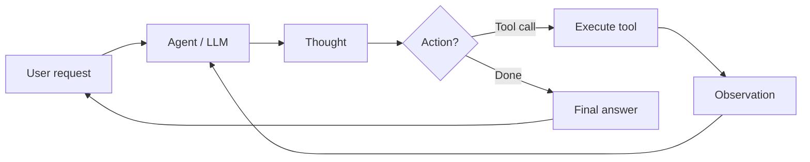

# Agentes de IA

## Definición

An **AI agent** es un sistema que percibe su entorno (por ej. user input, tool outputs), reasons (possibly with an LLM), and takes actions (por ej. calling APIs, writing code) to achieve goals. Agents often use tools and loops of thought–action–observation.

More formally: **an agent es un autonomous program that talks to an AI model to perform goal-based operations using the tools and context it has, and is capable of autonomous decisión-making grounded in truth.** Agents bridge the gap between a one-off prototype (por ej. in AI Studio) and a scalable application: you define tools, give the agent access to them, and it decides when to call which tool and how to combine results to satisfy the user's goal.

## Cómo funciona

Typical loop: receive task → plan or reason → choose action (por ej. tool call) → observe result → repeat until done or limit. The **user** sends a request; the **agent** (backed by an LLM) produce a **thought** (razonamiento) and a **decisión**: either call a **tool** (por ej. search, API, code runner) and get an **observation**, or return a **final answer**. The observation is fed back into the agent for the next step. LLMs provide razonamiento and tool selection; frameworks (LangChain, LlamaIndex, Google ADK) handle orchestration, tool registration, and message passing. [Multi-agent](/docs/agents/multi-agent-systems) and [subagent](/docs/subagents) setups extend this with multiple agents or a parent delegating to children.



```python
# Conceptual agent loop (pseudocode)
def agent_loop(task):
    state = {"messages": [user_message(task)]}
    while not done(state):
        response = llm.invoke(state["messages"])
        if response.tool_calls:
            for call in response.tool_calls:
                result = tools.execute(call)
                state["messages"].append(tool_result(result))
        else:
            return response.content
    return state
```

## Casos de uso

Los agentes son adecuados cuando la tarea requiere múltiples pasos, uso de herramientas o decisiónes que van más allá de una sola llamada al LLM.

- Automatización de tareas (programación, pipelines de datos, llenado de formularios)
- Generación y edición de código con acceso a archivos y APIs
- Asistentes de investigación que buscan, resumen y citan
- Flujos de trabajo multi-paso que combinan herramientas e intervención humana

## Ventajas y desventajas

| Pros | Cons |
|------|------|
| Flexible, can use many tools | Unpredictable, can loop or fail |
| Handles multi-step tasks | Latency and cost from many LLM calls |
| Enables automation | Needs good tool diseño and safety |
| Scale from prototype to production | Requires monitoring and guardrails |

## Documentación externa

- [From Prototypes to Agents with ADK – Google Codelabs](https://codelabs.developers.google.com/your-first-agent-with-adk#0) — Build your first agent with Google's Agent Development Kit (ADK)
- [LangChain – Agents](https://python.langchain.com/docs/concepts/agents/) — Agent concepts and tool use
- [LlamaIndex – Agents](https://docs.llamaindex.ai/en/stable/module_guides/deploying/agents/) — Agent and query engine guides
- [OpenAI Assistants API](https://platform.openai.com/docs/assistants/overview) — Managed agents with tools

## Ver también

- [Multi-agent systems](/docs/agents/multi-agent-systems)
- [Subagents](/docs/subagents)
- [ReAct](/docs/reasoning-patterns/react)
- [RDD](/docs/reasoning-patterns/rdd)
