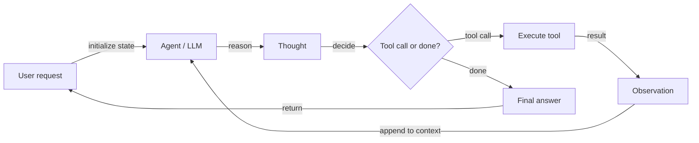
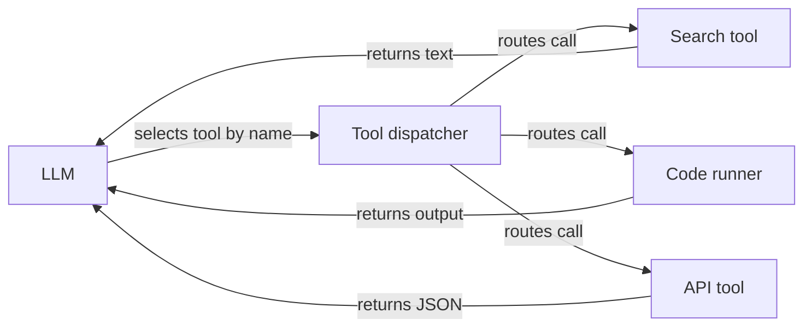

# Agentes de IA

## Definición

Un **agente de IA** es un sistema que percibe su entorno (por ejemplo, entradas del usuario, salidas de herramientas), razona (posiblemente con un LLM) y toma acciones (por ejemplo, llamar APIs, escribir código) para alcanzar objetivos. Los agentes suelen usar herramientas y bucles de pensamiento–acción–observación para resolver tareas que requieren más de una sola llamada a un LLM.

Más formalmente: **un agente es un programa autónomo que habla con un modelo de IA para realizar operaciones basadas en objetivos usando las herramientas y el contexto que tiene, y es capaz de tomar decisiones autónomas fundamentadas en la verdad.** Los agentes salvan la brecha entre un prototipo puntual (por ejemplo, en AI Studio) y una aplicación escalable: se definen herramientas, se da acceso al agente a ellas, y este decide cuándo llamar a qué herramienta y cómo combinar resultados para satisfacer el objetivo del usuario.

La característica definitoria de un agente —en contraposición a una cadena o pipeline simple— es la **autonomía para decidir la siguiente acción**. El agente no sigue un guion fijo; usa el LLM para razonar sobre el estado actual y seleccionar la acción más apropiada. Esto hace que los agentes sean poderosos para tareas abiertas, pero también más difíciles de predecir y depurar que las pipelines deterministas. Los sistemas [multi-agente](/docs/agents/multi-agent-systems) y de [subagentes](/docs/subagents) extienden los agentes individuales con patrones de coordinación y delegación jerárquica.

## Cómo funciona

### Bucle de razonamiento del agente



### Registro y despacho de herramientas



Bucle típico: recibir tarea → planificar o razonar → elegir acción (por ejemplo, llamada a herramienta) → observar resultado → repetir hasta terminar o alcanzar el límite. El **usuario** envía una solicitud; el **agente** (respaldado por un LLM) produce un **pensamiento** (razonamiento) y una **decisión**: llamar a una **herramienta** (por ejemplo, búsqueda, API, ejecutor de código) y obtener una **observación**, o devolver una **respuesta final**. La observación se retroalimenta al agente para el siguiente paso. Los LLMs proporcionan razonamiento y selección de herramientas; los frameworks (LangChain, LlamaIndex, Google ADK) manejan la orquestación, el registro de herramientas y el paso de mensajes.

## Cuándo usar / Cuándo NO usar

| Escenario | Usar agentes | No usar agentes |
|---|---|---|
| Tareas de múltiples pasos que requieren varias herramientas | Sí — los agentes manejan cadenas de herramientas complejas de forma natural | No — una cadena o pipeline simple es más económica y predecible |
| Tareas con número desconocido de pasos de antemano | Sí — los agentes deciden dinámicamente cuántos pasos se necesitan | No — si los pasos son fijos, usa una pipeline codificada |
| Investigación y síntesis a través de muchas fuentes | Sí — los agentes pueden buscar, leer e integrar iterativamente | No — si los datos ya están estructurados, basta una consulta por lotes |
| Tareas críticas para la seguridad sin supervisión humana | No — los agentes pueden tomar decisiones inesperadas | Sí — mantener humanos en el bucle para acciones de alto riesgo |
| Respuestas simples de un solo paso con baja latencia | No — el overhead del agente añade latencia | Sí — una llamada directa al LLM es más rápida |

## Comparaciones

| Enfoque | Autonomía | Uso de herramientas | Pasos | Predecibilidad | Costo |
|---|---|---|---|---|---|
| Llamada directa al LLM | Ninguna | No | 1 | Alta | Bajo |
| Cadena / pipeline | Baja (flujo fijo) | Posible | Fijo | Alta | Bajo–medio |
| Agente (individual) | Alta (dinámica) | Sí | Dinámico | Media | Medio–alto |
| Multi-agente | Muy alta | Sí | Dinámico por agente | Bajo–medio | Alto |

## Ventajas y desventajas

| Ventajas | Desventajas |
|---|---|
| Flexible — puede usar muchas herramientas y manejar tareas abiertas | Impredecible — puede entrar en bucles, quedarse atascado o tomar caminos inesperados |
| Maneja tareas de múltiples pasos con ramificación dinámica | Latencia y costo por múltiples llamadas al LLM |
| Permite la automatización de flujos de trabajo complejos | Requiere herramientas, esquemas y salvaguardas bien diseñados |
| Escala del prototipo a producción con el framework correcto | La depuración requiere inspeccionar trazas largas de pensamiento–acción |

## Ejemplos de código

```python
# Conceptual agent loop (pseudocode)
def agent_loop(task: str, tools: dict, llm) -> str:
    messages = [{"role": "user", "content": task}]
    for _ in range(10):  # max iterations
        response = llm.invoke(messages, tools=list(tools.values()))
        if response.tool_calls:
            for call in response.tool_calls:
                tool_fn = tools[call["name"]]
                result = tool_fn(**call["arguments"])
                messages.append({"role": "tool", "content": str(result)})
        else:
            return response.content  # final answer
    return "Max iterations reached."

# LangChain example with a real tool
from langchain_openai import ChatOpenAI
from langchain.agents import AgentExecutor, create_tool_calling_agent
from langchain_community.tools import DuckDuckGoSearchRun
from langchain import hub

llm = ChatOpenAI(model="gpt-4o-mini")
tools = [DuckDuckGoSearchRun()]
prompt = hub.pull("hwchase17/openai-tools-agent")
agent = create_tool_calling_agent(llm, tools, prompt)
executor = AgentExecutor(agent=agent, tools=tools, verbose=True)
result = executor.invoke({"input": "What are the latest developments in RAG?"})
print(result["output"])
```

## Recursos prácticos

- [From Prototypes to Agents with ADK – Google Codelabs](https://codelabs.developers.google.com/your-first-agent-with-adk#0) — Construye tu primer agente con el Agent Development Kit (ADK) de Google
- [LangChain – Agents](https://python.langchain.com/docs/concepts/agents/) — Conceptos de agentes, uso de herramientas y orquestación estilo ReAct
- [LlamaIndex – Agents](https://docs.llamaindex.ai/en/stable/module_guides/deploying/agents/) — Guías de agentes y motores de consulta
- [OpenAI Assistants API](https://platform.openai.com/docs/assistants/overview) — Agentes gestionados con herramientas integradas (intérprete de código, búsqueda de archivos)
- [Anthropic – Build with Claude: Agents](https://docs.anthropic.com/en/docs/build-with-claude/tool-use) — Uso de herramientas de Claude y patrones agénticos
- [AgentsKit](https://emersonbraun.github.io/agentskit/) — Framework listo para producción para construir agentes de IA con memoria, herramientas y orquestación multi-agente

## Ver también

- [Multi-agent systems](/docs/agents/multi-agent-systems)
- [Subagents](/docs/subagents)
- [Autonomous agents](/docs/autonomous-agents)
- [ReAct](/docs/reasoning-patterns/react)
- [RDD](/docs/reasoning-patterns/rdd)
