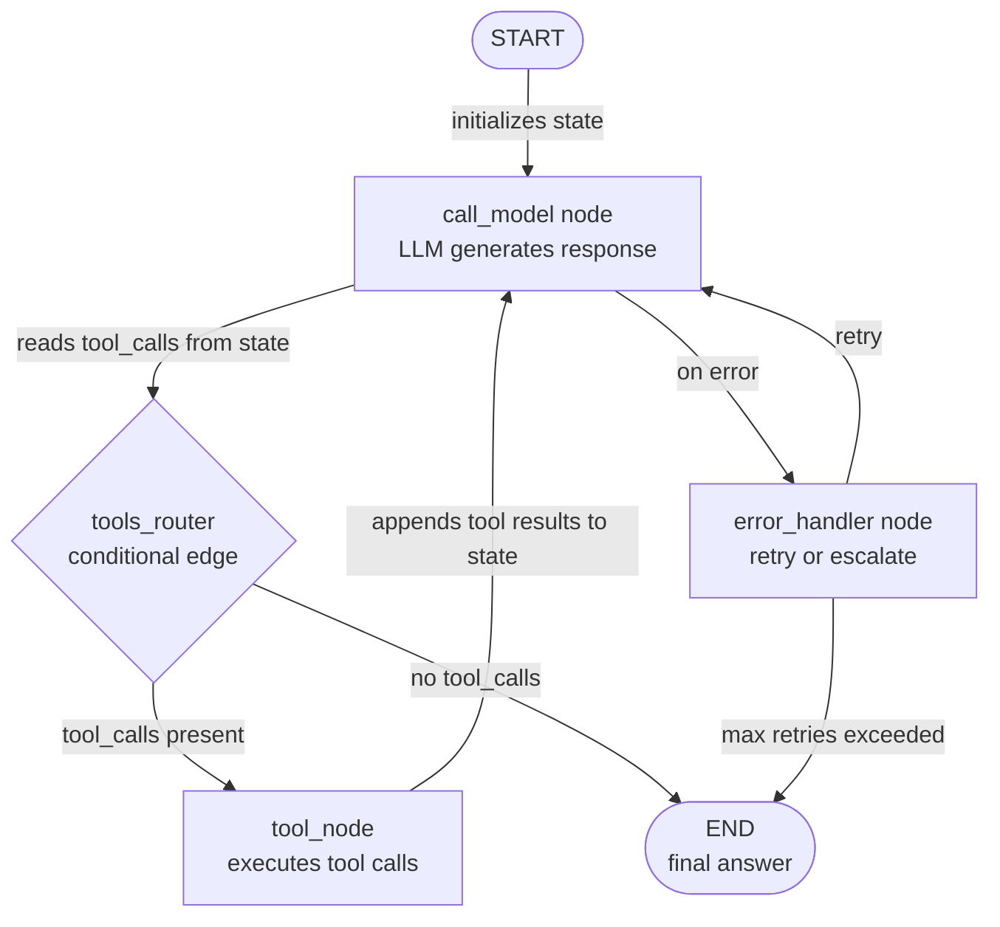

# LangGraph

## Definición

LangGraph es una biblioteca Python de código abierto, construida sobre LangChain, para construir **flujos de trabajo de agentes con estado como grafos dirigidos explícitos**. Donde la mayoría de los frameworks de agentes ocultan el bucle de ejecución detrás de una llamada opaca a `run()`, LangGraph lo expone como un objeto de grafo de primera clase que se puede inspeccionar, probar y modificar. Los nodos son funciones Python ordinarias (cada una puede llamar a un LLM, una herramienta o lógica arbitraria); las aristas son transiciones entre nodos; y todo el flujo de trabajo comparte un único objeto de **estado** — un diccionario tipado que cada nodo puede leer y escribir.

La idea clave en LangGraph es que muchos comportamientos de agentes que parecen complejos — hacer bucles hasta que se cumpla una condición, ramificar según el contenido de una respuesta LLM, pausar para aprobación humana, reanudar desde un punto de control guardado — se mapean limpiamente a primitivos de grafos: ciclos, aristas condicionales, interrupciones y estado persistente. Esta explicitud tiene un costo (más código base que CrewAI o AutoGen) pero se amortiza en producción: puedes probar unitariamente cada nodo de forma aislada, rastrear exactamente qué camino tomó una ejecución y reproducir un flujo de trabajo desde cualquier punto de control.

LangGraph admite tanto patrones de **agente único** (un grafo con unos pocos nodos que llama a herramientas en un bucle) como patrones **multi-agente** (múltiples subgrafos compuestos juntos, con compartición de estado entre grafos). Se integra de forma nativa con el ecosistema de herramientas de LangChain, los modelos de chat y LangSmith para observabilidad. El framework es la base de la arquitectura de agentes de producción recomendada por LangChain a partir de 2024-2025.

## Cómo funciona

### Nodos: funciones Python como unidades de ejecución

Un nodo en LangGraph es cualquier callable Python que acepta el estado actual y devuelve un estado actualizado (parcial). Los nodos se añaden al grafo con `graph.add_node("name", function)`. La firma de la función siempre es `(state: State) -> dict` — lee lo que necesita del estado, hace su trabajo (llamada al LLM, ejecución de herramienta, transformación de datos) y devuelve solo las claves que quiere actualizar. Esto hace que los nodos sean fáciles de probar de forma independiente: pasa un estado simulado y verifica el diccionario devuelto. El `ToolNode` de LangChain es un nodo preconstruido que ejecuta llamadas a herramientas de la respuesta de un LLM, lo que cubre el patrón de agente más común de inmediato.

### Aristas: enrutamiento y ramificación condicional

Las aristas conectan nodos y determinan el orden de ejecución. Una arista simple (`graph.add_edge("a", "b")`) siempre hace la transición del nodo `a` al nodo `b`. Una arista condicional (`graph.add_conditional_edges`) llama a una función de enrutamiento con el estado actual y usa la cadena devuelta para decidir el siguiente nodo. Este es el mecanismo para el flujo de control dinámico: después de que un LLM genera una respuesta, un enrutador comprueba si contiene llamadas a herramientas (ruta a `tools`) o una respuesta final (ruta a `END`). Las aristas condicionales hacen que LangGraph sea significativamente más poderoso que una canalización secuencial — puedes expresar árboles de decisión complejos, lógica de reintentos y rutas de escalada como estructura de grafo legible.

### Estado: TypedDict compartido entre todos los nodos

El estado es la columna vertebral de una aplicación LangGraph. Defines un `TypedDict` (o un modelo Pydantic) con todos los campos que necesita tu flujo de trabajo: mensajes, resultados intermedios, indicadores, contadores. Cada nodo recibe el estado completo y devuelve solo los campos que modifica. LangGraph fusiona las actualizaciones parciales con el estado actual usando **reductores** — por defecto, las asignaciones sobrescriben; con el reductor `add_messages`, la lista de mensajes se añade en lugar de reemplazarse. El tipado explícito del estado significa que los verificadores de tipos pueden detectar errores antes del tiempo de ejecución, y la instantánea del estado en cualquier punto de control es un registro completo e inspeccionable de lo que ocurrió.

### Ciclos, persistencia y humano en el bucle

LangGraph maneja los ciclos de forma nativa: un nodo puede tener una arista de vuelta a un nodo anterior (o a sí mismo) basándose en una condición, permitiendo bucles de reintento del agente, patrones de autocorrección y uso de herramientas en múltiples turnos sin ningún manejo especial. La persistencia es proporcionada por **checkpointers** (SQLite, Postgres, Redis, o en memoria): el grafo guarda el estado completo después de cada ejecución de nodo, para que puedas reanudar desde cualquier punto después de un fallo o interrupción. El humano en el bucle se implementa mediante `interrupt_before` e `interrupt_after` — el grafo se pausa en el nodo especificado, muestra el estado actual al llamador, acepta entrada humana y reanuda. Esto hace que LangGraph sea la elección más sólida cuando necesitas canalizaciones de agentes auditables, interrumpibles y listas para producción.



## Cuándo usar / Cuándo NO usar

| Usar cuando | Evitar cuando |
|---|---|
| Necesitas control detallado sobre cada paso de la ejecución del agente | Quieres una API declarativa de alto nivel y no necesitas control a nivel de paso |
| Requieres persistencia y la capacidad de reanudar flujos de trabajo a mitad de ejecución | Tu flujo de trabajo es simple y lineal — una cadena o un bucle de agente único es suficiente |
| Se requieren aprobaciones de humano en el bucle en pasos específicos | El equipo no está familiarizado con la teoría de grafos y prefiere un modelo mental más simple |
| Estás construyendo sistemas de producción que necesitan observabilidad completa y reproducción | Tus agentes son prototipos de investigación que no necesitan confiabilidad de nivel de producción |
| Tu flujo de trabajo tiene ramificación condicional compleja o ciclos que son difíciles de expresar linealmente | La coordinación de roles multi-agente es tu necesidad principal — CrewAI o AutoGen son más simples |

## Comparaciones

| Criterio | LangGraph | CrewAI | AutoGen |
|---|---|---|---|
| **Nivel de abstracción** | Bajo: grafo explícito, nodos, aristas y estado | Alto: roles, objetivos, tareas declarativos | Medio: agentes conversacionales con historial de mensajes |
| **Flujo de control** | Aristas condicionales explícitas y ciclos | Proceso secuencial o jerárquico (opaco) | Conducido por mensajes, basado en turnos (opaco) |
| **Persistencia** | Primera clase: checkpointers para SQLite, Postgres, Redis | No incorporado | No incorporado |
| **Humano en el bucle** | Primera clase: `interrupt_before` / `interrupt_after` | Solo manual | Primera clase: `human_input_mode` por agente |
| **Testabilidad** | Alta: los nodos son funciones puras, fáciles de probar unitariamente | Media: las tareas pueden probarse pero la ejecución de la tripulación es opaca | Baja: los flujos de conversación son difíciles de probar unitariamente de forma determinista |

## Ejemplos de código

```python
import os
from typing import Annotated, TypedDict, Literal
from langchain_anthropic import ChatAnthropic
from langchain_core.tools import tool
from langchain_core.messages import HumanMessage, AIMessage, BaseMessage
from langgraph.graph import StateGraph, END
from langgraph.graph.message import add_messages
from langgraph.prebuilt import ToolNode

# --- State definition ---
# add_messages is a reducer: it appends to the messages list instead of replacing it.
class AgentState(TypedDict):
    messages: Annotated[list[BaseMessage], add_messages]
    step_count: int  # track how many steps we have taken

# --- Tool definitions ---
# Tools are standard LangChain tools decorated with @tool.
# The docstring becomes the tool description sent to the LLM.

@tool
def search_web(query: str) -> str:
    """Search the web for current information on a topic."""
    # In production, replace with a real search API (Serper, Tavily, etc.)
    return f"Search results for '{query}': LangGraph is a stateful agent framework by LangChain."

@tool
def add_numbers(a: float, b: float) -> str:
    """Add two numbers together and return the result."""
    return f"Result: {a + b}"

tools = [search_web, add_numbers]

# --- LLM setup ---
# Bind tools to the model so it knows what functions are available.
llm = ChatAnthropic(model="claude-opus-4-5")
llm_with_tools = llm.bind_tools(tools)

# --- Node definitions ---
# Each node is a plain Python function: (state) -> partial state update.

def call_model(state: AgentState) -> dict:
    """Primary agent node: calls the LLM and returns its response."""
    response = llm_with_tools.invoke(state["messages"])
    return {
        "messages": [response],  # add_messages reducer will append this
        "step_count": state["step_count"] + 1,
    }

def handle_error(state: AgentState) -> dict:
    """Error handling node: appends a fallback message if something went wrong."""
    fallback = AIMessage(content="I encountered an error. Let me try a different approach.")
    return {"messages": [fallback]}

# --- Routing function (conditional edge) ---
# Returns the name of the next node based on the current state.

def should_continue(state: AgentState) -> Literal["tools", "end"]:
    """Route to tools if the LLM made tool calls, otherwise end."""
    last_message = state["messages"][-1]
    # Safety limit: stop after 10 steps to prevent infinite loops
    if state["step_count"] >= 10:
        return "end"
    if hasattr(last_message, "tool_calls") and last_message.tool_calls:
        return "tools"
    return "end"

# --- Graph construction ---
tool_node = ToolNode(tools)  # prebuilt node that executes tool calls

graph = StateGraph(AgentState)

# Add nodes
graph.add_node("agent", call_model)
graph.add_node("tools", tool_node)
graph.add_node("error_handler", handle_error)

# Set entry point
graph.set_entry_point("agent")

# Add conditional edge from agent: either call tools or end
graph.add_conditional_edges(
    "agent",
    should_continue,
    {
        "tools": "tools",  # route to tool execution
        "end": END,        # route to terminal node
    },
)

# After tool execution, always return to the agent (creates a cycle)
graph.add_edge("tools", "agent")

# Error handler routes back to agent for a retry
graph.add_edge("error_handler", "agent")

# Compile the graph into a runnable application
app = graph.compile()

# --- Optional: add persistence with a checkpointer ---
# from langgraph.checkpoint.sqlite import SqliteSaver
# memory = SqliteSaver.from_conn_string(":memory:")
# app = graph.compile(checkpointer=memory)
# Use config={"configurable": {"thread_id": "session-1"}} to resume sessions.

# --- Run the agent ---
initial_state = {
    "messages": [HumanMessage(content="What is LangGraph and what is 42 plus 17?")],
    "step_count": 0,
}

result = app.invoke(initial_state)
print("Final answer:", result["messages"][-1].content)
print("Total steps:", result["step_count"])

# --- Inspect the graph structure ---
# app.get_graph().print_ascii()  # print ASCII diagram of the graph
```

## Recursos prácticos

- [Documentación oficial de LangGraph](https://langchain-ai.github.io/langgraph/) — Referencia completa para la construcción de grafos, gestión de estado, checkpointers y patrones de humano en el bucle.
- [Repositorio de LangGraph en GitHub](https://github.com/langchain-ai/langgraph) — Código fuente, rastreador de problemas y notebooks de ejemplo que cubren patrones comunes.
- [Guías prácticas de LangGraph](https://langchain-ai.github.io/langgraph/how-tos/) — Recetas prácticas para persistencia, streaming, subgrafos, coordinación multi-agente y más.
- [Rastreo de LangSmith para LangGraph](https://docs.smith.langchain.com/) — Plataforma de observabilidad para rastrear ejecuciones de LangGraph, inspeccionar el estado en cada nodo y depurar fallos.

## Ver también

- [Resumen de frameworks de agentes](/docs/agents/frameworks-overview)
- [CrewAI](/docs/agents/crewai)
- [AutoGen](/docs/agents/autogen)
- [LangChain](/docs/tools/langchain)
- [Sistemas multi-agente](/docs/agents/multi-agent-systems)
- [ReAct](/docs/reasoning-patterns/react)
