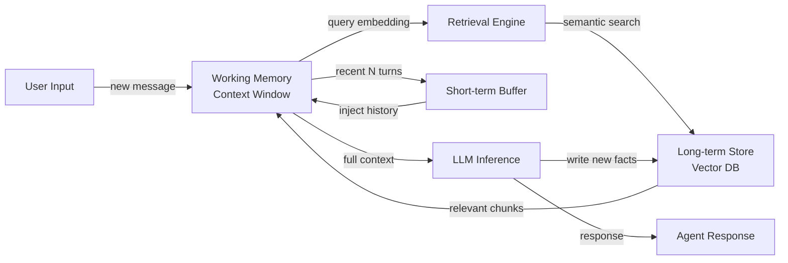

# Memoria de agentes

## Definición

La memoria de agentes se refiere a los mecanismos mediante los cuales un agente de IA almacena, indexa y recupera información durante su operación. Sin memoria, cada interacción comienza desde cero — el agente no puede aprender de conversaciones pasadas, acumular hechos ni rastrear el estado de una tarea de larga duración. La memoria transforma una llamada LLM sin estado en un sistema persistente y orientado a objetivos.

En las ciencias cognitivas, la memoria se divide en varios tipos: memoria de trabajo (información activa que se mantiene en mente en ese momento), memoria a corto plazo (eventos recientes que se retienen durante un período limitado) y memoria a largo plazo (conocimiento duradero que persiste indefinidamente). Los agentes de IA reflejan de cerca esta taxonomía. La ventana de contexto del LLM actúa como memoria de trabajo; un buffer deslizante de mensajes recientes sirve como memoria a corto plazo; y un almacén externo — a menudo una base de datos vectorial — sirve como memoria a largo plazo.

La memoria habilita el razonamiento de múltiples pasos. Cuando un agente necesita responder una pregunta de seguimiento, ejecutar un plan a través de varios pasos o recordar las preferencias de un usuario de una sesión anterior, recurre a una o más de estas capas de memoria. El diseño correcto de la memoria determina si un agente se siente como un asistente con conocimiento o un chatbot amnésico.

## Cómo funciona

### Memoria de trabajo y la ventana de contexto

La ventana de contexto es la forma más inmediata de memoria disponible para cualquier agente impulsado por LLM. Todos los mensajes, resultados de herramientas y pensamientos intermedios dentro de una única llamada de inferencia residen en la memoria de trabajo. Las ventanas de contexto típicas van de 8K a 200K tokens y establecen un límite estricto de sobre qué puede razonar activamente el agente. Cuando se alcanza este límite, la información más antigua debe resumirse, comprimirse o eliminarse para hacer espacio. La memoria de trabajo es rápida y de latencia cero, pero completamente volátil — desaparece cuando termina la llamada.

### Buffer de memoria a corto plazo

La memoria a corto plazo se implementa como un buffer rotativo que mantiene las últimas N rondas de conversación. Cuando llega una nueva ronda, la más antigua se descarta cuando el buffer está lleno. Este enfoque es simple, económico y suficiente para la continuidad conversacional dentro de una sola sesión. El buffer normalmente se serializa y se pasa de vuelta a la ventana de contexto al comienzo de cada nueva llamada de inferencia. Su principal limitación es que no escala para sesiones largas ni para recuperación entre sesiones.

### Almacén semántico a largo plazo

La memoria a largo plazo utiliza un almacén persistente externo — típicamente una base de datos vectorial — para mantener incrustaciones de eventos pasados, hechos y resúmenes. Cuando el agente necesita recordar algo, incrusta la consulta actual y realiza una búsqueda de vecinos aproximados para recuperar los recuerdos semánticamente más relevantes. Los fragmentos recuperados se inyectan en la ventana de contexto antes de la inferencia. Este patrón escala a millones de hechos almacenados y admite recuperación entre sesiones, pero añade latencia de recuperación y requiere un modelo de incrustación.

### Memoria episódica vs. semántica

La memoria episódica almacena eventos pasados específicos con su contexto: "En la sesión 23, el usuario preguntó sobre la política de devoluciones y estaba frustrado." La memoria semántica almacena conocimiento general del mundo o hechos acumulados: "La ventana de devoluciones es de 30 días." Ambos tipos pueden coexistir en el mismo almacén vectorial, distinguidos por metadatos. La memoria episódica es valiosa para la personalización; la semántica es valiosa para anclar al agente en el conocimiento del dominio.

### Bucle de recuperación

El bucle de recuperación conecta todas las capas. En cada ronda, el agente consulta la memoria a largo plazo para obtener contexto relevante, lo fusiona con el buffer a corto plazo y alimenta el contexto combinado en la memoria de trabajo del LLM. Después de la generación, los hechos importantes de la nueva ronda pueden escribirse de vuelta en el almacén a largo plazo, cerrando el bucle.



## Cuándo usar / Cuándo NO usar

| Usar cuando | Evitar cuando |
|---|---|
| El agente necesita recuperar información de sesiones o rondas anteriores | La tarea es completamente autocontenida en un único prompt y no tiene preguntas de seguimiento |
| Los usuarios esperan personalización basada en interacciones pasadas | Los costos de almacenamiento o la latencia son inaceptables para el caso de uso |
| El agente rastrea tareas de larga duración con muchos resultados intermedios | La ventana de contexto es lo suficientemente grande como para contener toda la información relevante |
| El conocimiento del dominio supera lo que cabe en una sola ventana de contexto | Los requisitos de privacidad prohíben almacenar conversaciones de usuarios |
| Se necesita comportamiento consistente a través de múltiples invocaciones del agente | La complejidad añadida supera el beneficio marginal de la persistencia |

## Ventajas y desventajas

| Ventajas | Desventajas |
|---|---|
| Permite continuidad de múltiples pasos y entre sesiones | Los almacenes a largo plazo añaden latencia de recuperación |
| Admite personalización y contexto específico del usuario | Las bases de datos vectoriales introducen complejidad de infraestructura |
| Escala más allá de los límites de la ventana de contexto | La calidad de recuperación depende de la precisión del modelo de incrustación |
| La memoria episódica mejora significativamente la experiencia del usuario | El envejecimiento de la memoria requiere estrategias de desalojo o actualización |
| La memoria semántica ancla al agente en el conocimiento del dominio | Las políticas de privacidad y retención de datos deben gestionarse explícitamente |

## Ejemplos de código

```python
"""
Simple agent memory implementation combining a list-based short-term buffer
with a vector-based long-term store using sentence-transformers and numpy.
"""
from __future__ import annotations

import json
import numpy as np
from dataclasses import dataclass, field
from typing import Optional
from sentence_transformers import SentenceTransformer  # pip install sentence-transformers


# ---------------------------------------------------------------------------
# Short-term buffer memory (last N turns)
# ---------------------------------------------------------------------------

@dataclass
class ShortTermMemory:
    """Keeps the most recent `max_turns` conversation turns in a list."""
    max_turns: int = 10
    turns: list[dict] = field(default_factory=list)

    def add(self, role: str, content: str) -> None:
        self.turns.append({"role": role, "content": content})
        # Evict oldest turn when capacity is exceeded
        if len(self.turns) > self.max_turns:
            self.turns.pop(0)

    def get_history(self) -> list[dict]:
        """Return all buffered turns for injection into the context window."""
        return list(self.turns)


# ---------------------------------------------------------------------------
# Long-term vector memory (semantic retrieval)
# ---------------------------------------------------------------------------

@dataclass
class LongTermMemory:
    """
    Simple in-memory vector store backed by numpy.
    In production, replace with Chroma, Pinecone, or pgvector.
    """
    model_name: str = "all-MiniLM-L6-v2"
    _model: Optional[SentenceTransformer] = field(default=None, init=False, repr=False)
    _texts: list[str] = field(default_factory=list, init=False)
    _embeddings: Optional[np.ndarray] = field(default=None, init=False)

    @property
    def model(self) -> SentenceTransformer:
        if self._model is None:
            self._model = SentenceTransformer(self.model_name)
        return self._model

    def store(self, text: str) -> None:
        """Embed and store a piece of text in long-term memory."""
        embedding = self.model.encode([text])  # shape: (1, dim)
        self._texts.append(text)
        if self._embeddings is None:
            self._embeddings = embedding
        else:
            self._embeddings = np.vstack([self._embeddings, embedding])

    def retrieve(self, query: str, top_k: int = 3) -> list[str]:
        """Return the top_k most semantically similar stored memories."""
        if not self._texts:
            return []
        query_emb = self.model.encode([query])  # shape: (1, dim)
        # Cosine similarity
        norms = np.linalg.norm(self._embeddings, axis=1, keepdims=True)
        normed = self._embeddings / (norms + 1e-9)
        query_norm = query_emb / (np.linalg.norm(query_emb) + 1e-9)
        scores = (normed @ query_norm.T).flatten()
        top_indices = np.argsort(scores)[::-1][:top_k]
        return [self._texts[i] for i in top_indices]


# ---------------------------------------------------------------------------
# Agent with combined memory
# ---------------------------------------------------------------------------

class MemoryAgent:
    """
    A simple agent that combines short-term buffer and long-term vector memory.
    Uses a mock LLM call for illustration; replace with openai.chat.completions.create.
    """

    def __init__(self, max_short_term_turns: int = 6):
        self.short_term = ShortTermMemory(max_turns=max_short_term_turns)
        self.long_term = LongTermMemory()
        self.system_prompt = "You are a helpful assistant with access to past context."

    def _build_context(self, user_message: str) -> list[dict]:
        """Combine long-term retrieval + short-term buffer into a message list."""
        # Retrieve relevant memories from long-term store
        memories = self.long_term.retrieve(user_message, top_k=3)
        memory_block = "\n".join(f"- {m}" for m in memories) if memories else "None"

        messages = [
            {"role": "system", "content": self.system_prompt},
            {"role": "system", "content": f"Relevant past context:\n{memory_block}"},
        ]
        # Append recent conversation history
        messages.extend(self.short_term.get_history())
        # Append the current user message
        messages.append({"role": "user", "content": user_message})
        return messages

    def chat(self, user_message: str) -> str:
        """Process a user message and return the agent's response."""
        messages = self._build_context(user_message)

        # --- Replace this mock with a real LLM call ---
        # import openai
        # response = openai.chat.completions.create(model="gpt-4o", messages=messages)
        # reply = response.choices[0].message.content
        reply = f"[Mock LLM reply to: {user_message!r} with {len(messages)} context messages]"
        # ----------------------------------------------

        # Update short-term buffer
        self.short_term.add("user", user_message)
        self.short_term.add("assistant", reply)

        # Write important facts to long-term memory (in production, use LLM to decide)
        self.long_term.store(f"User said: {user_message}")
        self.long_term.store(f"Assistant replied: {reply}")

        return reply


# ---------------------------------------------------------------------------
# Example usage
# ---------------------------------------------------------------------------
if __name__ == "__main__":
    agent = MemoryAgent(max_short_term_turns=4)

    turns = [
        "My name is Alice and I prefer concise answers.",
        "What is the capital of France?",
        "What did I say my name was?",
    ]
    for turn in turns:
        print(f"User: {turn}")
        print(f"Agent: {agent.chat(turn)}\n")
```

## Recursos prácticos

- [LangChain Memory Concepts](https://python.langchain.com/docs/concepts/memory/) — Documentación oficial de LangChain sobre todos los tipos de memoria integrados y cuándo aplicar cada uno.
- [MemGPT: Towards LLMs as Operating Systems](https://arxiv.org/abs/2310.08560) — Artículo de investigación que introduce la gestión de contexto virtual para capacidad de memoria de agentes ilimitada, análogo a la memoria virtual del SO.
- [Chroma – Open-source embedding database](https://docs.trychroma.com/) — Almacén vectorial ligero y popular utilizado en muchas implementaciones de memoria de agentes.
- [OpenAI Assistants Threads](https://platform.openai.com/docs/assistants/how-it-works/managing-threads) — Cómo la API de agentes gestionada de OpenAI maneja los hilos de conversación y el almacenamiento persistente.

## Ver también

- [AI agents](/docs/agents)
- [Conversational memory](/docs/agents/conversational-memory)
- [RAG](/docs/rag)
