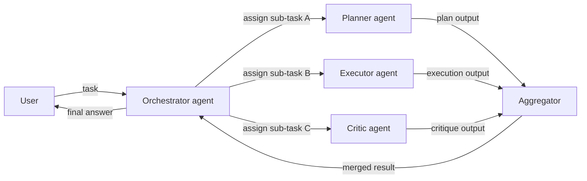
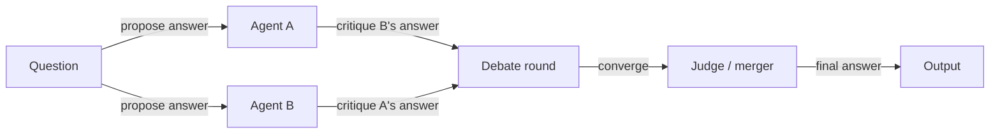

# Sistemas multi-agente

## Definición

Los sistemas multi-agente (MAS) involucran múltiples agentes de IA que interactúan para resolver tareas: colaboración (dividir el trabajo, compartir estado), debate (argumentar y refinar respuestas) o roles especializados (planificador, ejecutor, crítico). En lugar de un único agente monolítico que intenta hacer todo, los MAS asignan responsabilidades distintas a diferentes agentes y componen sus salidas.

Extienden los [agentes](/docs/agents) individuales cuando un modelo o un bucle no es suficiente: por ejemplo, un agente para recuperación [RAG](/docs/rag), otro para generación y otro para crítica y verificación de hechos. Cada agente puede usar un modelo diferente, un conjunto diferente de herramientas y un system prompt diferente ajustado para su rol. Esta modularidad hace que los agentes individuales sean más simples, más confiables y más fáciles de intercambiar o actualizar.

Los [subagentes](/docs/subagents) son una forma jerárquica donde un agente raíz delega en hijos; los sistemas multi-agente también pueden ser planos (peer-to-peer) o con estructura de malla, donde los agentes se comunican entre sí sin un orquestador central. La topología correcta —jerárquica, plana o híbrida— depende de si el flujo de trabajo tiene una descomposición natural en subtareas independientes o secuencialmente dependientes.

## Cómo funciona

### Topología orquestada (jerárquica)



### Topología de debate / revisión



El **usuario** envía una tarea a un **orquestador** (que puede ser un LLM o un flujo de trabajo fijo). El orquestador asigna trabajo al **Agente 1**, **Agente 2**, etc., cada uno con su propio rol, herramientas y opcionalmente modelo. Los agentes pueden compartir un estado común, pasar mensajes o invocarse secuencial o paralelamente. Sus salidas se **agregan** (combinan, votan o resumen) y se devuelven. Los MAS son útiles cuando se quiere **modularidad**, **especialización**, **reutilización** y **flujo de control estructurado** en tareas complejas de múltiples pasos.

## Cuándo usar / Cuándo NO usar

| Escenario | Usar MAS | No usar MAS |
|---|---|---|
| La tarea se descompone claramente en roles distintos | Sí — planificador + ejecutor + crítico es una división natural | No — si la tarea es de un solo rol, un agente es suficiente |
| Se necesita alta confianza mediante debate/revisión | Sí — el patrón de debate filtra errores a través del desacuerdo | No — un agente individual es suficiente para dominios bien comprendidos |
| Diferentes subtareas necesitan diferentes herramientas/modelos | Sí — cada agente usa solo lo que necesita | No — un agente con todas las herramientas es más simple si los roles se superponen mucho |
| Prototipado rápido o pipelines simples | No — el overhead de MAS añade complejidad | Sí — comenzar con un agente individual y añadir complejidad según sea necesario |
| Requisitos fuertes de latencia en tiempo real | No — los agentes paralelos añaden overhead de coordinación | Sí — el agente individual es más rápido para presupuestos de latencia ajustados |

## Comparaciones

| Patrón | Estructura | Comunicación | Autonomía | Mejor para |
|---|---|---|---|---|
| Agente individual | Monolítico | Ninguna | Alta por agente | Tareas simples o moderadas |
| MAS jerárquico | Árbol (raíz → hijos) | La raíz delega | Media por agente | Flujos de trabajo estructurados |
| MAS plano / peer-to-peer | Malla o anillo | Mensajería directa | Alta | Razonamiento colaborativo |
| Debate / revisión | Paralelo + fusión | Basado en crítica | Media | Generación de alta confianza |
| Subagente (jerarquía estricta) | Árbol (raíz posee el objetivo) | Delegación controlada | Baja por subagente | Tareas complejas de largo horizonte |

## Ventajas y desventajas

| Ventajas | Desventajas |
|---|---|
| Modular — cada agente tiene una responsabilidad clara y testeable | Overhead de coordinación (latencia, tokens, sincronización de estado) |
| Los agentes especializados superan a los generalistas en su rol | Más difícil de depurar que una traza de agente individual |
| Reutilizable — el mismo agente en diferentes flujos de trabajo | El diseño del protocolo de comunicación no es trivial |
| Los patrones de debate pueden mejorar significativamente la precisión | Riesgo de errores en cascada entre agentes |

## Ejemplos de código

```python
from langchain_openai import ChatOpenAI
from langchain_core.messages import HumanMessage, SystemMessage

llm = ChatOpenAI(model="gpt-4o-mini")

def planner_agent(task: str) -> str:
    """Break a task into a numbered plan."""
    response = llm.invoke([
        SystemMessage(content="You are a planning agent. Break the task into 3–5 clear steps."),
        HumanMessage(content=task),
    ])
    return response.content

def executor_agent(plan: str) -> str:
    """Execute the plan and produce a draft output."""
    response = llm.invoke([
        SystemMessage(content="You are an execution agent. Follow the plan and produce a detailed output."),
        HumanMessage(content=f"Plan:\n{plan}"),
    ])
    return response.content

def critic_agent(draft: str) -> str:
    """Review the draft and suggest improvements."""
    response = llm.invoke([
        SystemMessage(content="You are a critic agent. Identify flaws and suggest concrete improvements."),
        HumanMessage(content=f"Draft:\n{draft}"),
    ])
    return response.content

# Orchestrate
task = "Write a short guide on how to get started with RAG."
plan = planner_agent(task)
print("Plan:\n", plan)

draft = executor_agent(plan)
print("\nDraft:\n", draft)

critique = critic_agent(draft)
print("\nCritique:\n", critique)
```

## Recursos prácticos

- [From Prototypes to Agents with ADK – Google Codelabs](https://codelabs.developers.google.com/your-first-agent-with-adk#0) — ADK admite la composición de múltiples agentes en un sistema multi-agente
- [LangChain – Multi-agent orchestration](https://python.langchain.com/docs/concepts/multi_agent/) — Patrones multi-agente incluyendo topologías de supervisor y enjambre
- [Microsoft AutoGen](https://microsoft.github.io/autogen/) — Framework para construir sistemas conversacionales multi-agente
- [AgentsKit](https://emersonbraun.github.io/agentskit/) — Framework listo para producción para construir agentes de IA con memoria, herramientas y orquestación multi-agente

## Ver también

- [Agents](/docs/agents)
- [Subagents](/docs/subagents)
- [Autonomous agents](/docs/autonomous-agents)
- [ReAct](/docs/reasoning-patterns/react)
