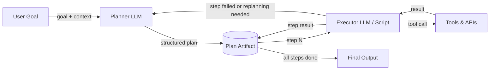

# Arquitectura Planificador-Ejecutor

## Definición

La arquitectura Planificador-Ejecutor separa la preocupación de *decidir qué hacer* de la preocupación de *hacerlo*. Un LLM **Planificador** recibe un objetivo de alto nivel y produce un plan estructurado, paso a paso — una secuencia de subtareas que juntas logran el objetivo. Un LLM **Ejecutor** (o un programa determinista) luego trabaja a través del plan un paso a la vez, invocando herramientas y produciendo resultados. Los dos componentes se comunican a través de un artefacto de plan compartido en lugar de a través de un único prompt monolítico.

Esta separación de responsabilidades aborda una limitación fundamental de los bucles ReAct de agente único: cuando una tarea es compleja, pedirle a un LLM que simultáneamente razone sobre la estrategia, elija la siguiente acción y maneje los detalles de herramientas de bajo nivel conduce a errores y alucinaciones. Al delegar la descomposición de alto nivel al Planificador y la ejecución de bajo nivel al Ejecutor, cada componente puede optimizarse, diseñarse con prompts y monitorearse de forma independiente. El Planificador puede usar un modelo más capaz; el Ejecutor puede ser un modelo más rápido y económico o incluso un programa no LLM.

El refinamiento del plan y la replanificación son extensiones críticas de la arquitectura básica. Las tareas del mundo real rara vez se desarrollan como se espera: una llamada a herramienta podría fallar, una página web podría devolver datos inesperados, o un resultado intermedio podría revelar que el plan original era incorrecto. Un sistema Planificador-Ejecutor robusto monitorea los resultados de ejecución y vuelve a invocar al Planificador cuando se necesita replanificar. Este bucle de retroalimentación convierte una canalización frágil en un agente adaptativo.

## Cómo funciona

### Planificador

El Planificador recibe el objetivo del usuario junto con las herramientas disponibles y cualquier contexto relevante. Produce un plan estructurado — típicamente una lista JSON de objetos de pasos, cada uno describiendo una subtarea, la entrada/salida esperada y, opcionalmente, qué herramienta usar. Un buen prompt de planificación incluye los esquemas de herramientas para que el Planificador pueda referenciarlos con precisión. El Planificador no invoca ninguna herramienta por sí mismo; solo razona sobre la secuencia de operaciones necesarias. La temperatura generalmente debe ser baja para producir planes deterministas y bien estructurados.

### Artefacto del plan

El plan es el contrato entre el Planificador y el Ejecutor. Es un documento legible por máquina (JSON o texto estructurado) que codifica la secuencia de pasos, sus dependencias y sus resultados esperados. Almacenar el plan como un artefacto explícito — en lugar de mantenerlo implícito en la cadena de pensamiento del modelo — hace que el sistema sea auditable, pausable y reanudable. Aquí se puede insertar un paso de aprobación de humano en el bucle, permitiendo a los usuarios revisar y editar el plan antes de que comience la ejecución.

### Ejecutor

El Ejecutor lee el plan un paso a la vez, resuelve cualquier referencia de entrada a salidas de pasos anteriores, llama a las herramientas apropiadas y registra el resultado. El Ejecutor puede ser un segundo LLM (útil cuando los pasos requieren razonamiento en lenguaje natural), un script determinista (útil para pasos estructurados como llamadas a API) o un híbrido. Después de cada paso, el resultado se escribe de vuelta al artefacto del plan para que los pasos subsiguientes puedan referenciarlo. Si un paso falla, el Ejecutor lo marca y, opcionalmente, activa la replanificación.

### Bucle de replanificación

Cuando la ejecución diverge del plan — debido a fallos de herramientas, salidas inesperadas o condiciones cambiadas — el control regresa al Planificador con el registro de ejecución parcial. El Planificador revisa los pasos restantes dada la nueva información. La replanificación puede activarse automáticamente (por ejemplo, en cualquier fallo de paso) o después de cada paso para máxima adaptabilidad. Limitar las iteraciones de replanificación evita los bucles infinitos.



## Cuándo usar / Cuándo NO usar

| Usar cuando | Evitar cuando |
|---|---|
| La tarea requiere múltiples pasos secuenciales que son difíciles de enumerar de antemano | La tarea es lo suficientemente simple para una sola llamada al LLM o un bucle ReAct |
| Quieres revisión o aprobación humana antes de que comience la ejecución | La latencia es crítica y la llamada adicional al planificador es inaceptable |
| Los pasos de ejecución tienen dependencias claras y pueden validarse individualmente | La estructura del plan sería trivial y añade complejidad innecesaria |
| Necesitas auditar qué hizo el agente y por qué se tomó cada paso | La tarea es exploratoria y no puede planificarse de antemano en absoluto |
| La replanificación en caso de fallo es importante para la confiabilidad | Las APIs de herramientas son tan poco confiables que ningún plan sobrevive al primer contacto |

## Comparaciones

| Criterio | Planificador-Ejecutor | Agente ReAct único | Agentes basados en DAG |
|---|---|---|---|
| Separación de responsabilidades | Alta — planificación y ejecución son distintas | Ninguna — un agente hace ambas | Alta — cada nodo es una unidad separada |
| Adaptabilidad / replanificación | Moderada — la replanificación añade un viaje de ida y vuelta | Alta — el agente se ajusta en cada paso | Baja — la estructura del DAG es típicamente fija |
| Auditabilidad | Alta — el artefacto del plan es explícito | Baja — el razonamiento está solo en contexto | Alta — la estructura del grafo es explícita |
| Paralelismo | Ninguno por defecto | Ninguno | Nativo — las ramas independientes se ejecutan en paralelo |
| Complejidad de implementación | Media | Baja | Alta |
| Mejor para | Tareas de múltiples pasos con dependencias secuenciales | Tareas exploratorias y dinámicas | Tareas con subtareas paralelizables conocidas |

## Ejemplos de código

```python
"""
Planner-Executor implementation using the OpenAI API.

The Planner produces a JSON plan; the Executor steps through it,
calling mock tools and writing results back. Replanning is triggered
on step failure.
"""
from __future__ import annotations

import json
import os
from typing import Any

from openai import OpenAI  # pip install openai

client = OpenAI(api_key=os.environ.get("OPENAI_API_KEY", "sk-placeholder"))

# ---------------------------------------------------------------------------
# Mock tools
# ---------------------------------------------------------------------------

def web_search(query: str) -> str:
    """Mock web search tool."""
    return f"[Search result for '{query}': Found 5 relevant pages about {query}.]"

def summarize_text(text: str) -> str:
    """Mock summarizer tool."""
    return f"[Summary of: {text[:40]}...]"

def write_report(sections: list[str]) -> str:
    """Mock report writer tool."""
    return f"[Report written with {len(sections)} sections.]"

TOOLS: dict[str, Any] = {
    "web_search": web_search,
    "summarize_text": summarize_text,
    "write_report": write_report,
}

# ---------------------------------------------------------------------------
# Planner
# ---------------------------------------------------------------------------

PLANNER_SYSTEM = """
You are a planning assistant. Given a goal and available tools, produce a JSON plan.
The plan is a list of steps. Each step has:
  - "id": int (1-indexed)
  - "description": str (what this step does)
  - "tool": str (tool name from the available list, or "none")
  - "input": str (what to pass to the tool, may reference prior steps as {step_N_result})
  - "depends_on": list[int] (ids of steps that must complete first)

Return ONLY valid JSON — no markdown, no prose.
Available tools: web_search, summarize_text, write_report
"""

def create_plan(goal: str, context: str = "") -> list[dict]:
    """Call the Planner LLM to create a structured plan for the given goal."""
    user_msg = f"Goal: {goal}\n\nAdditional context: {context}" if context else f"Goal: {goal}"
    response = client.chat.completions.create(
        model="gpt-4o-mini",
        temperature=0,
        response_format={"type": "json_object"},
        messages=[
            {"role": "system", "content": PLANNER_SYSTEM},
            {"role": "user", "content": user_msg},
        ],
    )
    raw = response.choices[0].message.content
    parsed = json.loads(raw)
    # Handle both {"steps": [...]} and bare [...]
    return parsed.get("steps", parsed) if isinstance(parsed, dict) else parsed


# ---------------------------------------------------------------------------
# Executor
# ---------------------------------------------------------------------------

def resolve_input(template: str, results: dict[int, str]) -> str:
    """Replace {step_N_result} placeholders with actual results."""
    for step_id, result in results.items():
        template = template.replace(f"{{step_{step_id}_result}}", result)
    return template

def execute_plan(plan: list[dict]) -> dict[int, str]:
    """
    Execute each step sequentially, respecting dependencies.
    Returns a mapping of step_id -> result string.
    """
    results: dict[int, str] = {}

    for step in plan:
        step_id = step["id"]
        tool_name = step.get("tool", "none")
        raw_input = step.get("input", "")
        resolved_input = resolve_input(raw_input, results)

        print(f"  Step {step_id}: {step['description']}")

        if tool_name != "none" and tool_name in TOOLS:
            try:
                result = TOOLS[tool_name](resolved_input)
            except Exception as exc:
                # Signal failure for potential replanning
                result = f"ERROR: {exc}"
                print(f"    [FAILED] {result}")
        else:
            result = f"[No tool — step noted: {resolved_input}]"

        results[step_id] = result
        print(f"    Result: {result}\n")

    return results


# ---------------------------------------------------------------------------
# Planner-Executor orchestration with simple replanning
# ---------------------------------------------------------------------------

def run_planner_executor(goal: str, max_replan_attempts: int = 2) -> str:
    """
    Full Planner-Executor loop with replanning on failure.
    Returns the result of the last step as the final output.
    """
    attempt = 0
    context = ""

    while attempt <= max_replan_attempts:
        print(f"\n--- Planning (attempt {attempt + 1}) ---")
        plan = create_plan(goal, context=context)
        print(f"Plan has {len(plan)} steps.")

        print("\n--- Executing ---")
        results = execute_plan(plan)

        # Check for failures
        failures = {sid: r for sid, r in results.items() if r.startswith("ERROR")}
        if not failures:
            # Return the result of the last step
            last_id = max(results.keys())
            return results[last_id]

        # Build replanning context
        context = (
            f"Previous plan failed at steps: {list(failures.keys())}. "
            f"Errors: {failures}. Please revise the plan to avoid these failures."
        )
        attempt += 1

    return "Max replanning attempts reached. Could not complete goal."


if __name__ == "__main__":
    goal = "Research the latest trends in renewable energy and write a brief report."
    final = run_planner_executor(goal)
    print(f"\nFinal output:\n{final}")
```

## Recursos prácticos

- [Plan-and-Solve Prompting (Wang et al., 2023)](https://arxiv.org/abs/2305.04091) — Artículo que muestra que separar la planificación de la resolución mejora la precisión del razonamiento sobre el chain-of-thought estándar.
- [LangGraph — Plan-and-Execute Agent](https://langchain-ai.github.io/langgraph/tutorials/plan-and-execute/plan-and-execute/) — Tutorial oficial de LangGraph que implementa un bucle Planificador-Ejecutor con replanificación.
- [LLM Compiler (Kim et al., 2023)](https://arxiv.org/abs/2312.04511) — Extiende el Planificador-Ejecutor con ejecución en paralelo de pasos de plan independientes.
- [Anthropic — Building Effective Agents](https://www.anthropic.com/research/building-effective-agents) — Orientación práctica sobre arquitecturas de agentes incluyendo patrones orquestador-subagente.

## Ver también

- [Agentes de IA](/docs/agents)
- [Agentes basados en DAG](/docs/agents/dag-agents)
- [Razonamiento chain-of-thought](/docs/reasoning-patterns/cot)
