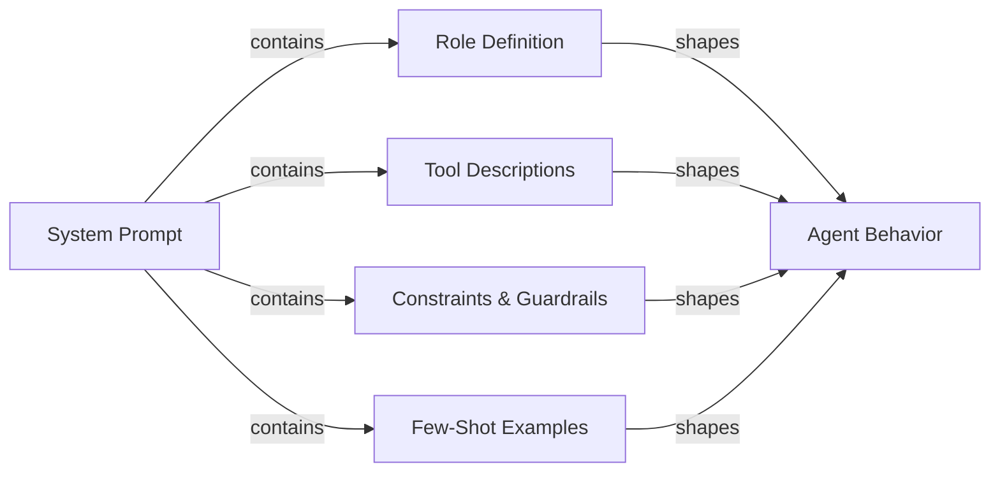

# Ingeniería de prompts para agentes

## Definición

La ingeniería de prompts para agentes es el arte de escribir system prompts y definiciones de herramientas que produzcan de manera confiable el comportamiento deseado de un agente de IA. A diferencia de la ingeniería de prompts para un chatbot de un solo turno — donde se trata principalmente de formato y tono —, los prompts de agentes deben gobernar el razonamiento de múltiples pasos, la disciplina de selección de herramientas, el cumplimiento de restricciones, la recuperación de errores y las condiciones de detención a través de una secuencia ilimitada de pasos. Un prompt de agente mal escrito produce agentes que se repiten indefinidamente, llaman herramientas con argumentos incorrectos, ignoran las restricciones del usuario o confabulan resultados cuando las herramientas fallan.

El system prompt es la constitución del agente. Define quién es el agente, qué puede hacer, qué nunca debe hacer, cómo debe pensar y cómo debe verse su salida. Dado que los LLMs son muy sensibles a la formulación, estructura y orden, pequeños cambios en el system prompt pueden tener grandes efectos en el comportamiento. La ingeniería de prompts para agentes es por tanto una disciplina iterativa y empírica: se escribe un prompt, se evalúa contra un conjunto de datos de tareas, se identifican los modos de fallo y se refina. Herramientas como LangSmith y DeepEval (ver [Evaluación](/docs/agents/evaluation)) aceleran este bucle de retroalimentación.

Los buenos prompts de agentes son modulares y explícitos. Separan la definición de rol, declaración de capacidades, especificación de restricciones, reglas de formato de salida y ejemplos few-shot en secciones claramente delimitadas. Esta estructura facilita el mantenimiento, la auditoría y la ampliación de los prompts a medida que evolucionan las capacidades del agente. También ayuda al LLM a activar el "modo" correcto para cada sección en lugar de mezclar preocupaciones.

## Cómo funciona



### Definición de rol

La definición de rol le dice al agente quién es, cuál es su propósito principal y qué persona debe adoptar. Una buena definición de rol es específica: "Eres un Ingeniero de Software Senior especializado en Python y PostgreSQL que ayuda a los desarrolladores a solucionar problemas de producción" es más útil que "Eres un asistente útil." La especificidad activa el conocimiento relevante y establece un tono de respuesta apropiado. El rol también debe establecer la relación del agente con el usuario (colega, asistente, experto), lo que influye en cómo el agente maneja la incertidumbre y el desacuerdo. Mantén la definición de rol concisa (3-5 oraciones) y colócala en primer lugar en el system prompt para que enmarque todas las instrucciones posteriores.

### Descripciones de herramientas y selección de herramientas

Cada herramienta a la que el agente tiene acceso debe describirse con precisión. El nombre de la herramienta, descripción, nombres de parámetros, tipos de parámetros y formato de retorno deben especificarse todos. Las descripciones de herramientas ambiguas son una de las causas más comunes de selección incorrecta de herramientas y argumentos erróneos. Incluir: qué hace la herramienta, cuándo usarla (y de manera crítica, cuándo no), qué entradas espera y qué formato de salida esperar. Para herramientas con propósitos similares, añadir desambiguación explícita: "Usa `search_web` para eventos actuales y noticias; usa `search_documents` para consultas de la base de conocimientos interna de la empresa." Los ejemplos few-shot de llamadas correctas a herramientas (dentro del system prompt o como historial de conversación) reducen significativamente los errores de selección de herramientas.

### Chain-of-Thought para agentes

El prompting de Chain-of-Thought (CoT) pide al agente que piense explícitamente antes de actuar. Para los agentes, esto significa razonar sobre: qué está pidiendo el usuario, qué información tengo, qué información necesito, qué herramienta debería llamar a continuación y cómo espero que se vea el resultado. Instruir al agente para que piense antes de actuar ("Antes de llamar a cualquier herramienta, esboza brevemente tu plan") mejora la precisión en tareas complejas de múltiples pasos y hace que las trazas sean más interpretables. Algunos frameworks (ReAct, ver [ReAct](/docs/reasoning-patterns/react)) formalizan esto como ciclos pensamiento/acción/observación. Sé explícito en el prompt sobre si el razonamiento debe estar en la salida o solo en el bloque de borrador.

### Restricciones y guardrails en prompts

Las restricciones definen lo que el agente no debe hacer. Deben formularse de manera positiva siempre que sea posible ("siempre solicitar confirmación antes de eliminar datos") en lugar de solo negativa ("nunca eliminar datos sin preguntar"). Incluir: restricciones de alcance (solo responder preguntas sobre X), restricciones de salida (siempre responder en inglés, siempre usar JSON válido), restricciones de comportamiento (nunca inventar URLs o rutas de archivo) y restricciones de seguridad (nunca generar contenido dañino). Los guardrails en prompts son una primera línea de defensa, no un reemplazo de los controles técnicos (ver [Seguridad](/docs/agents/security)); son más efectivos cuando especifican el comportamiento esperado exacto en casos límite.

### Especificación del formato de salida

Los agentes que producen salidas estructuradas (JSON, Markdown, llamadas a funciones) necesitan instrucciones de formato explícitas. Especificar el esquema exacto, nombres de campos, tipos y campos requeridos vs. opcionales. Incluir un ejemplo válido en el prompt. Para agentes de llamada a herramientas, aclarar cuándo devolver una respuesta final versus seguir llamando herramientas, y cómo se ve la condición de parada. Cuando el agente interactúa con sistemas downstream, el formato de salida es un contrato; la ambigüedad aquí se traduce en integraciones defectuosas.

## Cuándo usar / Cuándo NO usar

| Usar cuando | Evitar cuando |
|---|---|
| El agente llama múltiples herramientas y la selección de herramientas es inconsistente | Tratar el system prompt como una configuración de una sola vez que nunca se revisa |
| El agente se repite o se detiene prematuramente sin completar la tarea | Escribir un prompt de texto continuo sin estructura ni secciones |
| El agente ignora las restricciones del usuario o viola las políticas de seguridad | Depender únicamente de los valores predeterminados del modelo sin especificación de rol o restricciones |
| Se integra un nuevo LLM y se desea transferir el comportamiento del modelo anterior | Añadir nuevas instrucciones ad hoc sin evaluación de regresión |
| Se construye un flujo de trabajo de múltiples pasos con requisitos de formato de salida deterministas | Esperar que el prompt solo maneje amenazas de seguridad (usar controles técnicos) |

## Comparaciones

| Elemento del prompt | Propósito | Errores comunes |
|---|---|---|
| Definición de rol | Establece persona, experiencia y tono | Demasiado vago ("asistente útil") o demasiado largo; colocado después de otras secciones |
| Descripciones de herramientas | Guía la selección correcta de herramientas y la formación de argumentos | Falta orientación de cuándo/cuándo no; sin llamadas de ejemplo |
| Restricciones | Impone límites de alcance, seguridad y formato | Solo restricciones negativas ("nunca hacer X") sin especificar la alternativa correcta |
| Instrucción de Chain-of-Thought | Mejora la precisión del razonamiento en tareas complejas | Mezclar el razonamiento en la salida de llamada a herramienta cuando debe estar en el bloque de borrador |
| Ejemplos few-shot | Demuestra el comportamiento esperado para el uso de herramientas y el formato de salida | Ejemplos demasiado simples para representar casos límite reales |

## Ventajas y desventajas

| Ventajas | Desventajas |
|---|---|
| Efecto inmediato: no se requiere fine-tuning ni reentrenamiento | La sensibilidad al prompt significa que pequeños cambios de formulación pueden romper el comportamiento |
| La estructura modular hace que el mantenimiento y la auditoría sean sencillos | Los prompts largos consumen tokens en cada llamada y aumentan los costos |
| Los ejemplos few-shot reducen significativamente los errores de selección de herramientas | Las instrucciones pueden conflictuar; los LLMs pueden priorizar instrucciones posteriores |
| Las restricciones proporcionan una primera línea de defensa contra el abuso | Los prompts son visibles para el modelo pero no están criptográficamente protegidos |
| Chain-of-Thought mejora la precisión y la interpretabilidad de la traza | Especificar demasiado el comportamiento puede hacer al agente frágil en casos límite |

## Ejemplos de código

```python
# Well-structured agent system prompt with tool definitions
# pip install anthropic

import os
import json
import anthropic

# ---------------------------------------------------------------------------
# Tool definitions with precise descriptions
# ---------------------------------------------------------------------------

TOOLS = [
    {
        "name": "search_documents",
        "description": (
            "Search the internal company knowledge base for documents, policies, and procedures. "
            "Use this tool when the user asks about internal processes, company policies, or "
            "historical project information. Do NOT use this for current news or external information."
        ),
        "input_schema": {
            "type": "object",
            "properties": {
                "query": {
                    "type": "string",
                    "description": "The search query. Use specific keywords; avoid vague terms.",
                },
                "max_results": {
                    "type": "integer",
                    "description": "Maximum number of results to return. Default 5. Max 20.",
                    "default": 5,
                },
            },
            "required": ["query"],
        },
    },
    {
        "name": "create_ticket",
        "description": (
            "Create a support ticket in the project management system. "
            "Use this ONLY after confirming the details with the user. "
            "Never call this tool without explicit user confirmation of the ticket content."
        ),
        "input_schema": {
            "type": "object",
            "properties": {
                "title": {
                    "type": "string",
                    "description": "Short, descriptive title (under 80 characters).",
                },
                "description": {
                    "type": "string",
                    "description": "Full description of the issue or request.",
                },
                "priority": {
                    "type": "string",
                    "enum": ["low", "medium", "high", "critical"],
                    "description": "Ticket priority. Ask the user if unclear.",
                },
                "assignee": {
                    "type": "string",
                    "description": "Email address of the assignee. Optional.",
                },
            },
            "required": ["title", "description", "priority"],
        },
    },
]

# ---------------------------------------------------------------------------
# System prompt with all sections
# ---------------------------------------------------------------------------

SYSTEM_PROMPT = """
## Role
You are a senior IT support specialist for Acme Corp, helping internal employees resolve
technical issues and navigate company processes. You are thorough, patient, and always
confirm destructive actions before proceeding. You do not have access to external systems
or the public internet.

## Capabilities
You have access to two tools:
- `search_documents`: Search the internal knowledge base. Use this to find policies,
  procedures, troubleshooting guides, and historical decisions.
- `create_ticket`: Create a support ticket. ALWAYS confirm ticket details with the user
  before calling this tool.

## Reasoning approach
Before calling any tool, briefly state your plan in one sentence (e.g., "I'll search for
the VPN setup guide first."). After receiving tool results, summarize what you found and
what you'll do next. If a tool returns no results, say so and ask the user for more
details rather than guessing.

## Constraints
- Only answer questions about Acme Corp's internal systems and processes.
- If asked about external topics (competitor products, news, general knowledge),
  politely decline and redirect to your area of expertise.
- Never make up document names, ticket IDs, or employee contact information.
- If you do not know the answer and cannot find it in the knowledge base, say so clearly.
- Never create a ticket without explicit user confirmation of the title, description,
  and priority.
- Always respond in clear, professional English, regardless of the user's language.

## Output format
- For search results: summarize the key points in 2-4 bullet points, then offer to help
  with a follow-up action.
- For ticket creation: confirm the ticket details in a structured block before calling
  the tool, wait for user approval, then report the created ticket ID.
- Keep responses concise: under 300 words unless the user asks for more detail.

## Examples of correct tool use

Example 1 — searching the knowledge base:
User: "How do I request VPN access?"
Plan: I'll search the knowledge base for VPN access request procedures.
[call search_documents with query="VPN access request procedure"]
Response: summarize results in bullet points.

Example 2 — creating a ticket with confirmation:
User: "Can you create a ticket to fix my broken monitor?"
Response: "I'll create a ticket with these details — please confirm:
- Title: Broken monitor replacement request
- Description: User's monitor is not functioning; replacement needed.
- Priority: medium
Shall I proceed?"
[wait for user confirmation before calling create_ticket]
"""

# ---------------------------------------------------------------------------
# Simulated tool implementations
# ---------------------------------------------------------------------------

def search_documents(query: str, max_results: int = 5) -> list[dict]:
    """Simulated knowledge base search."""
    # In production, this calls a vector database or search API
    return [
        {
            "title": "VPN Access Request Process",
            "summary": "Submit an IT request form via the portal. Approval takes 1-2 business days.",
            "url": "internal://kb/vpn-access",
        }
    ][:max_results]


def create_ticket(title: str, description: str, priority: str, assignee: str = "") -> dict:
    """Simulated ticket creation."""
    return {
        "ticket_id": "TICK-4821",
        "title": title,
        "priority": priority,
        "status": "open",
        "assignee": assignee or "unassigned",
    }


def dispatch_tool(tool_name: str, tool_input: dict) -> str:
    """Route tool calls to their implementations."""
    if tool_name == "search_documents":
        results = search_documents(**tool_input)
        return json.dumps(results, indent=2)
    elif tool_name == "create_ticket":
        result = create_ticket(**tool_input)
        return json.dumps(result, indent=2)
    else:
        return json.dumps({"error": f"Unknown tool: {tool_name}"})


# ---------------------------------------------------------------------------
# Agent loop
# ---------------------------------------------------------------------------

def run_support_agent(user_message: str) -> str:
    """Run the support agent with the structured system prompt."""
    client = anthropic.Anthropic(api_key=os.environ["ANTHROPIC_API_KEY"])
    messages = [{"role": "user", "content": user_message}]

    while True:
        response = client.messages.create(
            model="claude-opus-4-5",
            max_tokens=1024,
            system=SYSTEM_PROMPT,
            tools=TOOLS,
            messages=messages,
        )

        # Append assistant response to conversation history
        messages.append({"role": "assistant", "content": response.content})

        if response.stop_reason == "end_turn":
            # Extract text response
            for block in response.content:
                if hasattr(block, "text"):
                    return block.text
            return ""

        elif response.stop_reason == "tool_use":
            # Process all tool calls in this response
            tool_results = []
            for block in response.content:
                if block.type == "tool_use":
                    print(f"  [Tool call] {block.name}({json.dumps(block.input)})")
                    result = dispatch_tool(block.name, block.input)
                    tool_results.append({
                        "type": "tool_result",
                        "tool_use_id": block.id,
                        "content": result,
                    })

            messages.append({"role": "user", "content": tool_results})

        else:
            # Unexpected stop reason
            return f"Agent stopped unexpectedly: {response.stop_reason}"


# ---------------------------------------------------------------------------
# Example run
# ---------------------------------------------------------------------------
if __name__ == "__main__":
    queries = [
        "How do I request VPN access for a new employee?",
        "What's the weather like in São Paulo today?",  # Out of scope — should be declined
    ]
    for query in queries:
        print(f"\nUser: {query}")
        answer = run_support_agent(query)
        print(f"Agent: {answer}")
```

## Recursos prácticos

- [Anthropic - Prompt engineering overview](https://docs.anthropic.com/en/docs/build-with-claude/prompt-engineering/overview) — Guías oficiales de Anthropic sobre estructura de system prompts, definición de roles y Chain-of-Thought para modelos Claude.
- [Anthropic - Tool use documentation](https://docs.anthropic.com/en/docs/build-with-claude/tool-use) — Referencia completa para escribir definiciones de herramientas, manejar llamadas a herramientas y estructurar conversaciones de uso de herramientas con Claude.
- [OpenAI - Prompt engineering guide](https://platform.openai.com/docs/guides/prompt-engineering) — Técnicas fundamentales para el prompting estructurado, incluyendo ejemplos few-shot, instrucciones de formato explícitas y especificación de restricciones.
- [ReAct: Synergizing Reasoning and Acting in Language Models](https://arxiv.org/abs/2210.03629) — Artículo original que describe el patrón de prompting pensamiento/acción/observación que subyace a la mayoría de los frameworks de agentes.

## Ver también

- [Agents](/docs/agents)
- [Prompt engineering](/docs/prompt-engineering)
- [Agent tools and actions](/docs/agents/tools-actions)
- [Anthropic tool use](/docs/agents/anthropic-tool-use)
