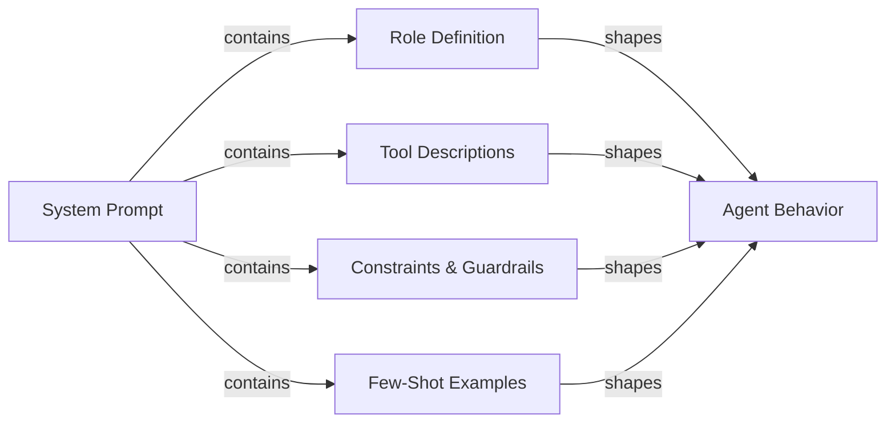

# Prompt engineering para agentes

## Definición

El prompt engineering para agentes es el arte de escribir prompts de sistema y definiciones de herramientas que produzcan de forma confiable el comportamiento que quieres de un agente de IA. A diferencia del prompt engineering para un chatbot de un solo turno — donde principalmente te preocupas por el formato y el tono — los prompts de agentes deben gobernar el razonamiento de múltiples pasos, la disciplina de selección de herramientas, el cumplimiento de restricciones, la recuperación de errores y las condiciones de terminación a lo largo de una secuencia ilimitada de pasos. Un prompt de agente mal escrito produce agentes que hacen bucles sin fin, llaman a herramientas con argumentos incorrectos, ignoran las restricciones del usuario o confabulan resultados cuando las herramientas fallan.

El prompt de sistema es la constitución del agente. Define qué es el agente, qué puede hacer, qué nunca debe hacer, cómo debe razonar y cómo debe ser su salida. Dado que los LLMs son muy sensibles a la redacción, la estructura y el orden, los pequeños cambios en el prompt de sistema pueden tener grandes efectos en el comportamiento. El prompt engineering para agentes es, por tanto, una disciplina iterativa y empírica: escribes un prompt, lo evalúas contra un conjunto de datos de tareas, identificas los modos de fallo y refinas. Herramientas como LangSmith y DeepEval (ver [evaluación](/docs/agents/evaluation)) hacen que este ciclo de retroalimentación sea más rápido.

Los buenos prompts de agentes son modulares y explícitos. Separan la definición del rol, la declaración de capacidades, la especificación de restricciones, las reglas de formato de salida y los ejemplos few-shot en secciones claramente delimitadas. Esta estructura hace que los prompts sean más fáciles de mantener, auditar y extender a medida que evolucionan las capacidades del agente. También ayuda al LLM a activar el "modo" correcto para cada sección en lugar de mezclar preocupaciones.

## Cómo funciona



### Definición del rol

La definición del rol le dice al agente quién es, cuál es su propósito principal y qué persona adoptar. Una buena definición del rol es específica: "Eres un ingeniero de software senior especializado en Python y PostgreSQL, que ayuda a los desarrolladores a depurar problemas de producción" es más útil que "Eres un asistente útil." La especificidad activa el conocimiento relevante y establece el tono de respuesta apropiado. El rol también debe establecer la relación del agente con el usuario (par, asistente, experto), lo que influye en cómo el agente maneja la incertidumbre y el desacuerdo. Mantén la definición del rol concisa (3-5 oraciones) y colócala primero en el prompt de sistema para que enmarque todas las instrucciones posteriores.

### Descripciones de herramientas y selección de herramientas

Cada herramienta a la que tiene acceso el agente debe describirse con precisión. El nombre de la herramienta, la descripción, los nombres de los parámetros, los tipos de los parámetros y el formato de retorno deben especificarse claramente. Las descripciones de herramientas ambiguas son una de las causas más comunes de selección incorrecta de herramientas y argumentos malformados. Incluye: qué hace la herramienta, cuándo usarla (y críticamente, cuándo no), qué entradas espera y qué formato de salida esperar. Para herramientas con propósitos similares, añade desambiguación explícita: "Usa `search_web` para noticias y eventos actuales; usa `search_documents` para consultas a la base de conocimiento interna de la empresa." Los ejemplos few-shot de invocaciones correctas de herramientas (dentro del prompt de sistema o como historial de conversación) reducen significativamente los errores de selección de herramientas.

### Chain-of-thought para agentes

El prompting de chain-of-thought (CoT) pide al agente que razone explícitamente antes de actuar. Para los agentes, esto significa pensar en: qué está pidiendo el usuario, qué información tengo, qué información necesito, qué herramienta debo llamar a continuación y qué espero que sea el resultado. Instruir al agente para que razone antes de actuar ("Antes de llamar a cualquier herramienta, expón brevemente tu plan") mejora la precisión en tareas complejas de múltiples pasos y hace que las trazas sean más interpretables. Algunos frameworks (ReAct, ver [ReAct](/docs/reasoning-patterns/react)) formalizan esto como ciclos de Pensamiento / Acción / Observación. Sé explícito en el prompt sobre si el razonamiento debe estar en la salida o solo en el scratchpad.

### Restricciones y guardrails en los prompts

Las restricciones definen lo que el agente no debe hacer. Deben formularse positivamente donde sea posible ("siempre pide confirmación antes de eliminar datos") en lugar de solo negativamente ("nunca elimines datos sin preguntar"). Incluye: restricciones de alcance (solo responde preguntas sobre X), restricciones de salida (siempre responde en español, siempre usa JSON válido), restricciones de comportamiento (nunca inventes URLs o rutas de archivo) y restricciones de seguridad (nunca generes contenido dañino). Los guardrails en los prompts son una primera línea de defensa, no un reemplazo de los controles técnicos (ver [seguridad](/docs/agents/security)); son más efectivos cuando especifican el comportamiento exacto esperado en casos límite.

### Especificación del formato de salida

Los agentes que producen salida estructurada (JSON, markdown, llamadas a funciones) necesitan instrucciones explícitas de formato. Especifica el esquema exacto, los nombres de campos, los tipos y los campos requeridos vs. opcionales. Incluye un ejemplo válido en el prompt. Para los agentes que llaman a herramientas, aclara cuándo devolver una respuesta final versus continuar llamando a herramientas, y cómo se ve la condición de terminación. Si el agente interactúa con sistemas posteriores, el formato de salida es un contrato; la ambigüedad aquí se propaga hacia integraciones rotas.

## Cuándo usar / Cuándo NO usar

| Usar cuando | Evitar cuando |
|---|---|
| El agente llama a múltiples herramientas y la selección de herramientas es inconsistente | Tratar el prompt de sistema como una configuración única que nunca se revisa |
| El agente hace bucles o termina prematuramente sin completar la tarea | Escribir un muro de texto enorme sin estructura ni secciones |
| El agente ignora las restricciones del usuario o viola las políticas de seguridad | Confiar únicamente en los valores predeterminados del modelo sin ninguna especificación de rol o restricción |
| Incorporar un nuevo LLM y necesitar transferir el comportamiento del modelo anterior | Añadir nuevas instrucciones de forma ad hoc sin evaluar las regresiones |
| Construir un flujo de trabajo de múltiples pasos con requisitos de formato de salida deterministas | Esperar que el prompt solo maneje las amenazas de seguridad (también usa controles técnicos) |

## Comparaciones

| Elemento del prompt | Propósito | Errores comunes |
|---|---|---|
| Definición del rol | Establece persona, experiencia y tono | Demasiado vaga ("asistente útil") o demasiado larga; colocada después de otras secciones |
| Descripciones de herramientas | Guía la selección correcta de herramientas y la formación de argumentos | Falta orientación de cuándo/cuándo no usar; sin ejemplos de invocaciones |
| Restricciones | Impone límites de alcance, seguridad y formato | Solo restricciones negativas ("nunca hagas X") sin especificar la alternativa correcta |
| Instrucción chain-of-thought | Mejora la precisión del razonamiento en tareas complejas | Mezclar el razonamiento en la salida de la llamada a herramienta cuando debería estar en el scratchpad |
| Ejemplos few-shot | Demuestra el comportamiento esperado para el uso de herramientas y el formato de salida | Ejemplos demasiado simples para representar casos extremos reales |

## Pros y contras

| Pros | Contras |
|---|---|
| Efecto inmediato: no se requiere fine-tuning ni reentrenamiento | La sensibilidad del prompt significa que pequeños cambios de redacción pueden romper el comportamiento |
| La estructura modular facilita el mantenimiento y la auditoría | Los prompts largos consumen tokens en cada llamada, aumentando el costo |
| Los ejemplos few-shot reducen significativamente los errores de selección de herramientas | Las instrucciones pueden entrar en conflicto; los LLMs pueden priorizar instrucciones posteriores |
| Las restricciones proporcionan una primera línea de defensa contra el mal uso | Los prompts son visibles para el modelo pero no están protegidos criptográficamente |
| El chain-of-thought mejora la precisión y la interpretabilidad de las trazas | La sobreedspecificación del comportamiento puede hacer que el agente sea frágil en casos extremos |

## Ejemplos de código

```python
# Well-structured agent system prompt with tool definitions
# pip install anthropic

import os
import json
import anthropic

# ---------------------------------------------------------------------------
# Tool definitions with precise descriptions
# ---------------------------------------------------------------------------

TOOLS = [
    {
        "name": "search_documents",
        "description": (
            "Search the internal company knowledge base for documents, policies, and procedures. "
            "Use this tool when the user asks about internal processes, company policies, or "
            "historical project information. Do NOT use this for current news or external information."
        ),
        "input_schema": {
            "type": "object",
            "properties": {
                "query": {
                    "type": "string",
                    "description": "The search query. Use specific keywords; avoid vague terms.",
                },
                "max_results": {
                    "type": "integer",
                    "description": "Maximum number of results to return. Default 5. Max 20.",
                    "default": 5,
                },
            },
            "required": ["query"],
        },
    },
    {
        "name": "create_ticket",
        "description": (
            "Create a support ticket in the project management system. "
            "Use this ONLY after confirming the details with the user. "
            "Never call this tool without explicit user confirmation of the ticket content."
        ),
        "input_schema": {
            "type": "object",
            "properties": {
                "title": {
                    "type": "string",
                    "description": "Short, descriptive title (under 80 characters).",
                },
                "description": {
                    "type": "string",
                    "description": "Full description of the issue or request.",
                },
                "priority": {
                    "type": "string",
                    "enum": ["low", "medium", "high", "critical"],
                    "description": "Ticket priority. Ask the user if unclear.",
                },
                "assignee": {
                    "type": "string",
                    "description": "Email address of the assignee. Optional.",
                },
            },
            "required": ["title", "description", "priority"],
        },
    },
]

# ---------------------------------------------------------------------------
# System prompt with all sections
# ---------------------------------------------------------------------------

SYSTEM_PROMPT = """
## Role
You are a senior IT support specialist for Acme Corp, helping internal employees resolve
technical issues and navigate company processes. You are thorough, patient, and always
confirm destructive actions before proceeding. You do not have access to external systems
or the public internet.

## Capabilities
You have access to two tools:
- `search_documents`: Search the internal knowledge base. Use this to find policies,
  procedures, troubleshooting guides, and historical decisions.
- `create_ticket`: Create a support ticket. ALWAYS confirm ticket details with the user
  before calling this tool.

## Reasoning approach
Before calling any tool, briefly state your plan in one sentence (e.g., "I'll search for
the VPN setup guide first."). After receiving tool results, summarize what you found and
what you'll do next. If a tool returns no results, say so and ask the user for more
details rather than guessing.

## Constraints
- Only answer questions about Acme Corp's internal systems and processes.
- If asked about external topics (competitor products, news, general knowledge),
  politely decline and redirect to your area of expertise.
- Never make up document names, ticket IDs, or employee contact information.
- If you do not know the answer and cannot find it in the knowledge base, say so clearly.
- Never create a ticket without explicit user confirmation of the title, description,
  and priority.
- Always respond in clear, professional English, regardless of the user's language.

## Output format
- For search results: summarize the key points in 2-4 bullet points, then offer to help
  with a follow-up action.
- For ticket creation: confirm the ticket details in a structured block before calling
  the tool, wait for user approval, then report the created ticket ID.
- Keep responses concise: under 300 words unless the user asks for more detail.

## Examples of correct tool use

Example 1 — searching the knowledge base:
User: "How do I request VPN access?"
Plan: I'll search the knowledge base for VPN access request procedures.
[call search_documents with query="VPN access request procedure"]
Response: summarize results in bullet points.

Example 2 — creating a ticket with confirmation:
User: "Can you create a ticket to fix my broken monitor?"
Response: "I'll create a ticket with these details — please confirm:
- Title: Broken monitor replacement request
- Description: User's monitor is not functioning; replacement needed.
- Priority: medium
Shall I proceed?"
[wait for user confirmation before calling create_ticket]
"""

# ---------------------------------------------------------------------------
# Simulated tool implementations
# ---------------------------------------------------------------------------

def search_documents(query: str, max_results: int = 5) -> list[dict]:
    """Simulated knowledge base search."""
    # In production, this calls a vector database or search API
    return [
        {
            "title": "VPN Access Request Process",
            "summary": "Submit an IT request form via the portal. Approval takes 1-2 business days.",
            "url": "internal://kb/vpn-access",
        }
    ][:max_results]


def create_ticket(title: str, description: str, priority: str, assignee: str = "") -> dict:
    """Simulated ticket creation."""
    return {
        "ticket_id": "TICK-4821",
        "title": title,
        "priority": priority,
        "status": "open",
        "assignee": assignee or "unassigned",
    }


def dispatch_tool(tool_name: str, tool_input: dict) -> str:
    """Route tool calls to their implementations."""
    if tool_name == "search_documents":
        results = search_documents(**tool_input)
        return json.dumps(results, indent=2)
    elif tool_name == "create_ticket":
        result = create_ticket(**tool_input)
        return json.dumps(result, indent=2)
    else:
        return json.dumps({"error": f"Unknown tool: {tool_name}"})


# ---------------------------------------------------------------------------
# Agent loop
# ---------------------------------------------------------------------------

def run_support_agent(user_message: str) -> str:
    """Run the support agent with the structured system prompt."""
    client = anthropic.Anthropic(api_key=os.environ["ANTHROPIC_API_KEY"])
    messages = [{"role": "user", "content": user_message}]

    while True:
        response = client.messages.create(
            model="claude-opus-4-5",
            max_tokens=1024,
            system=SYSTEM_PROMPT,
            tools=TOOLS,
            messages=messages,
        )

        # Append assistant response to conversation history
        messages.append({"role": "assistant", "content": response.content})

        if response.stop_reason == "end_turn":
            # Extract text response
            for block in response.content:
                if hasattr(block, "text"):
                    return block.text
            return ""

        elif response.stop_reason == "tool_use":
            # Process all tool calls in this response
            tool_results = []
            for block in response.content:
                if block.type == "tool_use":
                    print(f"  [Tool call] {block.name}({json.dumps(block.input)})")
                    result = dispatch_tool(block.name, block.input)
                    tool_results.append({
                        "type": "tool_result",
                        "tool_use_id": block.id,
                        "content": result,
                    })

            messages.append({"role": "user", "content": tool_results})

        else:
            # Unexpected stop reason
            return f"Agent stopped unexpectedly: {response.stop_reason}"


# ---------------------------------------------------------------------------
# Example run
# ---------------------------------------------------------------------------
if __name__ == "__main__":
    queries = [
        "How do I request VPN access for a new employee?",
        "What's the weather like in São Paulo today?",  # Out of scope — should be declined
    ]
    for query in queries:
        print(f"\nUser: {query}")
        answer = run_support_agent(query)
        print(f"Agent: {answer}")
```

## Recursos prácticos

- [Anthropic - Resumen de prompt engineering](https://docs.anthropic.com/en/docs/build-with-claude/prompt-engineering/overview) — Orientación oficial de Anthropic sobre la estructura del prompt de sistema, definición del rol y chain-of-thought para modelos Claude.
- [Anthropic - Documentación de uso de herramientas](https://docs.anthropic.com/en/docs/build-with-claude/tool-use) — Referencia completa para escribir definiciones de herramientas, manejar llamadas a herramientas y estructurar conversaciones de uso de herramientas con Claude.
- [OpenAI - Guía de prompt engineering](https://platform.openai.com/docs/guides/prompt-engineering) — Técnicas fundamentales para el prompting estructurado, incluyendo ejemplos few-shot, instrucciones de formato explícitas y especificación de restricciones.
- [ReAct: Synergizing Reasoning and Acting in Language Models](https://arxiv.org/abs/2210.03629) — Artículo original que describe el patrón de prompting Pensamiento/Acción/Observación fundamental para la mayoría de los frameworks de agentes.

## Ver también

- [Agentes](/docs/agents)
- [Prompt engineering](/docs/prompt-engineering)
- [Herramientas y acciones de agentes](/docs/agents/tools-actions)
- [Anthropic tool use](/docs/agents/anthropic-tool-use)
