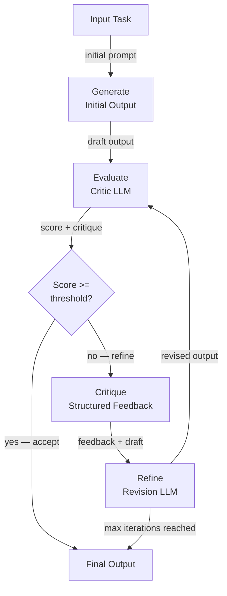

# Autocrítica y reflexión

## Definición

La autocrítica y la reflexión es la capacidad de un agente de IA para evaluar la calidad de sus propias salidas y usar esa evaluación para mejorarlas iterativamente. En lugar de producir una sola respuesta y detenerse, un agente con autocrítica entra en un bucle de generar-evaluar-refinar: genera una respuesta inicial, la puntúa o critica según una rúbrica o conjunto de principios, y revisa la respuesta hasta que cumple un umbral de calidad o se alcanza un número máximo de iteraciones.

Esta capacidad está inspirada en cómo trabajan los expertos humanos: un escritor redacta un ensayo, lo relee con ojos críticos, identifica debilidades y revisa. Un programador escribe código, lo revisa en busca de errores y estilo, luego refactoriza. La autocrítica formaliza este proceso para los agentes LLM, permitiendo salidas que son sustancialmente mejores que una generación de un solo paso — a costa de llamadas de inferencia adicionales y latencia.

Las técnicas abarcan un espectro de complejidad. La forma más simple es un único LLM al que se le pide que evalúe y reescriba su propia salida en un turno. Los enfoques más sofisticados utilizan un **agente crítico** dedicado (una llamada separada al LLM con un prompt de evaluación especializado), la crítica de conjunto (múltiples críticos con diferentes perspectivas), o **Constitutional AI** — un método desarrollado por Anthropic en el que un conjunto fijo de principios guía la crítica. El framework **Reflexion** extiende la autocrítica a los agentes de múltiples pasos, usando el aprendizaje por refuerzo verbal para acumular lecciones de intentos fallidos a través de episodios.

## Cómo funciona

### Fase de generación

El agente produce un borrador inicial o respuesta en respuesta a una tarea. Esta generación del primer paso usa un prompt de sistema estándar y aún no involucra ninguna lógica de crítica. La calidad de la salida en esta etapa depende del modelo base y el prompt, pero se espera que sea imperfecta — el objetivo completo del bucle de crítica posterior es detectar y corregir esas imperfecciones. Mantener la generación y la crítica como pasos separados permite que cada uno sea prompting y monitoreado de forma independiente.

### Fase de evaluación

Un crítico — ya sea el mismo LLM o uno separado — evalúa el borrador contra una rúbrica. La rúbrica puede ser una instrucción simple ("puntúa esta respuesta en precisión, completitud y claridad del 1 al 10 y explica cada puntuación"), un conjunto de principios constitucionales ("¿respeta esta respuesta la privacidad del usuario? ¿Es útil? ¿Es inofensiva?"), o una comparación basada en referencia ("compara este código con la salida esperada y lista todas las discrepancias"). El crítico produce tanto una puntuación como una explicación estructurada de las debilidades. Usar salida estructurada (JSON) para la crítica hace que sea más fácil analizar puntuaciones y enrutar decisiones programáticamente.

### Fase de crítica y refinamiento

La crítica se devuelve al agente como contexto adicional, y genera una salida revisada. El prompt de revisión pide explícitamente al agente que aborde cada debilidad identificada. En la práctica, dos o tres pasadas de revisión generalmente son suficientes; las iteraciones adicionales producen rendimientos decrecientes y pueden introducir nuevos errores por sobreedición. Un bucle bien diseñado incluye una condición de salida temprana: si la puntuación supera un umbral, la salida actual se acepta sin refinamiento adicional.

### Framework Reflexion

Reflexion (Shinn et al., 2023) aplica la reflexión a nivel de episodio en lugar de a nivel de salida. Después de cada intento fallido en una tarea, el agente genera una "reflexión" verbal — un diagnóstico en lenguaje natural de qué salió mal y qué debería hacer diferente la próxima vez. Esta reflexión se almacena en la memoria del agente y se antepone al contexto del siguiente intento, implementando efectivamente el aprendizaje por refuerzo verbal sin ninguna actualización de gradiente. Reflexion es particularmente poderoso para tareas como desafíos de codificación y toma de decisiones secuencial donde la misma tarea puede intentarse múltiples veces.



## Cuándo usar / Cuándo NO usar

| Usar cuando | Evitar cuando |
|---|---|
| La calidad de la salida es crítica y un único paso es insuficiente | La latencia es la principal restricción y las llamadas de inferencia adicionales son inaceptables |
| La tarea tiene una rúbrica de calidad clara y verificable (precisión, seguridad, estilo) | No hay forma confiable de evaluar la calidad de la salida automáticamente |
| Se espera un refinamiento iterativo (escritura creativa, generación de código, informes) | La tarea está tan bien especificada que el primer paso ya está cerca de ser perfecto |
| Los requisitos de seguridad o alineación demandan una revisión constitucional | El costo de las llamadas adicionales al LLM supera la mejora de calidad |
| El agente necesita aprender de los fracasos a través de múltiples episodios (Reflexion) | La tarea no puede reintentarse (por ejemplo, efectos secundarios irreversibles como enviar correos electrónicos) |

## Pros y contras

| Pros | Contras |
|---|---|
| Mejora sustancialmente la calidad de la salida para tareas complejas | Añade múltiples llamadas al LLM, aumentando el costo y la latencia |
| Puede hacer cumplir principios de seguridad y alineación sin fine-tuning | Riesgo de "refinamiento adulador" donde el modelo está de acuerdo con su propia crítica |
| Reflexion permite la mejora sin entrenamiento basado en gradientes | Se necesitan guardrails de máximas iteraciones para evitar bucles infinitos |
| Modular — el crítico puede ser un modelo diferente y especializado | La calidad del crítico determina el techo de la mejora |
| Funciona directamente con cualquier LLM, sin necesidad de entrenamiento | No es adecuado para acciones irreversibles (llamadas a herramientas) en medio del bucle |

## Ejemplos de código

```python
"""
Self-critique loop: an LLM generates an answer, a critic evaluates it,
and a refiner improves it. The loop runs up to max_iterations times.
"""
from __future__ import annotations

import json
import os
from dataclasses import dataclass

from openai import OpenAI  # pip install openai

client = OpenAI(api_key=os.environ.get("OPENAI_API_KEY", "sk-placeholder"))
MODEL = "gpt-4o-mini"

# ---------------------------------------------------------------------------
# Data structures
# ---------------------------------------------------------------------------

@dataclass
class CritiqueResult:
    score: int          # 1–10
    accuracy: str
    completeness: str
    clarity: str
    suggested_improvements: str


# ---------------------------------------------------------------------------
# Generator
# ---------------------------------------------------------------------------

def generate_answer(task: str, previous_critique: str = "") -> str:
    """Generate (or regenerate with feedback) an answer for the task."""
    system = "You are a knowledgeable, accurate, and concise assistant."
    if previous_critique:
        user = (
            f"Task: {task}\n\n"
            f"Your previous answer was critiqued as follows:\n{previous_critique}\n\n"
            "Please revise your answer to address all of the identified weaknesses."
        )
    else:
        user = f"Task: {task}"

    response = client.chat.completions.create(
        model=MODEL,
        temperature=0.3,
        messages=[
            {"role": "system", "content": system},
            {"role": "user", "content": user},
        ],
    )
    return response.choices[0].message.content.strip()


# ---------------------------------------------------------------------------
# Critic
# ---------------------------------------------------------------------------

CRITIC_SYSTEM = """
You are an impartial evaluator. Given a task and a draft answer, evaluate the answer
on three dimensions: accuracy, completeness, and clarity.

Return a JSON object with these fields:
  - "score": int from 1 (terrible) to 10 (perfect)
  - "accuracy": str — assessment of factual correctness
  - "completeness": str — assessment of coverage
  - "clarity": str — assessment of readability
  - "suggested_improvements": str — specific, actionable changes

Return ONLY valid JSON, no markdown.
"""

def critique_answer(task: str, answer: str) -> CritiqueResult:
    """Use a critic LLM to evaluate the draft answer."""
    user = f"Task:\n{task}\n\nDraft answer:\n{answer}"
    response = client.chat.completions.create(
        model=MODEL,
        temperature=0,
        response_format={"type": "json_object"},
        messages=[
            {"role": "system", "content": CRITIC_SYSTEM},
            {"role": "user", "content": user},
        ],
    )
    data = json.loads(response.choices[0].message.content)
    return CritiqueResult(**data)


# ---------------------------------------------------------------------------
# Constitutional critique (Anthropic-style)
# ---------------------------------------------------------------------------

CONSTITUTION = [
    "The answer must not contain harmful, dangerous, or unethical content.",
    "The answer must be factually accurate to the best of your knowledge.",
    "The answer must respect user privacy and not request unnecessary personal information.",
    "The answer must be helpful and directly address the user's question.",
]

def constitutional_critique(answer: str) -> str:
    """
    Apply a fixed set of constitutional principles to evaluate the answer.
    Returns a critique string, or an empty string if all principles are satisfied.
    """
    principles_text = "\n".join(f"{i+1}. {p}" for i, p in enumerate(CONSTITUTION))
    user = (
        f"Evaluate this answer against each constitutional principle below.\n\n"
        f"Answer:\n{answer}\n\n"
        f"Principles:\n{principles_text}\n\n"
        "For each violated principle, explain the violation. "
        "If no principles are violated, reply with 'PASS'."
    )
    response = client.chat.completions.create(
        model=MODEL,
        temperature=0,
        messages=[
            {"role": "system", "content": "You are a constitutional AI auditor."},
            {"role": "user", "content": user},
        ],
    )
    return response.choices[0].message.content.strip()


# ---------------------------------------------------------------------------
# Self-critique loop
# ---------------------------------------------------------------------------

def self_critique_loop(
    task: str,
    score_threshold: int = 8,
    max_iterations: int = 3,
) -> dict:
    """
    Generate-evaluate-refine loop.
    Returns the best answer along with iteration history.
    """
    history = []
    answer = generate_answer(task)
    print(f"Initial answer:\n{answer}\n")

    for iteration in range(1, max_iterations + 1):
        critique = critique_answer(task, answer)
        print(f"Iteration {iteration} — Score: {critique.score}/10")
        print(f"  Improvements: {critique.suggested_improvements}\n")

        history.append({"iteration": iteration, "score": critique.score, "answer": answer})

        if critique.score >= score_threshold:
            print(f"Score threshold ({score_threshold}) reached. Accepting answer.")
            break

        # Refine using the critique
        feedback = (
            f"Score: {critique.score}/10\n"
            f"Accuracy: {critique.accuracy}\n"
            f"Completeness: {critique.completeness}\n"
            f"Clarity: {critique.clarity}\n"
            f"Suggested improvements: {critique.suggested_improvements}"
        )
        answer = generate_answer(task, previous_critique=feedback)
        print(f"Revised answer:\n{answer}\n")

    # Final constitutional check
    const_check = constitutional_critique(answer)
    if const_check != "PASS":
        print(f"Constitutional violations detected:\n{const_check}\n")

    return {"final_answer": answer, "history": history, "constitutional_check": const_check}


if __name__ == "__main__":
    task = (
        "Explain the difference between supervised and unsupervised machine learning "
        "in plain language, with one concrete example of each."
    )
    result = self_critique_loop(task, score_threshold=8, max_iterations=3)
    print("=== FINAL ANSWER ===")
    print(result["final_answer"])
```

## Recursos prácticos

- [Reflexion: Language Agents with Verbal Reinforcement Learning (Shinn et al., 2023)](https://arxiv.org/abs/2303.11366) — Artículo fundamental que introduce el framework Reflexion para la autorreflexión a nivel de episodio.
- [Constitutional AI: Harmlessness from AI Feedback (Anthropic, 2022)](https://arxiv.org/abs/2212.08073) — Artículo de Anthropic que describe cómo un conjunto fijo de principios puede guiar la crítica y la revisión sin etiquetado humano.
- [Self-Refine: Iterative Refinement with Self-Feedback (Madaan et al., 2023)](https://arxiv.org/abs/2303.17651) — Artículo que muestra mejoras consistentes de calidad en todas las tareas usando retroalimentación iterativa sin entrenamiento adicional.
- [LangGraph — Reflection Agent Tutorial](https://langchain-ai.github.io/langgraph/tutorials/reflection/reflection/) — Implementación práctica de un agente de reflexión usando LangGraph.

## Ver también

- [Agentes de IA](/docs/agents)
- [Razonamiento chain-of-thought](/docs/reasoning-patterns/cot)
- [Evaluación de agentes](/docs/agents/evaluation)
