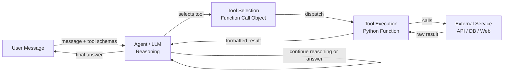

# Herramientas y acciones de agentes

## Definición

Las herramientas y acciones son las manos de un agente de IA. Mientras el LLM proporciona razonamiento y comprensión del lenguaje, las herramientas dan al agente la capacidad de afectar al mundo: buscar en la web, ejecutar código, consultar una base de datos, enviar mensajes o llamar a cualquier API externa. Sin herramientas, un agente está limitado a lo que sabe de sus datos de entrenamiento; con herramientas, puede acceder a información en tiempo real, realizar cómputos y tomar acciones con efectos secundarios.

En los ecosistemas de OpenAI y Anthropic, el mecanismo para el uso de herramientas se llama **function calling** (OpenAI) o **tool use** (Anthropic). El desarrollador define un conjunto de esquemas de herramientas — descripciones JSON estructuradas del nombre, propósito y parámetros de cada herramienta — y los incluye en la solicitud a la API. Cuando el LLM decide que se necesita una herramienta, devuelve un objeto de llamada a herramienta estructurado en lugar de texto plano. El código llamante ejecuta la herramienta y alimenta el resultado de vuelta a la conversación. Este bucle se repite hasta que el agente produce una respuesta final.

La amplitud de las herramientas disponibles es esencialmente ilimitada: si algo puede expresarse como una función Python, puede ser una herramienta. Las categorías comunes incluyen búsqueda web, sandboxes de ejecución de código, consultas a bases de datos SQL o NoSQL, acceso al sistema de archivos, llamadas a APIs REST, integraciones de correo electrónico y mensajería, y herramientas de uso del computador que interactúan con interfaces gráficas de usuario. Diseñar buenas herramientas — con esquemas claros, comportamiento predecible y mensajes de error útiles — es una de las cosas más impactantes que un desarrollador puede hacer para mejorar la confiabilidad del agente.

## Cómo funciona

### Definición del esquema de herramientas

Cada herramienta se describe mediante un esquema que el LLM usa para entender cuándo y cómo llamarla. Un esquema incluye: un nombre (identificador corto en snake_case), una descripción (explicación clara en lenguaje natural de qué hace la herramienta y cuándo usarla) y un objeto de parámetros (JSON Schema que describe cada argumento: nombre, tipo, descripción y si es requerido). La calidad de la descripción afecta directamente a qué tan confiablemente el agente selecciona e invoca la herramienta correctamente. Las descripciones vagas llevan al mal uso; las descripciones precisas con ejemplos llevan a llamadas a herramientas precisas.

### Selección de herramientas

Cuando el LLM recibe un mensaje del usuario junto con un conjunto de esquemas de herramientas, decide en cada paso si responder directamente o invocar una herramienta. Esta decisión se aprende implícitamente durante el fine-tuning en datos de llamada a funciones. En la práctica, la selección de herramientas está influenciada por el prompt de sistema (que puede instruir al agente sobre cuándo preferir ciertas herramientas), la especificidad de las descripciones de herramientas y la confianza del modelo en que puede responder desde los datos de entrenamiento solos. Proporcionar un parámetro `tool_choice` puede forzar o restringir la selección de herramientas programáticamente.

### Ejecución de herramientas e inyección de resultados

Cuando el LLM produce una llamada a herramienta, el código llamante la intercepta, valida los argumentos contra el esquema, ejecuta la función correspondiente y recibe un resultado. Este resultado — ya sea una cadena, un objeto JSON o un mensaje de error — se formatea como un mensaje con rol `tool` y se añade al historial de conversación. El LLM genera entonces el siguiente paso con pleno conocimiento de la salida de la herramienta. Los mensajes de error de llamadas a herramientas fallidas son importantes: el agente debe saber que una herramienta falló para que pueda reintentar, probar una alternativa o pedir aclaraciones al usuario.

### Llamadas a múltiples herramientas y llamadas paralelas

Las APIs modernas de LLM admiten llamadas paralelas a herramientas: el modelo puede solicitar múltiples invocaciones de herramientas en una sola respuesta cuando identifica que son independientes. Por ejemplo, un agente podría llamar a web_search para tres consultas diferentes simultáneamente en lugar de secuencialmente, reduciendo la latencia en dos tercios. El código llamante ejecuta todas las herramientas en paralelo, recopila los resultados y los alimenta juntos en el siguiente turno. Diseñar herramientas para que sean sin estado e idempotentes donde sea posible maximiza el beneficio de la ejecución en paralelo.



## Cuándo usar / Cuándo NO usar

| Usar cuando | Evitar cuando |
|---|---|
| El agente necesita información en tiempo real o externa no presente en los datos de entrenamiento | La tarea puede responderse completamente desde el conocimiento del modelo |
| Se requieren acciones con efectos secundarios (enviar correo, escribir archivo, actualizar BD) | Las herramientas introducen riesgos de seguridad sin sandboxing o limitación de tasa adecuados |
| Se necesita cómputo más allá de las capacidades del LLM (aritmética, ejecución de código) | Cada llamada a herramienta añade latencia y la tarea es sensible al tiempo |
| La recuperación de datos estructurados (consultas SQL, respuestas de API) es esencial | El esquema de la herramienta es tan complejo que el modelo frecuentemente lo usa incorrectamente |
| Se pueden componer múltiples herramientas especializadas para resolver tareas complejas | Los modos de fallo de la herramienta son irrecuperables y podrían causar daño |

## Pros y contras

| Pros | Contras |
|---|---|
| Extiende al agente más allá de los datos de entrenamiento estáticos | Cada llamada a herramienta añade latencia y costo de API |
| Permite efectos secundarios en el mundo real y automatización | El mal uso de herramientas puede causar acciones irreversibles |
| Admite E/S estructurada y validada mediante JSON Schema | Diseñar esquemas claros requiere un prompt engineering cuidadoso |
| Las llamadas paralelas a herramientas reducen el tiempo de respuesta general | Más herramientas aumentan la carga cognitiva del modelo para la selección |
| Completamente extensible — cualquier función Python puede convertirse en una herramienta | El manejo de errores y los reintentos deben implementarse explícitamente |

## Ejemplos de código

```python
"""
OpenAI function calling example with multiple tools:
- web_search: retrieve current information from the web
- safe_math: evaluate arithmetic using operator-based parsing (no eval)
- get_weather: fetch weather data for a city

The agent loop continues until the LLM produces a final text response
with no tool calls.
"""
from __future__ import annotations

import json
import math
import operator
import os
from typing import Any

from openai import OpenAI  # pip install openai

client = OpenAI(api_key=os.environ.get("OPENAI_API_KEY", "sk-placeholder"))
MODEL = "gpt-4o-mini"

# ---------------------------------------------------------------------------
# Tool implementations
# ---------------------------------------------------------------------------

def web_search(query: str, num_results: int = 3) -> str:
    """
    Mock web search. Replace with a real search API such as
    Tavily (https://tavily.com) or Serper (https://serper.dev).
    """
    return json.dumps({
        "query": query,
        "results": [
            {
                "title": f"Result {i + 1} for '{query}'",
                "snippet": f"Relevant information about {query}.",
            }
            for i in range(min(num_results, 10))
        ],
    })


def safe_math(operation: str, a: float, b: float) -> str:
    """
    Perform basic arithmetic safely using an explicit operator table.
    Supports: add, subtract, multiply, divide, power, sqrt (b unused), log.
    This avoids arbitrary code execution entirely.
    """
    ops: dict[str, Any] = {
        "add": operator.add,
        "subtract": operator.sub,
        "multiply": operator.mul,
        "divide": operator.truediv,
        "power": operator.pow,
        "sqrt": lambda x, _: math.sqrt(x),
        "log": lambda x, base: math.log(x, base) if base else math.log(x),
    }
    if operation not in ops:
        return f"Unknown operation '{operation}'. Supported: {', '.join(ops)}"
    try:
        result = ops[operation](a, b)
        return json.dumps({"operation": operation, "a": a, "b": b, "result": result})
    except (ValueError, ZeroDivisionError, OverflowError) as exc:
        return json.dumps({"error": str(exc)})


def get_weather(city: str, units: str = "celsius") -> str:
    """
    Mock weather API. Replace with OpenWeatherMap or similar.
    """
    mock_data = {
        "city": city,
        "temperature": 22,
        "units": units,
        "condition": "Partly cloudy",
        "humidity_percent": 65,
    }
    return json.dumps(mock_data)


# Map tool names to Python functions
TOOL_FUNCTIONS: dict[str, Any] = {
    "web_search": web_search,
    "safe_math": safe_math,
    "get_weather": get_weather,
}

# ---------------------------------------------------------------------------
# Tool schemas (sent to the LLM with every request)
# ---------------------------------------------------------------------------

TOOLS = [
    {
        "type": "function",
        "function": {
            "name": "web_search",
            "description": (
                "Search the web for current information. Use this tool when the user asks "
                "about recent events, facts that may have changed, or anything that requires "
                "up-to-date information."
            ),
            "parameters": {
                "type": "object",
                "properties": {
                    "query": {
                        "type": "string",
                        "description": "The search query to execute.",
                    },
                    "num_results": {
                        "type": "integer",
                        "description": "Number of results to return (default 3, max 10).",
                        "default": 3,
                    },
                },
                "required": ["query"],
            },
        },
    },
    {
        "type": "function",
        "function": {
            "name": "safe_math",
            "description": (
                "Perform a mathematical operation on two numbers. "
                "Supported operations: add, subtract, multiply, divide, power, sqrt, log. "
                "Use this instead of trying to compute arithmetic mentally."
            ),
            "parameters": {
                "type": "object",
                "properties": {
                    "operation": {
                        "type": "string",
                        "enum": ["add", "subtract", "multiply", "divide", "power", "sqrt", "log"],
                        "description": "The arithmetic operation to perform.",
                    },
                    "a": {
                        "type": "number",
                        "description": "The first operand (or the only operand for sqrt).",
                    },
                    "b": {
                        "type": "number",
                        "description": "The second operand (base for log, ignored for sqrt).",
                    },
                },
                "required": ["operation", "a", "b"],
            },
        },
    },
    {
        "type": "function",
        "function": {
            "name": "get_weather",
            "description": (
                "Get the current weather for a city. Use this tool when the user asks "
                "about weather conditions, temperature, or humidity in a specific location."
            ),
            "parameters": {
                "type": "object",
                "properties": {
                    "city": {
                        "type": "string",
                        "description": "The city name, e.g. 'Tokyo' or 'New York'.",
                    },
                    "units": {
                        "type": "string",
                        "enum": ["celsius", "fahrenheit"],
                        "description": "Temperature units (default: celsius).",
                        "default": "celsius",
                    },
                },
                "required": ["city"],
            },
        },
    },
]

# ---------------------------------------------------------------------------
# Agent loop
# ---------------------------------------------------------------------------

def dispatch_tool_call(tool_call) -> str:
    """Execute a single tool call and return the result as a string."""
    name = tool_call.function.name
    args = json.loads(tool_call.function.arguments)
    print(f"  [Tool call] {name}({args})")

    if name not in TOOL_FUNCTIONS:
        return f"Error: unknown tool '{name}'"

    result = TOOL_FUNCTIONS[name](**args)
    preview = result[:120] + ("..." if len(result) > 120 else "")
    print(f"  [Tool result] {preview}")
    return result


def run_agent(user_message: str, system_prompt: str = "You are a helpful assistant.") -> str:
    """
    Agent loop: send message, handle tool calls, repeat until a final answer is produced.
    """
    messages = [
        {"role": "system", "content": system_prompt},
        {"role": "user", "content": user_message},
    ]

    print(f"User: {user_message}\n")

    max_turns = 10  # Safety limit to prevent infinite loops
    for _ in range(max_turns):
        response = client.chat.completions.create(
            model=MODEL,
            messages=messages,
            tools=TOOLS,
            tool_choice="auto",  # Let the model decide; "none" disables tools
        )
        msg = response.choices[0].message

        # If no tool calls, we have the final answer
        if not msg.tool_calls:
            print(f"\nAssistant: {msg.content}")
            return msg.content

        # Append the assistant message with tool calls to history
        messages.append(msg)

        # Execute all tool calls (for parallel execution use asyncio + concurrent.futures)
        for tool_call in msg.tool_calls:
            result = dispatch_tool_call(tool_call)
            messages.append({
                "role": "tool",
                "tool_call_id": tool_call.id,
                "content": result,
            })

    return "Max turns reached without a final answer."


if __name__ == "__main__":
    # Example 1: requires web search
    run_agent("What are the main differences between GPT-4 and Claude 3?")

    print("\n" + "=" * 60 + "\n")

    # Example 2: requires safe_math tool
    run_agent("What is 2 raised to the power of 16, and what is the square root of that?")

    print("\n" + "=" * 60 + "\n")

    # Example 3: requires weather tool
    run_agent("What's the weather like in London right now?")
```

## Recursos prácticos

- [Guía de Function Calling de OpenAI](https://platform.openai.com/docs/guides/function-calling) — Documentación oficial que cubre esquemas de herramientas, llamadas paralelas y mejores prácticas para definiciones de funciones.
- [Documentación de Anthropic Tool Use](https://docs.anthropic.com/en/docs/tool-use) — Guía de Anthropic para el uso de herramientas con Claude, incluyendo streaming, uso del computador y patrones de múltiples herramientas.
- [Tavily AI Search API](https://tavily.com/) — API de búsqueda diseñada específicamente para agentes LLM, que proporciona resultados estructurados limpios ideales para el uso de herramientas.
- [Conceptos de herramientas de LangChain](https://python.langchain.com/docs/concepts/tools/) — Visión general de los patrones de diseño de herramientas en LangChain, incluyendo herramientas personalizadas e integraciones incorporadas.
- [Gorilla: Large Language Model Connected with Massive APIs (Patil et al., 2023)](https://arxiv.org/abs/2305.15334) — Investigación sobre el fine-tuning de LLMs para la selección precisa de API/herramientas a través de miles de herramientas.

## Ver también

- [Agentes de IA](/docs/agents)
- [Anthropic tool use](/docs/agents/anthropic-tool-use)
- [Resumen de frameworks de agentes](/docs/agents/frameworks-overview)
