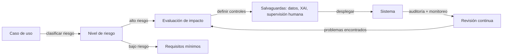

# Ética de la IA

## Definición

La ética de la IA es el campo que se ocupa de los principios morales, las estructuras de gobernanza y los estándares prácticos que guían cómo los sistemas de IA se diseñan, se despliegan y se supervisan. Los principios fundamentales incluyen la equidad (evitar la discriminación), la transparencia (hacer los sistemas comprensibles para los afectados), la responsabilidad (asignar responsabilidad clara por los resultados) y la privacidad (respetar los derechos de datos de los individuos). Estos principios se operacionalizan mediante códigos de conducta, evaluaciones de impacto, procesos de auditoría y, cada vez más, a través de regulación vinculante.

La IA ética no solo trata de prevenir daños — también consiste en promover activamente resultados beneficiosos para diversos grupos de interés. Esto incluye garantizar que los beneficios de la IA se distribuyan equitativamente, que las comunidades afectadas tengan recursos significativos cuando las cosas salgan mal, y que el desarrollo de la IA no concentre el poder de maneras que socaven las instituciones democráticas o la autonomía individual. La ética proporciona el marco normativo dentro del cual opera el trabajo técnico de seguridad y equidad.

En la práctica, la ética de la IA se conecta directamente con la [seguridad de la IA](/docs/ai-safety) en riesgos y alineación, con el [sesgo en IA](/docs/bias-in-ai) en resultados de equidad, y con la [IA explicable](/docs/xai) en requisitos de transparencia. La regulación está operacionalizando rápidamente la ética en ley: el Reglamento de IA de la UE introduce clasificación de riesgo por niveles, obligaciones de transparencia obligatorias y prácticas prohibidas, haciendo que las evaluaciones de ética e impacto sean legalmente requeridas para aplicaciones de alto riesgo. Las organizaciones deben ahora traducir principios abstractos en decisiones de diseño concretas, [prácticas de evaluación](/docs/evaluation-metrics) y controles de despliegue.

## Cómo funciona

### Traducción de principio a práctica

Los principios éticos se vuelven accionables a través de procesos estructurados. Una evaluación de impacto identifica quién se ve afectado por un sistema, qué podría salir mal, cuán grave sería el daño y qué mitigaciones están disponibles. Los comités de ética (internos o externos) evalúan los sistemas propuestos frente a estándares organizacionales y regulatorios antes del despliegue.

### Cumplimiento regulatorio



### Estructuras de gobernanza

Las organizaciones implementan gobernanza a través de políticas de IA responsable, tarjetas de modelos, hojas de datos para conjuntos de datos y documentación de decisiones de diseño y cadenas de responsabilidad. Los mecanismos de human-in-the-loop preservan una supervisión significativa para decisiones consecuentes. La participación de las partes interesadas garantiza que las comunidades afectadas tengan voz en los sistemas que las afectan.

## Cuándo usar / Cuándo NO usar

| Usar cuando | Evitar cuando |
|-------------|--------------|
| Diseño o despliegue de IA en dominios regulados o de alto riesgo (sanidad, contratación, crédito) | El sistema no toma decisiones consecuentes y no afecta a personas directamente |
| Se requiere cumplir con regulación (Reglamento de IA de la UE, RGPD, reglas sectoriales) | La aplicación es un prototipo de investigación puro sin camino hacia el despliegue |
| Lanzamiento de un producto o servicio de IA de cara al público | Todas las salidas son revisadas por personas cualificadas antes de que se tome cualquier acción |
| Gestión de herramientas de IA de terceros que afectan a clientes o empleados | La herramienta es puramente interna y los resultados son totalmente reversibles |

## Comparaciones

| Concepto | Alcance | Resultado principal |
|----------|---------|---------------------|
| Ética de la IA | Principios, gobernanza, valores | Políticas, evaluaciones de impacto, marcos de responsabilidad |
| Seguridad de la IA | Alineación técnica y riesgo | Técnicas de robustez, salvaguardas, sistemas de monitoreo |
| Sesgo en IA | Equidad entre grupos | Auditorías de equidad, métodos de dessesgado, informes de métricas |
| IA explicable | Interpretabilidad | Explicaciones, atribución de características, herramientas de auditoría |

## Pros y contras

| Pros | Contras |
|------|---------|
| Reduce el riesgo legal y reputacional | Las revisiones éticas pueden ralentizar los ciclos de desarrollo |
| Genera confianza de usuarios y del público | Los principios suelen ser vagos y difíciles de operacionalizar |
| Crea responsabilidad y rastros de auditoría | Las métricas de equidad pueden entrar en conflicto entre sí y con la precisión |
| Fomenta la prevención proactiva de daños | La fragmentación regulatoria global aumenta la complejidad del cumplimiento |

## Ejemplos de código

### Generación de una tarjeta de modelo simple (Python)

```python
from dataclasses import dataclass, asdict
import json

@dataclass
class ModelCard:
    model_name: str
    version: str
    intended_use: str
    out_of_scope_use: str
    training_data: str
    evaluation_metrics: list[str]
    known_limitations: str
    ethical_considerations: str
    contact: str

card = ModelCard(
    model_name="loan-approval-classifier",
    version="1.2.0",
    intended_use="Assist loan officers in reviewing consumer loan applications.",
    out_of_scope_use="Fully automated loan decisions without human review.",
    training_data="Internal loan data 2015-2023; balanced by income bracket and region.",
    evaluation_metrics=["accuracy", "F1", "demographic_parity", "equalized_odds"],
    known_limitations="Underperforms for applicants with non-traditional credit histories.",
    ethical_considerations="Reviewed by ethics board Q1 2024. Fairness audited across gender and race.",
    contact="ai-governance@example.com",
)

print(json.dumps(asdict(card), indent=2))
```

## Recursos prácticos

- [Reglamento de IA de la UE](https://digital-strategy.ec.europa.eu/en/policies/regulatory-framework-artificial-intelligence) — Marco regulatorio de la UE con niveles de riesgo y requisitos de cumplimiento
- [OCDE – Principios de IA](https://oecd.ai/en/ai-principles) — Principios internacionales sobre IA confiable
- [Google – Prácticas de IA responsable](https://ai.google/responsibility/responsible-ai-practices/) — Orientación práctica para aplicar la ética en el desarrollo de IA
- [Model Cards for Model Reporting (Mitchell et al.)](https://arxiv.org/abs/1810.03993) — Artículo fundacional sobre documentación de transparencia
- [AI Now Institute](https://ainowinstitute.org/) — Investigación sobre las implicaciones sociales de la IA

## Ver también

- [Seguridad de la IA](/docs/ai-safety)
- [Sesgo en IA](/docs/bias-in-ai)
- [IA explicable](/docs/xai)
