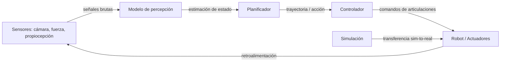

# IA y robótica

## Definición

La IA en robótica es el campo que aplica el aprendizaje automático y las técnicas de IA a agentes físicos que actúan en el mundo real. Abarca tres problemas fundamentales: percepción (comprender el estado del mundo a partir de datos de sensores), planificación (decidir qué hacer a continuación) y control (ejecutar acciones mediante actuadores). A diferencia de las aplicaciones de IA puramente digitales, los sistemas robóticos deben manejar incertidumbre física, latencia y restricciones de seguridad en tiempo real.

La robótica de IA moderna utiliza [aprendizaje por refuerzo](/docs/rl), aprendizaje por imitación y [visión por computadora](/docs/cv) para entrenar políticas que mapean directamente entradas de sensores a acciones. Un paradigma importante es sim-to-real: entrenar políticas en simulación (donde los datos son baratos y los fallos son seguros), luego transferirlas a hardware real. Esto requiere randomización de dominio, identificación de sistemas y a veces adaptación en línea para cerrar la brecha entre la dinámica simulada y la real.

En la práctica, la robótica se conecta con el [aprendizaje por refuerzo profundo](/docs/drl) para control basado en políticas, la [IA multimodal](/docs/multimodal-ai) para percepción sensorial rica e [inferencia en el borde](/docs/local-inference) para procesamiento a bordo en tiempo real. El rango va desde la manipulación industrial y el almacenamiento hasta robots quirúrgicos y navegación autónoma — cada caso de uso trae diferentes compromisos entre velocidad, precisión y restricciones de seguridad.

## Cómo funciona

### Pipeline de percepción-planificación-control

Los sensores (cámaras, fuerza/torque, propiocepción) alimentan modelos de **percepción** que estiman el estado (por ej. poses de objetos, disposición de la escena). Los **planificadores** (clásicos o aprendidos) producen trayectorias o acciones de alto nivel (por ej. "agarrar bloque A"). Los **controladores** (por ej. PID, política aprendida) ejecutan comandos de bajo nivel (pares de articulaciones, velocidades) para seguir el plan.

El aprendizaje **end-to-end** mapea entradas de sensores crudas a acciones en una sola red; las pipelines **modulares** separan percepción, planificación y control para interpretabilidad y reutilización. El entrenamiento es a menudo en simulación ([DRL](/docs/drl)); sim-to-real (randomización de dominio, identificación de sistemas) y las restricciones de seguridad son críticos para el despliegue.



### Transferencia sim-to-real

La simulación permite datos de entrenamiento ilimitados y exploración segura. Las técnicas sim-to-real cierran la brecha: la randomización de dominio varía parámetros físicos y texturas visuales para que las políticas generalicen a variación real. La identificación de sistemas calibra parámetros de simulación contra hardware real. Las políticas residuales aprenden pequeñas correcciones encima de la simulación.

## Cuándo usar / Cuándo NO usar

| Usar cuando | Evitar cuando |
|-------------|--------------|
| La tarea requiere interacción física con entornos no estructurados | La tarea es completamente basada en reglas y determinista (robótica clásica suficiente) |
| La transferencia sim-to-real es factible y las restricciones de seguridad son manejables | Aplicaciones de seguridad crítica sin suficiente tolerancia a fallos y pruebas |
| Hay suficientes datos de demostración o simulación disponibles | La latencia del hardware en tiempo real no es compatible con los requisitos de inferencia |
| Se necesitan políticas adaptativas en tiempo real para entornos cambiantes | Los datos de etiquetado o demostración son demasiado escasos o costosos |

## Comparaciones

| Enfoque | Fuente de entrenamiento | Fortalezas | Limitaciones |
|---------|------------------------|-----------|--------------|
| Aprendizaje por refuerzo | Rollouts de simulación | Explora estrategias novedosas | Requiere muchas muestras, brecha de simulación |
| Aprendizaje por imitación | Demostraciones humanas | Aprende rápidamente de demostraciones | No generaliza bien más allá de las demos |
| Control clásico | Modelo + reglas | Interpretable, determinista | No escala a percepción compleja |
| Aprendizaje end-to-end | Sensores → acciones | Entrenamiento unificado | Más difícil de depurar y desplegar |

## Pros y contras

| Pros | Contras |
|------|---------|
| Adaptable a entornos no estructurados | La brecha sim-to-real puede requerir una calibración costosa |
| Aprende políticas de datos, sin programación explícita | Las restricciones de seguridad son difíciles de codificar en políticas aprendidas |
| La simulación permite entrenamiento de bajo costo | Requiere integración cuidadosa de sensores y hardware |
| Los modelos pueden transferirse en escenarios multitarea | Los requisitos de inferencia en tiempo real limitan el tamaño del modelo |

## Ejemplos de código

### Bucle de política simple (Python / estilo OpenAI Gym)

```python
import gymnasium as gym

env = gym.make("FetchReach-v2", render_mode="human")
obs, info = env.reset()

for step in range(200):
    # Reemplazar con política aprendida; aquí acción aleatoria
    action = env.action_space.sample()
    obs, reward, terminated, truncated, info = env.step(action)
    if terminated or truncated:
        obs, info = env.reset()

env.close()
```

### Randomización de dominio (conceptual)

```python
import numpy as np

def randomize_env_params(base_mass: float, base_friction: float) -> dict:
    """Randomizar propiedades físicas para mejorar sim-to-real."""
    return {
        "mass": base_mass * np.random.uniform(0.8, 1.2),
        "friction": base_friction * np.random.uniform(0.5, 1.5),
        "joint_damping": np.random.uniform(0.01, 0.1),
    }

# Durante el entrenamiento: re-muestrear parámetros del entorno en cada reset
params = randomize_env_params(base_mass=1.0, base_friction=0.5)
```

## Recursos prácticos

- [Spinning Up in Deep RL (OpenAI)](https://spinningup.openai.com/) — Fundamentos de RL para control robótico
- [Google Robotics Research](https://research.google/pubs/robotics/) — Visión general de investigación en robótica de aprendizaje
- [Gymnasium Robotics](https://robotics.farama.org/) — Entornos estándar para investigación de RL en aprendizaje robótico
- [Isaac Gym / Isaac Lab (NVIDIA)](https://developer.nvidia.com/isaac-gym) — Framework de simulación física acelerado por GPU para RL de robots

## Ver también

- [Aprendizaje por refuerzo](/docs/rl)
- [Aprendizaje por refuerzo profundo](/docs/drl)
- [Visión por computadora](/docs/cv)
- [IA multimodal](/docs/multimodal-ai)
- [Inferencia en el borde](/docs/local-inference)
