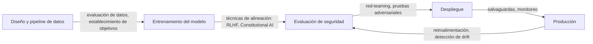

# Seguridad de la IA

## Definición

La seguridad de la IA es el campo de investigación e ingeniería que se ocupa de garantizar que los sistemas de IA hagan lo que pretendemos y permanezcan seguros bajo una amplia gama de condiciones. Abarca tres problemas fundamentales: alineación (sistemas que representan y persiguen correctamente los valores e intenciones humanas), robustez (comportamiento consistente bajo cambios de distribución, entradas adversariales y casos extremos) e interpretabilidad (comprender por qué un sistema produjo una salida particular). Estos problemas se refuerzan mutuamente: la robustez es más difícil de lograr sin interpretabilidad, y la interpretabilidad apoya la verificación de garantías de alineación.

La seguridad de la IA se superpone con la [ética de la IA](/docs/ai-ethics) — la ética proporciona el marco normativo (qué valores deben perseguir los sistemas), mientras que la seguridad aborda el problema técnico (cómo garantizar que lo hagan). El [sesgo en IA](/docs/bias-in-ai) es un punto de intersección: las salidas sesgadas pueden ser tanto un problema de alineación como de equidad. Para los [LLMs](/docs/llms) y los [agentes](/docs/agents), RLHF (aprendizaje por refuerzo con retroalimentación humana), constitutional AI y la supervisión escalable ofrecen las principales herramientas; la [IA explicable](/docs/xai) apoya la auditoría y la depuración.

En la práctica, la seguridad se extiende por todo el ciclo de vida del modelo. Durante el entrenamiento, esto incluye calidad de datos, objetivos y regularización. Durante la evaluación, incluye red-teaming, entradas adversariales y evaluación del comportamiento en los límites. En el despliegue, incluye salvaguardas, monitoreo y mecanismos para intervenir. Para los sistemas de agentes, la mayor autonomía agrega capas adicionales de seguridad: si el agente entiende correctamente sus propias limitaciones, si permanece corregible y si evita la acumulación de poder o las acciones irreversibles.

## Cómo funciona

### Componentes centrales de seguridad

**La alineación** garantiza que un modelo persiga el objetivo previsto — no un error de proxy o una optimización errónea. RLHF entrena modelos para preferir preferencias humanas; Constitutional AI utiliza principios explícitos; la supervisión escalable propone utilizar asistentes de IA confiables para escalar a los revisores humanos.

**La robustez** prueba el comportamiento del sistema bajo condiciones alteradas. Las pruebas adversariales buscan entradas que fuercen fallos. Las pruebas de envenenamiento comprueban si los datos de entrenamiento han sido comprometidos. Las evaluaciones de cambio de distribución miden la degradación cuando las entradas divergen de los datos de entrenamiento.



### Red-teaming y monitoreo

El red-teaming simula el uso adversarial intentando activamente hacer que el modelo falle. El red-teaming automatizado utiliza otros modelos como adversarios para escalar la cobertura. El monitoreo de producción detecta comportamientos inesperados, patrones de salida inusuales y abuso.

## Cuándo usar / Cuándo NO usar

| Usar cuando | Evitar cuando |
|-------------|--------------|
| La IA se despliega en dominios de decisión de alto riesgo (crédito, salud, justicia) | El sistema solo produce recomendaciones internas sin acción directa |
| Modelos o agentes interactúan con entradas no confiables o usuarios públicos | Se garantiza una revisión humana completa de todas las salidas |
| Los sistemas ejecutan acciones irreversibles o controlan infraestructura crítica | La aplicación es un prototipo de bajo riesgo con despliegue limitado |
| Se requiere cumplimiento regulatorio o auditorías externas | El perfil de riesgo es muy bajo y está completamente cubierto por las pruebas existentes |

## Comparaciones

| Técnica | Objetivo | Resultados típicos |
|---------|---------|-------------------|
| RLHF | Alineación | Modelos que siguen preferencias humanas |
| Constitutional AI | Alineación | Modelos que siguen principios |
| Pruebas adversariales | Robustez | Casos extremos e modos de fallo identificados |
| Red-teaming | Revisión de seguridad | Escenarios de abuso y salvaguardas |
| Monitoreo | Seguridad en tiempo de ejecución | Alertas para drift y abuso |

## Pros y contras

| Pros | Contras |
|------|---------|
| Reduce el riesgo de uso catastrófico o malicioso | La ingeniería de seguridad agrega tiempo y costo de desarrollo |
| Crea garantías demostrables para reguladores y auditores | Las garantías formales de alineación siguen siendo un problema abierto de investigación |
| Las salvaguardas mejoran la experiencia del usuario al rechazar el abuso | Los filtros demasiado estrictos pueden rechazar salidas útiles |
| El monitoreo detecta problemas pronto antes de que escalen | Los sistemas distribuidos o basados en agentes son más difíciles de monitorear |

## Ejemplos de código

### Revisión de salida simple con salvaguarda basada en reglas (Python)

```python
import re

BLOCKED_PATTERNS = [
    r"\b(ssn|social security)\b",
    r"\b\d{3}-\d{2}-\d{4}\b",  # SSN format
    r"\bcredit.?card\b",
]

def check_output_safety(text: str) -> tuple[bool, str]:
    """Devuelve (is_safe, reason)."""
    lower = text.lower()
    for pattern in BLOCKED_PATTERNS:
        if re.search(pattern, lower):
            return False, f"Patrón bloqueado detectado: {pattern}"
    return True, "OK"

response = "Tu SSN es 123-45-6789."
safe, reason = check_output_safety(response)
print(f"Seguro: {safe}, Razón: {reason}")
# Seguro: False, Razón: Patrón bloqueado detectado: \b\d{3}-\d{2}-\d{4}\b
```

### Envoltura simple de moderación de prompts

```python
from anthropic import Anthropic

client = Anthropic()

SYSTEM_PROMPT = """Eres un asistente útil. Debes:
- No generar contenido dañino, ilegal o engañoso
- Aclarar cuando una solicitud está fuera de tus capacidades
- Nunca fingir ser humano cuando se te pregunta directamente
"""

def safe_chat(user_message: str) -> str:
    response = client.messages.create(
        model="claude-opus-4-5",
        max_tokens=1024,
        system=SYSTEM_PROMPT,
        messages=[{"role": "user", "content": user_message}],
    )
    return response.content[0].text

print(safe_chat("Ayúdame a entender este error."))
```

## Recursos prácticos

- [Anthropic – Investigación de seguridad en IA](https://www.anthropic.com/research) — Investigación sobre alineación, constitutional AI y supervisión escalable
- [OpenAI – Seguridad y responsabilidad](https://openai.com/safety) — Prácticas de seguridad y compromisos
- [NIST AI Risk Management Framework](https://www.nist.gov/system/files/documents/2023/01/26/AI%20RMF%201.0.pdf) — Marco gubernamental para la gestión de riesgos de IA
- [Alignment Forum](https://www.alignmentforum.org/) — Comunidad para investigación técnica de alineación

## Ver también

- [Ética de la IA](/docs/ai-ethics)
- [IA explicable](/docs/xai)
- [Sesgo en IA](/docs/bias-in-ai)
- [Agentes autónomos](/docs/autonomous-agents)
