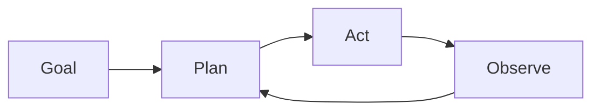

# Agentes autónomos

## Definición

Los agentes autónomos persiguen objetivos a largo plazo con intervención humana limitada. They plan, use tools, and adapt when the environment or task changes (por ej. codificación agents, research assistants).

They se sitúan en el “alta autonomía” extremo del [agents](/docs/agents) espectro: en lugar de un turno de usuario y una respuesta, ejecutan bucles largos (plan → act → observe → replan) until the goal is met or a limit is hit. [Subagents](/docs/subagents) and [razonamiento patterns](/docs/reasoning-patterns) (por ej. ReAct, ToT) are often used inside autonomous agents to structure planning and action.

## Cómo funciona

The agent starts from a **goal** (por ej. “implement feature X”). It **plans** (possibly breaking into steps or sub-tasks), then **acts** (llamadas a herramientas, code edits, search). The **observe** step captures results (tool outputs, errors, state) and feeds back into **plan** for the next iteration. The loop combines planning, memory (what was tried, what worked), tool use, and often reflection (por ej. self-critique). It runs until a stopping condition: task done, step/budget limit, or human-in-the-loop check. Safety and oversight (por ej. approval gates, rollback) are important when autonomy is high.

## Casos de uso

Los agentes autónomos son adecuados para trabajo de largo horizonte y múltiples pasos donde el sistema debe planificar, actuar y adaptarse sin input humano paso a paso.

- Long-horizon codificación agents that plan, edit, and test
- Research assistants that gather sources, summarize, and iterate
- Data pipelines that adapt when inputs or schemas change

## Documentación externa

- [From Prototypes to Agents with ADK – Google Codelabs](https://codelabs.developers.google.com/your-first-agent-with-adk#0)
- [LangChain – Autonomous agents](https://python.langchain.com/docs/concepts/agents/)

## Ver también

- [Agents](/docs/agents)
- [Subagents](/docs/subagents)
- [Reasoning patterns](/docs/reasoning-patterns)
