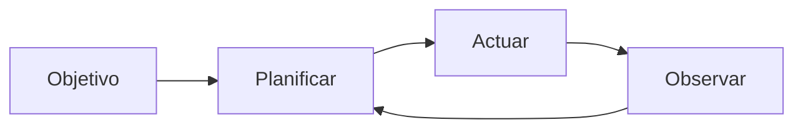

# Agentes autónomos

## Definición

Los agentes autónomos persiguen objetivos a largo plazo con intervención humana limitada. Planifican, usan herramientas y se adaptan cuando el entorno o la tarea cambian (por ejemplo, agentes de codificación, asistentes de investigación).

Se sitúan en el extremo de "alta autonomía" del espectro de [agentes](/docs/agents): en lugar de un turno de usuario y una respuesta, ejecutan bucles largos (planificar → actuar → observar → replanificar) hasta que se cumple el objetivo o se alcanza un límite. Los [subagentes](/docs/subagents) y los [patrones de razonamiento](/docs/reasoning-patterns) (como ReAct, ToT) se usan a menudo dentro de agentes autónomos para estructurar la planificación y la acción.

## Cómo funciona

El agente comienza a partir de un **objetivo** (por ejemplo, "implementar la función X"). **Planifica** (posiblemente dividiendo en pasos o subtareas), luego **actúa** (llamadas a herramientas, ediciones de código, búsqueda). El paso de **observación** captura los resultados (salidas de herramientas, errores, estado) y retroalimenta la **planificación** para la siguiente iteración. El bucle combina planificación, memoria (qué se intentó, qué funcionó), uso de herramientas y, a menudo, reflexión (como autocrítica). Se ejecuta hasta que se cumple una condición de parada: tarea completada, límite de pasos o presupuesto, o verificación en el bucle humano. La seguridad y supervisión (como puertas de aprobación, reversión) son importantes cuando la autonomía es alta.

## Casos de uso

Los agentes autónomos son adecuados para trabajo de largo horizonte y múltiples pasos donde el sistema debe planificar, actuar y adaptarse sin intervención humana paso a paso.

- Agentes de codificación de largo horizonte que planifican, editan y prueban
- Asistentes de investigación que recopilan fuentes, resumen e iteran
- Canales de datos que se adaptan cuando cambian las entradas o los esquemas

## Recursos prácticos

- [From Prototypes to Agents with ADK – Google Codelabs](https://codelabs.developers.google.com/your-first-agent-with-adk#0)
- [LangChain – Agentes autónomos](https://python.langchain.com/docs/concepts/agents/)

## Ver también

- [Agentes](/docs/agents)
- [Subagentes](/docs/subagents)
- [Patrones de razonamiento](/docs/reasoning-patterns)
