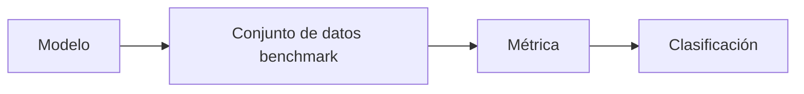

# Benchmarks

## Definición

Los benchmarks son conjuntos de datos estandarizados y protocolos de evaluación (como GLUE, SuperGLUE para NLP; MMLU para conocimiento amplio; HumanEval para código). Permiten la comparación entre modelos y a lo largo del tiempo.

Dependen de [métricas de evaluación](/docs/evaluation-metrics) y divisiones fijas para que los resultados sean comparables. El sobreajuste a los benchmarks es un problema conocido; complemente con evaluaciones fuera de distribución y humanas al desplegar [LLMs](/docs/llms) o sistemas en producción.

## Cómo funciona

Un **modelo** se ejecuta en un **conjunto de datos benchmark** (indicaciones o entradas fijas, división estándar). Las **métricas** (como exactitud, pass@k) se calculan por tarea y a menudo se promedian; los resultados se reportan en una **clasificación** o en artículos. Los protocolos definen qué entradas usar, cómo interpretar las salidas y qué [métricas](/docs/evaluation-metrics) reportar. Reutilizar el mismo benchmark a lo largo del tiempo permite a la comunidad hacer seguimiento del progreso. Se necesita cuidado: los modelos pueden sobreajustarse a las particularidades del benchmark y los benchmarks pueden no reflejar la calidad del mundo real; úselos como una señal entre otras.

## Casos de uso

Los benchmarks proporcionan una vara común para comparar modelos y métodos; úselos junto con evaluación específica de la tarea y humana.

- Comparar modelos de NLP (como GLUE, SuperGLUE, MMLU)
- Evaluar generación de código (como HumanEval) o razonamiento
- Hacer seguimiento del progreso de modelos y métodos a lo largo del tiempo

## Recursos prácticos

- [Papers with Code – Clasificaciones](https://paperswithcode.com/)
- [MMLU (Hendrycks et al.)](https://arxiv.org/abs/2009.03300) — Benchmark de conocimiento amplio
- [HumanEval](https://github.com/openai/human-eval) — Benchmark de generación de código

## Ver también

- [Métricas de evaluación](/docs/evaluation-metrics)
- [LLMs](/docs/llms)
