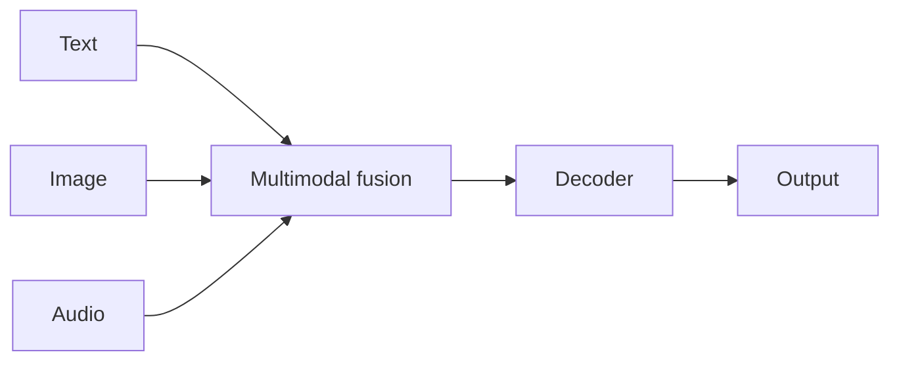

# Case study: Gemini

## Definición

Gemini es la familia de [LLMs](/docs/llms) de Google con soporte **multimodal nativo**: texto, imagen, audio y vídeo en un solo modelo. Sucede a modelos anteriores de Google (p. ej., [BART](/docs/case-studies/bart) en la línea codificador-decodificador) y se ofrece en múltiples niveles de escala (Nano, Pro, Ultra) para diferentes equilibrios de latencia y capacidad.

Gemini se entrena y despliega en los productos de Google (Search, Workspace, Vertex AI, Android). Caso de uso: chat, comprensión y generación [multimodal](/docs/multimodal-ai), programación y uso de herramientas de estilo [agente](/docs/agents).

## Cómo funciona

Las **entradas multimodales** (texto, imagen, audio, vídeo) se codifican y fusionan en un stack [transformer](/docs/transformers) unificado. El **decodificador** genera texto (o salida estructurada) condicionado en todas las modalidades. **Niveles de escala**: modelos más pequeños (p. ej., Nano) para [edge](/docs/edge-reasoning) y en el dispositivo; más grandes (Pro, Ultra) para máxima capacidad en la nube. **Integración**: los mismos modelos impulsan Gemini en las APIs de Search, Workspace y Vertex AI. La [ingeniería de prompts](/docs/prompt-engineering) y [RAG](/docs/rag) o herramientas amplían el uso en aplicaciones.

## Casos de uso

Gemini es adecuado cuando se necesita comprensión o generación multimodal e integración opcional con el stack de Google.

- Chat y asistentes con comprensión de imágenes, documentos o vídeos
- Búsqueda multimodal, resumen y generación de contenido
- Programación y razonamiento a través de la API o los productos de Google

## Documentación externa

- [Google AI – Gemini](https://ai.google.dev/gemini-api) — API y descripción general
- [Google – Gemini models](https://deepmind.google/technologies/gemini/) — Niveles del modelo y capacidades

## Ver también

- [LLMs](/docs/llms)
- [IA multimodal](/docs/multimodal-ai)
- [BART](/docs/case-studies/bart) — Predecesor en la línea codificador-decodificador
