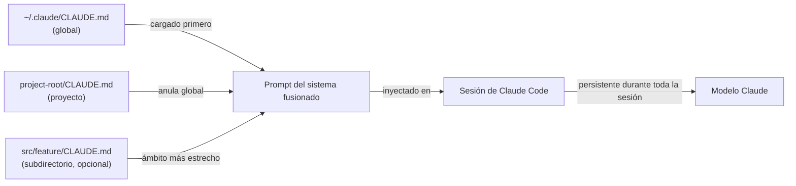

# Configuración de CLAUDE.md

## Definición

`CLAUDE.md` es un archivo Markdown que Claude Code lee automáticamente al inicio de cada sesión. Su contenido se inyecta en el prompt del sistema, proporcionando al modelo instrucciones persistentes y conscientes del proyecto sin requerir que el desarrollador las repita en cada conversación. Piénsalo como el "documento de incorporación" que recibe cada sesión: le dice a Claude qué es el proyecto, cómo está estructurado, qué convenciones seguir y qué comportamientos evitar.

El archivo está escrito intencionalmente en Markdown plano en lugar de un formato propietario, lo que significa que es legible por humanos, controlable por versiones y editable por cualquier desarrollador del equipo. Dado que vive en el repositorio junto al código, evoluciona con el proyecto: cuando cambia el stack tecnológico, cuando se adoptan nuevas convenciones, o cuando un nuevo desarrollador se une y necesita incorporarse, el `CLAUDE.md` es la única fuente de verdad sobre cómo debe comportarse Claude en esa base de código.

Hay dos ámbitos distintos para los archivos `CLAUDE.md`. Un archivo a **nivel de proyecto** vive en la raíz del repositorio (o cualquier subdirectorio) y se aplica solo a ese proyecto. Un archivo **global** vive en `~/.claude/CLAUDE.md` y se aplica a cada sesión de Claude Code independientemente del proyecto. Los dos ámbitos son aditivos: ambos se cargan simultáneamente, con las instrucciones a nivel de proyecto tomando precedencia cuando entran en conflicto con las globales.

## Cómo funciona

### Descubrimiento de archivos y orden de carga

Cuando Claude Code inicia una sesión, recorre el árbol de directorios hacia arriba desde el directorio de trabajo actual buscando archivos `CLAUDE.md`. Los archivos encontrados en directorios padre se cargan primero (ámbito más amplio), luego los archivos encontrados en el directorio actual y sus subdirectorios (ámbito más estrecho). El archivo global en `~/.claude/CLAUDE.md` siempre se carga primero, proporcionando una línea base que los archivos de proyecto pueden anular. Esta carga jerárquica significa que un monorepo puede tener un `CLAUDE.md` a nivel raíz para convenciones compartidas y archivos `CLAUDE.md` por paquete para reglas específicas del paquete — ambos se aplican simultáneamente durante una sesión.

### Inyección en el prompt del sistema

El contenido de todos los archivos `CLAUDE.md` descubiertos se concatena y se antepone al prompt del sistema antes de cualquier turno de conversación. Esto significa que Claude tiene acceso a las instrucciones en cada solicitud individual, no solo en la primera. Dado que las instrucciones son parte del prompt del sistema en lugar del mensaje del usuario, no consumen contexto conversacional que de otro modo se usaría para código y resultados de herramientas. Las instrucciones persisten durante toda la sesión y no son resumidas ni comprimidas por el sistema de gestión de contexto.

### Qué pertenece en CLAUDE.md

Un `CLAUDE.md` bien escrito responde las preguntas que haría un nuevo miembro del equipo antes de tocar la base de código: ¿Qué es este proyecto? ¿Qué lenguaje y framework se usan? ¿Cómo está organizado el código? ¿Cuáles son las convenciones de pruebas y formateo? ¿Hay patrones que seguir o antipatrones que evitar? ¿Hay comandos que Claude debería o no debería ejecutar? El archivo debe ser lo suficientemente específico para ser accionable pero lo suficientemente conciso para que el modelo pueda internalizarlo todo. Evita llenarlo con información que Claude ya sabe (p. ej., explicar qué es TypeScript) y céntrate en hechos específicos del proyecto.

### Mantener CLAUDE.md actualizado

Dado que `CLAUDE.md` se inyecta en cada solicitud, las instrucciones desactualizadas dañan activamente el rendimiento — Claude puede seguir convenciones obsoletas o usar patrones deprecados. La práctica recomendada es tratar las actualizaciones de `CLAUDE.md` como parte del desarrollo normal: cuando una refactorización importante cambia la estructura del proyecto, actualiza el archivo en el mismo commit. La revisión de código debe incluir cambios de `CLAUDE.md` igual que cualquier otro cambio de configuración. Los equipos con pipelines de CI pueden hacer lint del archivo (p. ej., verificar que los caminos referenciados aún existan) para detectar entradas obsoletas temprano.



## Cuándo usar / Cuándo NO usar

| Usar cuando | Evitar cuando |
|---|---|
| Quieres que Claude siga siempre estándares de codificación específicos (p. ej., usar `const` sobre `let`, preferir componentes funcionales) | Las instrucciones cambian frecuentemente por tarea — usa prompts en sesión para solicitudes únicas |
| Necesitas proporcionar contexto del stack tecnológico que de otro modo requeriría re-explicación (p. ej., "usamos Zod para validación de esquemas, no Yup") | El archivo contendría secretos o credenciales — usa variables de entorno para eso |
| Quieres evitar que Claude ejecute comandos peligrosos (p. ej., "nunca ejecutar `DROP TABLE` o `rm -rf`") | Las instrucciones son mejores prácticas genéricas que Claude ya sigue por defecto |
| Tu proyecto tiene decisiones de arquitectura no obvias que afectan cómo se debe escribir el código | El proyecto es un script único sin convenciones compartidas que valga la pena documentar |
| Trabajas en múltiples proyectos y quieres un estilo base personal en tu `~/.claude/CLAUDE.md` global | Diferentes miembros del equipo tienen preferencias conflictivas — resuélvelas primero en la revisión de código |

## Ejemplos de código

```markdown
# CLAUDE.md — instrucciones del proyecto my-app

## Descripción general del proyecto
Esta es una aplicación web full-stack: frontend React + TypeScript, backend Node.js + Express,
base de datos PostgreSQL gestionada con Prisma ORM. El monorepo está estructurado como:

- `packages/web/` — Frontend React (Vite, React Router v6, Tailwind CSS)
- `packages/api/` — API REST Express (TypeScript, Zod para validación de solicitudes)
- `packages/shared/` — Tipos TypeScript compartidos utilizados por ambos paquetes

## Convenciones del stack tecnológico

### Frontend (packages/web)
- Usar solo componentes funcionales con hooks — sin componentes de clase
- Preferir exportaciones nombradas sobre exportaciones predeterminadas para componentes
- Gestión de estado: Zustand para estado global, React Query para estado del servidor
- Estilos: clases utilitarias de Tailwind; sin estilos en línea ni módulos CSS
- Usar esquemas `zod` importados de `packages/shared` para validar respuestas de API

### Backend (packages/api)
- Todos los manejadores de rutas viven en `src/routes/`; usar Express Router, un archivo por recurso
- Validar todos los cuerpos de solicitud y parámetros de consulta con Zod antes de acceder a ellos
- Usar el cliente generado de Prisma — nunca escribir SQL crudo a menos que Prisma no pueda expresar la consulta
- Devolver errores como objetos JSON `{ error: string, code: string }`, nunca como HTML

## Estilo de código
- El modo strict de TypeScript está habilitado — nunca usar `any` o `// @ts-ignore`
- Usar `const` por defecto; solo usar `let` cuando se requiere reasignación
- Preferir retornos tempranos sobre condicionales anidados
- Todas las funciones async deben manejar errores con try/catch o `.catch()`
- No importar desde `../../..` más de dos niveles de profundidad — usar aliases de ruta (`@web/`, `@api/`, `@shared/`)

## Pruebas
- Las pruebas viven junto a los archivos fuente como `*.test.ts` — no en un directorio `tests/` separado
- Usar Vitest para todas las pruebas (no Jest)
- Escribir pruebas unitarias para todas las funciones de utilidad; pruebas de integración para todas las rutas de API
- Ejecutar pruebas con: `pnpm test` (ejecuta todos los paquetes) o `pnpm --filter @app/api test` (paquete único)

## Convenciones de Git
- Usar conventional commits: `feat:`, `fix:`, `chore:`, `docs:`, `refactor:`, `test:`
- Un cambio lógico por commit — no agrupar cambios no relacionados
- Nombres de ramas: `feat/description`, `fix/description`, `chore/description`

## Comandos que puedes ejecutar libremente
- `pnpm install`, `pnpm build`, `pnpm test`, `pnpm lint`, `pnpm format`
- `prisma generate`, `prisma migrate dev`, `prisma studio`
- `git status`, `git diff`, `git log`

## Comandos que NUNCA debes ejecutar sin confirmación explícita del usuario
- Cualquier `prisma migrate reset` o `prisma db push --force-reset` — estos destruyen datos
- Cualquier `DROP TABLE`, `DELETE FROM` sin una cláusula WHERE
- `rm -rf` en cualquier directorio que no sea `node_modules` o artefactos de construcción
```

```markdown
# Instrucciones globales de Claude Code (todos los proyectos)

## Mis valores predeterminados personales
- Prefiero TypeScript sobre JavaScript en todos los archivos nuevos
- Usar comillas simples para cadenas en JavaScript/TypeScript
- Explicar lo que vas a hacer antes de hacer cambios grandes (más de 3 archivos)
- Al escribir mensajes de commit, usar siempre el formato de conventional commits

## Reglas de seguridad (todos los proyectos)
- Nunca hacer commit directamente a `main` o `master` — siempre crear primero una rama de funcionalidad
- Nunca ejecutar comandos de migración de base de datos sin mostrarme primero el archivo de migración
- Preguntar antes de instalar nuevas dependencias — quiero revisar el tamaño del paquete y la licencia
```

## Recursos prácticos

- [Documentación de Claude Code — CLAUDE.md](https://docs.anthropic.com/en/docs/claude-code/memory) — Guía oficial sobre ubicaciones de archivos CLAUDE.md, orden de carga y mejores prácticas.
- [Referencia de configuración de Claude Code](https://docs.anthropic.com/en/docs/claude-code/settings) — Referencia completa de configuración incluyendo todas las opciones de configuración junto a CLAUDE.md.
- [Inicio rápido de Claude Code](https://docs.anthropic.com/en/docs/claude-code/quickstart) — Guía de inicio que cubre la configuración inicial de CLAUDE.md.

## Ver también

- [Descripción general de Claude Code](/docs/claude-code)
- [Skills de Claude Code](/docs/claude-code/skills)
- [Gestión del contexto](/docs/claude-code/context-management)
