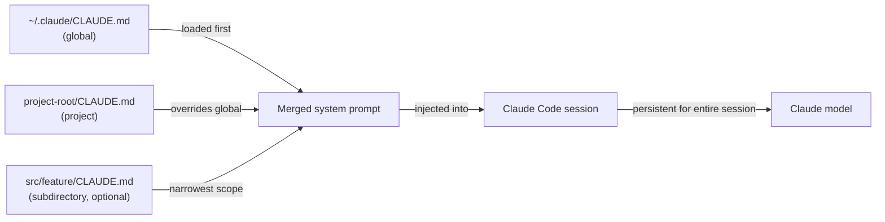

# Configuración CLAUDE.md

## Definición

`CLAUDE.md` es un archivo Markdown que Claude Code lee automáticamente al inicio de cada sesión. Su contenido se inyecta en el prompt del sistema, dando al modelo instrucciones persistentes y conscientes del proyecto sin requerir que el desarrollador las repita en cada conversación. Piénsalo como el "documento de incorporación" que recibe cada sesión: le dice a Claude qué es el proyecto, cómo está estructurado, qué convenciones seguir y qué comportamientos evitar.

El archivo está intencionalmente escrito en Markdown plano en lugar de un formato propietario, lo que significa que es legible por humanos, versionable con control de versiones y editable por cualquier desarrollador del equipo. Dado que vive en el repositorio junto al código, evoluciona con el proyecto: cuando la pila tecnológica cambia, cuando se adoptan nuevas convenciones o cuando un nuevo desarrollador se incorpora y necesita orientación, el `CLAUDE.md` es la única fuente de verdad sobre cómo debe comportarse Claude en esa base de código.

Hay dos ámbitos distintos para los archivos `CLAUDE.md`. Un archivo **a nivel de proyecto** vive en la raíz del repositorio (o cualquier subdirectorio) y se aplica solo a ese proyecto. Un archivo **global** vive en `~/.claude/CLAUDE.md` y se aplica a cada sesión de Claude Code independientemente del proyecto. Los dos ámbitos son aditivos: ambos se cargan simultáneamente, con las instrucciones a nivel de proyecto que tienen precedencia cuando entran en conflicto con las globales.

## Cómo funciona

### Descubrimiento de archivos y orden de carga

Cuando Claude Code inicia una sesión, recorre el árbol de directorios hacia arriba desde el directorio de trabajo actual buscando archivos `CLAUDE.md`. Los archivos encontrados en directorios padre se cargan primero (ámbito más amplio), luego los archivos encontrados en el directorio actual y sus subdirectorios (ámbito más estrecho). El archivo global en `~/.claude/CLAUDE.md` siempre se carga primero, proporcionando una base que los archivos del proyecto pueden anular. Esta carga jerárquica significa que un monorepo puede tener un `CLAUDE.md` a nivel raíz para convenciones compartidas y archivos `CLAUDE.md` por paquete para reglas específicas del paquete — ambos se aplican simultáneamente durante una sesión.

### Inyección en el prompt del sistema

El contenido de todos los archivos `CLAUDE.md` descubiertos se concatena y antepone al prompt del sistema antes de cualquier turno de conversación. Esto significa que Claude tiene acceso a las instrucciones en cada solicitud, no solo en la primera. Dado que las instrucciones son parte del prompt del sistema en lugar del mensaje del usuario, no consumen contexto conversacional que de otro modo se usaría para código y resultados de herramientas. Las instrucciones persisten durante toda la sesión y no son resumidas ni comprimidas por el sistema de gestión de contexto.

### Qué pertenece en CLAUDE.md

Un `CLAUDE.md` bien escrito responde las preguntas que haría un nuevo miembro del equipo antes de tocar la base de código: ¿Qué es este proyecto? ¿Qué lenguaje y framework se usan? ¿Cómo está organizado el código? ¿Cuáles son las convenciones de prueba y formato? ¿Hay patrones que seguir o anti-patrones a evitar? ¿Hay comandos que Claude debe o no debe ejecutar? El archivo debe ser lo suficientemente específico como para ser accionable, pero lo suficientemente conciso como para que el modelo pueda internalizarlo todo. Evita llenarlo con información que Claude ya conoce (p. ej., explicar qué es TypeScript) y enfócate en hechos específicos del proyecto.

### Mantener CLAUDE.md actualizado

Dado que `CLAUDE.md` se inyecta en cada solicitud, las instrucciones desactualizadas perjudican activamente el rendimiento — Claude puede seguir convenciones obsoletas o usar patrones deprecados. La práctica recomendada es tratar las actualizaciones de `CLAUDE.md` como parte del desarrollo normal: cuando una refactorización importante cambia la estructura del proyecto, actualiza el archivo en el mismo commit. La revisión de código debe incluir cambios en `CLAUDE.md` igual que cualquier otro cambio de configuración. Los equipos con pipelines de CI pueden hacer lint del archivo (p. ej., verificar que las rutas referenciadas aún existen) para detectar entradas obsoletas de forma temprana.



## Cuándo usar / Cuándo NO usar

| Usar cuando | Evitar cuando |
|---|---|
| Quieres que Claude siempre siga estándares de codificación específicos (p. ej., usar `const` sobre `let`, preferir componentes funcionales) | Las instrucciones cambian frecuentemente por tarea — usa prompts dentro de la sesión para solicitudes únicas |
| Necesitas proporcionar contexto de la pila tecnológica que de otro modo requeriría re-explicación (p. ej., "usamos Zod para validación de esquemas, no Yup") | El archivo contendría secretos o credenciales — usa variables de entorno para eso |
| Quieres evitar que Claude ejecute comandos peligrosos (p. ej., "nunca ejecutar `DROP TABLE` o `rm -rf`") | Las instrucciones son mejores prácticas genéricas que Claude ya sigue por defecto |
| Tu proyecto tiene decisiones de arquitectura no obvias que afectan cómo debe escribirse el código | El proyecto es un script de un solo uso sin convenciones compartidas que valgan la pena documentar |
| Trabajas en múltiples proyectos y quieres un estilo base personal en tu `~/.claude/CLAUDE.md` global | Diferentes miembros del equipo tienen preferencias conflictivas — resuelve eso primero en la revisión de código |

## Ejemplos de código

```markdown
# CLAUDE.md — my-app project instructions

## Project overview
This is a full-stack web app: React + TypeScript frontend, Node.js + Express backend,
PostgreSQL database managed with Prisma ORM. The monorepo is structured as:

- `packages/web/` — React frontend (Vite, React Router v6, Tailwind CSS)
- `packages/api/` — Express REST API (TypeScript, Zod for request validation)
- `packages/shared/` — Shared TypeScript types used by both packages

## Tech stack conventions

### Frontend (packages/web)
- Use functional components with hooks only — no class components
- Prefer named exports over default exports for components
- State management: Zustand for global state, React Query for server state
- Styling: Tailwind utility classes; no inline styles or CSS modules
- Use `zod` schemas imported from `packages/shared` to validate API responses

### Backend (packages/api)
- All route handlers live in `src/routes/`; use Express Router, one file per resource
- Validate all request bodies and query params with Zod before accessing them
- Use Prisma's generated client — never write raw SQL unless Prisma cannot express the query
- Return errors as `{ error: string, code: string }` JSON objects, never as HTML

## Code style
- TypeScript strict mode is enabled — never use `any` or `// @ts-ignore`
- Use `const` by default; only use `let` when reassignment is required
- Prefer early returns over nested conditionals
- All async functions must handle errors with try/catch or `.catch()`
- Do not import from `../../..` more than two levels deep — use path aliases (`@web/`, `@api/`, `@shared/`)

## Testing
- Tests live alongside source files as `*.test.ts` — not in a separate `tests/` directory
- Use Vitest for all tests (not Jest)
- Write unit tests for all utility functions; integration tests for all API routes
- Run tests with: `pnpm test` (runs all packages) or `pnpm --filter @app/api test` (single package)

## Git conventions
- Use conventional commits: `feat:`, `fix:`, `chore:`, `docs:`, `refactor:`, `test:`
- One logical change per commit — do not bundle unrelated changes
- Branch names: `feat/description`, `fix/description`, `chore/description`

## Commands you may run freely
- `pnpm install`, `pnpm build`, `pnpm test`, `pnpm lint`, `pnpm format`
- `prisma generate`, `prisma migrate dev`, `prisma studio`
- `git status`, `git diff`, `git log`

## Commands to NEVER run without explicit user confirmation
- Any `prisma migrate reset` or `prisma db push --force-reset` — these destroy data
- Any `DROP TABLE`, `DELETE FROM` without a WHERE clause
- `rm -rf` on any directory other than `node_modules` or build artifacts
```

```bash
# Global CLAUDE.md at ~/.claude/CLAUDE.md (applies to all projects)
# Good for personal style preferences and safety rules that span every project

# Example global instructions:
cat ~/.claude/CLAUDE.md
```

```markdown
# Global Claude Code instructions (all projects)

## My personal defaults
- I prefer TypeScript over JavaScript in all new files
- Use single quotes for strings in JavaScript/TypeScript
- Explain what you are going to do before making large changes (more than 3 files)
- When writing commit messages, always use conventional commits format

## Safety rules (all projects)
- Never commit directly to `main` or `master` — always create a feature branch first
- Never run database migration commands without showing me the migration file first
- Ask before installing new dependencies — I want to review package size and license
```

## Recursos prácticos

- [Documentación de Claude Code — CLAUDE.md](https://docs.anthropic.com/en/docs/claude-code/memory) — Guía oficial sobre ubicaciones de archivos CLAUDE.md, orden de carga y mejores prácticas.
- [Referencia de configuración de Claude Code](https://docs.anthropic.com/en/docs/claude-code/settings) — Referencia completa de configuraciones incluyendo todas las opciones de configuración junto con CLAUDE.md.
- [Inicio rápido de Claude Code](https://docs.anthropic.com/en/docs/claude-code/quickstart) — Guía de inicio que cubre la configuración inicial de CLAUDE.md.

## Ver también

- [Descripción general de Claude Code](/docs/claude-code)
- [Skills de Claude Code](/docs/claude-code/skills)
- [Gestión de contexto](/docs/claude-code/context-management)
