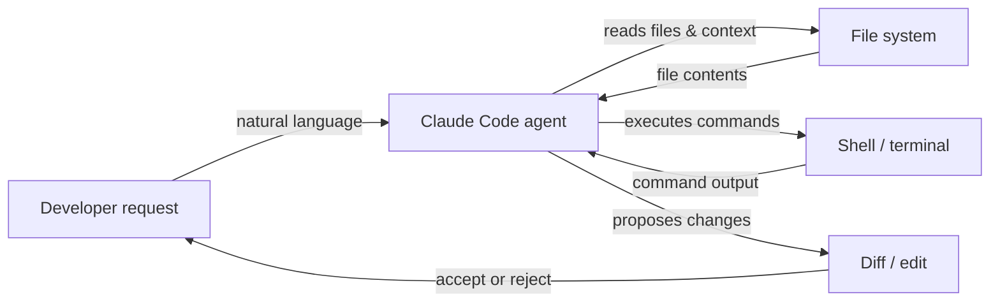

# Claude Code

## Definición

Claude Code es el agente de codificación con IA de Anthropic — una herramienta específica que lleva las capacidades de razonamiento de Claude directamente al flujo de trabajo del desarrollador. A diferencia de las herramientas de IA orientadas al chat, Claude Code está diseñado para **operación agente**: puede planificar y ejecutar de forma autónoma tareas de múltiples pasos, navegar por grandes bases de código, ejecutar comandos de shell, editar archivos, gestionar operaciones de git e iterar sobre su propio resultado sin orientación humana constante en cada paso.

Está disponible en múltiples entornos: como una **interfaz de línea de comandos (CLI)** que se ejecuta en cualquier terminal, como una extensión para los IDEs **VS Code** y **JetBrains** con edición en línea y diffs visuales, y a través de la **aplicación web** en claude.ai/code para sesiones basadas en navegador. Esta presencia en múltiples entornos significa que los desarrolladores pueden usar Claude Code donde ya trabajan, en lugar de cambiar a un editor específico de la herramienta.

El conjunto de capacidades principales cubre el ciclo de vida completo de la codificación: **generación de código** (scaffolding de nuevos archivos, escritura de funciones, generación de pruebas), **refactoring** (reestructuración del código existente preservando el comportamiento), **depuración** (diagnóstico de errores con contexto completo), **operaciones de git** (staging, commits, lectura de diffs, interpretación del historial) y **gestión de archivos** (lectura, escritura, búsqueda y organización de archivos de proyectos). Dado que Claude Code opera con acceso a todo el árbol del proyecto y una terminal, maneja de forma natural tareas que requieren comprensión entre archivos y uso secuencial de herramientas.

## Cómo funciona

### Instalación y autenticación

Claude Code se instala como un paquete npm (`npm install -g @anthropic-ai/claude-code`) y requiere una suscripción a Claude (Pro, Teams o Enterprise) o acceso a la API a través de Amazon Bedrock o Google Vertex AI. Después de ejecutar `claude` en una terminal, la autenticación se maneja a través de OAuth o una clave de API almacenada en la configuración local. La CLI lee el directorio del proyecto, localiza cualquier archivo de instrucciones `CLAUDE.md` e inicia una sesión interactiva donde el usuario escribe solicitudes en lenguaje natural.

### Bucle de ejecución de tareas agente

Cuando se le da una tarea, Claude Code sigue un bucle interno de planificar-actuar-observar. Primero lee los archivos relevantes para construir contexto, luego emite llamadas a herramientas (lecturas de archivos, comandos de shell, ediciones de código) en secuencia, observa cada resultado y ajusta su plan en consecuencia. Este bucle continúa de forma autónoma hasta que la tarea se completa o Claude determina que necesita aclaración. El agente mantiene el historial completo de conversación entre turnos, por lo que puede referirse a descubrimientos anteriores y evitar operaciones redundantes.

### Integraciones con IDEs

En VS Code y JetBrains, Claude Code aparece como un panel integrado con una interfaz de chat y vistas de diff en línea. Cuando Claude propone cambios de código, aparecen como diffs lado a lado que el desarrollador puede aceptar, rechazar o aplicar parcialmente. La extensión tiene acceso al mismo sistema de archivos y terminal que la CLI, por lo que las capacidades son equivalentes — la diferencia es ergonómica, no funcional. Los atajos de edición en línea (activados mediante atajo de teclado) permiten a los desarrolladores solicitar ediciones dirigidas sin cambiar a un panel de chat.

### Contexto y uso de herramientas

Claude Code usa un conjunto de herramientas integradas: `Read`, `Edit`, `Write`, `Bash`, `Glob` y `Grep`. Estas se mapean directamente a las acciones que tomaría un desarrollador al investigar y modificar una base de código. Cada llamada a herramienta es visible para el usuario en la sesión, haciendo rastreable el razonamiento del agente. El contexto de archivos se carga bajo demanda en lugar de precargarse, lo que ayuda a gestionar la ventana de contexto eficientemente. Las instrucciones a nivel de proyecto en archivos `CLAUDE.md` se inyectan automáticamente en el prompt del sistema para guiar el comportamiento.



## Cuándo usar / Cuándo NO usar

| Usar cuando | Evitar cuando |
|---|---|
| Necesitas un agente que ejecute tareas de múltiples pasos de forma autónoma (p. ej., "añadir paginación a todos los endpoints de lista") | Solo necesitas una única sugerencia de autocompletado — una herramienta en línea más simple es más rápida |
| Quieres explorar una base de código desconocida con preguntas en lenguaje natural | La base de código contiene secretos confidenciales que no deben ser leídos por una IA externa |
| Necesitas operaciones conscientes de git: resumir diffs, escribir mensajes de commit, revisar PRs | Tu proyecto requiere desarrollo offline o en entorno aislado sin acceso a la API |
| Quieres integración con IDE con diffs visuales y ediciones en línea | Prefieres IA completamente local/de código abierto sin dependencia en la nube |
| Ejecutas tareas desde la terminal y quieres asistencia de IA nativa de CLI | Necesitas seguimiento granular del costo por token en el nivel gratuito |

## Comparaciones

| Criterio | Claude Code | Cursor | GitHub Copilot |
|---|---|---|---|
| **Nivel de autonomía** | Alto — bucle agente completo con planificación y ejecución de múltiples pasos | Medio — editor con IA con modo agente, pero principalmente centrado en el editor | Bajo a medio — completados en línea y chat; Copilot Workspace añade planificación |
| **Soporte de IDE** | VS Code, JetBrains, más CLI independiente y web | Solo fork propietario de VS Code | VS Code, Visual Studio, JetBrains, Neovim y más |
| **Modelo de precios** | Incluido en la suscripción Claude Pro/Teams o pago por token vía API | Suscripción ($20/mes hobby, $40/mes pro); sin nivel gratuito más allá del trial | Gratuito para individuos; $10/mes Pro; niveles Teams y Enterprise |
| **Capacidades agente** | Nativas: ejecuta comandos de shell, edita archivos, usa git, itera de forma autónoma | En crecimiento: modo Agente disponible, ejecuta comandos de terminal | Limitadas: Copilot Workspace para planificación; el modo estándar es reactivo |
| **Manejo de contexto** | Carga de archivos basada en herramientas explícitas; soporta `CLAUDE.md` para instrucciones persistentes | Reglas de Cursor (`.cursorrules`) + indexación de base de código con embeddings | El contexto de Copilot proviene de archivos abiertos y código seleccionado; sin reglas persistentes de proyecto |

Ver también los artículos dedicados: [Cursor](/docs/tools/cursor) y [GitHub Copilot](/docs/tools/github-copilot).

## Ejemplos de código

```bash
# Install Claude Code globally
npm install -g @anthropic-ai/claude-code

# Start an interactive session in your project directory
cd ~/projects/my-app
claude

# --- Inside the Claude Code CLI session ---

# Ask a question about the codebase
> How is authentication handled in this project?

# Ask Claude to make a targeted change
> Add input validation to the POST /users endpoint in src/routes/users.ts

# Ask Claude to fix a bug with context
> The test in tests/auth.test.ts is failing with "Cannot read property 'id' of undefined". Fix it.

# Ask Claude to perform a cross-file refactor
> Rename the UserProfile component to ProfileCard across all files that import it

# Use git-aware operations
> Write a conventional commit message for the changes currently staged in git

# Run a slash command to clear conversation context
> /clear

# Run a multi-step agentic task
> Create a new Express route for GET /health that returns server uptime and version from package.json, add a unit test for it, and stage both files

# Exit the session
> /exit
```

## Recursos prácticos

- [Documentación de Claude Code — Anthropic](https://docs.anthropic.com/en/docs/claude-code) — Documentación oficial que cubre instalación, uso de la CLI, integraciones con IDEs y configuración.
- [Inicio rápido de Claude Code](https://docs.anthropic.com/en/docs/claude-code/quickstart) — Guía paso a paso para instalar, autenticar y ejecutar tu primera sesión.
- [Repositorio de GitHub de Claude Code](https://github.com/anthropics/claude-code) — Fuente, rastreador de problemas y notas de versión para la CLI y extensiones.
- [Página de producto de Claude Code de Anthropic](https://www.anthropic.com/claude-code) — Descripción general de alto nivel y ejemplos de casos de uso de Anthropic.
- [Repositorio de skills](https://github.com/EmersonBraun/skills) — Colección curada de skills de IA reutilizables para Claude Code y otros asistentes de codificación con IA

## Ver también

- [Configuración CLAUDE.md](/docs/claude-code/claude-md)
- [Skills de Claude Code](/docs/claude-code/skills)
- [Cursor](/docs/tools/cursor)
- [GitHub Copilot](/docs/tools/github-copilot)
