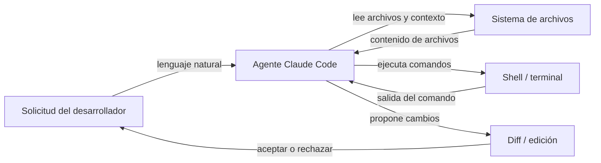

# Claude Code

## Definición

Claude Code es el agente de codificación con IA de Anthropic — una herramienta diseñada específicamente que lleva las capacidades de razonamiento de Claude directamente al flujo de trabajo del desarrollador. A diferencia de las herramientas de IA orientadas al chat, Claude Code está diseñado para la **operación agéntica**: puede planificar y ejecutar tareas de múltiples pasos de forma autónoma, navegar grandes bases de código, ejecutar comandos de shell, editar archivos, gestionar operaciones de git e iterar sobre su propia salida sin necesidad de guía humana constante en cada paso.

Está disponible en múltiples entornos: como una **interfaz de línea de comandos (CLI)** que se ejecuta en cualquier terminal, como extensión para los IDEs **VS Code** y **JetBrains** con edición en línea y diffs visuales, y a través de la **aplicación web** en claude.ai/code para sesiones basadas en el navegador. Esta presencia en múltiples entornos significa que los desarrolladores pueden usar Claude Code dondequiera que ya trabajen, en lugar de cambiar a un editor específico de la herramienta.

El conjunto de capacidades principales cubre el ciclo de vida completo de codificación: **generación de código** (andamiaje de nuevos archivos, escritura de funciones, generación de pruebas), **refactorización** (reestructuración del código existente preservando el comportamiento), **depuración** (diagnóstico de errores con contexto completo), **operaciones de git** (staging, commits, lectura de diffs, interpretación del historial) y **gestión de archivos** (lectura, escritura, búsqueda y organización de archivos del proyecto). Dado que Claude Code opera con acceso a todo el árbol del proyecto y un terminal, maneja de forma natural tareas que requieren comprensión entre archivos y uso secuencial de herramientas.

## Cómo funciona

### Instalación y autenticación

Claude Code se instala como paquete npm (`npm install -g @anthropic-ai/claude-code`) y requiere una suscripción a Claude (Pro, Teams o Enterprise) o acceso a la API a través de Amazon Bedrock o Google Vertex AI. Después de ejecutar `claude` en un terminal, la autenticación se gestiona mediante OAuth o una clave API almacenada en la configuración local. La CLI lee el directorio del proyecto, localiza cualquier archivo de instrucciones `CLAUDE.md` y entra en una sesión interactiva donde el usuario escribe solicitudes en lenguaje natural.

### Bucle de ejecución de tareas agénticas

Cuando se le asigna una tarea, Claude Code sigue un bucle interno de planificar-actuar-observar. Primero lee los archivos relevantes para construir contexto, luego emite llamadas a herramientas (lecturas de archivos, comandos de shell, ediciones de código) en secuencia, observa cada resultado y ajusta su plan en consecuencia. Este bucle continúa de forma autónoma hasta que la tarea esté completa o Claude determine que necesita aclaración. El agente mantiene el historial completo de la conversación entre turnos, por lo que puede hacer referencia a descubrimientos anteriores y evitar operaciones redundantes.

### Integraciones con IDEs

En VS Code y JetBrains, Claude Code aparece como un panel integrado con una interfaz de chat y vistas de diff en línea. Cuando Claude propone cambios de código, aparecen como diffs lado a lado que el desarrollador puede aceptar, rechazar o aplicar parcialmente. La extensión tiene acceso al mismo sistema de archivos y terminal que la CLI, por lo que las capacidades son equivalentes — la diferencia es ergonómica, no funcional. Los atajos de edición en línea (activados por atajo de teclado) permiten a los desarrolladores solicitar ediciones específicas sin cambiar a un panel de chat.

### Contexto y uso de herramientas

Claude Code usa un conjunto de herramientas integradas: `Read`, `Edit`, `Write`, `Bash`, `Glob` y `Grep`. Estas se corresponden directamente con las acciones que un desarrollador realizaría al investigar y modificar una base de código. Cada llamada a herramienta es visible para el usuario en la sesión, lo que hace que el razonamiento del agente sea rastreable. El contexto de archivos se carga bajo demanda en lugar de precargarse, lo que ayuda a gestionar la ventana de contexto de manera eficiente. Las instrucciones a nivel de proyecto en archivos `CLAUDE.md` se inyectan automáticamente en el prompt del sistema para guiar el comportamiento.



## Cuándo usar / Cuándo NO usar

| Usar cuando | Evitar cuando |
|---|---|
| Necesitas un agente que ejecute tareas de múltiples pasos de forma autónoma (p. ej., "añadir paginación a todos los endpoints de lista") | Solo necesitas una única sugerencia de autocompletar — una herramienta en línea más simple es más rápida |
| Quieres explorar una base de código desconocida con preguntas en lenguaje natural | La base de código contiene secretos sensibles que nunca deben ser leídos por una IA externa |
| Necesitas operaciones con conocimiento de git: resumir diffs, escribir mensajes de commit, revisar PRs | Tu proyecto requiere desarrollo offline o air-gapped sin acceso a la API |
| Quieres integración con el IDE con diffs visuales y ediciones en línea | Prefieres IA completamente local/de código abierto sin dependencia de la nube |
| Estás ejecutando tareas desde el terminal y quieres asistencia de IA nativa de CLI | Necesitas seguimiento detallado del costo por token en el nivel gratuito |

## Comparaciones

| Criterio | Claude Code | Cursor | GitHub Copilot |
|---|---|---|---|
| **Nivel de autonomía** | Alto — bucle agéntico completo con planificación y ejecución de múltiples pasos | Medio — editor impulsado por IA con modo agente, pero principalmente centrado en el editor | Bajo a medio — completados en línea y chat; Copilot Workspace añade planificación |
| **Soporte de IDE** | VS Code, JetBrains, más CLI independiente y web | Fork propietario de VS Code únicamente | VS Code, Visual Studio, JetBrains, Neovim y más |
| **Modelo de precios** | Incluido en la suscripción Claude Pro/Teams o pago por token a través de API | Suscripción ($20/mes hobby, $40/mes pro); sin nivel gratuito más allá del período de prueba | Gratuito para individuos; $10/mes Pro; niveles Teams y Enterprise |
| **Capacidades agénticas** | Nativo: ejecuta comandos de shell, edita archivos, usa git, itera de forma autónoma | Creciendo: modo agente disponible, ejecuta comandos de terminal | Limitado: Copilot Workspace para planificación; el modo estándar es reactivo |
| **Manejo del contexto** | Carga de archivos explícita basada en herramientas; soporta `CLAUDE.md` para instrucciones persistentes | Cursor Rules (`.cursorrules`) + indexación de código base con embeddings | El contexto de Copilot proviene de archivos abiertos y código seleccionado; sin reglas de proyecto persistentes |

Ver también los artículos dedicados: [Cursor](/docs/tools/cursor) y [GitHub Copilot](/docs/tools/github-copilot).

## Ejemplos de código

```bash
# Instalar Claude Code globalmente
npm install -g @anthropic-ai/claude-code

# Iniciar una sesión interactiva en el directorio de tu proyecto
cd ~/projects/my-app
claude

# --- Dentro de la sesión CLI de Claude Code ---

# Hacer una pregunta sobre la base de código
> How is authentication handled in this project?

# Pedir a Claude que realice un cambio específico
> Add input validation to the POST /users endpoint in src/routes/users.ts

# Pedir a Claude que corrija un error con contexto
> The test in tests/auth.test.ts is failing with "Cannot read property 'id' of undefined". Fix it.

# Pedir a Claude que realice una refactorización entre archivos
> Rename the UserProfile component to ProfileCard across all files that import it

# Usar operaciones con conocimiento de git
> Write a conventional commit message for the changes currently staged in git

# Ejecutar un comando slash para limpiar el contexto de la conversación
> /clear

# Ejecutar una tarea agéntica de múltiples pasos
> Create a new Express route for GET /health that returns server uptime and version from package.json, add a unit test for it, and stage both files

# Salir de la sesión
> /exit
```

## Recursos prácticos

- [Documentación de Claude Code — Anthropic](https://docs.anthropic.com/en/docs/claude-code) — Documentación oficial sobre instalación, uso de CLI, integraciones con IDEs y configuración.
- [Inicio rápido de Claude Code](https://docs.anthropic.com/en/docs/claude-code/quickstart) — Guía paso a paso para instalar, autenticar y ejecutar tu primera sesión.
- [Repositorio GitHub de Claude Code](https://github.com/anthropics/claude-code) — Fuente, rastreador de problemas y notas de versión para la CLI y las extensiones.
- [Página de producto Anthropic Claude Code](https://www.anthropic.com/claude-code) — Descripción general de alto nivel y ejemplos de casos de uso de Anthropic.
- [Repositorio de Skills](https://github.com/EmersonBraun/skills) — Colección curada de skills de IA reutilizables para Claude Code y otros asistentes de codificación con IA

## Ver también

- [Configuración de CLAUDE.md](/docs/claude-code/claude-md)
- [Skills de Claude Code](/docs/claude-code/skills)
- [Cursor](/docs/tools/cursor)
- [GitHub Copilot](/docs/tools/github-copilot)
