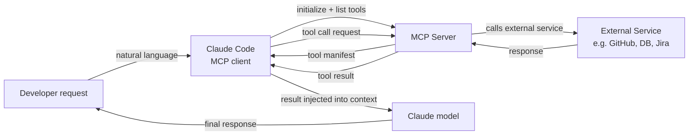

# Plugins e integraciones MCP

## Definición

El Model Context Protocol (MCP) es un estándar abierto desarrollado por Anthropic que define cómo los modelos de IA se comunican con fuentes de datos y herramientas externas. En el contexto de Claude Code, los servidores MCP son plugins que extienden el conjunto de herramientas disponibles para Claude más allá de sus capacidades integradas (acceso al sistema de archivos, comandos de shell, git). Con MCP, Claude puede consultar bases de datos, llamar APIs externas, navegar por la web, leer tickets de Jira, consultar paneles de Grafana, interactuar con GitHub y hacer cualquier otra cosa que implemente un servidor MCP — todo a través de la misma interfaz de lenguaje natural que las herramientas integradas.

MCP sigue una arquitectura cliente-servidor. Claude Code actúa como un **cliente MCP**: descubre servidores MCP disponibles desde la configuración, se conecta a ellos al inicio de la sesión y los consulta para obtener la lista de herramientas que exponen. Cada servidor MCP expone un conjunto de **herramientas** (funciones con definiciones de entrada JSON Schema, idénticas en estructura a las herramientas integradas), **recursos** opcionales (fuentes de datos de solo lectura como documentación o esquemas de bases de datos) y **prompts** opcionales (plantillas de prompts reutilizables). Cuando Claude decide llamar a una herramienta MCP, Claude Code enruta la llamada al servidor apropiado, ejecuta la operación y devuelve el resultado al modelo como resultado de herramienta.

El beneficio clave de MCP sobre las integraciones de herramientas ad hoc es la estandarización. Antes de MCP, cada asistente de IA tenía su propio formato de plugin propietario. MCP define un protocolo universal para que un servidor MCP escrito una vez pueda funcionar con cualquier cliente compatible con MCP — Claude Code, Claude Desktop o cualquier otro cliente MCP. Esto significa que el ecosistema de integraciones disponibles está creciendo rápidamente, y construir una nueva integración no requiere entender los aspectos internos específicos de Claude.

## Cómo funciona

### Tipos de servidores MCP y transportes

Los servidores MCP vienen en dos variedades de transporte. Los **servidores stdio** se ejecutan como subprocesos locales: Claude Code genera el proceso del servidor al inicio de la sesión y se comunica a través de stdin/stdout usando JSON-RPC. Los servidores stdio son el tipo más común para herramientas locales (clientes de bases de datos, procesadores de archivos, análisis de código especializado). Los **servidores SSE (Server-Sent Events)** se ejecutan como servidores HTTP persistentes y se comunican a través de una conexión de red. Los servidores SSE son mejores para servicios remotos, infraestructura de equipo compartida o servidores que necesitan mantener estado a través de múltiples conexiones de clientes.

### Configuración y descubrimiento

Los servidores MCP se configuran en el archivo de configuración de Claude Code, típicamente en `~/.claude/settings.json` para configuración global o `.claude/settings.json` para servidores específicos del proyecto. Cada entrada de servidor especifica un nombre, tipo de transporte y el comando (para stdio) o URL (para SSE) necesario para iniciar o conectarse al servidor. Claude Code lee esta configuración al inicio de la sesión, inicializa conexiones a todos los servidores configurados y obtiene sus manifiestos de herramientas. Las herramientas de todos los servidores MCP conectados aparecen en la lista de herramientas del modelo junto a las herramientas integradas — desde la perspectiva del modelo, no hay diferencia.

### Flujo de invocación de herramientas

Cuando Claude decide llamar a una herramienta MCP, Claude Code actúa como intermediario: serializa los argumentos de la llamada a herramienta a JSON, envía una solicitud `tools/call` al servidor MCP a través del transporte configurado, espera la respuesta, deserializa el resultado y lo devuelve al modelo como un bloque `tool_result`. Toda la ida y vuelta es transparente para el modelo — simplemente ve un resultado de herramienta, igual que una llamada a herramienta integrada. Los servidores MCP pueden devolver texto, imágenes o datos estructurados, todo lo cual Claude Code reenvía al modelo apropiadamente.

### Autenticación y seguridad

Los servidores MCP manejan su propia autenticación. Un servidor MCP de GitHub, por ejemplo, lee un token de acceso personal de GitHub de una variable de entorno configurada en el campo `env` de la entrada del servidor. Claude Code pasa el entorno configurado al subproceso pero no gestiona secretos por sí mismo — es responsabilidad del servidor MCP autenticarse con los servicios externos. Debido a que los servidores MCP ejecutan código con los permisos del usuario local, se debe tener cuidado al usar servidores MCP de terceros: revisa el código del servidor o confía en el publicador antes de agregarlo a tu configuración.



## Cuándo usar / Cuándo NO usar

| Usar cuando | Evitar cuando |
|---|---|
| Necesitas que Claude interactúe con un servicio externo (GitHub, Jira, Slack, bases de datos) | La tarea puede realizarse con herramientas integradas (sistema de archivos, shell) — no hay necesidad de agregar complejidad |
| Tu equipo comparte un conjunto común de herramientas y quieres una capa de integración estandarizada | Estás en un entorno sensible a la seguridad donde el acceso a herramientas externas debe estar estrictamente controlado |
| Quieres dar a Claude acceso a fuentes de datos privadas (APIs internas, bases de datos propietarias) | Necesitas una integración puntual rápida — un script de shell llamado a través de la herramienta Bash es más simple |
| Estás construyendo una herramienta reutilizable que debería funcionar con múltiples clientes de IA | El servidor MCP que quieres usar proviene de una fuente no confiable — revisa su código primero |
| Quieres que Claude tenga acceso en vivo al estado del sistema (métricas, registros, seguimiento de errores) | El servicio externo tiene límites de tasa que podrían superarse por las llamadas autónomas de herramientas de Claude |

## Ejemplos de código

```json
// ~/.claude/settings.json — MCP server configuration
{
  "mcpServers": {
    // GitHub MCP server — gives Claude access to repos, issues, PRs
    "github": {
      "command": "npx",
      "args": ["-y", "@modelcontextprotocol/server-github"],
      "env": {
        "GITHUB_PERSONAL_ACCESS_TOKEN": "${GITHUB_TOKEN}"
      }
    },

    // PostgreSQL MCP server — gives Claude read access to your database schema and query capability
    "postgres": {
      "command": "npx",
      "args": ["-y", "@modelcontextprotocol/server-postgres", "postgresql://localhost/mydb"],
      "env": {
        "PGPASSWORD": "${DB_PASSWORD}"
      }
    },

    // Filesystem MCP server (extended) — gives Claude access to directories beyond the project root
    "filesystem": {
      "command": "npx",
      "args": [
        "-y",
        "@modelcontextprotocol/server-filesystem",
        "/Users/me/projects",
        "/Users/me/documents/specs"
      ]
    },

    // Custom internal MCP server (stdio, local binary)
    "internal-tools": {
      "command": "/usr/local/bin/my-mcp-server",
      "args": ["--config", "/etc/my-mcp/config.json"],
      "env": {
        "INTERNAL_API_KEY": "${INTERNAL_API_KEY}"
      }
    },

    // Remote SSE server — shared team infrastructure
    "team-server": {
      "url": "https://mcp.internal.mycompany.com/sse",
      "headers": {
        "Authorization": "Bearer ${TEAM_MCP_TOKEN}"
      }
    }
  }
}
```

```typescript
// Custom MCP server — TypeScript implementation using the official MCP SDK
// This example creates an MCP server that wraps an internal metrics API

import { McpServer } from "@modelcontextprotocol/sdk/server/mcp.js";
import { StdioServerTransport } from "@modelcontextprotocol/sdk/server/stdio.js";
import { z } from "zod";

// Initialize the MCP server with a name and version
const server = new McpServer({
  name: "metrics-server",
  version: "1.0.0",
});

// Define a tool: get_error_rate
// The description is critical — Claude uses it to decide when to call this tool
server.tool(
  "get_error_rate",
  "Get the error rate for a service over a specified time window. Use this when the user asks about errors, reliability, or service health.",
  {
    // Zod schema — the SDK converts this to JSON Schema automatically
    service: z.string().describe("The service name, e.g. 'api', 'frontend', 'worker'"),
    window: z
      .enum(["1h", "6h", "24h", "7d"])
      .describe("Time window for the metric. Defaults to 1h."),
  },
  async ({ service, window }) => {
    // In production, this would call your metrics API (Prometheus, Datadog, etc.)
    const response = await fetch(
      `https://metrics.internal.mycompany.com/api/error-rate?service=${service}&window=${window}`,
      { headers: { Authorization: `Bearer ${process.env.METRICS_API_KEY}` } }
    );

    if (!response.ok) {
      return {
        content: [{ type: "text", text: `Error fetching metrics: ${response.statusText}` }],
        isError: true,
      };
    }

    const data = await response.json();
    return {
      content: [
        {
          type: "text",
          text: JSON.stringify({
            service,
            window,
            error_rate: data.errorRate,
            total_requests: data.totalRequests,
            error_count: data.errorCount,
            timestamp: new Date().toISOString(),
          }, null, 2),
        },
      ],
    };
  }
);

// Define a tool: list_services
server.tool(
  "list_services",
  "List all services that have metrics available for monitoring.",
  {},
  async () => {
    const response = await fetch("https://metrics.internal.mycompany.com/api/services", {
      headers: { Authorization: `Bearer ${process.env.METRICS_API_KEY}` },
    });
    const services = await response.json();
    return {
      content: [{ type: "text", text: JSON.stringify(services, null, 2) }],
    };
  }
);

// Start the server with stdio transport (for local subprocess use)
const transport = new StdioServerTransport();
await server.connect(transport);
```

```bash
# Install the MCP SDK for building custom servers
npm install @modelcontextprotocol/sdk zod

# Compile and run the custom server locally for testing
npx ts-node metrics-server.ts

# Add the custom server to your Claude Code configuration
cat >> ~/.claude/settings.json << 'EOF'
# (add to the mcpServers object in your existing settings.json)
"metrics": {
  "command": "node",
  "args": ["/path/to/metrics-server.js"],
  "env": {
    "METRICS_API_KEY": "your-api-key-here"
  }
}
EOF

# Inside a Claude Code session, use the MCP tools naturally:
claude
> What is the current error rate for the api service?
> List all services and show me the error rates for any that exceed 1% in the last hour
> Compare error rates across all services for the past 24 hours
```

## Recursos prácticos

- [Documentación MCP — Anthropic](https://docs.anthropic.com/en/docs/mcp) — Especificación oficial de MCP, descripción general del protocolo y arquitectura cliente/servidor.
- [SDK de TypeScript de MCP](https://github.com/modelcontextprotocol/typescript-sdk) — SDK oficial para construir servidores y clientes MCP en TypeScript/JavaScript.
- [Repositorio de servidores MCP](https://github.com/modelcontextprotocol/servers) — Colección oficial de servidores MCP de referencia: sistema de archivos, GitHub, PostgreSQL, Google Drive, Slack y más.
- [Guía de integración MCP de Claude Code](https://docs.anthropic.com/en/docs/claude-code/mcp) — Guía específica de Claude Code para configurar y usar servidores MCP en sesiones.
- [Especificación MCP](https://spec.modelcontextprotocol.io) — Especificación completa del protocolo para implementar clientes o servidores personalizados.

## Ver también

- [Descripción general de Claude Code](/docs/claude-code)
- [Skills de Claude Code](/docs/claude-code/skills)
- [Uso de herramientas de Anthropic](/docs/agents/anthropic-tool-use)
