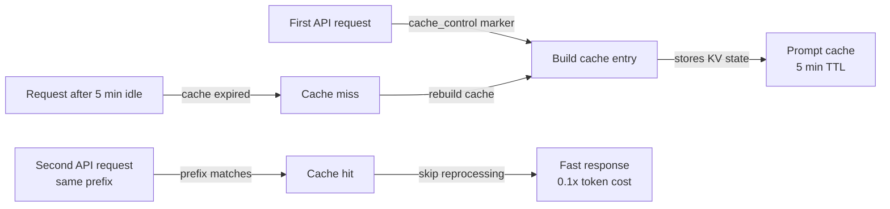

# Caché de prompts

## Definición

El caché de prompts es una característica de la API de Claude que permite que las porciones repetidas de un prompt — el prompt del sistema, definiciones de herramientas, contexto de documentos, o largos prefijos de conversación — sean procesadas una vez y reutilizadas en múltiples llamadas a la API posteriores. En lugar de reprocesar secuencias de tokens idénticas en cada solicitud, el modelo las lee desde un caché, lo que reduce la latencia y disminuye el costo de los tokens en caché. En Claude Code, el caché de prompts opera automáticamente en segundo plano para hacer que las sesiones largas y el uso repetido de herramientas sean más rápidos y económicos.

La idea central detrás del caché de prompts es que la mayor parte de lo que cambia entre llamadas a la API en una sesión de codificación es pequeño: un nuevo mensaje de usuario, un nuevo resultado de herramienta, o un archivo actualizado. Las partes grandes y estables — el prompt del sistema que contiene instrucciones del proyecto, las definiciones de todas las herramientas disponibles, y el historial de conversación acumulado — permanecen sin cambios durante la mayoría de los turnos. Procesar estas partes estables de forma redundante en cada solicitud es un desperdicio. El caché de prompts elimina ese desperdicio almacenando los estados clave-valor procesados y reutilizándolos cuando el prefijo del prompt coincide.

Desde la perspectiva de un desarrollador, el caché de prompts es en gran medida transparente en las sesiones de Claude Code — ocurre automáticamente sin configuración. Entenderlo importa más cuando se construye directamente sobre la API de Claude, se diseñan bucles de agentes de larga duración, o se solucionan problemas de alta latencia o costos inesperados. En esos contextos, saber cómo estructurar los prompts para una utilización óptima del caché puede generar ahorros sustanciales: los tokens de entrada en caché se facturan a una fracción del costo de los tokens de entrada regulares, y los aciertos del caché eliminan por completo la latencia de procesamiento de las partes en caché.

## Cómo funciona

### Marcadores de control de caché

El caché de prompts usa anotaciones explícitas `cache_control` para marcar dónde en el prompt se debe crear un punto de control de caché. Cuando la API procesa una solicitud con control de caché `{"type": "ephemeral"}` en un bloque de contenido, almacena el estado procesado de todos los tokens hasta e incluyendo ese bloque. En solicitudes posteriores con el mismo prefijo, la API detecta el acierto del caché y omite reprocesar esos tokens. Un prompt puede tener hasta cuatro puntos de control de caché activos simultáneamente, lo que permite a los desarrolladores cachear el prompt del sistema por separado de las definiciones de herramientas y del historial de conversación.

### Vida útil del caché e invalidación

El caché efímero tiene un tiempo de vida de aproximadamente cinco minutos de inactividad. Si ninguna llamada a la API hace referencia a un prefijo en caché dentro de esa ventana, la entrada del caché se elimina y debe reconstruirse en la siguiente solicitud. Esto significa que el caché de prompts es más efectivo para casos de uso de alta frecuencia: sesiones de codificación interactivas donde las solicitudes llegan cada pocos segundos, bucles de agentes que ejecutan muchas llamadas de herramientas en rápida sucesión, o canalizaciones de procesamiento por lotes que procesan muchos documentos con un prompt del sistema compartido. Para flujos de trabajo de baja frecuencia donde pasan minutos entre solicitudes, el caché puede expirar y no proporcionar ningún beneficio.

### Qué cachear

Los mejores candidatos para el almacenamiento en caché son el contenido que es grande, estable y reutilizado con frecuencia. El prompt del sistema es el candidato más obvio: en Claude Code contiene instrucciones del proyecto de CLAUDE.md, definiciones de herramientas y pautas de comportamiento — a menudo miles de tokens que son idénticos en cada turno. Las definiciones de herramientas (esquemas JSON para todas las herramientas disponibles) son otro candidato sólido. En flujos de trabajo de RAG o con muchos documentos, los grandes documentos de referencia cargados al inicio de una sesión pueden cachearse para que las preguntas posteriores sobre esos documentos incurran solo en el costo marginal de la nueva pregunta, no en el costo de releer los documentos.

### Detección de aciertos del caché e informes de uso

La respuesta de la API incluye un objeto `usage` que distingue entre tokens de entrada regulares, tokens de creación de caché y tokens de lectura de caché. Los tokens de creación de caché se cobran al 1,25x de la tarifa base (el costo único de escribir en el caché). Los tokens de lectura de caché se cobran al 0,1x de la tarifa base — un descuento del 90% versus los tokens de entrada regulares. Monitorear estos campos permite a los desarrolladores medir la efectividad real del caché: la proporción de tokens de lectura de caché respecto al total de tokens de entrada indica cuánto del prompt se está sirviendo desde el caché.



## Cuándo usar / Cuándo NO usar

| Usar cuando | Evitar cuando |
|---|---|
| Tu prompt del sistema es grande (>1.000 tokens) y constante en muchas solicitudes | Tus prompts cambian significativamente en cada solicitud — no hay prefijo estable para cachear |
| Estás ejecutando un bucle de agente con muchas llamadas de herramientas secuenciales en una sola sesión | Las solicitudes son poco frecuentes (>5 min entre turnos) — el caché expira antes de poder reutilizarse |
| Cargas grandes documentos de referencia (especificaciones, bases de código) al inicio de la sesión | Tu caso de uso son solicitudes únicas sin contexto repetido |
| Quieres reducir la latencia en la primera respuesta visible para el usuario en una sesión interactiva | Estás probando o depurando y quieres recuentos deterministas de tokens por solicitud |
| Estás optimizando costos en un sistema de producción con alto volumen de llamadas a la API | La sobrecarga de estructurar marcadores cache_control supera los ahorros con bajo volumen |

## Ejemplos de código

```python
import anthropic

client = anthropic.Anthropic()

# Example: caching a large system prompt and tool definitions
# The system prompt is the same on every request — mark it for caching

SYSTEM_PROMPT = """
You are a senior software engineer working on a large TypeScript monorepo.
The project uses React on the frontend, Node.js/Express on the backend, and PostgreSQL.
[... imagine 2000+ tokens of detailed project instructions here ...]
""" * 10  # simulating a large system prompt

# Tool definitions for the coding agent — stable across all requests
TOOLS = [
    {
        "name": "read_file",
        "description": "Read a file from the project directory",
        "input_schema": {
            "type": "object",
            "properties": {
                "path": {"type": "string", "description": "Relative file path"}
            },
            "required": ["path"]
        }
    },
    {
        "name": "write_file",
        "description": "Write content to a file",
        "input_schema": {
            "type": "object",
            "properties": {
                "path": {"type": "string"},
                "content": {"type": "string"}
            },
            "required": ["path", "content"]
        }
    },
    # ... more tools
]

def make_request(messages: list, turn_number: int) -> dict:
    """
    Make a Claude API request with prompt caching enabled.
    The system prompt and tools are marked with cache_control so they are
    processed once and reused on subsequent calls in the same session.
    """
    response = client.messages.create(
        model="claude-opus-4-5",
        max_tokens=4096,
        # Mark the system prompt for caching with cache_control
        system=[
            {
                "type": "text",
                "text": SYSTEM_PROMPT,
                # This tells the API to cache everything up to this point
                "cache_control": {"type": "ephemeral"}
            }
        ],
        # Mark tool definitions for caching too
        tools=[
            {**tool, "cache_control": {"type": "ephemeral"}} if i == len(TOOLS) - 1 else tool
            for i, tool in enumerate(TOOLS)
        ],
        messages=messages
    )

    # Inspect cache usage in the response
    usage = response.usage
    print(f"Turn {turn_number} token usage:")
    print(f"  Input tokens:        {usage.input_tokens:>8}")
    print(f"  Cache creation:      {usage.cache_creation_input_tokens:>8}  (1.25x cost)")
    print(f"  Cache read:          {usage.cache_read_input_tokens:>8}  (0.1x cost)")
    print(f"  Output tokens:       {usage.output_tokens:>8}")

    # Calculate effective cost savings
    if usage.cache_read_input_tokens > 0:
        savings_pct = (usage.cache_read_input_tokens / usage.input_tokens) * 100 * 0.9
        print(f"  Estimated savings:   {savings_pct:.1f}% on input tokens this turn")

    return response

# Simulate a multi-turn coding session
messages = []

# Turn 1 — cold start, cache is built
messages.append({"role": "user", "content": "What files exist in the src/ directory?"})
response1 = make_request(messages, turn_number=1)
# Output: cache_creation_input_tokens > 0, cache_read_input_tokens = 0
messages.append({"role": "assistant", "content": response1.content})

# Turn 2 — system prompt and tools are now cached
messages.append({"role": "user", "content": "Read the main entry point file"})
response2 = make_request(messages, turn_number=2)
# Output: cache_read_input_tokens > 0, significant cost savings

# Turn 3 — still cache-hitting on system prompt + tools
messages.append({"role": "user", "content": "Explain how the authentication middleware works"})
response3 = make_request(messages, turn_number=3)
# Output: continued cache hits, growing cache_read_input_tokens
```

```bash
# Observing prompt caching in Claude Code sessions
# Claude Code automatically applies caching — use verbose mode to see token counts

# Start a session with verbose output to inspect token usage
claude --verbose

# Inside the session, run several requests in sequence
> List all TypeScript files in src/
> Read src/index.ts
> Explain the main function

# With --verbose, Claude Code prints token usage per turn including cache statistics
# You'll see cache_creation_input_tokens spike on turn 1, then
# cache_read_input_tokens grow on subsequent turns
```

## Recursos prácticos

- [Documentación de caché de prompts — Anthropic](https://docs.anthropic.com/en/docs/build-with-claude/prompt-caching) — Referencia oficial completa: formato de control de caché, precios de tokens, TTL y modelos compatibles.
- [Cookbook de caché de prompts](https://github.com/anthropics/anthropic-cookbook/blob/main/misc/prompt_caching.ipynb) — Jupyter notebook con ejemplos funcionales incluyendo cálculo de costos y medición de aciertos del caché.
- [Precios de la API de Claude](https://www.anthropic.com/pricing) — Tarifas actuales de tokens para entrada, creación de caché y lectura de caché en todos los modelos.
- [Monitoreo de uso de Anthropic](https://console.anthropic.com/usage) — Panel de la consola para inspeccionar desgloses de uso de tokens por clave de API.

## Ver también

- [Descripción general de Claude Code](/docs/claude-code)
- [Gestión de contexto](/docs/claude-code/context-management)
- [Modos de pensamiento y esfuerzo](/docs/claude-code/thinking-modes)
