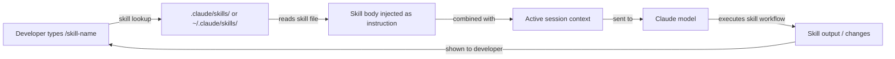

# Skills de Claude Code

## Definición

Las skills son archivos de prompts reutilizables e invocables que extienden el comportamiento de Claude Code más allá de sus valores predeterminados. Una skill es un archivo Markdown con frontmatter YAML que define un comando nombrado: cuando un desarrollador escribe `/nombre-skill` dentro de una sesión de Claude Code, el contenido de la skill se inyecta como instrucción — convirtiendo efectivamente un flujo de trabajo común, complejo o específico del equipo en un solo comando slash.

El modelo mental es similar a los alias de shell o los objetivos de Makefile, pero para flujos de trabajo asistidos por IA. En lugar de repetir un prompt largo y cuidadosamente elaborado cada vez que quieres que Claude siga un proceso específico (checklist de revisión de código, generación de notas de lanzamiento, documentación de arquitectura, auditoría de seguridad), lo escribes una vez como skill, lo confirmas en el repositorio y lo invocas con un comando corto. Las skills se controlan por versiones, son compartibles y son componibles con las instrucciones de CLAUDE.md.

Las skills difieren de las instrucciones de CLAUDE.md de una manera importante: CLAUDE.md siempre está activo y se aplica a cada interacción, mientras que las skills son opt-in e invocadas explícitamente. Esto hace que las skills sean apropiadas para flujos de trabajo pesados o específicos del contexto que no deben ejecutarse en cada solicitud, mientras que CLAUDE.md es mejor para convenciones y restricciones ligeras que siempre deben estar en efecto.

## Cómo funciona

### Formato de archivo de skill

Un archivo de skill es un archivo `.md` con frontmatter YAML. El frontmatter debe incluir al menos un campo `description` que le diga a Claude qué hace la skill. El cuerpo del archivo es el prompt que se inyectará cuando se invoque la skill. El nombre del archivo (sin `.md`) se convierte en el nombre del comando slash: un archivo llamado `code-review.md` se invoca como `/code-review`. Los nombres de skill pueden contener guiones pero no espacios.

### Directorios de skills

Claude Code busca skills en dos ubicaciones. Las **skills de proyecto** viven en `.claude/skills/` relativo a la raíz del proyecto y están disponibles solo cuando se trabaja en ese proyecto. Las **skills globales** viven en `~/.claude/skills/` y están disponibles en cada sesión de Claude Code. Las skills de proyecto tienen precedencia sobre las skills globales con el mismo nombre, lo que permite a los equipos sobreescribir skills personales con versiones específicas del proyecto. También puedes apuntar a Claude Code a un directorio de skills personalizado a través de la configuración.

### Invocación de skills

Dentro de una sesión de Claude Code, escribir `/nombre-skill` activa la skill. Claude Code encuentra el archivo de skill correspondiente, lee su cuerpo e inyecta el contenido como instrucción de usuario en ese punto de la conversación. La skill puede hacer referencia al contexto que ya existe en la sesión (archivos leídos anteriormente, salidas de herramientas anteriores) y puede emitir sus propias llamadas a herramientas (leer archivos, ejecutar comandos) para reunir información adicional antes de producir la salida. Las skills pueden aceptar argumentos en línea después del nombre del comando: `/generate-test src/utils/format.ts` pasa la ruta del archivo como contexto.

### Composición de skills con CLAUDE.md

Las skills y CLAUDE.md trabajan juntas. CLAUDE.md establece la línea base del proyecto (convenciones, patrones prohibidos, stack tecnológico), y las skills proporcionan flujos de trabajo invocables sobre esa línea base. Una skill `code-review`, por ejemplo, puede instruir a Claude a "verificar que todos los cambios cumplan con las convenciones en CLAUDE.md" — no necesita repetir esas convenciones porque ya están en el prompt del sistema. Esta separación de responsabilidades mantiene cada archivo enfocado y evita la duplicación.



## Cuándo usar / Cuándo NO usar

| Usar cuando | Evitar cuando |
|---|---|
| Tienes un flujo de trabajo de múltiples pasos que repites regularmente (p. ej., escribir changelogs, ejecutar un checklist de revisión) | La tarea es verdaderamente única y no se repetirá — simplemente escribe el prompt directamente |
| Quieres estandarizar un proceso complejo en un equipo (p. ej., revisión de seguridad, formato de resumen de PR) | Las instrucciones pertenecen a CLAUDE.md porque se aplican a cada sesión, no solo bajo demanda |
| El flujo de trabajo depende del contexto y se beneficia de aceptar argumentos (p. ej., `/document src/api/users.ts`) | La skill duplicaría documentación que ya existe en CLAUDE.md |
| Quieres compartir las mejores prácticas de prompting entre proyectos a través de tu directorio de skills global | El flujo de trabajo requiere integraciones de herramientas externas más allá de lo que soportan las herramientas integradas de Claude |
| Estás construyendo una biblioteca de skills para tu equipo y quieres archivos de prompt controlados por versiones y revisables | Necesitas activar skills automáticamente — las skills se invocan manualmente, no son impulsadas por eventos |

## Ejemplos de código

```markdown
<!-- File: .claude/skills/code-review.md -->
---
description: Perform a thorough code review on staged or recently changed files. Checks correctness, security, performance, test coverage, and project conventions.
---

You are conducting a code review. Follow these steps:

1. **Identify changed files**: Run `git diff --name-only HEAD` to list recently changed files.
   If there are staged changes, also run `git diff --cached --name-only`.

2. **Read each changed file** and the corresponding test file if it exists.

3. **Review for the following categories** (report findings under each heading):

   ### Correctness
   - Are there logic errors, off-by-one errors, or unhandled edge cases?
   - Does the code handle null/undefined inputs safely?

   ### Security
   - Is any user input used in SQL queries without parameterization? Flag immediately.
   - Are secrets or credentials hardcoded? Flag immediately.
   - Is authentication/authorization enforced on all new API routes?

   ### Performance
   - Are there N+1 query patterns in database access code?
   - Are expensive operations inside loops that could be moved outside?

   ### Test coverage
   - Do the tests cover the happy path, error paths, and edge cases?
   - Are there any new code paths with zero test coverage?

   ### Conventions
   - Does the code follow the project conventions in CLAUDE.md?
   - Are imports organized correctly? Are there unused imports?

4. **Summarize**: Provide an overall verdict (Approve / Request Changes / Needs Discussion)
   and a prioritized list of action items.
```

```markdown
<!-- File: .claude/skills/generate-changelog.md -->
---
description: Generate a changelog entry for changes since the last git tag. Follows Keep a Changelog format.
---

Generate a changelog entry for inclusion in CHANGELOG.md.

1. Run `git describe --tags --abbrev=0` to find the most recent tag.
2. Run `git log <tag>..HEAD --oneline` to list all commits since that tag.
3. Read the commit messages and group them into these categories:
   - **Added** — new features
   - **Changed** — changes to existing functionality
   - **Deprecated** — features that will be removed in a future release
   - **Removed** — features that were removed
   - **Fixed** — bug fixes
   - **Security** — security-related changes

4. Write the changelog entry in Keep a Changelog format:

   ## [Unreleased] - YYYY-MM-DD

   ### Added
   - ...

   ### Fixed
   - ...

Use concise, user-facing language. Omit chore/refactor/docs commits that don't affect users.
Output only the Markdown text — I will paste it into CHANGELOG.md manually.
```

```bash
# Invoke skills inside a Claude Code session

# Start a session
claude

# Trigger the code review skill (no arguments)
> /code-review

# Trigger the changelog skill
> /generate-changelog

# A skill that accepts an argument — document a specific file
> /document src/services/payment.ts

# List available skills (Claude will search .claude/skills/ and ~/.claude/skills/)
> /help

# Skills can be combined with regular instructions in the same turn
> /code-review and also check that the PR title follows conventional commits format
```

```markdown
<!-- File: ~/.claude/skills/explain-error.md (global skill, available in all projects) -->
---
description: Explain a compiler or runtime error in plain language and suggest fixes. Paste the error message after the command.
---

The user has provided an error message. Analyze it and respond with:

1. **Plain language explanation**: What does this error mean? Why does it occur?
2. **Most likely cause**: Given the error message and any stack trace, what is the most probable root cause?
3. **Suggested fixes**: Provide 2-3 concrete fixes, ranked by likelihood. Show code snippets where relevant.
4. **How to verify**: How can the developer confirm the fix worked?

If the error references a file path, read that file to provide more specific advice.
```

## Recursos prácticos

- [Documentación de memoria y skills de Claude Code](https://docs.anthropic.com/en/docs/claude-code/memory) — Referencia oficial para el formato de archivo de skill, directorios e invocación.
- [Configuración de Claude Code](https://docs.anthropic.com/en/docs/claude-code/settings) — Opciones de configuración incluyendo rutas de directorios de skills personalizados.
- [GitHub de Anthropic Claude Code](https://github.com/anthropics/claude-code) — Fuente y ejemplos contribuidos por la comunidad.
- [Referencia de comandos slash de Claude Code](https://docs.anthropic.com/en/docs/claude-code/cli-reference) — Lista completa de comandos slash integrados junto al sistema de skills personalizadas.
- [Repositorio de skills](https://github.com/EmersonBraun/skills) — Colección curada de skills de IA reutilizables para Claude Code y otros asistentes de codificación de IA

## Ver también

- [Descripción general de Claude Code](/docs/claude-code)
- [Configuración CLAUDE.md](/docs/claude-code/claude-md)
- [Plugins e integraciones MCP](/docs/claude-code/mcp-plugins)
